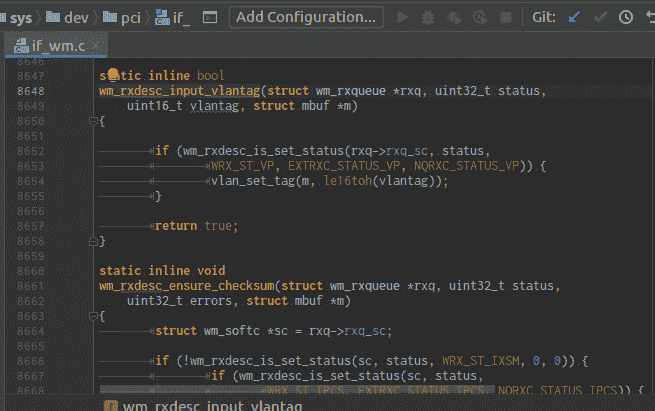
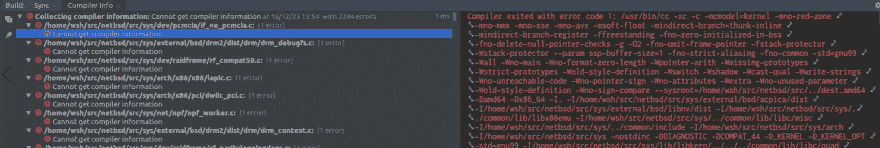
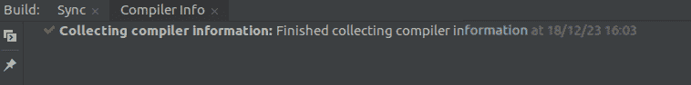

# 为 NetBSD 内核源代码创建编译数据库(compile_commands.json)

> 原文：<https://dev.to/wataash/create-compilation-database-compilecommandsjson-for-netbsd-kernel-source-3c3n>

[](https://res.cloudinary.com/practicaldev/image/fetch/s--Zziekj6o--/c_limit%2Cf_auto%2Cfl_progressive%2Cq_66%2Cw_880/https://qiita-image-store.s3.amazonaws.com/0/167409/744421a3-26f2-50ca-a59f-46fcc9fec6a4.gif)

[加上日语](https://qiita.com/wataash/items/6844815d28477109cfc0)

NetBSD 内核(netbsd-src/sys/)的源代码结构非常复杂，静态源代码分析工具几乎不可能提供符号的准确位置。举个例子，cscope 不明白`<machine/endian.h>`在哪里:

*   `sys/arch/hpc/stand/include/machine/endian.h`？
*   还是`sys/arch/hpcmips/stand/include/machine/endian.h`？

居然是`${OBJDIR}/sys/arch/amd64/compile/GENERIC/machine/endian.h`！cscope 不知道编译是在带有`-I.`标志的`${OBJDIR}/sys/arch/amd64/compile/GENERIC`中完成的。

为了实现准确的代码分析，需要编译信息——所谓的[编译数据库](https://clang.llvm.org/docs/JSONCompilationDatabase.html)或`compile_commands.json`。

下面是如何在 Linux (Ubuntu 18.04) :
上为 NetBSD 内核**创建`compile_commands.json`(很快在 NetBSD 和 macOS 上完成后我会写附加信息...NetBSD 可能会与[在贝尔](https://github.com/rizsotto/Bear/issues/212)面临一个问题。并且可以通过使用[扫描构建](https://github.com/rizsotto/scan-build) )
来避免**

```
# https://github.com/rizsotto/Bear/
sudo apt install bear

cd netbsd-src/

# First, create ${OBJDIR}/sys/arch/amd64/compile/GENERIC/Makefile
# and confirm that the kernel can be built
./build.sh kernel=GENERIC

cd ${OBJDIR}/sys/arch/amd64/compile/GENERIC/
${TOOLDIR}/bin/nbmake-amd64 clean
bear ${TOOLDIR}/bin/nbmake-amd64             # creates compile_commands.json
mv compile_commands.json ${NETBSD-SRC}/sys/  # optional 
```

然后用你喜欢的支持编译数据库的编辑器打开内核源代码，比如 vim with [YouCompleteMe](https://github.com/Valloric/YouCompleteMe#c-family-semantic-completion) 或者 [CLion](https://www.jetbrains.com/help/clion/compilation-database.html) (在本文中使用)。您可能会从`cc` :
得到错误

```
Compiler exited with error code 1: /usr/bin/cc -xc -c -mcmodel=kernel (snip) -v -dD -E
    Using built-in specs.
    (snip)
    End of search list.
    cc1: error: code model kernel does not support PIC mode 
```

[](https://res.cloudinary.com/practicaldev/image/fetch/s--jGVSTdmn--/c_limit%2Cf_auto%2Cfl_progressive%2Cq_auto%2Cw_880/https://qiita-image-store.s3.amazonaws.com/0/167409/aba7814e-7157-603e-94f9-4507b3a03d35.png)

编辑器执行`/usr/bin/cc`进行代码分析，而它应该是`${TOOLDIR}/bin/x86_64--netbsd-gcc[--<target>]`这个问题可以通过简单地替换编译器的路径来解决:

```
cp compile_commands.json compile_commands.json.bak
sed -i s!'"cc",'!'"/home/wsh/src/netbsd/tools/bin/x86_64--netbsd-gcc",'!g compile_commands.json 
```

[](https://res.cloudinary.com/practicaldev/image/fetch/s--GZUD3Jpe--/c_limit%2Cf_auto%2Cfl_progressive%2Cq_auto%2Cw_880/https://qiita-image-store.s3.amazonaws.com/0/167409/c9d37160-1359-8671-4784-b3935f452ec1.png)

享受代码跳跃！

## 用于正式文件的维护者

我很乐意将本文和其他文章的全部或部分内容迁移到官方文档中。请在这里发表评论或联系我。