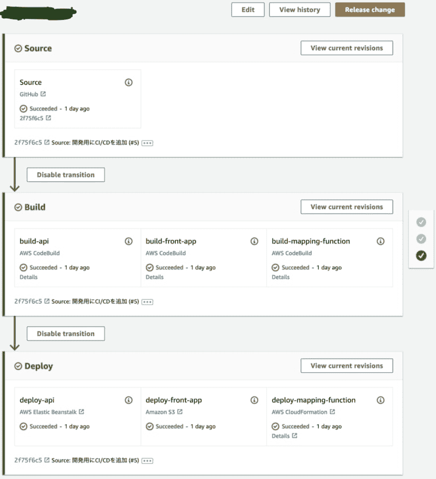
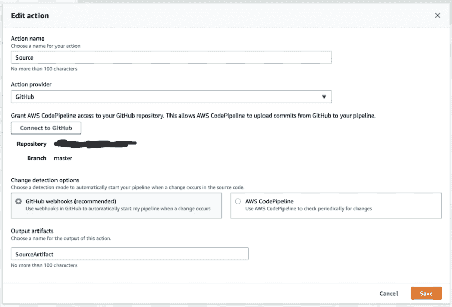
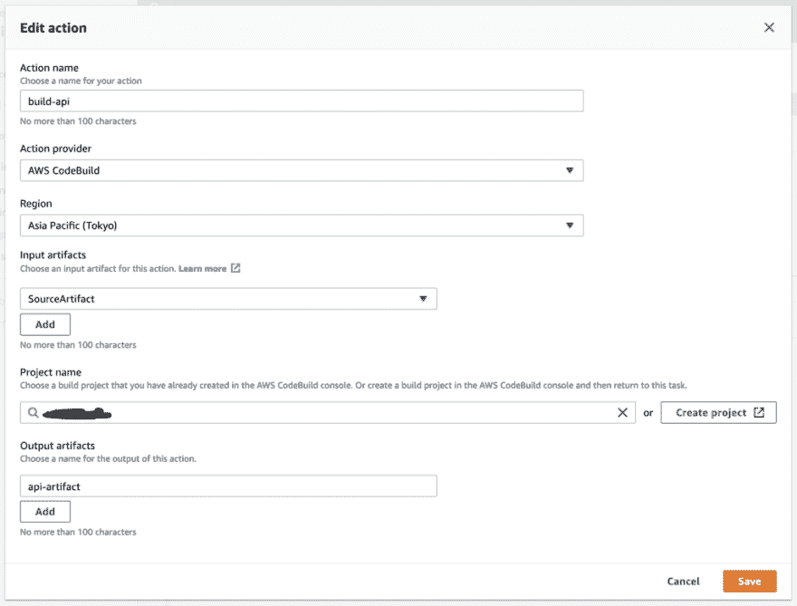

# 为 AWS 弹性 Beanstalk 应用程序创建部署管道

> 原文：<https://dev.to/yasunoritanaka/create-deploy-pipeline-for-aws-elastic-beanstalk-app-2a4n>

[AWS 弹性豆茎](https://aws.amazon.com/elasticbeanstalk/) app 可以通过[代码管道](https://aws.amazon.com/codepipeline/)简单部署。

下面是我在 CodePipeline 上创建的一个管道，用于将应用程序部署到 Elastic Beanstalk、S3 和 Cloud。这次我只介绍 CodePipeline。

<figure>[](https://res.cloudinary.com/practicaldev/image/fetch/s--I7MPZs_3--/c_limit%2Cf_auto%2Cfl_progressive%2Cq_auto%2Cw_880/https://cdn-images-1.medium.com/max/1024/1%2AXGOXegu6fhUPvD6dDZ8WPw.png) 

<figcaption>一条调配管道</figcaption>

</figure>

该项目的目录结构如下:

```
my-api
  + .elasticbeanstalk
  | + config.yaml
  + application.py
  + requirements.txt 
```

application.py 和 requrements.txt 都是简单的[烧瓶](http://flask.pocoo.org/) app。你也可以阅读[一个烧瓶教程](https://docs.aws.amazon.com/elasticbeanstalk/latest/dg/create-deploy-python-flask.html)。

在创建部署管道之前，需要创建管道和 Beanstalk 应用程序。请参考 [a 创建管道教程](https://docs.aws.amazon.com/codepipeline/latest/userguide/tutorials-simple-s3.html#s3-create-pipeline)和[豆茎教程](https://docs.aws.amazon.com/elasticbeanstalk/latest/dg/GettingStarted.html)。

在创建了管道和最小的 Beanstalk 应用程序之后，您需要设置一个获取代码的源。下面是使用 GitHub 的例子:

<figure>[](https://res.cloudinary.com/practicaldev/image/fetch/s--iKg_ebGs--/c_limit%2Cf_auto%2Cfl_progressive%2Cq_auto%2Cw_880/https://cdn-images-1.medium.com/max/1024/1%2Ax7IhG1Lv4iQdc062ATBkdQ.png) 

<figcaption>从 GitHub 主分支</figcaption>

</figure>

获取信号源的信号源配置

接下来，您需要添加一个构建步骤来进行单元测试，或者将您的应用程序构建为二进制代码或归档。我还将输出工件指定为“api 工件”。这是在此步骤中构建的归档文件，供后续步骤使用。在这个管道中，下一个部署步骤将使用这个文件。以下是我的设定:

<figure>[](https://res.cloudinary.com/practicaldev/image/fetch/s--u7f8wJfT--/c_limit%2Cf_auto%2Cfl_progressive%2Cq_auto%2Cw_880/https://cdn-images-1.medium.com/max/1024/1%2AhBUqHQksEjIF6zGMXO8sKg.png) 

<figcaption>为单元测试构建配置</figcaption>

</figure>

您需要创建 buildspec.yaml 来运行 CodeBuild 上的构建步骤。