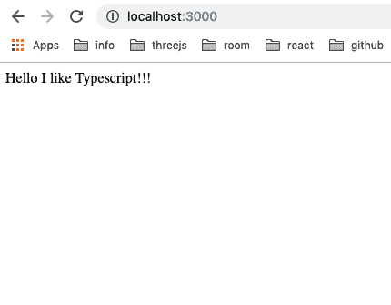

# 用 Node + Typescript + yarn 创建 devenv

> 原文：<https://dev.to/0xkoji/create-devenv-with-node--typescript--yarn-2e8d>

老实说，我不喜欢 javascript，但没有选择，因为我需要用 reactjs lol 在前端工作。

你们很多人都知道，最近使用`Typescript`非常流行/普遍。当我开始使用它时，我感到有点压力，但现在有点理解为什么我们需要使用 Typescript 而不是纯 js 了。

现在，基本上当我需要为某事编写 js 时，我会尝试使用 Typescript。

今天，我将在这里留下一个带有 Typescript 的 nodejs 的基本环境。在这种情况下，我使用 yarn，因为 yarn 比 npm 快😂

#### package.json

```
{
  "name": "ntenv",
  "version": "1.0.0",
  "description": "",
  "main": "index.js",
  "scripts": {
    "watch-ts": "tsc -w",
    "start": "node build/dist/server.js",
    "build": "tsc -p tsconfig.json",
    "dev": "concurrently \"npm run watch-ts\" \"npm start\"",
    "clear": "rm -rf build/dist",
    "test": "echo \"Error: no test specified\" && exit 1"
  },
  "author": "",
  "license": "ISC",
  "dependencies": {
    "concurrently": "^4.1.0",
    "express": "^4.16.4"
  },
  "devDependencies": {
    "@types/express": "^4.16.1",
    "@types/node": "^11.11.3",
    "ts-loader": "^5.3.3",
    "tslint": "^5.14.0",
    "tslint-loader": "^3.5.4",
    "typescript": "^3.3.3333"
  }
} 
```

Enter fullscreen mode Exit fullscreen mode

#### tsconfig.json

```
{
  "compilerOptions": {
    "module": "commonjs",
    "esModuleInterop": true,
    "target": "es2017",
    "moduleResolution": "node",
    "noFallthroughCasesInSwitch": true,
    "noImplicitReturns": true,
    "noUnusedLocals": true,
    "sourceMap": true,
    "rootDir": "src",
    "outDir": "build/dist",
    "baseUrl": ".",
    "forceConsistentCasingInFileNames": true,
    "paths": {
      "~src/*": [
        "src/*"
      ],
    },
    "strict": true,
    "suppressImplicitAnyIndexErrors": true,
    "typeRoots": [
      "./node_modules/@types"
    ]
  },
  "include": [
    "src/**/*"
  ],
  "exclude": [
    "node_modules",
    "build",
  ]
} 
```

Enter fullscreen mode Exit fullscreen mode

#### linton . JSON

```
{
    "extends": [
        "tslint:latest",
        "tslint-eslint-rules",
        "tslint-config-prettier"
    ],
    "linterOptions": {
        "exclude": ["node_modules/**/*.ts"]
    },
    "defaultSeverity": "warning",
    "jsRules": {},
    "rules": {
        "await-promise": true,
        "cyclomatic-complexity": [true, 15],
        "interface-name": [true, "never-prefix"],
        "interface-over-type-literal": false,
        "match-default-export-name": true,
        "member-access": [true, "no-public"],
        "member-ordering": [true],
        "no-boolean-literal-compare": true,
        "no-inferred-empty-object-type": true,
        "no-floating-promises": true,
        "no-implicit-dependencies": [true, "dev", ["~src"]],
        "no-inferrable-types": [true, "ignore-params", "ignore-properties"],
        "no-submodule-imports": false,
        "no-unnecessary-callback-wrapper": true,
        "no-unnecessary-type-assertion": true,
        "no-console": [false],
        "no-void-expression": [true, "ignore-arrow-function-shorthand"],
        "object-literal-shorthand": false,
        "object-literal-sort-keys": false,
        "prefer-conditional-expression": false,
        "promise-function-async": true,
        "triple-equals": [true, "allow-undefined-check", "allow-null-check"],
        "max-classes-per-file": [true, 1],
        "ordered-imports": false
    },
    "rulesDirectory": []
} 
```

Enter fullscreen mode Exit fullscreen mode

#### server.ts

```
import e from "express";

const app = e();
const PORT = 3000;
app.get('/', (req: e.Request, res:e.Response )=> {
    return res.send ("Hello I like Typescript!!!");
});

app.listen(PORT, ()=>{
    console.log(`server is running and using port: ${PORT}`);
});

export default app; 
```

Enter fullscreen mode Exit fullscreen mode

## 运行 server.js

```
$ npm run dev 
```

Enter fullscreen mode Exit fullscreen mode

然后，访问`localhost:3000`。您将看到以下内容。
[](https://res.cloudinary.com/practicaldev/image/fetch/s--wz5s0itF--/c_limit%2Cf_auto%2Cfl_progressive%2Cq_auto%2Cw_880/https://thepracticaldev.s3.amazonaws.com/i/hh5aunlwdpf2bnp7qmeb.png)