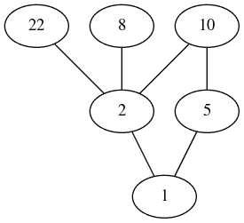

# 与 dorothy 一起在 Clojure 中创建 Graphviz 图形

> 原文：<https://dev.to/deciduously/create-graphviz-graphs-in-clojure-with-dorothy-5eej>

今天的快速帖子——了解到这一点让我觉得我提高了，所以我想我应该分享一下。

我[最近决定](https://dev.to/deciduously/back-to-school-57fd)把“自我”从自学中去掉，回学校做软件开发。毫不奇怪，我的第一学期包括一门离散数学课，本周我们看了用于表示偏序集的[哈塞图](https://en.wikipedia.org/wiki/Hasse_diagram)。这就是那种图 [`graphviz`](https://graphviz.org/) 的设计初衷！

作为一个 C 库，Graphviz 拥有你能想到的任何语言的接口。Python 是这种快速一次性的好选择，但它也很适合 Clojure！也没有人感到惊讶，社区已经创建了一个使用 Clojure 数据结构定义 Graphviz 图形的库，就像 [Hiccup](https://github.com/weavejester/hiccup) 为 HTML 所做的那样。它叫 [`dorothy`](https://github.com/daveray/dorothy) 。

为了跟进，你需要安装 [leiningen](https://leiningen.org/) 和 [graphviz](https://graphviz.org/download/) 。一旦两者都安装了，创建一个新项目:

```
$ lein new app hasse 
```

Enter fullscreen mode Exit fullscreen mode

在你最喜欢的文本编辑器中打开`hasse`文件夹，找到`project.clj`。我们只需要添加`dorothy`依赖项。找到`:dependencies`地图，使它看起来像这样:

```
 :dependencies  [[org.clojure/clojure  "1.9.0"]  [dorothy  "0.0.7"]] 
```

Enter fullscreen mode Exit fullscreen mode

现在运行`lein deps`拉动震击器并打开`src/hasse/core.clj`。在`(ns)`表单下，添加以下 require 语句:

```
(ns  hasse.core  (:gen-class))  (require  '[dorothy.core  :as  dot])  (require  '[dorothy.jvm  :refer  (render  save!)])] 
```

Enter fullscreen mode Exit fullscreen mode

要创建一个图，你只需要定义你的节点和边——在这种情况下，我们需要做的就是定义边。Graphviz 将负责其他一切。移除`-main`的主体并添加一个`let`绑定来定义我们的图:

```
 (let  [g  (dot/graph  [  [:22  :2]  [:8  :2]  [:10  :5  :1]  [:10  :2  :1]])]) 
```

Enter fullscreen mode Exit fullscreen mode

还有一个`dot/digraph`将创建定向边。每个关键字是一个节点，每个列表是连接两个或更多节点的边。每个节点也可以有一个属性图，这里我只是使用默认的属性图。现在我们已经定义了图表，我们使用`(dot/dot)`函数将其转换为 Graphviz 点格式。然后我们可以使用`save!`来保存我们的结果:

```
(->  g  dot/dot  (save!  "out.png"  {:format  :png})) 
```

Enter fullscreen mode Exit fullscreen mode

在`dorothy.jvm`中还有一个`show!`,它使用了一个简单的 Swing 查看器——对测试很有用。你的完整代码片段应该是这样的:

```
(ns  hasse.core  (:gen-class))  (require  '[dorothy.core  :as  dot])  (require  '[dorothy.jvm  :refer  (render  save!)])  (defn  -main  [&  args]  (let  [g  (dot/graph  [  [:22  :2]  [:8  :2]  [:10  :5  :1]  [:10  :2  :1]])]  (->  g  dot/dot  (save!  "out.png"  {:format  :png})))) 
```

Enter fullscreen mode Exit fullscreen mode

现在运行`lein uberjar`来编译 Clojure，执行`java -jar target/uberjar/hasse-0.1.0-SNAPSHOT-standalone.jar`，惊叹其美妙之处:

[](https://res.cloudinary.com/practicaldev/image/fetch/s--bNX_Y3t9--/c_limit%2Cf_auto%2Cfl_progressive%2Cq_auto%2Cw_880/https://i.imgur.com/b7yQAMB.png)

俏皮！我告诉你，这肯定是集合{1，2，5，8，10，22}上关系“除”的哈斯图。

这在 ClojureScript 中也是可用的，但是没有渲染和保存功能——您需要依靠另一个库来将您的点格式输出到可视化的东西。

快乐的绘图！