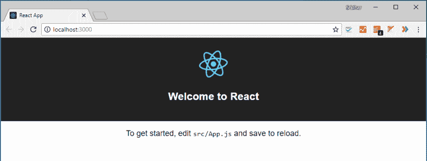
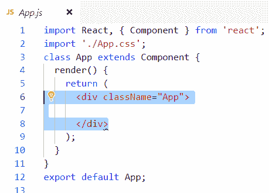
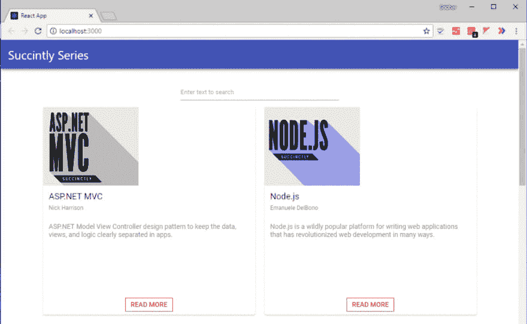
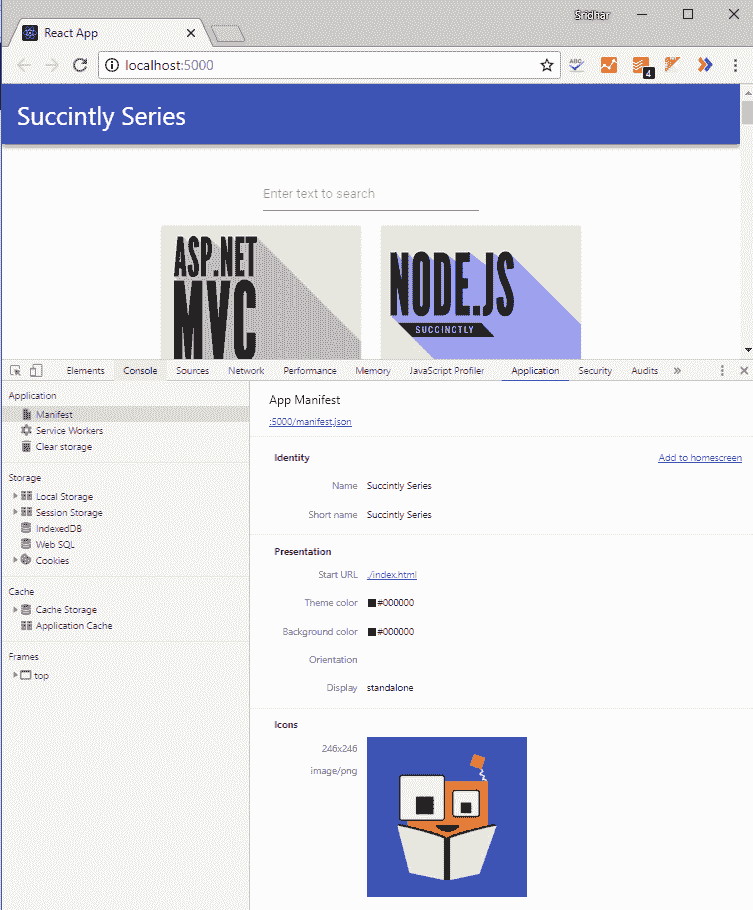
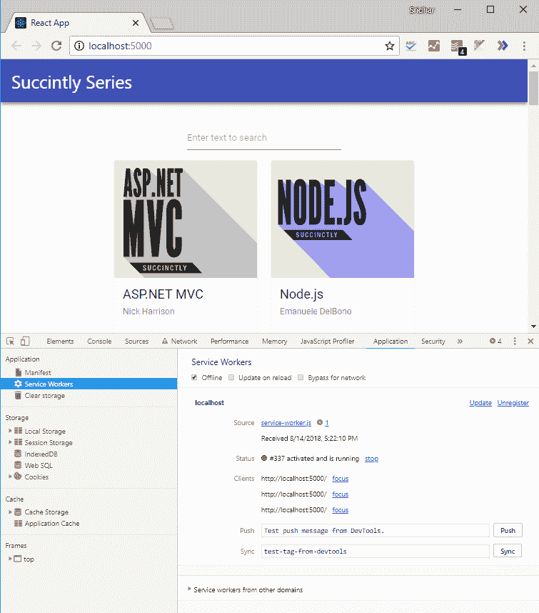

# 使用 Syncfusion React UI 组件创建渐进式 Web 应用程序

> 原文：<https://dev.to/syncfusion/create-progressive-web-app-with-syncfusion-react-ui-components-1p00>

渐进式 Web 应用程序使 react web 应用程序感觉像移动原生应用程序。它的特点是可以选择将 web 应用程序添加到移动设备的主屏幕上以便于访问，并支持全屏显示本机应用程序外观。PWA 支持缓存，并利用缓存的项目在慢速网络和脱机模式下工作。

在这个博客中，我将创建一个应用程序，简洁地列出 *[系列书籍](https://www.syncfusion.com/ebooks)* ，并允许用户搜索特定的书籍。我将使用 [create-react-app](https://facebook.github.io/create-react-app/docs/getting-started) CLI 来创建基础应用程序，并将配置 Syncfusion [React UI 组件](https://www.syncfusion.com/react-ui-components)来实现该应用程序。为此，我将遵循以下步骤:

1.  create-react-app 入门
2.  在其中配置 Syncfusion React UI 组件
3.  让它成为一个进步的网络应用
4.  启动应用程序

最终的项目样本可以在这个 [github](https://github.com/Sridhar-Narasimhan/pwa-succintly-books.git) 资源库中获得，以跟踪每一步的进展。您还可以遵循在每个步骤结束时提供的承诺细节。

## 创建-反应-应用入门

为了创建 React 应用程序，我使用 create-react-app CLI。这有一些默认设置，如 Manifest.json 和 service workers，以帮助我使它成为一个渐进的 Web 应用程序。使用以下命令全局安装 create-react-app CLI:

```
npm i create-react-app -g 
```

您可以使用 create-react-app 命令在任何目录中创建 React 应用程序。移动到要创建应用程序的目录，并运行以下命令。在这里，我将这个应用程序命名为“pwa-简洁地-书籍”

**示例:**创建-反应-应用

```
create-react-app pwa-succinctly-books 
```

这将创建应用程序。要使用默认配置运行相同的程序，请转到应用程序目录并使用以下命令:

```
cd pwa-succinctly-books

npm start 
```

[](https://res.cloudinary.com/practicaldev/image/fetch/s--5Wfr40zl--/c_limit%2Cf_auto%2Cfl_progressive%2Cq_auto%2Cw_880/https://blog.syncfusion.com/wp-content/uploads/2019/03/React-application.png)

*React 应用*

**注意:**你可以在 GitHub 上找到这一步的信息:[create-react-app 入门](https://github.com/Sridhar-Narasimhan/pwa-succintly-books/commit/5f1515c04ceb6c66d0a82b9613463063ac4dacaa)

## 配置 Syncfusion React UI 组件

至此，我已经创建了基础应用程序并使其运行。因此，我将使用 Syncfusion React UI 组件来配置应用程序。

就像我之前说过的，这个应用程序的核心思想是简洁地填充 Syncfusion *系列电子书的列表，该列表可以基于书籍属性进行搜索。在这个应用程序中，我将使用 [Syncfusion 卡](https://www.syncfusion.com/react-ui-components/react-card)简洁地列出*系列电子书，并且为了搜索，我将使用 [Syncfusion 文本框](https://www.syncfusion.com/react-ui-components/react-textbox)。为此，我将安装 ej2-react-inputs 和 ej2-layouts。对于搜索操作，我将使用[数据管理器](https://ej2.syncfusion.com/react/documentation/data/)。要安装这些 Syncfusion 组件，请运行以下命令:**

```
npm install  @syncfusion/ej2-react-inputs @syncfusion/ej2-data @syncfusion/ej2-layouts 
```

现在，所有需要的配置都完成了。要启动应用程序，请从基本应用程序中删除一些元素。在 App.js 中，清空 App div 元素。

[](https://res.cloudinary.com/practicaldev/image/fetch/s--hWYH5itI--/c_limit%2Cf_auto%2Cfl_progressive%2Cq_auto%2Cw_880/https://blog.syncfusion.com/wp-content/uploads/2019/03/Content-of-App-js.png) 现在，我打算遵循以下步骤:

1.  渲染 React 组件
2.  实施搜索操作
3.  应用程序样式

## 渲染 React 组件

我们需要呈现以下元素:

1.  页眉
2.  搜索文本框
3.  卡片列表

首先，我们需要搜索文本框的输入和引导网格布局，以便按顺序排列卡片。创建一个本地数据源，简洁地列出*系列书籍的详细信息，并将文件命名为 **datasource.js** 。导出此文件以使其在 App.js 中可用。添加 Syncfusion React TextBox 组件以呈现搜索文本框。我们现在可以从 ej2-react-inputs 包中导入 TextBox。在包含必需的元素后，App.js 将包含以下代码:*

```
import {TextBoxComponent} from '@syncfusion/ej2-react-inputs';
class App extends Component {
render() {
return (
<div className="App">
<div className='control-pane'>
<div>
{/* Header HTML element */}
<header className="header">
<h1 className="header__title">Succinctly Series</h1>
</header>
</div>
<div className="main">
<div className="control-section card-control-section tile_layout">
<div className="row filter">
<div className="col-xs-4 col-sm-4 col-lg-4 col-md-4 "></div>
<div className="col-xs-4 col-sm-4 col-lg-4 col-md-4 ">
{/* Searching HTML element */}
<TextBoxComponent id="search_Card" placeholder="Enter text to search" floatLabelType="Auto" />
</div>
<div className="col-xs-4 col-sm-4 col-lg-4 col-md-4  tile_search">
</div></div>
{/* Cards Template holder */}
<div className='row e-card-layout' style={{ textAlign: 'center' }}>
<div className="row">
<div className="row error" style={{ minHeight: '150px' }}>
<div className="e-error-content" style={{ margin: 'auto', fontWeight: 500 }}>No results found. Please try a different search.</div></div>
<div className="col-xs-6 col-sm-6 col-lg-6 col-md-6"><div id='card_sample_1' className='card_sample'></div></div>
<div className="col-xs-6 col-sm-6 col-lg-6 col-md-6"><div id='card_sample_2' className='card_sample'></div></div>
<div className="col-xs-6 col-sm-6 col-lg-6 col-md-6"><div id='card_sample_3' className='card_sample'></div></div>
<div className="col-xs-6 col-sm-6 col-lg-6 col-md-6"><div id='card_sample_4' className='card_sample'></div></div>
<div className="col-xs-6 col-sm-6 col-lg-6 col-md-6"><div id='card_sample_5' className='card_sample'></div></div>
<div className="col-xs-6 col-sm-6 col-lg-6 col-md-6"><div id='card_sample_6' className='card_sample'></div></div>
<div className="col-xs-6 col-sm-6 col-lg-6 col-md-6"><div id='card_sample_7' className='card_sample'></div></div>
<div className="col-xs-6 col-sm-6 col-lg-6 col-md-6"><div id='card_sample_8' className='card_sample'></div></div>
<div className="col-xs-6 col-sm-6 col-lg-6 col-md-6"><div id='card_sample_9' className='card_sample'></div></div>
<div className="col-xs-6 col-sm-6 col-lg-6 col-md-6"><div id='card_sample_10' className='card_sample'></div></div>
<div className="col-xs-6 col-sm-6 col-lg-6 col-md-6"><div id='card_sample_11' className='card_sample'></div></div>
<div className="col-xs-6 col-sm-6 col-lg-6 col-md-6"><div id='card_sample_12' className='card_sample'></div></div>
</div></div></div></div></div>
</div>
);
}
} 
```

现在我将通过处理**componentdimount**钩子方法来呈现卡片。定义卡组件，并对其运行数据源。这将在引导网格布局中呈现每个卡。

```
import * as ReactDOM from 'react-dom';
import {cardBook} from './datasource';
let cardEle;
/* Funtion for Rendering Cards */
function cardRendering(cardBook) {
let errorContent = document.querySelector('.tile_layout .row.error');
if (cardBook.length > 0) {
errorContent.style.display = 'none';
cardBook.forEach((data, index) => {
cardEle = document.getElementById('card_sample_' + (++index));
if (cardEle) {
ReactDOM.render(<CardRender data={data}/>, cardEle); }
});
}
else {
errorContent.style.display = 'flex';
}
}

class App extends Component {
componentDidMount() {
cardRendering(cardBook);
}
//render(){..}
}
class CardRender extends React.Component {
constructor() {
super(...arguments);
this.headerTitleSubCheck = this.props.data.header_title.length > 0 || this.props.data.header_subtitle.length > 0;
this.headerCheck = this.props.data.header_title.length > 0 || this.props.data.header_subtitle.length > 0 || this.props.data.header_img.length > 0;
this.bgimageUrl =  this.props.data.cardImage.url ;
}
render() {
return (<div className={this.props.data.isHorizontal ? 'e-card e-card-horizontal' : 'e-card'}>
{this.props.data.cardImage && <div className={"e-card-image "+this.bgimageUrl} > {this.props.data.cardImage.title && <div className='e-card-title'>{this.props.data.cardImage.title}</div>} </div>}
{this.props.data.cardTitle && <div className='e-card-title'>{this.props.data.cardTitle}</div>} {this.headerCheck && <div className='e-card-header'>
{this.props.data.header_img && <div className={this.props.data.header_img.isRounded ? 'e-card-header-image e-card-corner' : 'e-card-header-image e-card-corner'}></div>} {this.headerTitleSubCheck && <div className='e-card-header-caption'>
{this.props.data.header_title && <div className='e-card-header-title'>{this.props.data.header_title}</div>} {this.props.data.header_subtitle && <div className='e-card-sub-title'>{this.props.data.header_subtitle}</div>} </div>} </div>} {this.props.data.cardContent && <div className='e-card-content'>{this.props.data.cardContent}</div>} {this.props.data.card_action_btn &&
<div className={this.props.data.card_action_btn.isVertical ? 'e-card-actions e-card-vertical' : 'e-card-actions'}>
{this.props.data.card_action_btn.action_btns.map(function (actBtn) {
return actBtn.tag === "a" ? <a key={actBtn.text} href={actBtn.href} target={actBtn.target} className='e-btn e-outline e-primary'> {actBtn.text}</a> : <button key={actBtn.text} className='e-card-btn'>{actBtn.text}</button>;
})}
</div>} </div>); }
} 
```

## 实现搜索操作

我已经在上面的操作中呈现了搜索文本框，现在我将把这个功能添加到用户界面中。处理**搜索文本框**的**输入**事件，创建一个谓词并用数据源解析它。在搜索操作后销毁文档中所有可用的卡片。然后，在搜索数据源后，为可用的项目创建新卡片。

```
import { Query, DataManager, Predicate } from '@syncfusion/ej2-data';
let data = [];
let emptyData = true;
/* Function for Destroying Cards */
function destroyAllCard() {
let cards = document.querySelectorAll('.card-control-section .e-card');
[].slice.call(cards).forEach((el) => {
ReactDOM.unmountComponentAtNode(el.parentElement);
});
}
/* Function for Filtering Cards */
function searchFilter(key) {
let predicate = new Predicate('cardContent', 'Contains', key, true);
predicate = predicate.or('cardImage.title', 'Contains', key, true).or('header_title', 'Contains', key, true).or('header_subtitle', 'Contains', key, true);
data = new DataManager(cardBook).executeLocal(new Query().where(predicate));
destroyAllCard();
cardRendering(data);
}
class App extends Component {
componentDidMount() {
cardRendering(cardBook);
}
filterHandler(e) {
if (e.event.code === 'Tab' || e.event.code === 'Escape' || e.event.code === 'ShiftLeft' || (e.event.code === 'Backspace' && emptyData)) {
return;
}
let inputVal = e.value;
emptyData =inputVal.length === 0 ;
searchFilter(inputVal);
}
render(){
..
/* Filter handler in search text box */
<TextBoxComponent id="search_Card" input={(event) => this.filterHandler(event)} placeholder="Enter text to search" floatLabelType="Auto" />
..}
} 
```

**注意:**你可以在 GitHub 上找到关于这一步的信息:[配置 Syncfusion React UI 组件](https://github.com/Sridhar-Narasimhan/pwa-succintly-books/commit/e2d7df76c3ca9090a524138749d42a27c820852d)

## 样式化应用程序

React 应用程序需要样式来使其在移动设备上响应。为此，我将为卡片的网格布局导入 bootstrap，并为 App.js 中的 Syncfusion React UI 组件加载材料 CSS。此外，还将为从 SRC 文件夹加载的卡片图像定义样式，并使用背景图像 URL 对其进行处理。

```
npm install bootstrap 
```

**App.js**

```
import “https://cdn.syncfusion.com/ej2/material.css”;

import “bootstrap/dist/css/bootstrap.min.css”; 
```

**注意:**你可以在 GitHub 上找到关于这一步的信息:[应用造型](https://github.com/Sridhar-Narasimhan/pwa-succintly-books/commit/503476b570d023d9ae7387563da16caa61c54d96)

## 让它成为一个进步的网络应用

使应用程序成为渐进式 web 应用程序的基本步骤是:

1.  配置 web 应用程序清单
2.  搬运服务人员

### 配置 Web 应用清单

因为我已经使用 create-react-app CLI 创建了这个应用程序，所以默认的应用程序清单将在 public 文件夹中可用。这个 web 应用程序清单是一个 JSON 数据，包含关于应用程序的一些基本细节。我们在清单中增加了[个键值对，并将修改一些。](https://developers.google.com/web/fundamentals/web-app-manifest/)

**简称/姓名**–您可以提供简称/姓名。如果两者都提供，将显示 short_name，其中小空格可用，name 将用于 [app 安装提示](https://developers.google.com/web/fundamentals/app-install-banners/)。

**background _ color**–您可以提供该属性，当应用程序在慢速网络上启动时，该属性将在[启动画面](https://developers.google.com/web/fundamentals/web-app-manifest/#splash-screen)上使用。在应用程序初始加载期间，下载资源需要一些时间。

**theme _ color**–使用该属性设置浏览器中工具栏的颜色。

**图标**–当从浏览器添加到主页和闪屏时，这些用于应用程序图标。

**显示**–您可以将此设置为“独立”以使应用程序看起来像本地移动应用程序。其他显示选项如下表所示。

| **选项** | **描述** |
|全屏|应用程序将在没有浏览器 UI 的情况下加载，并将响应整个显示区域|
|浏览器|标准浏览器外观|
|独立|类似本地移动应用程序|

**start _ url**–这让浏览器在启动时显示应用程序起始页，并阻止显示用户从中拉出应用程序的 URL。

**Manifest.json**

```
{  "short_name":  "Succinctly Series",  "name":  "Succinctly Series",  "icons":  [{  "src":  "succinctly_series.png",  "sizes":  "246x246",  "type":  "image/png"  }],  "start_url":  "./index.html",  "display":  "standalone",  "theme_color":  "#000000",  "background_color":  "#000000"  } 
```

### 处理服务人员-离线缓存

服务人员处理离线体验，以及 web 应用程序中数据的后台同步。这反过来会在离线或慢速网络时提供更好的体验。我们在 **SRC** 文件夹中有一个名为 **serviceworker.js** 的默认服务工作者 JavaScript 文件，因为该应用程序是使用 create-react-app 创建的。

这个脚本将处理文件所需的默认缓存，这样，即使我们离线，我们也可以启动应用程序。当应用程序第一次启动时，服务工作者将被注册并缓存所需的文件；这将服务到缓存被清除。您可以通过 serviceworker.js 中提供的注释来了解服务工作者是做什么的。

```
serviceWorker.register(); 
```

**注:**你可以在 GitHub 上找到关于这一步的信息:[制作渐进式 Web App](https://github.com/Sridhar-Narasimhan/pwa-succintly-books/commit/ba39405cc619612182773f5da27dd1badc1e7e1f)

## 启动应用程序

至此，我们已经成功实现了我们的应用程序，现在我们需要启动它。要在**开发**版本中启动应用程序，请使用下面的命令。

```
npm start 
```

[](https://res.cloudinary.com/practicaldev/image/fetch/s--A2NZ9R4F--/c_limit%2Cf_auto%2Cfl_progressive%2Cq_auto%2Cw_880/https://blog.syncfusion.com/wp-content/uploads/2019/03/Succinctly-series-PWA.png) 

*简洁地串联起 PWA*

要启动用于**生产的应用程序，**运行以下命令。

```
npm run build 
```

这将在应用程序中生成用于生产目的的构建文件夹。然后，我们需要启动这个应用程序，这样我们就可以利用用于服务静态应用程序和单页应用程序的 [serve](https://www.npmjs.com/package/serve) NPM 包。为此，使用以下命令为应用程序提供服务:

```
npm i serve -g

serve -s build 
```

这将在 [http://localhost:5000](http://localhost:5000) 启动应用程序，您可以在这里用应用程序清单和服务工作器检查更改。

在 Chrome 开发人员工具中，我们有**应用程序选项卡，**，其中你可以在树的左侧看到清单和服务人员。单击清单后，在右侧窗格中，您可以检查为应用程序配置的键值对。

[](https://res.cloudinary.com/practicaldev/image/fetch/s--jC1fb8Vj--/c_limit%2Cf_auto%2Cfl_progressive%2Cq_auto%2Cw_880/https://blog.syncfusion.com/wp-content/uploads/2019/03/Succinctly-series-PWA-Manifest.png) 

*简洁地串联 PWA 清单*

当您单击服务人员时，您会看到，我们可以选择使用复选框来检查应用程序的**离线**状态。在此之前，请确保维修人员已注册。刷新整个页面，检查服务人员是否正确启动了应用程序。

[](https://res.cloudinary.com/practicaldev/image/fetch/s--U9Hiq82K--/c_limit%2Cf_auto%2Cfl_progressive%2Cq_auto%2Cw_880/https://blog.syncfusion.com/wp-content/uploads/2019/03/Succinctly-series-PWA-Service-Worker.png) 

*简洁地系列 PWA 服务人员*

## 总结

在这篇博客中，我们已经介绍了创建渐进式 Web 应用程序的基本步骤。我们使用 React 应用程序进行了演练，使用 create-react-app CLI 和 Syncfusion React UI 组件创建了一个应用程序。我们可以用渐进式网络应用做更多的事情，我把这个留给你去试验。

您可以在这个 [Github 资源库](https://github.com/Sridhar-Narasimhan/pwa-succintly-books)中找到该应用程序。如果你有任何问题或需要更多帮助，请在下面的评论区告诉我们。您也可以通过我们的[支持论坛](https://www.syncfusion.com/forums)或 [Direct-Trac](https://www.syncfusion.com/support/directtrac/) 联系我们。我们随时乐意为您提供帮助！

帖子[用 Syncfusion React UI 组件](https://blog.syncfusion.com/post/create-progressive-web-app-using-syncfusion-react-ui-components.aspx)创建渐进式 Web 应用首先出现在 [Syncfusion 博客](https://blog.syncfusion.com)上。