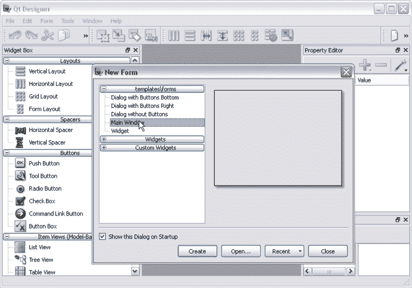

# 用 Python 创建 PyQt 桌面应用

> 原文：<https://dev.to/petercour/create-pyqt-desktop-app-with-python-4mcl>

你可以用 Python 制作**桌面应用。其中一个方法是使用 **PyQt** ，一个非常专业的构建模块。**

PyQt 给你一个设计器，你可以简单地通过拖拽来设计你的窗口。

然后你可以用 Python 加载设计。使用 PyQt 将它们连接在一起。

许多应用程序都是用 Qt (PyQt)制作的，包括整个 KDE 桌面环境。你可以制作任何你想要的桌面应用，**在所有流行的平台上运行(Windows，Mac OS X，Linux)** 。

为什么不学 PyQt？

听起来比你想象的要容易吗？

查看下面的教程，轻松开始。它配有一个 1 小时的视频和 80 多个例子。