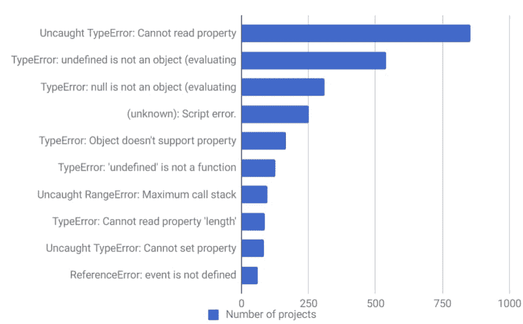
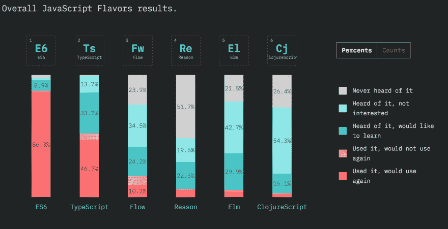
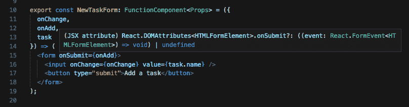
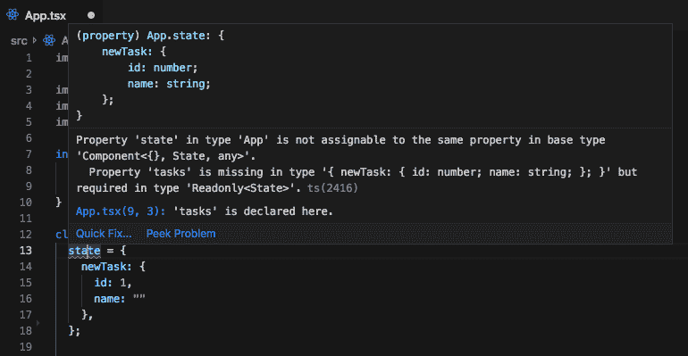

# 使用类型脚本创建 React 应用程序教程

> 原文：<https://dev.to/archiewald/create-react-app-with-typescript-tutorial-291d>

> 最初发布于 [www.kozubek.dev](https://www.kozubek.dev/2019/03/31/react-typescript.html)

本教程将一步一步地帮助你理解为什么 TypeScript + React 是令人敬畏的💪同时构建一个简单的待办 app。我使它对初学者友好，但它需要一些基本的反应和 JavaScript 知识。

查看 [StackBlitz](https://stackblitz.com/edit/react-ts-todo-list?embed=1&file=App.tsx) 上的工作应用程序

顺便说一下，StackBlitz 是由 VS 代码和强大的类型脚本支持驱动的。您可以检查大多数 TypeScript 特性，只需在那里操作代码！

TypeScript 可以帮助您创建可维护和可伸缩的 web 应用程序。它可以立即与 React 一起使用！由于创建带有类型脚本支持的 React 应用程序包，现在配置部分非常容易。

## 为什么要使用 TypeScript(在 React 中)

### 认清那些愚蠢的错误

我❤️打字稿给我即时反馈，如果我的代码是错误的。寻找十大 JavaScript 错误。我敢肯定，作为一个网站开发者，你很了解他们。

<figure>

[](https://res.cloudinary.com/practicaldev/image/fetch/s--PJOyDrSE--/c_limit%2Cf_auto%2Cfl_progressive%2Cq_auto%2Cw_880/https://www.kozubek.dev/asseimg/3-js-errors.png)

<figcaption>top 10 JavaScript errors in 1000 projects by [Rollbar](https://rollbar.com/blog/top-10-javascript-errors/t)</figcaption>

</figure>

其中 7 个是关于混淆你的类型，没有访问正确的变量，对象属性等等。有了 TypeScript，你很少会看到它们！您配置的 IDE 会提前告诉您它们。

另一件事是代码维护和重构。你是否曾经修改过你的大型应用程序中的一些属性，并且检查过所有的类和属性，想知道你刚刚在这里和那里弄乱和修复了什么？这里的 TypeScript +你的 IDE 也会对你有所帮助。

### 配合得很好

如果你曾经因为有 TypeScript 支持而喜欢 Angular，你会更喜欢 React。从开发者的角度来看，模板引擎是非常不同的——在 Angular 中你有虚拟的类似 HTML 的文件，在 React 中有 JSX，用 TypeScript 变成 TSX。这意味着在你的模板中也有静态类型检查！

### 通过 Create React App 支持

正如我们的预言家曾经宣布的那样，Create React App 支持开箱即用的 TypeScript，这使得启动一个新的应用程序(也是从这些相对较新的应用程序中迁移)更加容易🎉

> 创建 React 应用程序 2.1 +类型脚本=💜[https://t.co/tpb04toZ95](https://t.co/tpb04toZ95)pic.twitter.com/zBTVb0qa3UT2
> 
> — Dan Abramov ([@dan_abramov](https://dev.to/dan_abramov) ) [October 30, 2018](https://twitter.com/dan_abramov/status/1057118684479537152?ref_src=twsrc%5Etfw)

### 变得超级新潮

看看最新的 JS 调查结果就知道了:

<figure>

[](https://res.cloudinary.com/practicaldev/image/fetch/s--Yt27lxbe--/c_limit%2Cf_auto%2Cfl_progressive%2Cq_auto%2Cw_880/https://www.kozubek.dev/asseimg/3-state-of-js.png)

<figcaption>State of JS 2019 - [JavaScript flavors](https://2018.stateofjs.com/javascript-flavors/overview/))</figcaption>

</figure>

TypeScript 在 [Flow](https://flow.org/) 中越来越受欢迎，这是一个非常类似于脸书的库。甚至 Jest，React 生态系统中的首选测试库，[也被迁移到 TypeScript](https://github.com/facebook/jest/pull/7554#issuecomment-454358729) 。

总而言之，我在 [React 播客](https://reactpodcast.com/41)上听到了一个很好的比较，它更少:

> TypeScript 就像一个很酷的伙伴，你想和它一起编写程序💪

## 如何开始🚀

### 右边的 IDE

为了获得最佳体验，您应该使用 [VS 代码](https://code.visualstudio.com/)。它是微软的开源 IDE，TypeScript 也来自微软。你会得到最好的集成，我知道自从人们开始使用 TypeScript 后，他们就从 WebStorm 转移到了 VS Code。

> TypeScript 完全是关于开发人员的体验，即在您的 IDE 中发生了什么。你会多快多好地被告知你将要犯的错误

### 创建 React App

我们从启动项目开始。CRA 创作者建议使用 [npx](https://www.npmjs.com/package/npx) 而不是全球安装 create-react-app，以确保你从最新版本开始。

> 重要！在运行下面之前，请确保您没有全球安装 CRA 了！你可能会在这里遇到类似
> 的问题

```
npm uninstall -g create-react-app 
```

我们将使用全新的国旗。

```
npx create-react-app react-ts --typescript
cd react-ts 
```

然后你的基于 TS 的应用应该会出现。检查是否以`npm start`开头。然后快速浏览一下它与普通 CRA 首发有何不同:

### [T1。ts 和。tsx 文件](#ts-and-tsx-files)

`.ts`是常规的打字稿文件，基本上取代了`.js`。虽然对于包含带有 JSX 代码的 React 组件的文件，使用`.jsx`并不是强制性的，但是对于 TypeScript，当您编写 TSX 代码时，您需要始终使用`.tsx`。

### tsconfig.json

该文件指示该目录是 TypeScript 项目的根目录。这是编译器的起点，所以它包含一些配置选项:

```
{  "compilerOptions":  {  "target":  "es5",  "lib":  [  "dom",  "dom.iterable",  "esnext"  ],  "allowJs":  true,  "skipLibCheck":  true,  "esModuleInterop":  true,  "allowSyntheticDefaultImports":  true,  "strict":  true,  "forceConsistentCasingInFileNames":  true,  "module":  "esnext",  "moduleResolution":  "node",  "resolveJsonModule":  true,  "isolatedModules":  true,  "noEmit":  true,  "jsx":  "preserve"  },  "include":  [  "src"  ]  } 
```

您可以在[文档](https://www.typescriptlang.org/docs/handbook/compiler-options.html)中查找具体的选项。

一个有趣的例子是 CRA 配置中默认提供的`strict`。以下文件:

> 启用所有严格的类型检查选项。
> Enabling - strict 启用- noImplicitAny、- noImplicitThis、- alwaysStrict、- strictBindCallApply、- strictNullChecks、- strictFunctionTypes 和- strictPropertyInitialization。

严格模式使您能够使用 TypeScript 的强大功能，并且不会忽略类型检查的可能性。如果您将 JavaScript 应用程序转移到 TypeScript，您可能不会打开它，但作为开始，它是绝对推荐的。

## 编码 app

让我们清空 app，删除`App.css`，在`App.tsx`
只留下一个假人骨架。

```
import React, { Component } from "react";

class App extends Component {
  render() {
    return (
      <div>
        <h2>Hello React TS!</h2>
      </div>
    );
  }
}

export default App; 
```

到目前为止，它看起来和 JS React 组件一样。接下来我们可能要考虑的是我们的应用程序会保留哪些数据。基本上，一些任务。我们将在一个单独的文件夹中定义一个任务模型，这是一个很好的做法。在`src/models/task.ts` :

```
export interface Task {
  id: number;
  name: string;
} 
```

你可能会看到人们添加一个`I`前缀来注释这是一个接口(就像这里的`ITask`)，大部分来自 Java 或 C#后台。我认为这不是一个好的做法。我在我的打字稿代码中没有看到任何使用它的例子，当然我们在这里对简单的`Task`很好。

### 创建任务

让我们在`components/NewTaskForm.tsx`
中创建我们的第一个组件

```
import React, { FunctionComponent } from "react";
import { Task } from "../models/task";

interface Props {
  onChange: (event: React.ChangeEvent<HTMLInputElement>) => void;
  onAdd: (event: React.FormEvent<HTMLFormElement>) => void;
  task: Task;
}

export const NewTaskForm: FunctionComponent<Props> = ({
  onChange,
  onAdd,
  task
}) => (
  <form onSubmit={onAdd}>
    <input onChange={onChange} value={task.name} />
    <button type="submit">Add a task</button>
  </form>
); 
```

你需要给`NewTaskForm`组件标注一个类型，它是从`react`导入的`FunctionComponent`。有趣的`<>`括号表明这是一个[通用](https://www.typescriptlang.org/docs/handbook/generics.html)接口。由于这个原因，你可以在你的 TSX 代码中得到组件内部的类型检查。你应该放入你的`Props`接口，它描述了这个组件从父组件获得了什么属性。

有了这些回调，接口看起来有点神秘。`onChange`属性期望得到一个带有一个`event`参数的函数。如果您曾经在 React 中处理过表单，那么您可能非常了解这一点。我们将在父组件中使用来自`event`对象的数据，因此我们需要注释它的类型。这并没有你想象的那么难！

只需将鼠标移动到表单`onSubmit`上，您的 IDE 就会帮助您找到所需的属性类型。我们将一个回调传递给 form，而不是一个按钮，以便在点击按钮和输入后按回车键时获得动作。

<figure>

[](https://res.cloudinary.com/practicaldev/image/fetch/s--QA9Q_LaQ--/c_limit%2Cf_auto%2Cfl_progressive%2Cq_auto%2Cw_880/https://www.kozubek.dev/asseimg/3-callback.png)

<figcaption>VS Code + TypeScript being helpful with callback types</figcaption>

</figure>

无论如何，如果注释类型在某种程度上阻碍了你，或者目前是不可能的，你总是可以逃脱:

```
// TODO: annotate event types properly
interface Props {
  onChange: (event: any) => void;
  onAdd: (event: any) => void;
  task: Task;
} 
```

### 起死回生

我们将使用 React State 来处理任务变更，因此我们还需要为它标注一个类型。在`src/App.tsx` :

```
interface State {
  newTask: Task;
  tasks: Task[];
}

class App extends Component<{}, State> {
  state = {
    newTask: {
      id: 1,
      name: ""
    },
    tasks: []
  };

  render() {
    return (
      <div>
        <h2>Hello React TS!</h2>
        <NewTaskForm
          task={this.state.newTask}
          onAdd={this.addTask}
          onChange={this.handleTaskChange}
        />
      </div>
    );
  }
} 
```

这一次我们注释了`State`接口，并将它作为第二个参数放入一个通用的`Component`接口中。第一个又是`Props`，因为`App`组件没有，我们放一个空对象。

因为我们不需要在类构造函数中执行任何任务，所以我们可以使用类属性`state`来定义它。看看 TypeScript 是如何确保我们正确声明它的，假设我们忘记用空数组初始化`tasks`:

<figure>

[](https://res.cloudinary.com/practicaldev/image/fetch/s--sQkKLfv4--/c_limit%2Cf_auto%2Cfl_progressive%2Cq_auto%2Cw_880/https://www.kozubek.dev/asseimg/3-react-state.png)

<figcaption>TypeScript helping us with initializing state</figcaption>

</figure>

很酷的东西！

让我们添加一些方法使`NewTaskForm`组件工作，并最终渲染一些东西:

```
private addTask = (event: React.FormEvent<HTMLFormElement>) => {
  event.preventDefault();

  this.setState(previousState => ({
    newTask: {
      id: previousState.newTask.id + 1,
      name: ""
    },
    tasks: [...previousState.tasks, previousState.newTask]
  }));
};

private handleTaskChange = (event: React.ChangeEvent<HTMLInputElement>) => {
  this.setState({
    newTask: {
      ...this.state.newTask,
      name: event.target.value
    }
  });
}; 
```

我们将它们标记为`private`,因为这是我们注释不应该在类外访问的方法的方式。`state`属性没有这样的前缀，所以它是公共的——这是一个默认行为你可以在这里阅读更多关于[的内容。尽量标成`private`，打字稿不让！](https://www.typescriptlang.org/docs/handbook/classes.html)

如果您自己编写它们，您将会看到 TypeScript 对于自动完成是多么有帮助。如果我们将`event`注释为`any`，我们将无法获得任何帮助，只能使用 React `setState`方法。

您应该只看到一个简单的表单，您可以在其中命名任务并添加它，因为我们还没有呈现`this.state.tasks`。让我们实现它吧！

### 渲染任务并删除

为了完成这个简单的应用程序，让我们添加一个删除任务的方法。

```
private deleteTask = (taskToDelete: Task) => {
  this.setState(previousState => ({
    tasks: [
      ...previousState.tasks.filter(task => task.id !== taskToDelete.id)
    ]
  }));
}; 
```

然后是一个任务列表，里面有一项:

在`src/components/TaskList.tsx` :

```
import React, { FunctionComponent } from "react";

import { Task } from "../models/task";
import { TaskListItem } from "./TasksListItem";

interface Props {
  tasks: Task[];
  onDelete: (task: Task) => void;
}

export const TasksList: FunctionComponent<Props> = ({ tasks, onDelete }) => (
  <ul>
    {tasks.map(task => (
      <TaskListItem task={task} onDelete={onDelete} />
    ))}
  </ul>
); 
```

在`src/components/TaskListItem.tsx` :

```
import React, { FunctionComponent } from "react";

import { Task } from "../models/task";

interface Props {
  task: Task;
  onDelete: (task: Task) => void;
}

export const TaskListItem: FunctionComponent<Props> = ({ task, onDelete }) => {
  const onClick = () => {
    onDelete(task);
  };

  return (
    <li>
      {task.name} <button onClick={onClick}>X</button>
    </li>
  );
}; 
```

因为我没有在`deleteTask`方法中使用任何`event`项，所以我决定不传递它，而是传递任务本身。这可以通过许多其他方式来处理:)

## 总结

在`App.tsx`中添加了`TaskList`组件后，我们就完成了用 React + TypeScript 创建一个简单的待办事项列表应用程序！我很兴奋如何创建带有`--typescript`标志的 React 应用程序，使配置部分如此简单。如你所见，编写组件，TSX，处理状态没有太大区别！在你把它和静态类型以及 IDE 的超快的反馈结合起来之后，你可能会爱上像我这样的打字稿❤️.

还有许多其他值得解释的地方，TypeScript 可以提供帮助。重构，处理外部库等等...我将在本教程的下一部分强调这些部分。

我鼓励您在 IDE 中自己编写代码，看看 TypeScript 是否对您有所帮助，并尝试一下这个应用程序。如果有任何问题，评论区在下面，我很乐意帮忙🙂

*   [github 上的源代码](https://github.com/archiewald/todo-list-react-ts)
*   [stack blitz 上的 app](https://stackblitz.com/edit/react-ts-todo-list)