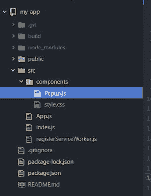
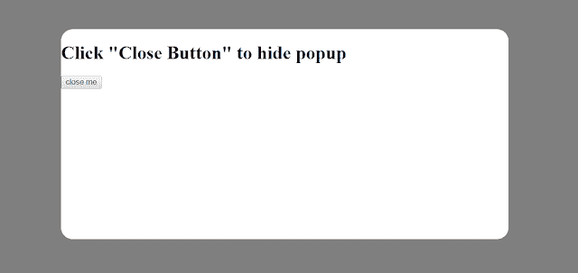

# 在 React 应用程序中创建简单的弹出示例

> 原文：<https://dev.to/skptricks/create-simple-popup-example-in-react-application-5g7f>

* * *

## 来源:[在 React 应用中创建简单的弹出示例](https://www.skptricks.com/2019/01/create-simple-popup-example-in-react.html)

在本教程中，我们将看到**如何在 react 应用**中创建简单的弹出窗口。这里我们将提供给你一个非常简单的例子，帮助你理解 react JS 中简单弹出窗口的创建过程。我们可以使用这种弹出消息向用户显示**电子邮件订阅通知**、**显示广告**、**确认消息，如是/否**等。

因此，在本例中，我们创建了名为“ **Popup** ”的组件，每当用户单击“ **Click To Launch Popup** ”按钮时，该组件有助于显示弹出消息。

## **React 中简单的弹出例子:**

让我们看看项目结构:

[](https://1.bp.blogspot.com/-eimtOnLz2jA/XDtHzut2rQI/AAAAAAAACUQ/jePSUJfE8aABm8Z46vml0hKi67wp4O2LACLcBGAs/s1600/11.PNG)

这是一个弹出组件，帮助向用户显示弹出消息。

```
import React from 'react';  
import './style.css';  

class Popup extends React.Component {  
  render() {  
return (  
<div className='popup'>  
<div className='popup\_inner'>  
<h1>{this.props.text}</h1>  
<button onClick={this.props.closePopup}>close me</button>  
</div>  
</div>  
);  
}  
}  

export default Popup; 
```

* *style.css **

这是一个为弹出消息设计的样式表。

```
.popup {  
  position: fixed;  
  width: 100%;  
  height: 100%;  
  top: 0;  
  left: 0;  
  right: 0;  
  bottom: 0;  
  margin: auto;  
  background-color: rgba(0,0,0, 0.5);  
}  
.popup\_inner {  
  position: absolute;  
  left: 25%;  
  right: 25%;  
  top: 25%;  
  bottom: 25%;  
  margin: auto;  
  border-radius: 20px;  
  background: white;  
} 
```

* *App.js **

这是一个主要组件，这里我们已经提到了所有的事件处理程序和状态。

```
import React, { Component } from 'react';  
import Popup from './components/Popup';  

class App extends Component {  

  constructor(props){  
super(props);  
this.state = { showPopup: false };  
}  

  togglePopup() {  
this.setState({  
     showPopup: !this.state.showPopup  
});  
 }  

  render() {  
return (  
<div>  
<h1> Simple Popup Example In React Application </h1>  
<button onClick={this.togglePopup.bind(this)}> Click To Launch Popup</button>  

{this.state.showPopup ?  
<Popup  
          text='Click "Close Button" to hide popup'  
          closePopup={this.togglePopup.bind(this)}  
/>  
: null  
}  
</div>  

);  
}  
}  

export default App; 
```

## **输出:**

[](https://1.bp.blogspot.com/-fmdgCvD9xlg/XDtLkpIFH7I/AAAAAAAACUk/p1i8FvebyTgcizEY_6osXyNhIvavREiVwCLcBGAs/s1600/1.PNG)

**下载链接:**

[https://github . com/skptricks/react/tree/master/Create % 20 simple % 20 popup % 20 example % 20 in % 20 react % 20 application](https://github.com/skptricks/react/tree/master/Create%20Simple%20Popup%20Example%20In%20React%20Application)

这是 React 应用程序中的**简单弹出示例。感谢你阅读这篇文章，如果你有任何问题，有关于这篇文章的另一个更好的有用的解决方案，请在评论区写消息。**