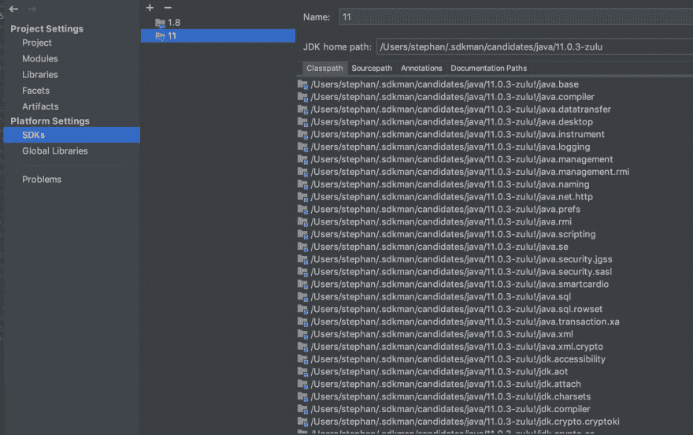
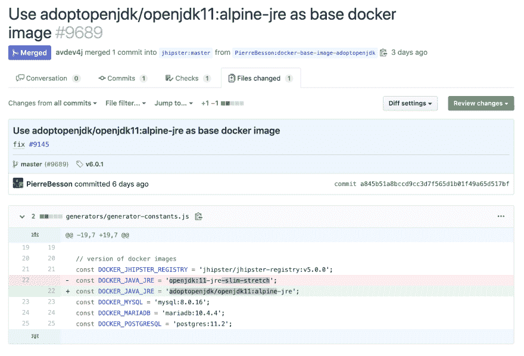

# 使用 JHipster 6 和 Java 11+创建最小的 Docker 映像

> 原文：<https://dev.to/stephan007/create-the-smallest-docker-image-using-jhipster-6-and-java-11-35m7>

本文将解释如何使用 JHipster 6 和 Java 11+创建最小的 Docker 映像。

请务必先阅读 Matt Raible 的《使用 Java 12 和 JHipster 6 实现更好、更快、更轻的 Java》。

今天(2019 年 5 月 13 日星期一)Mohammed Aboullaite(来自摩洛哥 Devoxx)做了一个很棒的相关演讲“Docker containers & java:我希望我已经被告知了什么！”有很多有趣的信息。一定要去看看他的滑梯。

# 设置您的 Java 11 开发环境

如果您的开发机器上已经运行了 Java 11，那么您可以跳过这一部分。

SDKman 是安装多个版本 Java 的绝佳工具。这个工具还允许您非常容易地在不同的 java 版本之间切换。#必须拥有

安装后，您可以列出所有可用的 Java SDK 版本。

$ sdk list java
您可以选择(并安装)Java 11 SDK 版本，如下所示:

$ sdk 使用 java 11.0.3-zulu
现在我们可以将 maven pom.xml java.version 从 1.8 更改为 11。

```
<java.version>11</java.version> 
```

SDK 文件位于一个隐藏目录中。sdkman 使得在 IDEA 中重用有点困难。添加一个符号链接是一个实用的解决方案:

```
$ cd /Library/Java/JavaVirtualMachines

$ sudo ln -s /Users/stephan/.sdkman/candidates/java/11.0.3-zulu 11.0.03-zulu 
```

现在，您可以将 SDK 11 添加到您的想法中。

[](https://res.cloudinary.com/practicaldev/image/fetch/s--DVBOwQDM--/c_limit%2Cf_auto%2Cfl_progressive%2Cq_auto%2Cw_880/https://thepracticaldev.s3.amazonaws.com/i/8ivvwhncskw9ntbmj77b.jpeg)

# 来自 JHipster 的“损坏的”docker 文件

JHipster 提供了一个 docker 文件，它位于 src/main/docker :

```
FROM openjdk:11-jre-slim-stretch

ENV SPRING_OUTPUT_ANSI_ENABLED=ALWAYS \
    JHIPSTER_SLEEP=0 \
    JAVA_OPTS=""

# Add a jhipster user to run our application so that it doesn't need to run as root
RUN adduser -D -s /bin/sh jhipster

WORKDIR /home/jhipster

ADD entrypoint.sh entrypoint.sh
RUN chmod 755 entrypoint.sh && chown jhipster:jhipster entrypoint.sh
USER jhipster

ENTRYPOINT ["./entrypoint.sh"]

EXPOSE 8080

ADD *.war app.war 
```

我对这个文档有几个问题，主要是...它不起作用😂

请务必阅读附录，了解 docker 文件损坏的原因。

adduser 命令在构建 Docker 映像时出错。

```
Option d is ambiguous (debug, disabled-login, disabled-password)
Option s is ambiguous (shell, system)
adduser [--home DIR] [--shell SHELL] [--no-create-home] [--uid ID]
[--firstuid ID] [--lastuid ID] [--gecos GECOS] [--ingroup GROUP | --gid ID]
[--disabled-password] [--disabled-login] [--add_extra_groups] USER
   Add a normal user

adduser --system [--home DIR] [--shell SHELL] [--no-create-home] [--uid ID]
[--gecos GECOS] [--group | --ingroup GROUP | --gid ID] [--disabled-password]
[--disabled-login] [--add_extra_groups] USER
   Add a system user

adduser --group [--gid ID] GROUP
addgroup [--gid ID] GROUP
   Add a user group

addgroup --system [--gid ID] GROUP
   Add a system group

adduser USER GROUP
   Add an existing user to an existing group

general options:
  --quiet | -q      don't give process information to stdout
  --force-badname   allow usernames which do not match the
                    NAME_REGEX configuration variable
  --help | -h       usage message
  --version | -v    version number and copyright
  --conf | -c FILE  use FILE as configuration file 
```

命令“/bin/sh-c adduser-D-s/bin/sh jhipster”返回了一个非零代码:1

Dockerfile 应该添加一个 JAR 文件，而不是 war 文件(参见 maven pom.xml 文件打包字段)。

entrypoint.sh 脚本也应该使用 jar 文件而不是 war。

```
#!/bin/sh

echo "The application will start in ${JHIPSTER_SLEEP}s..." && sleep ${JHIPSTER_SLEEP}
exec java ${JAVA_OPTS} -noverify -XX:+AlwaysPreTouch -Djava.security.egd=file:/dev/./urandom -jar "${HOME}/app.war" "$@"

DockerFile V2
FROM openjdk:11-jre-slim-stretch

ENV SPRING_OUTPUT_ANSI_ENABLED=ALWAYS \
    JHIPSTER_SLEEP=0 \
    JAVA_OPTS=""

# Add a jhipster user to run our application so that it doesn't need to run as root
RUN adduser --home /home/jhipster --disabled-password jhipster

WORKDIR /home/jhipster

ADD entrypoint.sh entrypoint.sh
RUN chmod 755 entrypoint.sh && chown jhipster:jhipster entrypoint.sh
USER jhipster

ENTRYPOINT ["./entrypoint.sh"]

EXPOSE 8080

ADD *.jar app.jar 
```

这产生了一个 340Mb 的 Docker 映像，但是我们能把它变小吗？

[](https://res.cloudinary.com/practicaldev/image/fetch/s--8yvPJXSc--/c_limit%2Cf_auto%2Cfl_progressive%2Cq_auto%2Cw_880/https://thepracticaldev.s3.amazonaws.com/i/37i55fblr6c42nirm2kc.jpeg)

# 从 Debian 到 Alpine Linux(到发行版)

JHipster Dockerfile 使用基于 Debian 的 OpenJDK 11 运行时映像，这部分解释了为什么映像有 340Mb。转用 Alpine Linux 是更好的策略！

来自马萨诸塞州 Devoxx 的 Mohammed 建议使用谷歌的“distroles”Docker 图片来研究一个更小的可能性。# NeedMoreTimeToInvestigate

提示:考虑观看 Matthew Gilliard 关于 Java 容器的非常有趣的 Voxxed Days Zurich 2019 演示。他以 Hello World 为例，使用包括本机映像在内的不同策略来部署它。

[https://www.youtube.com/embed/8SdrYGIM384](https://www.youtube.com/embed/8SdrYGIM384)

# 蓝色的 OpenJDK Zulu

Azul 为 Java 11 提供了 Alpine Linux OpenJDK 发行版，两全其美！

[](https://res.cloudinary.com/practicaldev/image/fetch/s--FhOdO0g---/c_limit%2Cf_auto%2Cfl_progressive%2Cq_auto%2Cw_880/https://thepracticaldev.s3.amazonaws.com/i/z1urxzxxqbh2eq6mi9h5.jpeg)

> Azul 运行时集成并本地支持 musl 库，这使得集成更加有效(在内存占用和运行时性能方面)。
> 
> 另请参见 Portola 项目——这个项目的目标是为 Alpine Linux 发行版，特别是 musl C 库提供一个 JDK 的端口。

# 用 JLink 来脱衣吧

现在我们(终于)在 Java 9+上了，我们可以利用 Java 模块系统了。这意味着我们可以创建一个定制的 JVM，它只包含我们的应用程序使用的 Java 模块。

为了找出使用了哪些模块，我们可以使用 jdeps 来自省我们的项目 jar 文件。

```
$ jdeps --list-deps myapp-1.0.0.jar

java.base
java.logging
java.sql 
```

看起来这个应用程序只需要 3 个 Java 模块。不幸的是，这是不正确的，更多的关于这一点。

下一步是使用 jlink 创建一个定制的 JVM，并添加 3 个必需的模块:

```
$ jlink --output myjdk --module-path $JAVA_HOME/jmods --add-modules java.base,java.sql,java.logging 
```

上面的命令创建了一个 myjdk 目录，其中包含了运行 jar 文件的所有内容。

# 最后的 Dockerfile

在生产机器上运行 JHipster 应用程序后，我注意到仍然缺少几个模块来运行使用 Java 11 的 Spring Boot web 应用程序。

```
java.desktop       // For Java Beans getter's and setters
java.management    // JMX 
jdk.management     // JDK-specific management interfaces for the JVM
java.naming        // JNDI
jdk.unsupported    // Sun.misc.Unsafe
jdk.crypto.ec      // SSL
java.net.http      // HTTP 
```

很明显，根据您的项目功能，您需要添加更多的模块。

现在我们知道了需要哪些 Java 模块，我们可以创建下面的 Dockerfile 文件。

第 1 部分:使用 Azul 的 zulu OpenJDK jvm，并在/jlinked 目录中创建一个自定义 jvm。

第二部分

使用 Alpine linux，将 jlinked JDK 复制到/opt/jdk 中，启动 java 应用程序。Undertow 迫使我以 root 身份运行 Spring Boot，因为它无法打开一些套接字。需要进一步调查，欢迎提出建议。

```
#
# Part 1
#

FROM azul/zulu-openjdk-alpine:11 as zulu

RUN export ZULU_FOLDER=`ls /usr/lib/jvm/` \
    && jlink --compress=1 --strip-debug --no-header-files --no-man-pages \
    --module-path /usr/lib/jvm/$ZULU_FOLDER/jmods \
    --add-modules java.desktop,java.logging,java.sql,java.management,java.naming,jdk.unsupported,jdk.management,jdk.crypto.ec,java.net.http \
    --output /jlinked

#
# Part 2
#

FROM alpine:latest

COPY --from=zulu /jlinked /opt/jdk/

RUN apk update
RUN rm -rf /var/cache/apk/*

ENV CFP_JAVA_OPTS="-Xmx512m"
ENV CFP_PERFORMANCE_OPTS="-Dspring.jmx.enabled=false -Dlog4j2.disableJmx=true"

CMD /opt/jdk/bin/java $CFP_JAVA_OPTS $CFP_PERFORMANCE_OPTS -XX:+UseContainerSupport \
                           -noverify -XX:+AlwaysPreTouch -Djava.security.egd=file:/dev/./urandom -jar /app.jar

ADD target/*.jar /app.jar

EXPOSE 80 
```

上面的例子很大程度上是受 ALF.io 提供的 Docker 文件
的启发。我们现在有一个 180Mb 的 Docker 映像，可以部署到生产中😎💪🏻

# 我们能走得更快吗？

在我的任务清单上是调查应用程序类数据共享(CDS)，如果配置正确，应用程序可以有 25%的启动时间快！

从版本 7 开始，CDS 就是 Oracle JDK 的一个商业特性，但它在 OpenJ9 中也可用，现在从版本 10 开始包含在 OpenJDK 中。

另一个要研究的策略是使用分解的 jar 文件，不确定这是否会显著增加启动时间？

# 能不能再小一点？

> 绝对的！

想象一下，如果 JHipster 能够基于您的 JDL 开发出一个 Quarkus 和/或 Micronaut 项目。这意味着我们可以通过 GraalVM 创建一个本地映像。

产生一个更小的 Docker 图像和恒星快速启动...与 Google Cloud Run 的完美结合！

# 未来展望光明

非常欢迎评论和建议！

干杯，

斯蒂芬

本系列文章的第 2 部分现已推出@[https://dev . to/Stephan 007/the-jhipster-quar kus-demo-app-1a1n](https://dev.to/stephan007/the-jhipster-quarkus-demo-app-1a1n)

[](https://res.cloudinary.com/practicaldev/image/fetch/s--ga-2wFU0--/c_limit%2Cf_auto%2Cfl_progressive%2Cq_auto%2Cw_880/https://thepracticaldev.s3.amazonaws.com/i/kdhn4qntyjyjffjuwwi8.png)

# 补遗

## 三角帆

我的文章立即得到了 Christophe 的回复，感谢您的反馈！

> 克利斯朵夫婆罗门@ cbornet _[@ Stephan 007](https://twitter.com/Stephan007)[@ Bruno Borges](https://twitter.com/brunoborges)[@ alpinelinux](https://twitter.com/alpinelinux)[@ Azul systems](https://twitter.com/AzulSystems)[@ Docker](https://twitter.com/Docker)[@ open JDK](https://twitter.com/OpenJDK)[@ alfio _ event](https://twitter.com/alfio_event)有意思。注意， [@java_hipster](https://twitter.com/java_hipster) 不再使用 Dockerfile，它已经从 master 中移除。我们现在用 jib 代替。2019 年 5 月 13 日上午 06:58[](https://twitter.com/intent/tweet?in_reply_to=1127830445209600000)[](https://twitter.com/intent/retweet?tweet_id=1127830445209600000)0[](https://twitter.com/intent/like?tweet_id=1127830445209600000)7

看来 JHipster 现在用的是 Jib 而不是提供的 Dockerfile。需要研究 docker 文件的外观，以及它是否提供了一个较小的图像。！

> Jib 为您的 Java 应用程序构建优化的 Docker 和 OCI 映像，不需要 Docker 守护进程，也不需要深入掌握 Docker 最佳实践。它可以作为 Maven 和 Gradle 的插件以及 Java 库使用。

```
./mvnw package -Pprod verify jib:dockerBuild
More details @ https://www.jhipster.tech/docker-compose/#-building-and-running-a-docker-image-of-your-application 
```

# 【3 天前】

这篇文章的另一个回复告诉我，JHipster 团队已经在 3 天前使用 Alpine 切换到 OpenJDK11。这就是我喜欢 JHipster 的原因，他们处于行业的顶端！

[](https://res.cloudinary.com/practicaldev/image/fetch/s--IjB6qddI--/c_limit%2Cf_auto%2Cfl_progressive%2Cq_auto%2Cw_880/https://thepracticaldev.s3.amazonaws.com/i/r25l6yal3xlcx0i9op66.png)

# 【畸变】对接器图像

我的 Devoxx 摩洛哥朋友 Mohammed(也是 Docker 冠军)在 Twitter 回复中建议看看 Google 的 Distroless docker 图片。看起来确实很有希望，需要更多的时间来调查😄

> Mohammed Aboullaite@ layt oun[@ Stephan 007](https://twitter.com/Stephan007)[@ alpinelinux](https://twitter.com/alpinelinux)[@ Azul systems](https://twitter.com/AzulSystems)[@ Docker](https://twitter.com/Docker)[@ open JDK](https://twitter.com/OpenJDK)[@ alfio _ event](https://twitter.com/alfio_event)作为 alpine 的替代(以及 Musl 的问题)你可以使用一个非常轻量级的 linux 用 openjdk hotspot可以达到类似的效果 07:38am-2019 年 5 月 13 日[](https://twitter.com/intent/tweet?in_reply_to=1127840532363919361)[](https://twitter.com/intent/retweet?tweet_id=1127840532363919361)0[](https://twitter.com/intent/like?tweet_id=1127840532363919361)4

# 非法反射通过回流进入

Spring Boot 使用底流，并且依赖 jboss XNIO-NIO。结果 Java 11 会抛出一个警告:非法反射访问操作。

换成突堤而不是回流可能会解决这个问题？

```
WARNING: An illegal reflective access operation has occurred

[dvbe19-cfp-app-64676889d-4g8nv dvbe19-app] WARNING: Illegal reflective access by org.xnio.nio.NioXnio$2 (jar:file:/app.jar!/BOOT-INF/lib/xnio-nio-3.3.8.Final.jar!/) to constructor sun.nio.ch.EPollSelectorProvider()

[dvbe19-cfp-app-64676889d-4g8nv dvbe19-app] WARNING: Please consider reporting this to the maintainers of org.xnio.nio.NioXnio$2

[dvbe19-cfp-app-64676889d-4g8nv dvbe19-app] WARNING: Use --illegal-access=warn to enable warnings of further illegal reflective access operations

[dvbe19-cfp-app-64676889d-4g8nv dvbe19-app] WARNING: All illegal access operations will be denied in a future release 
```

另一个反思性的警告。但是对于这一点，我们还没有别的选择。

```
[INFO] --- maven-war-plugin:2.2:war (default-war) @ cfp ---
WARNING: An illegal reflective access operation has occurred
WARNING: Illegal reflective access by com.thoughtworks.xstream.core.util.Fields (file:/Users/stephan/.m2/repository/com/thoughtworks/xstream/xstream/1.3.1/xstream-1.3.1.jar) to field java.util.Properties.defaults
WARNING: Please consider reporting this to the maintainers of com.thoughtworks.xstream.core.util.Fields
WARNING: Use --illegal-access=warn to enable warnings of further illegal reflective access operations
WARNING: All illegal access operations will be denied in a future release
References
https://developer.okta.com/blog/2019/04/04/java-11-java-12-jhipster-oidc
https://spring.io/blog/2018/12/12/how-fast-is-spring
https://blog.gilliard.lol/2018/11/05/alpine-jdk11-images.html
https://docs.oracle.com/en/java/javase/11/vm/class-data-sharing.html
Docker containers & java: What I wish I've been told! https://docs.google.com/presentation/d/1d2L6O6WELVT6rwwhiw_Z9jBnFzVPtku4URPt4KCsWZQ/edit#slide=id.g5278af057a_0_124
"Docker containers & java: What I wish I've been told!" Video @ https://www.docker.com/dockercon/2019-videos?watch=docker-containers-java-what-i-wish-i-had-been-told 
```

# 参考文献

*   [https://developer . okta . com/blog/2019/04/04/Java-11-Java-12-jhipster-oidc](https://developer.okta.com/blog/2019/04/04/java-11-java-12-jhipster-oidc)
*   [https://spring.io/blog/2018/12/12/how-fast-is-spring](https://spring.io/blog/2018/12/12/how-fast-is-spring)
*   [https://blog . gilliard . lol/2018/11/05/alpine-JDK 11-images . html](https://blog.gilliard.lol/2018/11/05/alpine-jdk11-images.html)
*   [https://docs . Oracle . com/en/Java/Java se/11/VM/class-data-sharing . html](https://docs.oracle.com/en/java/javase/11/vm/class-data-sharing.html)
*   [https://docs . Google . com/presentation/d/1 d2l 6 o 6 wel vt 6 rw whiw _ z 9 jbn fzvptku 4 urpt 4 kcs wzq/edit # slide = id . g 5278 af 057 a _ 0 _ 124](https://docs.google.com/presentation/d/1d2L6O6WELVT6rwwhiw_Z9jBnFzVPtku4URPt4KCsWZQ/edit#slide=id.g5278af057a_0_124)
*   " Docker 容器和 java:我希望我已经被告知！"视频@[https://www.docker.com/dockercon/2019-videos?watch = docker-containers-Java-what-I-wish-I-have-have-that-bed-that-d-tell](https://www.docker.com/dockercon/2019-videos?watch=docker-containers-java-what-i-wish-i-had-been-told)