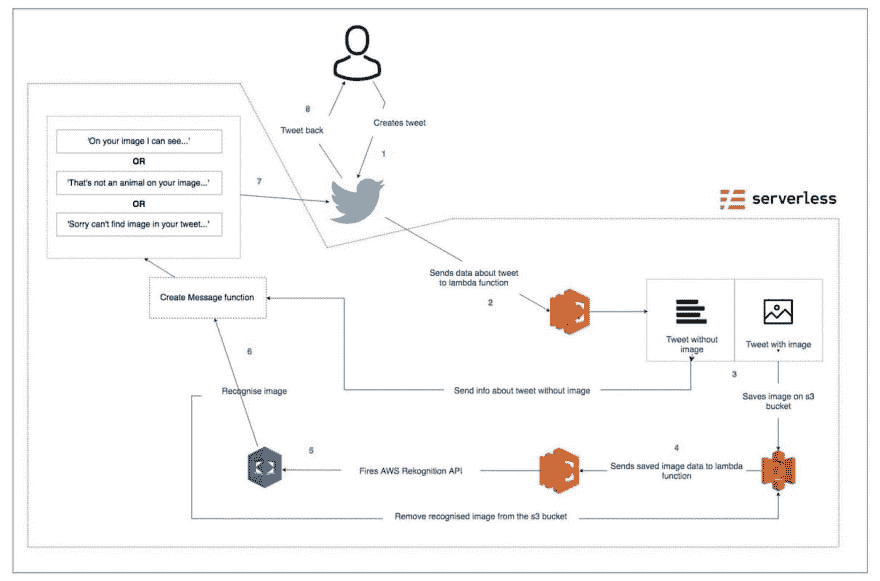
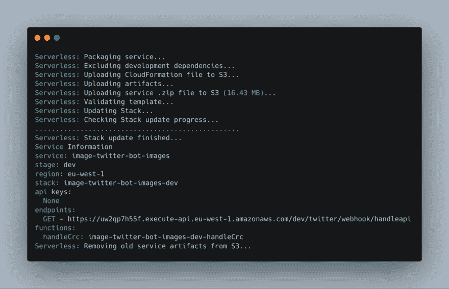

# 用无服务器和 AWS 创建 Twitter 图像识别机器人

> 原文：<https://dev.to/maciekgrzybek/create-twitter-image-recognition-bot-with-serverless-and-aws-396a>

[](https://res.cloudinary.com/practicaldev/image/fetch/s--_S-7S0zS--/c_limit%2Cf_auto%2Cfl_progressive%2Cq_auto%2Cw_880/https://images.unsplash.com/photo-1536250853075-e8504ee040b9%3Fixlib%3Drb-1.2.1%26ixid%3DeyJhcHBfaWQiOjEyMDd9%26auto%3Dformat%26fit%3Dcrop%26w%3D2100%26q%3D80g)

### 无服务器？

在过去的几年里，无服务器架构变得越来越流行。开发人员和公司正在改变他们创建、维护和部署 web 应用程序的方法。但是什么是真正的无服务器呢？正如来自[https://serverless-stack.com/](https://serverless-stack.com/)的人所定义的:

> 无服务器计算(或简称为无服务器计算)是一种执行模型，其中云提供商(AWS、Azure 或 Google Cloud)负责通过动态分配资源来执行一段代码。并且只对用于运行代码的资源量收费。代码通常在无状态容器中运行，这些容器可以由各种事件触发，包括 http 请求、数据库事件、队列服务、监控警报、文件上传、预定事件(cron 作业)等。发送给云提供商执行的代码通常以函数的形式出现。因此，无服务器有时被称为功能即服务或 FaaS。

提示:看看他们的教程——它真的很棒，会帮助你理解在无服务器的世界里什么是什么。

### 你会造什么？

在本教程中，我将向您展示如何构建一个 Twitter 机器人，它将接收附有图像的推文，识别图像上的内容(如果是动物)并以正确的响应进行响应。例如，如果你在推特上发布一张长颈鹿的图片，机器人将使用我们的无服务器架构，并几乎立即以这样的方式回复你——“嘿，在你的图片上，我可以看到一只长颈鹿！”。为了实现这一点，我们将使用无服务器框架。这是一个非常棒的工具，允许你在一个配置文件中轻松配置你的项目所需的所有云服务。除此之外，它是提供商不可知的，所以你不必在 AWS、Azure 或谷歌云之间进行选择，你可以使用所有这些。
在这个例子中，您将使用 Amazon Web Services - AWS。它有几十个很棒的云服务，但你只会使用其中的几个——S3 桶、Lambda 函数、API 网关和图像识别。查看这个奇特的流程图，看看它们是如何一起工作的。

[](https://res.cloudinary.com/practicaldev/image/fetch/s---W24yYf_--/c_limit%2Cf_auto%2Cfl_progressive%2Cq_auto%2Cw_880/https://i.postimg.cc/jq12yc2z/1-LCf-x-Z97-Af-y-DM5k-Bep-7w.jpg)

### 先做第一件事

在开始使用无服务器框架之前，您需要确保您已经准备好了基本的 Twitter API 配置。
首先，创建一个开发者 Twitter 账户，并在[https://developer.twitter.com](https://developer.twitter.com)上添加一个新应用。完成后，请转到“权限”部分，并确保将它更改为“读取、写入和直接发送邮件”。在“密钥和访问令牌”部分，确保生成了访问令牌和访问令牌密码。稍后您将需要它们来与 API 通信。
要将数据发送到您的 webhook，您需要访问账户活动 API。在这里申请。它说这是一个高级层，但我们只需要沙盒选项(这是免费的)来实现我们的目的。
现在，当您成功申请 API 访问时，在您的开发人员帐户上，转到开发环境并为帐户活动 API 创建一个环境。记下 Dev 环境标签，因为您稍后会用到它。

### 注册 Twitter webhook

现在，帐户活动 API 的工作方式起初可能看起来有点混乱，但实际上非常简单。下面是使其工作所需的步骤:

1.  向 Twitter API 发送包含 URL 端点信息的 post 请求，该请求将处理 Twitter 质询响应检查
2.  Twitter API 发送 GET 请求以完成 Twitter 质询响应检查
3.  您的端点用一个格式正确的 JSON 响应进行响应——web hook 已注册(耶！).
4.  向 Twitter API 发送 POST 请求，将您的应用程序订阅到您的 Twitter 应用程序。

为了处理所有这些请求，我们将创建一个 Twitter 控制器类。
首先，让我们创建我们需要在方法中使用的所有属性:

```
const request = require('request-promise');

module.exports = class TwitterController {
  constructor(consumerKey, consumerSecret, token, tokenSecret, urlBase, environment, crcUrl) {
    this.consumerKey = consumerKey;
    this.consumerSecret = consumerSecret;
    this.token = token;
    this.tokenSecret = tokenSecret;
    this.urlBase = urlBase;
    this.environment = environment;
    this.crcUrl = crcUrl;
    this.credentials = {
      consumer_key: this.consumerKey,
      consumer_secret: this.consumerSecret,
      token: this.token,
      token_secret: this.tokenSecret,
    };

    this.registerWebhook = this.registerWebhook.bind(this);
  }
}; 
```

Enter fullscreen mode Exit fullscreen mode

*[Twitter controller . js](https://github.com/maciekgrzybek/image-bot-rekon/blob/master/src/TwitterController.js)*

我们将在构造函数中传递的所有属性都将存储在项目根目录下的 serverless.env.yml 文件中。稍后我会回到这个话题。

现在，让我们来看看处理与 Twitter API 通信的方法。

```
 setRequestOptions(type, webhhokId) {
    let url = null;
    let content = {};
    const { urlBase, environment, credentials, crcUrl } = this;

    switch (type) {
      case ('registerWebhook'):
        url = `${urlBase}${environment}/webhooks.json`;
        content = {
          form: {
            url: crcUrl,
          },
        };
        break;
      case ('getWebhook'):
        url = `${urlBase}${environment}/webhooks.json`;
        break;
      case ('deleteWebhook'):
        url = `${urlBase}${environment}/webhooks/${webhhokId}.json`;
        break;
      case ('registerSubscription'):
        url = `${urlBase}${environment}/subscriptions.json`;
        break;
      case ('createTweet'):
        url = `${urlBase}update.json`;
        break;
      default:
        url = `${urlBase}${environment}/webhooks.json`;
    }
    return Object.assign({}, {
      url,
      oauth: credentials,
      headers: {
        'Content-type': 'application/x-www-form-urlencoded',
      },
      resolveWithFullResponse: true,
    }, content);
  }

  async registerWebhook() {
    const requestOptions = this.setRequestOptions('registerWebhook');

    try {
      const response = await request.post(requestOptions);
      console.log(response);
      console.log('Succesfully register webhook');
    } catch (err) {
      console.log(err);
      console.log('Cannot register webhook');
    }
  }

  async registerSubscription() {
    const requestOptions = this.setRequestOptions('registerSubscription');

    try {
      const response = await request.post(requestOptions);
      if (response.statusCode === 204) {
        console.log('Subscription added. Yay!');
      }
    } catch (err) {
      console.log(err);
      console.log('Cannot register subscription');
    }
  }

  async createTweet(status, tweetID) {
    const requestOptions = Object.assign({}, this.setRequestOptions('createTweet'), {
      form: {
        status,
        in_reply_to_status_id: tweetID,
        auto_populate_reply_metadata: true,
      },
    });

    try {
      await request.post(requestOptions);
    } catch (err) {
      console.log(err);
      console.log('Cannot post tweet.');
    }
  } 
```

Enter fullscreen mode Exit fullscreen mode

*[Twitter controller . js](https://github.com/maciekgrzybek/image-bot-rekon/blob/master/src/TwitterController.js)*

大多数方法都是异步函数，会创建某种请求。对于发送请求，我们使用请求-承诺库。让我们简单解释一下:

*   setRequestOptions -创建带有参数的对象，我们需要将这些参数传递给请求方法，比如端点 URL、凭证和可选内容
*   *registerWebhook* -向 Twitter API 发送 POST 请求，并将 Twitter 质询响应检查 URL 作为内容
*   *register subscription*——向 Twitter API 发送 POST 请求，向我们的 webhook 注册订阅
*   *createTweet* -向 Twitter 发送发布请求并创建新的 Tweet

### 无服务器

要开始使用无服务器，我们需要安装它(废话！).打开您的终端并全局安装框架。

```
$ npm install serverless -g 
```

Enter fullscreen mode Exit fullscreen mode

之后，导航到您的项目文件夹并运行:

```
$ serverless create --template aws-nodejs 
```

Enter fullscreen mode Exit fullscreen mode

该命令将创建一个默认的 node.js + AWS 配置文件。生成的 yaml 文件包含大量注释代码。我们这里不需要它，所以把它拿走吧。我们现在唯一关心的是这个:

```
service: aws-nodejs
provider:
  name: aws
  runtime: nodejs8.10
functions:
  hello:
    handler: handler.hello 
```

Enter fullscreen mode Exit fullscreen mode

这是最低限度的基本配置。现在，在我们继续下一步之前，您需要创建一个 AWS 帐户(如果您还没有)，并为无服务器设置您的 AWS 凭证。我就不赘述那个过程的细节了，你可以在这里看到如何去做。

设置好凭证后，您可以开始添加配置细节。但是还有一件事我想提一下。通常，无服务器将默认您的配置文件名称和 AWS 区域，但是如果您的机器上有多个配置文件(私人、工作等)。)，最好在 serverless.yaml 文件中这样定义:

```
provider:
  name: aws
  runtime: nodejs8.10
  profile: aws-private # your profile name
  region: eu-west-1 # aws region 
```

Enter fullscreen mode Exit fullscreen mode

提示:在你的命令行中，你可以使用一个快捷方式——而不是‘serverles…’,你可以简单地输入‘SLS…’。相当整洁。

### ENV 文件

就像我之前提到的，为了存储我们的密钥、令牌和其他变量，我们将在根文件夹中创建 serverless.env.yml 文件。应该是这样的:

```
TWITTER_CONSUMER_KEY: ########
TWITTER_CONSUMER_SECRET: ########
TWITTER_TOKEN: ########
TWITTER_TOKEN_SECRET: ########
ENVIRONMENT: ########
URL_BASE: 'https://api.twitter.com/1.1/account_activity/all/'
URL_CREATE: 'https://api.twitter.com/1.1/statuses/'
CRC_URL: ######## 
```

Enter fullscreen mode Exit fullscreen mode

前五个，我们之前提到过，在 Twitter 开发帐户中创建应用程序。这里还有一个 URL 库，只是为了将所有变量保存在一个文件中。稍后，我们将使用无服务器框架和 AWS 创建 Twitter 挑战响应检查 URL。

有了 env 文件，就可以通过将变量放在 serverless.yml 文件中，将变量注入到代码中。我们可以这样做:

```
custom:
  CRC_URL: ${file(./serverless.env.yml):CRC_URL}
  ENVIRONMENT: ${file(./serverless.env.yml):ENVIRONMENT}
  TWITTER_CONSUMER_KEY: ${file(./serverless.env.yml):TWITTER_CONSUMER_KEY}
  TWITTER_CONSUMER_SECRET: ${file(./serverless.env.yml):TWITTER_CONSUMER_SECRET}
  TWITTER_TOKEN: ${file(./serverless.env.yml):TWITTER_TOKEN}
  TWITTER_TOKEN_SECRET: ${file(./serverless.env.yml):TWITTER_TOKEN_SECRET}
  URL_BASE: ${file(./serverless.env.yml):URL_BASE}
provider:
  name: aws
  runtime: nodejs8.10
  profile: aws-private
  region: eu-west-1
  environment:
    TWITTER_CONSUMER_KEY: ${self:custom.TWITTER_CONSUMER_KEY}
    TWITTER_CONSUMER_SECRET: ${self:custom.TWITTER_CONSUMER_SECRET}
    TWITTER_TOKEN: ${self:custom.TWITTER_TOKEN}
    TWITTER_TOKEN_SECRET: ${self:custom.TWITTER_TOKEN_SECRET}
    ENVIRONMENT: ${self:custom.ENVIRONMENT} 
    CRC_URL: ${self:custom.CRC_URL}
    URL_BASE: ${self:custom.URL_BASE} 
```

Enter fullscreen mode Exit fullscreen mode

通过在 provider 中添加变量作为环境对象，我们能够在我们将要在无服务器配置文件中定义的任何函数中访问它们。我们也可以在每个函数中分别传递它，但是我将在教程的后面给出这个例子。

### 功能

现在，让我们进入项目的主要部分——lambda 函数。让我们首先在配置文件中定义它们。

```
functions:
handleCrc:
    handler: src/lambda_functions/handleCrc.handler
    events:
      - http:
          path: twitter/webhook/handleapi
          method: get 
```

Enter fullscreen mode Exit fullscreen mode

这里发生的是，我们创建了第一个 lambda 函数，名为 handleCrc。函数体将存在于 handler 方法中。在 events 部分，您可以定义何时调用该函数。正如你所看到的，在发送 GET 请求到我们的端点——Twitter/webhook/handle API 之后，handleCrc 函数将要运行。这是在无服务器框架中创建 lambda 函数配置的基本方式。有多个选项来定义事件，例如-图像已上传到 S3 桶，新数据已添加到数据库等。

让我们看看你的函数实际上是什么样子，它在做什么。

```
const crypto = require('crypto');

const encodeCrc = (crcToken, consumerSecret) => crypto.createHmac('sha256', consumerSecret).update(crcToken).digest('base64');

module.exports.handler = async (event) => {
  const responseToken = encodeCrc(
    event.queryStringParameters.crc_token,
    process.env.TWITTER_CONSUMER_SECRET,
  );
  return {
    statusCode: 200,
    body: JSON.stringify({ response_token: `sha256=${responseToken}` }),
  };
}; 
```

Enter fullscreen mode Exit fullscreen mode

*[handleCrc.js](https://github.com/maciekgrzybek/image-bot-rekon/blob/master/src/lambda_functions/handleCrc.js)*

您将使用加密库对来自 Twitter API 的响应进行编码。如你所见，这非常简单。您需要将 Twitter 挑战响应检查令牌和您的 Twitter 消费者机密传递给 encodeCRC 函数并返回结果。请注意，我们是从 process.env 对象中获取秘密的。由于之前在 serverless.yml 文件中定义了它，我们可以像这样访问它。

现在，您可以部署您的无服务器构建来获取稍后我们将需要的 Twitter 质询响应检查 URL。

要部署我们的功能，只需从我们的项目目录运行无服务器命令:

```
$ sls deploy 
```

Enter fullscreen mode Exit fullscreen mode

这将创建新的 AWS 云形成模板，并将您的功能上传到 S3 桶。如果一切顺利，您应该会看到如下内容:

[](https://res.cloudinary.com/practicaldev/image/fetch/s--goXQGJ8v--/c_limit%2Cf_auto%2Cfl_progressive%2Cq_auto%2Cw_880/https://i.postimg.cc/50hZxqZL/1-LOH0-MAFMn-K-Nz7-Djgd4v-Q.png)

在这里你可以找到你的栈的所有信息:阶段，栈名，端点，上传的函数等等。端点是你现在应该关心的事情。就像我之前提到的，你需要那个 URL 地址来通过 Twitter 挑战响应检查。将其复制并粘贴到 serverless.env.yml 文件中。

提示:如果您有兴趣了解$ sls deploy 命令运行时幕后实际发生了什么，您可以到[这里](https://serverless.com/framework/docs/providers/aws/guide/deploying/#aws---deploying)阅读所有相关内容。

### 注册 webhook 并订阅

现在，让我们添加 lambda 函数，它们将负责注册 webhook 和用户订阅。您将遵循相同的模式在配置文件中定义函数。

```
functions:
...
registerWebhook:
    handler: src/lambda_functions/registerWebhook.handler
    events:
      - http:
          path: twitter/webhook/register
          method: get
  registerSubscription:
    handler: src/lambda_functions/registerSubscription.handler
    events:
      - http:
          path: twitter/subscription/register
          method: get 
```

Enter fullscreen mode Exit fullscreen mode

这些函数的实际主体非常简单。基本上，您从 TwitterController 类中调用一个适当的方法，这是我们之前创建的。

```
const TwitterController = require('../TwitterController');

module.exports.handler = async () => {
  const controller = new TwitterController(
    process.env.TWITTER_CONSUMER_KEY,
    process.env.TWITTER_CONSUMER_SECRET,
    process.env.TWITTER_TOKEN,
    process.env.TWITTER_TOKEN_SECRET,
    process.env.URL_BASE,
    process.env.ENVIRONMENT,
    process.env.CRC_URL,
  );

  await controller.registerSubscription();
}; 
```

Enter fullscreen mode Exit fullscreen mode

*[register subscription . js](https://github.com/maciekgrzybek/image-bot-rekon/blob/master/src/lambda_functions/registerSubscription.js)*

```
const TwitterController = require('../TwitterController');

module.exports.handler = async () => {
  const controller = new TwitterController(
    process.env.TWITTER_CONSUMER_KEY,
    process.env.TWITTER_CONSUMER_SECRET,
    process.env.TWITTER_TOKEN,
    process.env.TWITTER_TOKEN_SECRET,
    process.env.URL_BASE,
    process.env.ENVIRONMENT,
    process.env.CRC_URL,
  );

  await controller.registerWebhook();
}; 
```

Enter fullscreen mode Exit fullscreen mode

*[register web hook . js](https://github.com/maciekgrzybek/image-bot-rekon/blob/master/src/lambda_functions/registerWebhook.js)*

这里肯定没有魔法。创建一个类的新实例，传递所有凭证，然后运行函数。就是这样。让我们用:
重新部署我们的应用程序

```
$ sls deploy 
```

Enter fullscreen mode Exit fullscreen mode

您应该会看到一个“报告”(类似于我们在第一次部署后收到的报告)，其中包含您的端点 URL。现在你已经准备好注册你的 webhook 了。

您可以直接将端点粘贴到浏览器的地址栏中。先用 registerWebhook 做吧。但在此之前，让我们看看如何实际监控我们的功能。

```
$ sls logs -f registerWebhook 
```

Enter fullscreen mode Exit fullscreen mode

如果您在终端中运行它，您将得到上次函数调用的日志报告。您可以选择跟踪日志，并通过传递此选项继续监听新日志:

```
$ sls logs -f registerWebhook -t 
```

Enter fullscreen mode Exit fullscreen mode

注意:这只有在你的函数至少被调用过一次的情况下才有效。

现在，您可以在浏览器中访问您的 registerWebhook 端点 URL。之后，进入终端并运行日志。如果您一切正常，您应该会看到一条消息:

```
Successfully register webhook 
```

Enter fullscreen mode Exit fullscreen mode

对 registerSubscription 函数重复相同的步骤。太好了！您刚刚注册了您的 twitter webhook。

### 处理推特回复

从现在开始，你的 twitter 账户上的任何活动都会触发一个包含该活动所有数据的 POST 请求。要查看数据，您必须创建一个 lambda 函数来处理该请求。

```
/* serverless.yml */
functions:
...
handleTweet:
    handler: src/lambda_functions/handleTweet.handler
    events:
      - http:
          path: twitter/webhook/handleapi
          method: post 
```

Enter fullscreen mode Exit fullscreen mode

```
module.exports = (username, labels = []) => {
  let message = '';
  const ANIMAL_LABELS = ['Animal', 'Mammal', 'Bird', 'Fish', 'Reptile', 'Amphibian'];
  const isAnimal = labels.length && labels.some(label => ANIMAL_LABELS.includes(label.Name));

  if (labels.length === 0) {
    message = `Sorry @${username}, you need to upload an image.`;
  } else if (isAnimal) {
    const recongizedLabels = labels.map(label => label.Name);
    message = `Hi @${username}. On your image, I can recognize: ${recongizedLabels.join(', ')}.`;
  } else {
    message = `Ooops @${username} looks like it's not an animal on your image.`;
  }

  return message;
}; 
```

Enter fullscreen mode Exit fullscreen mode

*[create message . js](https://github.com/maciekgrzybek/image-bot-rekon/blob/master/src/helpers/createMessage.js)T3* 

```
const uploadImage = require('../helpers/uploadImage');
const createMessage = require('../helpers/createMessage');
const TwitterController = require('../TwitterController');

module.exports.handler = async (event) => {
  const tweet = JSON.parse(event.body);
  const tweetData = await tweet.tweet_create_events;

  if (typeof tweetData === 'undefined' || tweetData.length < 1) {
    return console.log('Not a new tweet event');
  }

  if (tweet.for_user_id === tweetData[0].user.id_str) {
    return console.log('Same user, not sending response.');
  }

  const { id_str, user, entities } = tweetData[0];
  const key = `${id_str}___---${user.screen_name}`;

  // If tweet containes image
  if (entities.hasOwnProperty('media')) {
    const imageUrl = tweetData[0].entities.media[0].media_url_https;
    await uploadImage(imageUrl, {
      bucket: process.env.BUCKET,
      key,
    });
  } else {
    const controller = new TwitterController(
      process.env.TWITTER_CONSUMER_KEY,
      process.env.TWITTER_CONSUMER_SECRET,
      process.env.TWITTER_TOKEN,
      process.env.TWITTER_TOKEN_SECRET,
      process.env.URL_CREATE,
      process.env.ENVIRONMENT,
      process.env.CRC_URL,
    );
    const message = createMessage(user.screen_name);
    await controller.createTweet(message, key);
  }
}; 
```

Enter fullscreen mode Exit fullscreen mode

```
const fetch = require('node-fetch');
const AWS = require('aws-sdk');

const s3 = new AWS.S3();

module.exports = async (image, meta) => {
  console.log('Uploading image....');

  const mediaResponse = await fetch(image);
  const bufferedMedia = await mediaResponse.buffer();
  const params = {
    Bucket: meta.bucket,
    Key: meta.key,
    Body: bufferedMedia,
  };

  try {
    const uploadedImage = await s3.putObject(params).promise();
    console.log(uploadedImage, 'Image uploaded.');
  } catch (err) {
    console.log(err);
    console.log('Cannot upload.');
  }
}; 
```

Enter fullscreen mode Exit fullscreen mode

*[uploadImage.js](https://github.com/maciekgrzybek/image-bot-rekon/blob/master/src/lambda_functions/uploadImage.js)*

让我们分析一下，看看这里到底发生了什么:

在 handleTweet.js 文件中:

1.  检查事件对象是否实际上是一条推文(可能是一条私人消息或其他东西)，以及推文是否来自另一个用户(我们不想在发送回复时创建一个无限循环)
2.  检查媒体元素的 tweet，如果有，你要上传一张图片到 S3 桶，如果没有，发送回 tweet，包含丢失图片的信息

注意:在第 18 行，我们从变量——tweet ID 和用户名以及一些破折号/下划线——创建了一个文件名。我们这样做是为了在后面容易得到这些变量。

在 uploadImage.js 文件中:

1.  用 npm 安装 node-fetch，并用它来下载保存在 Twitter 服务器上的图片
2.  使用缓冲区方法将提取的图像转换为二进制数据，并在参数中作为主体传递
3.  安装 aws-sdk 包以直接在代码中使用 aws 服务方法
4.  使用 s3.putObject 方法将图像上传到 s3 bucket

提示:您可以通过对大多数 aws-sdk 请求运行 promise()来返回一个承诺，而不是使用回调。更多[见这里](https://docs.aws.amazon.com/sdk-for-javascript/v2/developer-guide/using-promises.html)。

### 处理上传到 S3 的图片

现在，您想要设置一个 lambda 函数，它将在每次新图像上传到我们的桶时触发。为此，我们需要向 server less . yml
添加一些配置

```
/* serverless.yml */
functions:
...
respondToTweetWithImage:
    handler: src/lambda_functions/respondToTweetWithImage.handler
    events:
      - s3: 
          bucket: ${self:custom.BUCKET} 
```

Enter fullscreen mode Exit fullscreen mode

我们来看看 respondToTweetWithImage 函数。

```
const AWS = require('aws-sdk');

module.exports = async (meta) => {
  const rekognition = new AWS.Rekognition();
  const params = {
    Image: {
      S3Object: {
        Bucket: meta.bucket.name,
        Name: meta.object.key,
      },
    },
    MaxLabels: 5,
    MinConfidence: 85,
  };

  try {
    const data = await rekognition.detectLabels(params).promise();
    return data.Labels;
  } catch (err) {
    console.log(err);
    console.log('Cannot recognize image');
  }
}; 
```

Enter fullscreen mode Exit fullscreen mode

*[recognizeimage . js](https://github.com/maciekgrzybek/image-bot-rekon/blob/master/src/helpers/recognizeImage.js)*

```
const AWS = require('aws-sdk');

module.exports = (meta) => {
  const s3 = new AWS.S3();
  const params = {
    Bucket: meta.bucket.name,
    Key: meta.object.key,
  };

  try {
    s3.deleteObject(params).promise();
  } catch (err) {
    console.log(err);
    console.log('Cannot delete image.');
  }
}; 
```

Enter fullscreen mode Exit fullscreen mode

*[remove image . js](https://github.com/maciekgrzybek/image-bot-rekon/blob/master/src/helpers/removeImage.js)T3* 

```
const recognizeImage = require('../helpers/recognizeImage');
const removeImage = require('../helpers/removeImage');
const createMessage = require('../helpers/createMessage');
const TwitterController = require('../TwitterController');

module.exports.handler = async (event) => {
  const { s3 } = event.Records[0];
  const tweetId = s3.object.key.split('___---')[0];
  const username = s3.object.key.split('___---')[1];

  const labels = await recognizeImage(s3);
  const message = createMessage(username, labels);
  const controller = new TwitterController(
    process.env.TWITTER_CONSUMER_KEY,
    process.env.TWITTER_CONSUMER_SECRET,
    process.env.TWITTER_TOKEN,
    process.env.TWITTER_TOKEN_SECRET,
    process.env.URL_CREATE,
    process.env.ENVIRONMENT,
    process.env.CRC_URL,
  );
  await controller.createTweet(message, tweetId);
  removeImage(s3);
}; 
```

Enter fullscreen mode Exit fullscreen mode

*[respontotweetwithimage . js](https://github.com/maciekgrzybek/image-bot-rekon/blob/master/src/lambda_functions/respondToTweetWithImage.js)*

让我们分析一下，看看实际发生了什么:

1.  当一个图像被上传到 s3 bucket 时，该函数将接收一个包含该事件所有数据的对象
2.  感谢 image filename 的特定构造，我们可以获得发布它的原始 tweet id 和用户名
3.  之后，该函数将把关于事件的数据传递给 AWS Rekognition 类
4.  然后，它识别图像上的内容，并将其返回给 createMessage 函数
5.  创建的消息作为响应发布到 Twitter 上
6.  从 s3 存储桶中删除图像，因为不再需要它

### 结论

仅此而已。你已经成功创建了一个 Twitter 机器人，它将自动识别图像，并根据发布的图片以正确的消息做出响应。我鼓励你玩更多的功能——识别不同类型的图像，创建更具体的信息等。这个例子只是对无服务器的一个简要概述，以及如何在几乎没有后端知识的情况下用它来构建东西。

如果您有任何意见或认为可能有问题，请给我发消息或留下评论。