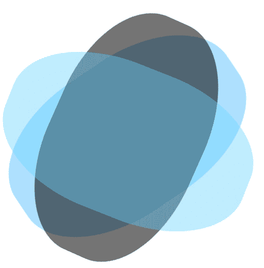

# 用纯 CSS 创建波浪

> 原文：<https://dev.to/pixmy/create-waves-with-pure-css-5gp>

大家好！

今天我们将学习如何在 ps4 界面中用纯 CSS 创建波浪，这是最终结果:

[](https://res.cloudinary.com/practicaldev/image/fetch/s--veS09c0c--/c_limit%2Cf_auto%2Cfl_progressive%2Cq_66%2Cw_880/https://thepracticaldev.s3.amazonaws.com/i/a79p4ddf652wvsi8lv1y.gif)

## 我们开始吧

**HTML**

```
<div class='box'>
          <div class='wave -one'></div>
          <div class='wave -two'></div>
          <div class='wave -three'></div>
      </div> 
```

Enter fullscreen mode Exit fullscreen mode

我们需要一个“div”用于你想要设置的每一个 wave，在这个例子中，我们将使用 3 个类“wave ”,并将它们包装在另一个类“box”的 div 中。

**CSS**

```
.box {
  position: fixed;
  top: 0;
  transform: rotate(80deg); 
  left: 0;
}

.wave {
  position: absolute;
  opacity: .4;
  width: 1500px;
  height: 1300px;
  margin-left: -150px;
  margin-top: -250px;
  border-radius: 43%;
} 
```

Enter fullscreen mode Exit fullscreen mode

首先，我们需要将“盒子”容器定义为固定位置，在这种情况下，为了达到与 ps4 界面相同的效果，接下来的 3 个 css 规则仅用于将“盒子”元素定位在您想要的任何位置。你可以随意使用这些值。

在你设置好“盒子”元素后，是时候创建波浪了。如果你查看“wave”类中的规则，大多数规则都是针对波的定位，但该动画的关键规则是边界半径，原因如下:

[](https://res.cloudinary.com/practicaldev/image/fetch/s--uWn0mp_q--/c_limit%2Cf_auto%2Cfl_progressive%2Cq_66%2Cw_880/https://thepracticaldev.s3.amazonaws.com/i/knvp3k19j1yu3zldd1nv.gif)

我们正在创建一个边界半径适中的矩形，如果我们放大到这个动画的一个角落，我们将这个波浪放置在正确的位置，我们将实现波浪效果。

现在我们需要创建动画来旋转波浪。超级简单！

```
@keyframes rotate {
  from { transform: rotate(0deg); }
  from { transform: rotate(360deg); }
} 
```

Enter fullscreen mode Exit fullscreen mode

一旦我们在 css 中有了动画，我们需要用不同的时间和背景颜色设置动画到我们的波浪中，你也可以用不透明的:D 来玩

```
.wave.-one {
  animation: rotate 7000ms infinite linear;
  opacity: .1;
  background: #0af;
}

.wave.-two {
  animation: rotate 3000ms infinite linear;
  opacity: .1;
  background: black;
}

.wave.-three {
  animation: rotate 7500ms infinite linear;
  background-color: #77daff;
} 
```

Enter fullscreen mode Exit fullscreen mode

我们完了。现在你应该可以看到海浪了！！！类似于我不久前做的这个代码笔(只能在桌面上正常工作)

[https://codepen.io/Pixmy/embed/qaYQoV?height=600&default-tab=result&embed-version=2](https://codepen.io/Pixmy/embed/qaYQoV?height=600&default-tab=result&embed-version=2)

这是我的第一篇帖子！希望你喜欢:D