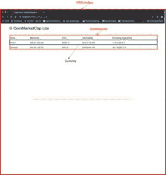
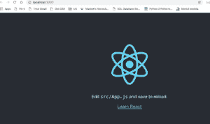
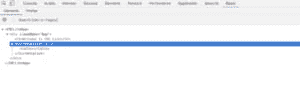
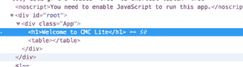
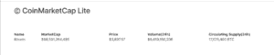

# 创建您的第一个 ReactJS 应用程序

> 原文：<https://dev.to/kadnan/create-your-first-reactjs-app-fbh>

[](https://res.cloudinary.com/practicaldev/image/fetch/s--0XTk7tIm--/c_limit%2Cf_auto%2Cfl_progressive%2Cq_auto%2Cw_880/https://miro.medium.com/max/1120/1%2AyQPzM3BaubJgWQkoL29iOw.png)

在本教程中，您将学习什么是 ReactJS，以及如何使用这个 JS 框架用 Javascript 编写可维护的 web 应用程序。

我们将要建立的项目将是一个克隆的 [Coinmarketcap](https://coinmarketcap.com/) ，这是一个列出加密货币最新价格的著名网站。CMC 提供 JSON APIs 来访问他们的数据。

在我进入主要项目之前，让我们谈一谈 ReactJS 本身。

## react js 是什么？

来自[官方网站](https://reactjs.org/) e:

> 用于构建用户界面的 JavaScript 库。

ReactJS 最初由脸书开发，现在由社区维护。

ReactJS 是:

*   声明性的:声明性意味着你不需要告诉所有的细节，只需要告诉你想要什么，框架会自动处理。简而言之，没有像 jQuery 那样的直接 DOM 操作。
*   **面向组件:-** 在 ReactJS 中，一个页面被划分成组件。有些组件是其他组件的子组件。例如，如果一个页面有一个*搜索栏*。搜索栏将被视为一个组件。
*   **一次学习，随处写:-** ReactJS 可以和 NodeJS 一起用作服务器语言，在 *ReactNative* 的帮助下，可以用于移动应用。

## 思维在作出反应

ReactJS 背后的团队分享了一篇非常有用的[文章](https://reactjs.org/docs/thinking-in-react.html)，它讲述了框架本身背后的哲学，以及如何通过与其他团队成员合作来高效地设计应用。我将遵循它来编写我们的 CoinmarketCap 克隆。

[](http://blog.adnansiddiqi.me/wp-content/uploads/2019/03/CMCThinkingReact.jpg)

实体模型已完成，组件标签也已完成。我们将相应地制造我们的组件。

## 创建 ReactApp

假设您已经安装了更新的节点和 NPM，我们将使用 [npx](https://www.npmjs.com/package/npx) 工具在本地安装并运行 react app。

`npx create-react-app cmclite`

你还应该安装 [React 开发者工具](https://chrome.google.com/webstore/detail/react-developer-tools/fmkadmapgofadopljbjfkapdkoienihi)，一个 Chrome 扩展来检查 DOM。

一旦创建了应用程序，运行`npm start`来运行服务器。如果一切顺利，您应该会看到如下内容:

[](http://blog.adnansiddiqi.me/wp-content/uploads/2019/03/Screen-Shot-2019-03-07-at-6.33.09-PM.png)

在第一层，它创建了`public`和`src`文件夹以及一些其他文件。

```
➜ cmclite git:(master) tree -L 1.├── README.md├── node\_modules├── package-lock.json├── package.json├── public 
```

Enter fullscreen mode Exit fullscreen mode

在`public`文件夹中，你可以找到一个`index.html`文件。该文件包含以下行:

`<div id="root"></div>`

是整个应用程序的主容器 div。

如果您注意到在`index.html`中没有包含任何`.js`文件。[的 Create-React 应用程序](https://github.com/facebook/create-react-app)正在做一些神奇的事情来处理所有这些依赖。如果你想深入了解，请阅读[这篇](https://stackoverflow.com/a/44727158/275002)精彩的回答。

接下来，转到`src/App.js`文件，在该文件中可以找到以下代码:

```
class App extends Component { render() { return ( <div className="App"> <header className="App-header">  <p> Edit <code>src/App.js</code> and save to reload. </p> <a className="App-link" href="https://reactjs.org" target="\_blank" rel="noopener noreferrer" > Learn React </a> </header> </div> ); }} 
```

Enter fullscreen mode Exit fullscreen mode

我们将删除不必要的代码行，文件现在看起来像:

```
import React, { Component } from 'react';import './App.css';class CMCLiteApp extends Component { render() { return ( <div className="App"> <h1>Welcome to CMC Lite</h1> </div> ); }}export default CMCLiteApp; 
```

Enter fullscreen mode Exit fullscreen mode

我不打算讨论这个`import`是什么意思，因为这超出了本文的范围。你可能想通过谷歌了解 ES6 javascript。如果你太懒，就去参观这里的。

好吧。最外层的组件`CMCLiteApp`已经准备好了，现在我们必须处理内部组件。

你注意到 Javascript 和 HTML 奇怪的混合了吗？它被称为**JSX(Java script XML)。**

## 什么是 JSX？

ReactJS 使用 JSX 作为模板，尽管这不是必需的。使用它有几个好处:

*   更快，因为它在编译时执行优化。
*   类型安全，大多数错误可以在编译过程中被捕获。
*   由于编写模板变得更加容易，生产率得到了提高。

Babel 用作预处理器，将基于 JSX 的语法编译成 JS 对象。让我们讨论一个简单的例子:

```
const element = <h1>Hello, world!</h1> 
```

Enter fullscreen mode Exit fullscreen mode

你可以看到这个奇怪的语法。奇怪是因为你看到 HTML 和 Javascript 混在一起了。如果你在线运行粘贴这一行[巴别塔 REPL](https://babeljs.io/en/repl) 你会看到原生的 JS 代码:

```
"use strict";var element = React.createElement("h1", null, "Hello, world!"); 
```

Enter fullscreen mode Exit fullscreen mode

另:

```
const myId = 'test'const element = <h1 id={myId}>Hello, world!</h1> 
```

Enter fullscreen mode Exit fullscreen mode

这里你分配一个变量，然后使用它。它的 JS 版本生成为:

```
var myId = 'test';var element = React.createElement("h1", { id: myId}, "Hello, world!"); 
```

Enter fullscreen mode Exit fullscreen mode

正如你所看到的，JSX 版本更短，可读性更强。

```
<div> <Article /> <LeftBar /></div> 
```

Enter fullscreen mode Exit fullscreen mode

JS 版本为:

```
"use strict";React.createElement("div", null, React.createElement(Article, null), React.createElement(LeftBar, null)); 
```

Enter fullscreen mode Exit fullscreen mode

如你所见，`<div>`嵌套了`<Article>`和`<LeftBar>`标签。JS 版本也创建了元素。

好吧，让我们回到我们的项目。我们现在将创建`CurrencyList`对象，它只是显示`<table></table>`

我在`src`下创建了一个文件夹，命名为`components`。在这个文件夹下，我创建了一个名为`CurrencyList.js`的文件。参考我上面分享的图/样机。这个名字也在那里使用。

```
import React, { Component } from 'react';class CurrencyList extends Component { render() { return ( <table></table> ); }}export default CurrencyList; 
```

Enter fullscreen mode Exit fullscreen mode

`CurrencyList.js`包含了`<table>`标签。`App.js`现在看起来是这样的:

```
import CurrencyList from './components/CurrencyList'class CMCLiteApp extends Component { render() { return ( <div className="App"> <h1>Welcome to CMC Lite</h1> <CurrencyList /> </div> ); 
```

Enter fullscreen mode Exit fullscreen mode

导入文件后，我调用了`<CurrencyList>`组件。如果一切顺利，你应该在 Chrome 浏览器的**反应**标签中看到以下内容。

[](http://blog.adnansiddiqi.me/wp-content/uploads/2019/03/Screen-Shot-2019-03-09-at-4.15.49-PM.png)

这里可以看到`<table>`标签。典型的 Chrome 检查器显示以下标记:

[](http://blog.adnansiddiqi.me/wp-content/uploads/2019/03/Screen-Shot-2019-03-09-at-4.18.43-PM.png)

在这里，您可以清楚地看到这两种标记之间的区别。

好了，下一个组件是`Currency`组件。表格中的一行。在`src/components`中创建一个新文件`Currency.js`。

```
import React, { Component } from 'react';class Currency extends Component { render() { return ( <tr> <td>Bitcoin</td> <td>$68,501,264,485</td> <td>$3,897.57</td> <td>$9,419,160,206</td> <td>17,575,400 BTC</td> </tr> ); }}export default Currency; 
```

Enter fullscreen mode Exit fullscreen mode

正如所料，它只包含几行条目。现在它是硬编码的，但它很快就会与 CMC API 联系起来。`CurrencyList.js`文件现在看起来像这样:

```
import Currency from './Currency'class CurrencyList extends Component { render() { return ( <table className="table margin-top"> <tr> <th>Name</th> <th>MarketCap</th> <th>Price</th> <th>Volume(24h)</th> <th>Circulating Supply(24h)</th> </tr> <Currency /> </table> ); }} 
```

Enter fullscreen mode Exit fullscreen mode

在添加了静态的`<th>`之后，我调用了`<Currency />`组件。我还在`App.js`中做了与引导相关的修改，现在看起来像:

```
class CMCLiteApp extends Component { render() { return ( <div className="container"> <div className='row'> <div className="col-md-12"></div> <h2>&copy; CoinMarketCap Lite</h2> </div> <div class="row margin-top"> <CurrencyList /> </div> </div> ); }} 
```

Enter fullscreen mode Exit fullscreen mode

如果一切正常，您应该会看到如下内容:

[](http://blog.adnansiddiqi.me/wp-content/uploads/2019/03/Screen-Shot-2019-03-09-at-4.42.11-PM.png)

在我进一步介绍和连接 API 之前，让我们先谈一谈道具和状态。

## 道具 vs 状态

属性是一个只读对象，由父对象传递给子对象。道具不能修改。另一方面，状态对象可以被修改。通常，当传递给子对象时，状态对象成为一个属性。从 CoinMarketAPI 中，我挑选了几个 JSON 条目，并在`App.js`文件中设置了一个状态变量。

```
API\_KEY = '<YOUR COINMARKET API KEY>' state = { currencies: [{ "id": 1, "name": "Bitcoin", "symbol": "BTC", "slug": "bitcoin", "circulating\_supply": 17578950, "total\_supply": 17578950, "max\_supply": 21000000, "date\_added": "2013-04-28T00:00:00.000Z", "num\_market\_pairs": 6700, "tags": [ "mineable"], "platform": null, "cmc\_rank": 1, "last\_updated": "2019-03-09T12:07:27.000Z", "quote": { "USD": { "price": 3943.74146337, "volume\_24h": 10641968561.724, "percent\_change\_1h": 0.0142697, "percent\_change\_24h": 0.477704, "percent\_change\_7d": 2.24831, "market\_cap": 69326833997.50806, "last\_updated": "2019-03-09T12:07:27.000Z" } } }, { "id": 1027, "name": "Ethereum", "symbol": "ETH", "slug": "ethereum", "circulating\_supply": 105163658.5616, "total\_supply": 105163658.5616, "max\_supply": null, "date\_added": "2015-08-07T00:00:00.000Z", "num\_market\_pairs": 4770, "tags": ["mineable"], "platform": null, "cmc\_rank": 2, "last\_updated": "2019-03-09T12:07:20.000Z", "quote": { "USD": { "price": 138.471887904, "volume\_24h": 4958392663.27933, "percent\_change\_1h": 0.105328, "percent\_change\_24h": 0.747307, "percent\_change\_7d": 2.97593, "market\_cap": 14562210339.916405, "last\_updated": "2019-03-09T12:07:20.000Z" } } }, ] } 
```

Enter fullscreen mode Exit fullscreen mode

然后在`render()`中我做了如下的事情:

```
<div className="row margin-top"> <CurrencyList currencies={this.state.currencies} /> </div> 
```

Enter fullscreen mode Exit fullscreen mode

然后在`CurrencyList`组件中，我通过一个`prop`变量:
访问它

```
render() { console.log(this.props.currencies); return (... 
```

Enter fullscreen mode Exit fullscreen mode

如你所见，我在`CurrencyList`标签中传递了一个`currencies`参数，然后我在`CurrencyList`组件中访问它。到目前为止一切顺利。我们的数据是可用的。迭代和创建多个`<Currency>`对象需要什么。我将在`CurrencyList.js`做一些改变，所以请注意，因为它们很重要。

```
return ( <table className="table margin-top"> <thead> <tr> <th>Name</th> <th>MarketCap</th> <th>Price</th> <th>Volume(24h)</th> <th>Circulating Supply(24h)</th> </tr> </thead> <tbody> { this.props.currencies.map(( currency ) => { return ( <Currency key={currency.id} currency={currency} /> ); }) } </tbody> </table> 
```

Enter fullscreen mode Exit fullscreen mode

首先，我用`THEAD`和`TBODY`包围这些行，因为编译器会警告我。之后，我添加了一个[评估块](https://medium.com/@leannezhang/curly-braces-versus-parenthesis-in-reactjs-4d3ffd33128f) `{}`，在其中，我调用了`map`来迭代一个`currencies`对象并将值传递给`<Currency>`标签。注意我传递了`key`参数。同样，React 希望确保存在唯一的 DOM 条目。*箭头功能*和*贴图*不在本文讨论范围内。你可能会在网上找到一些好的资源。你也可以使用普通的 for 循环，现在`Currency`组件看起来如下:

```
<tr> <td>{this.props.currency.name}</td> <td>{this.props.currency.quote.USD.market\_cap.toLocaleString('en-US', {style: 'currency',currency: 'USD',})}</td> <td>{this.props.currency.quote.USD.price.toLocaleString('en-US', {style: 'currency',currency: 'USD',})}</td> <td>{this.props.currency.quote.USD.volume\_24h}</td> <td>{this.props.currency.circulating\_supply}</td> </tr> 
```

Enter fullscreen mode Exit fullscreen mode

到目前为止一切顺利。状态对象被集成，数据被显示。现在剩下的是访问实时数据。

## 访问远程 API

为此，我将使用 [Axios](https://github.com/axios/axios) 库。通过运行`npm i axios`安装它。您可能需要手动安装依赖项。

CoinMarketCap API [不允许](https://coinmarketcap.com/api/faq/)直接从 Javascript 访问他们的 API，所以我创建了一个简单的 PHP 脚本来访问 CMC API，然后通过在返回的头中启用 CORS 来返回数据。一旦安装了 Axios，导入它`import axios from 'axios`

```
class CMCLiteApp extends Component { state = { currencies: [] } componentDidMount() { axios.get('http://localhost:8080/fetch.php') .then(res=> this.setState({ currencies:res.data.data })) } 
```

Enter fullscreen mode Exit fullscreen mode

清空`currencies`后，在`componentDidMount()`方法中对其进行设置。一旦 DOM 被插入到树中，它就会被立即调用。一旦数据被获取，`setState()`被用来分配`state`对象的键`currencies`。

## 结论

这是非常基础的 ReactJS 教程，应该可以帮助你起步。有更多的东西可以探索，我建议你访问官方文件和其他在线资源。该代码可在 [Github](https://github.com/kadnan/ReactCoinMarketCap) 上获得。