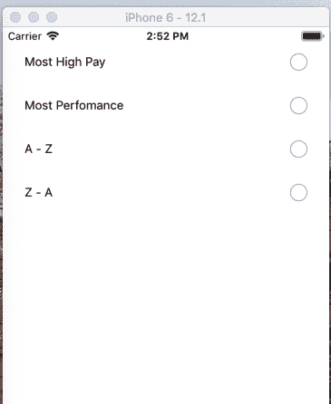
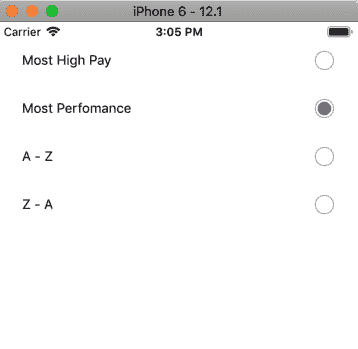

# React Native 单选按钮在 react native 中轻松创建自己的单选按钮组件

> 原文：<https://dev.to/saadbashar/create-your-own-radio-button-component-in-react-native-easily-59il>

您可以非常容易地在 react native 中创建自己的单选按钮组件。首先，您需要为单选按钮创建一个选项数组，并将其传递给单选按钮组件，如下所示:

```
const options = [
    {
        key: 'pay',
        text: 'Most High Pay',
    },
    {
        key: 'performance',
        text: 'Most Perfomance',
    },
    {
        key: 'aToZ',
        text: 'A - Z',
    },
    {
        key: 'zToA',
        text: 'Z - A',
    },
];

{...}
<RadioButtons options={options} /> 
```

之后，在你的单选按钮组件中，你可以在你的渲染方法中映射所有这些选项，并创建单选按钮视图

```
{options.map(item => {
    return (
        <View key={item.key} style={styles.buttonContainer}>
            <Text>{item.text}</Text>
            <TouchableOpacity style={styles.circle} />
        </View>
    });
} 
```

这将创建如下所示的默认单选按钮-

[](https://res.cloudinary.com/practicaldev/image/fetch/s--0T_-7esO--/c_limit%2Cf_auto%2Cfl_progressive%2Cq_auto%2Cw_880/https://thepracticaldev.s3.amazonaws.com/i/ne4l5ahsylbozocnqkeu.png)

现在是时候设置单击单选按钮时的状态了。首先我们声明我们的状态

`state = { value: null }`

，然后当点击任何特定的按钮时，我们定义我们选中的按钮。

```
<TouchableOpacity
    style={styles.circle}
    onPress={() => this.setState({ value: key })} // we set our value state to key
>
    { value === item.key && (<View style={styles.checkedCircle} />) } // when value is equal to key
</TouchableOpacity> 
```

所以现在当点击它的时候，它看起来像这样-

[](https://res.cloudinary.com/practicaldev/image/fetch/s--CINFtrD8--/c_limit%2Cf_auto%2Cfl_progressive%2Cq_auto%2Cw_880/https://thepracticaldev.s3.amazonaws.com/i/tp20i7e9qozfbmgdne0z.png)

最后是款式-

```
buttonContainer: {
    flexDirection: 'row',
    justifyContent: 'space-between',
    alignItems: 'center',
    marginBottom: 30,
},
circle: {
    height: 20,
    width: 20,
    borderRadius: 10,
    borderWidth: 1,
    borderColor: '#ACACAC',
    alignItems: 'center',
    justifyContent: 'center',
},
checkedCircle: {
    width: 14,
    height: 14,
    borderRadius: 7,
    backgroundColor: '#794F9B',
}, 
```

这里是小吃环节-[https://snack.expo.io/@saad-bashar/radio-buttons](https://snack.expo.io/@saad-bashar/radio-buttons)