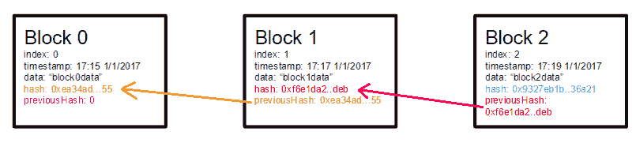
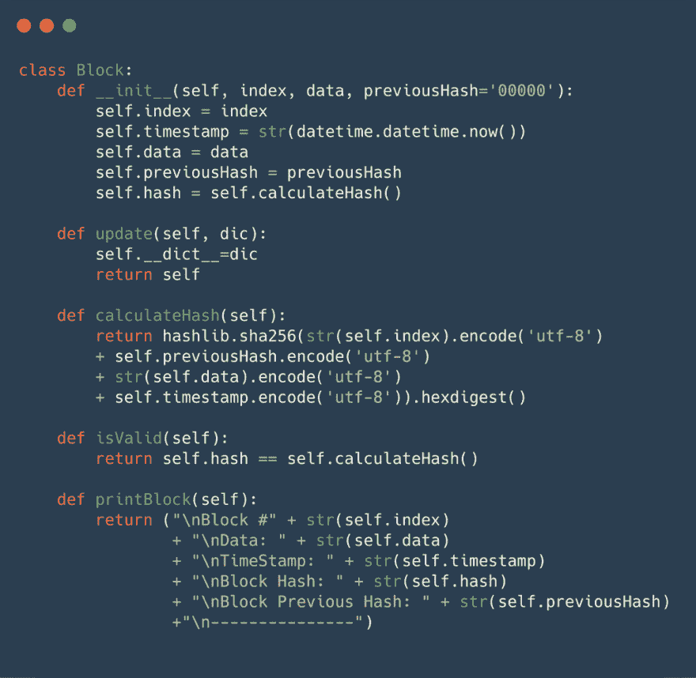
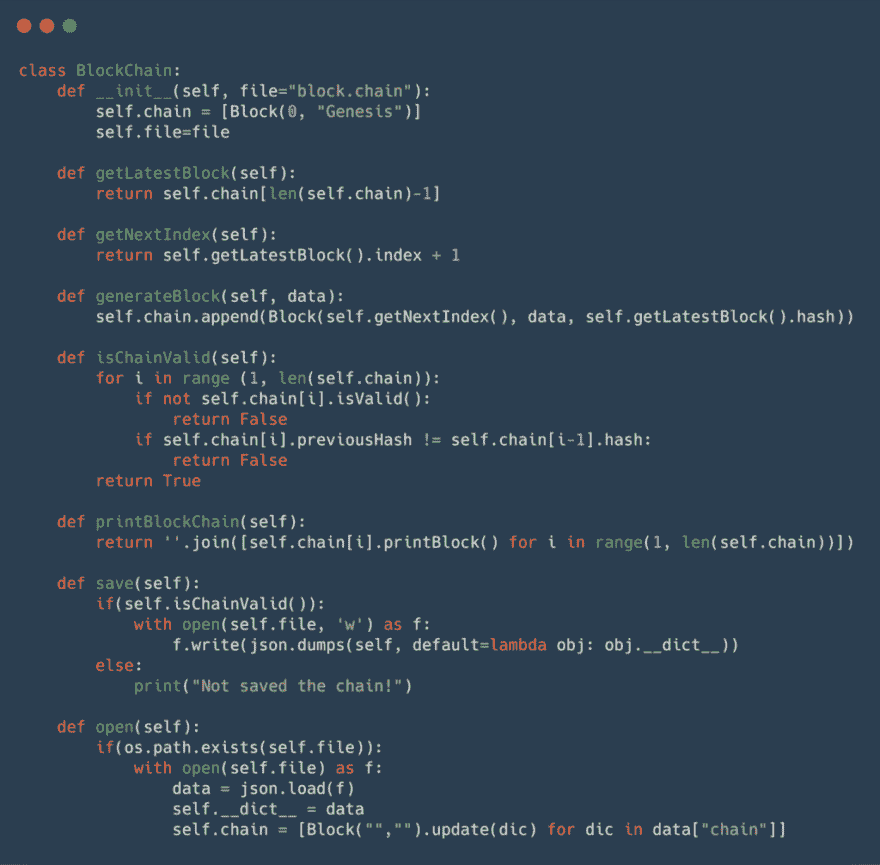

# 用不到 100 行代码创建区块链

> 原文：<https://dev.to/pemtajo/creating-a-blockchain-with-less-100-code-lines-5aba>

### 用不到 100 行代码创建区块链

<figure> 

<figcaption>照片由[思想目录](https://unsplash.com/@thoughtcatalog?utm_source=medium&utm_medium=referral)上[下](https://unsplash.com?utm_source=medium&utm_medium=referral)</figcaption>

</figure>

区块链的基本概念非常简单:*一个分布式数据库，它维护着一个不断增长的有序记录列表。*

区块链是一个通常与比特币和/或以太坊联系在一起的术语，但区块链不仅仅是这样，区块链是这些和任何其他加密货币背后的技术。

区块链还有很多其他用途，比如游戏( [CryptoKitties](https://www.cryptokitties.co/) )或者区块链+IOT(物联网)，而这只是这项技术的开始。

<figure> 

<figcaption>一个关于区块链概念的简单形象</figcaption>

</figure>

顾名思义，区块链是一串积木，所以，我们有第一类，积木。

在此阶段，我的块具有以下属性:

*   索引(index )-索引链中位置的块
*   时间戳—区块添加到区块链中的日期和时间
*   数据—数据值，换句话说，就是您要保存的内容
*   前一个哈希—块索引-1 的哈希
*   哈希—块的哈希

如果你不知道 hash 是什么，我已经在我的上一篇文章[这里](https://dev.to/pemtajo/an-overview-about-hash-functions-theory-and-security-139e)解释过了。

你会在图片中看到一些有趣的东西，我会在这里稍微解释一下:

*   让更多的 OOP 函数*是有效的*是为每个块响应他是否有效
*   构造函数定义了块中的所有东西
*   “更新”功能是在读取文件时更新*字典*，这是为了保存数据以备将来使用
*   计算以前保存的文件的哈希，总是转换成相同的编码，因为不同的编码有不同的字符，不同的字符产生不同的哈希。

所以这是一个有效的链，如果这个块被改变了，当前的块会知道，并使自己无效，如果任何先前的块被改变了，这个链会知道，所有的链都会无效。就是这个概念让区块链中保存的数据不可改变。

因此，在我们的第二个类别中，区块链看起来像是:

因此，区块链类创建块并寻找链中的任何问题，这个类负责保存在一个简单的 JSON 文件中并从他那里读取。我们的第一版区块链已经准备好了！！\o/

所有代码如下，您可以执行并查看输出