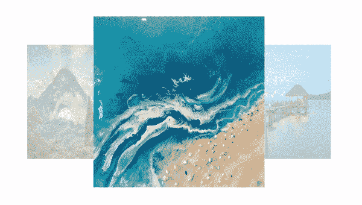
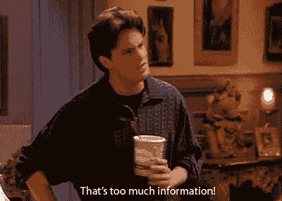

# 创建循环传送带

> 原文：<https://dev.to/dhilipkmr/creating-a-cycliccarousel-3j16>

[](https://res.cloudinary.com/practicaldev/image/fetch/s--31fkQ50V--/c_limit%2Cf_auto%2Cfl_progressive%2Cq_auto%2Cw_880/https://thepracticaldev.s3.amazonaws.com/i/eml2hzya6ekkcwmcgqsx.png)

最新的 React 包包括 **React 钩子**，这是一个新的 React API。使用 React 钩子非常简单。如果你是 React 钩子的新手，你需要学习 React 钩子的基础知识，请到我的[前一篇文章](https://medium.com/@dhilipkmr/reacthooks-3f289f2377ab)中来。

## 什么是旋转木马？

旋转木马允许我们表示一组或一堆相关的信息。
举几个例子:

*   旅游博客中的一组图片。
*   一组可用的报价。

[](https://i.giphy.com/media/aLKXj8KO0WB8c/giphy.gif)

### 我们要造什么？

我们的最终产品如下图所示:

[](https://res.cloudinary.com/practicaldev/image/fetch/s--bXubxsrM--/c_limit%2Cf_auto%2Cfl_progressive%2Cq_66%2Cw_880/https://thepracticaldev.s3.amazonaws.com/i/trjo2h7qchnwi3wcp8vt.gif)

## 应用概要:

*   Splashbase 给出了获取图像的 API 响应[您可以使用自己选择的 API]
*   一旦组件安装好，我们就点击飞溅基座。
*   一旦我们得到回应，我们加载一个旋转木马。
*   Carousel 具有启动自动改变图像的功能。
*   在轮播中提供循环图像(第一个图像紧挨着最后一个图像)。
*   无序加载图像的能力。

## 了解 App.js:

```
import React, { useState, useEffect } from 'react';
import Carousel from './Carousel';
import axios from 'axios';

const SPLASHBASE_URL = 'http://www.splashbase.co/api/img/latest';

const App = (props) => {
  const [imgList, setImgList] = useState([]);

  useEffect(() => {
    axios.get(SPLASHBASE_URL)
    .then((resp) => {
      setImgList(resp.data.images);
    }).catch((err) => {
      console.log('Unable to Fetch Image from splashbase', err);
    });
  }, []);

  return (
    <div>
      <h1>Carousel</h1>
      {imgList.length === 0 && <div>Loading...</div>}
      {imgList.length > 0 &&
        <Carousel imgList={imgList} img_width={300} img_height={300}
        visibleImages={3} duration={750}/>
      }
    </div>
  );
};

export default App; 
```

*   我们使用 React 挂钩创建一个应用程序组件。
*   在第 8 行，我们声明了一个 imageList，它是一个数组。它存储 Splashbase 的 API 响应。
*   【第 10 行】:这个和`componentDidMount()`差不多。这里，一旦组件加载，我们就调用 API，并相应地更新变量。
*   在第 27 行的**处，如果列表不为空，我们加载转盘，并将一些道具传递给用 React 钩子创建的`carousel`组件**

## 步入旋转木马…

```
import React, {useState, useEffect, useRef} from 'react';
import './Carousel.css';

const IMG_WIDTH = 300;
const IMG_HEIGHT = 300;
const parentPad = 0;
const VISIBLEIMAGES = 3;
const DURATION = 750;

const Carousel = (props) => {
  const {imgList = [], img_width = IMG_WIDTH, img_height = IMG_HEIGHT, visibleImages = VISIBLEIMAGES, duration = DURATION, autoNext = false, timeForNext = 3000} = props;
  /* Hooks Declarations Start*/
  const [currFirstImg, setCurrFirstImg] = useState(0);
  const [actualFirst, setActualFirst] = useState('');
  const [visibleItemsProps, setVisibleItemsProps] = useState({ order: [], styles: {}});
  const currMiddleImgRef = useRef(0);
  const intervalRef = useRef(0);
  const imgDifference = useRef(1);
  const durationRef = useRef(duration);
  /* Hooks Declarations End*/
  const parentHeight = img_height + 2 * parentPad;
  const parentWidth = img_width * 3;
  const elementsInLeft = Math.ceil(visibleImages / 2);
  const elementsInRight = visibleImages - elementsInLeft;

  const loadCarousel = () => {
    return (
      <ul className="carouselWrapper" style={{ height: parentHeight + 'px', width:  parentWidth + 'px', padding: parentPad + 'px', perspective: '500px'}}>
      {
        imgList.map(({large_url, url, id}, index) => {
          const dn = visibleItemsProps.order.indexOf(index) === -1; // To not to show images that are out of visibility scope
          const styles = visibleItemsProps[index] ? visibleItemsProps[index].styles: {};
          return (
            <li key={id} className={'imgWrap ' + (dn ? 'dn': '')} style={{...styles, position: 'absolute', transition: `all ${durationRef.current}ms linear `}} onClick={(e) => { changeCenter({e, index, large_url})} }>
              
            </li>
          )
        })
      }
      </ul>
    );
  };

  return (
    <React.Fragment>
      {loadCarousel()}
    </React.Fragment>
  );
}
export default Carousel; 
```

在上面的部分中，我们已经创建了一个 render 方法，并定义了一个加载 carousel 的方法。

## 理解声明的变量。

*   [第 4- 8 行]如果用户没有指定属性值，则返回常数值。
*   [第 11 行] : `imgList` -从父节点传递的图像列表。然后，我们添加图像的宽度和高度。可见图像的数量。auto next '-如果经过了`timeForNext`毫秒，自动转到下一幅图像。
*   `currFirstImg`-表示我们转盘的当前中间元素/主要元素
*   `actualFirst`-如果点击的图像不是紧接的下一幅或紧接的上一幅图像。由于我们在一段时间内将所有中间图像设为`currFirstImg`以创建一个旋转木马效果，需要存储这个。如果我们没有做到这一点，就会给用户造成一种奇怪而不愉快的动画效果。
*   `visibleItemsProps`-为当前可见的图像设置样式和排序。这是我们设置不透明度的地方，每个图像的坐标。
*   `currMiddleImgRef`-中间图像的参考。我们需要一个对当前中间图像的引用，因为一旦我们设置了计时器，更新后的状态变量将无法在 settimeout 中访问。[主要是处理无序的图像点击]
*   `intervalRef`-参考`setTimeInterval`。用于在启动新的时间间隔之前删除之前的设置时间间隔。
*   `imgDifference` -中间图像与用户点击查看的下一个图像之间的差异
*   `durationRef` -动画持续时间，当用户点击的图像不是紧接着的下一个/上一个图像时，它应该被改变并在跳过的图像之间平均分割
*   `parentHeight` -帮助避免重叠。定位图像绝对会导致与 Carousel 组件的同级重叠。
*   `parentWidth` -拥有三倍于单个图像的宽度。[个人偏好]
*   `elementsInLeft`-做 Floor 也包括一个中间的图像以及它左边的其他图像。

## 装载转盘:

这将在屏幕上呈现 JSX。有趣的是，呈现旋转木马的代码非常少，但在引擎盖下却有大量的逻辑。
我们给`<li>`元素添加过渡属性来创建动画。
我们遍历`imgList`中的每个图像项，通过检查它们是否在`visibleItemsProps`的 **order** 属性中来查看它们是否应该在屏幕中可见。**顺序**保存图像在屏幕上出现的顺序。

## 轮播静态 Css:

```
.carouselWrapper{
  position: relative;
  overflow: hidden;
  margin: auto;
  box-sizing: border-box;
}

.imgWrap {
  position: 'absolute';
  top: 0;
  left: 0;
}
.imgWrap:hover {
  cursor: pointer;
}

li {
  list-style-type: none;
}
.dn {
  display: none;
} 
```

在呈现我们的组件时，这些是我们应该使用的一些类。将图像定位为`absolute`，使其相对于其`relative`父图像。

## 效果:

```
useEffect(() => {
    clearInterval(intervalRef.current);
    if (actualFirst !== '') {
      intervalRef.current = setInterval(() => {
        if (actualFirst !== '' && actualFirst !== currMiddleImgRef.current) { // If the currentimage in middle is not actually clicked image then gotoNext image
          cycleToNextImage(actualFirst);
        } else if (actualFirst !== '' && actualFirst === currMiddleImgRef.current){
          setActualFirst('');
          imgDifference.current = 1;
          clearInterval(intervalRef.current); // If actual clicked and middle image are same we are all set to clear intervals, as they are unnecessary now
        }
      }, durationRef.current - 100);  // Introduced an advance of 100ms to begin bringing nextimage to middle before the previous one settles down else it looks jerky
    }
  }, [actualFirst]);

  useEffect(() => {
    constructVisibleItemsProps(); // This constructs all css properties to the elements in visibility
    currMiddleImgRef.current = currFirstImg;  // Need to set it here as well so while accessing inside interval it will have the latest value
  }, [currFirstImg]);

  useEffect(() => {
    if (autoNext) {
      setInterval(() => {
        const nextImg = currMiddleImgRef.current + 1 < imgList.length ?  currMiddleImgRef.current + 1 : 0;
        setCurrFirstImg(nextImg);
      }, timeForNext);
    }
  }, []); 
```

## 效果 1:

*   每次改变状态值时，钩子都会被触发。`actualFirst`是在有无序点击时设置的。我们将通过`timeinterval`处理此事。它允许所有中间图像一次进入中间，以避免循环看起来不平稳。
*   如果实际点击的图像不是中间的`currentimage`图像，则调用`gotoNext`图像函数。
*   [第 7 行]:当实际点击和中间的图像是相同的，我们都设置为清除间隔，因为他们现在是不必要的。[第 7 行]
*   为了在前一幅图像稳定下来之前开始将下一幅图像带到中间，引入了 100 毫秒的提前量**。否则看起来不稳定。[第 21 行]**

## 效果二:

*   `constructVisibleItemsProps()`:这为可见性中的元素构造了所有的 CSS 属性。每当中间的图像改变时，我们都需要这样做。
*   [第 19 行]:需要更改当前图像的 ref，以便在 interval 内访问它时，它将具有最新的值。

> *   ***Note:*** *Variable binding is as timeout as asynchronous method, and the interval behaves differently in the hook. It is always bound to the value of the component when starting setTimeout/setInterval. But this does not apply to referees. That's why we use refs in the timer to get the current image.*

## 效果 3:

如果启用了`autoNext`属性，则间隔设置为在给定的间隔(`timeForNext`)内自动遍历图像。

### 了解改变中心和图像循环的工作原理:

```
const changeCenter = ({event, index, large_url }) => {
    const currFirstImgIndex = visibleItemsProps.order.indexOf(currFirstImg);
    const prevIndex = visibleItemsProps.order[currFirstImgIndex - 1];
    const nextIndex = visibleItemsProps.order[currFirstImgIndex + 1];
    if (index !== currFirstImg) {
      if (index === prevIndex || index === nextIndex) {
        setCurrFirstImg(index);
      } else {
        const val = currFirstImgIndex - visibleItemsProps.order.indexOf(index);
        imgDifference.current = Math.abs(val);
        setActualFirst(index);
        cycleToNextImage(index);
      }
    } else {
      window.open(large_url);
    }
  }

  const cycleToNextImage = (actual) => {
    if (visibleItemsProps.order.indexOf(currMiddleImgRef.current) > visibleItemsProps.order.indexOf(actual)) {  // Right side image click
      currMiddleImgRef.current = currMiddleImgRef.current - 1 > -1 ? currMiddleImgRef.current - 1 : imgList.length - 1; // Right side image click
      setCurrFirstImg(currMiddleImgRef.current);
    } else {  // Left side image click
      currMiddleImgRef.current = (currMiddleImgRef.current + 1) < imgList.length ?  (currMiddleImgRef.current + 1) : 0; // Conditions to handle cycle
      setCurrFirstImg(currMiddleImgRef.current);
    }
  } 
```

## 更改中心:

### 点击图像，开始执行 changeCenter

检查点击的项目是否是紧接着的下一个/上一个项目。因为要产生旋转效果，我们需要让图像按顺序移动。
如果点击的图像位于当前图像的下一个/前一个，这不是问题。但是在其他情况下，用户不按顺序点击，比如在查看图像 1 时，他可以点击图像 5，在这种情况下，我们应该以这样的方式处理它，这样循环就不会中断。
每张图片应该出现在被点击图片的中间。
【第 6 行】:如果图像索引有变化，并且是上一个或下一个，则将图像索引设置为被点击图像的索引。
【第 9 行】:如果不是后续图像，则将实际图像点击索引设置为`setActualFirst`状态值。然后根据他单击的主图像的哪一侧，将中间图像更改为紧接的下一个或上一个图像。然后换 CSS 道具渲染。直到**实际点击的图像**值和中间的图像**值相同为止。当`setActualFirst`改变
【第 16 行】时，触发与`setActualFirst`相关的钩子效果:点击中间图像，进行回调。**

## 构造可见物品的道具:

```
const constructVisibleItemsProps = () => {
  const visibleItemsProps = {}; // To store config for items that are visibile in the carousel
  visibleItemsProps.order = [];
  let curr_center = currFirstImg; // Storing the Current Middle element in focus
  let timesToIterate = 0; // To iterate through all visible number of images.
  let zIndex = - elementsInRight; // We start from left to right and Zindex has to keep on increasing till middle then has to reduce.
  let xTranslate = img_width; // To move the element with respect to x axis
  let zTranslate = 0; // To reduce image size for images apart from center
  let opacity = 1;
  const division = (img_width * (1.66 / elementsInLeft)); // Specifies the length that next image has to move away from with resoect to current image (1.6 times the current image)
  let opacityDivider = (0.7 / elementsInRight); // minimum opacity should be 0.3 (1-0.7)
  let rightEltCount = elementsInRight;
  let leftEltCount = elementsInLeft; // including middle element
  let curr_center_copy = curr_center;

  while(timesToIterate < visibleImages ) {
    const styles = {};
    let currImgIndex;
    let currImgIndexOnRight = true; // Tells if in this iteration the currently iterated image lies left to the middle image or not
    // To set properties for elements in right side
    if (timesToIterate < elementsInRight) {
      const nextIndex = curr_center - (rightEltCount);
      currImgIndex = nextIndex > -1 ? nextIndex : imgList.length - Math.abs(nextIndex); // Gives the rightmost elemnt in first iteration and then the subsequent elements down the iteration
      opacity = 1 - (opacityDivider * rightEltCount); // To assign lowest opacity to last element and increaing it till we come to middle
      zTranslate =  -division * rightEltCount;  // To increase the size of the images subsequently from last to middle
      xTranslate = img_width - (division * rightEltCount);  // X coordinate position
      rightEltCount--;
    } else {  // To set properties for elements in center and to left of it. All props behaves similar to right
      currImgIndexOnRight = false;
      currImgIndex = curr_center_copy;  
      if (curr_center_copy + 1 >= imgList.length) { // to maintain cyclic carousel
        curr_center_copy = 0;
      } else {
        curr_center_copy++;
      }
      opacity = 1 - (opacityDivider * Math.abs(leftEltCount - (timesToIterate + 1)));
      zTranslate =  - division * Math.abs(leftEltCount - (timesToIterate + 1));
      xTranslate = img_width + division * Math.abs(leftEltCount - (timesToIterate + 1));
    }
    // Assigning above calculated values to 'styles' object
    styles.transform =  'translateX(' + xTranslate + 'px) translateZ(' +  zTranslate + 'px)';
    styles.opacity = opacity;
    styles.zIndex = currImgIndexOnRight ? zIndex++ : zIndex --; // To reduce zIndex while going through left elements
    visibleItemsProps.order.push(currImgIndex); // Push the current image number in the orders array
    visibleItemsProps[currImgIndex] = { styles }; // pushing all previously created styles
    timesToIterate++;
  }
  durationRef.current = actualFirst === '' ? duration : ((duration / imgDifference.current)); // duration will be user given if he clicks next image or we divide the duration by number of images skipped
  setVisibleItemsProps(visibleItemsProps); // setting state for visible items
} 
```

## 声明含义:

*   `visibleItemsProps` -存储转盘中可见项目的配置
*   `curr_center` -存储焦点中的当前中间元素。
*   `timesToIterate` -遍历所有可见数量的图像。
*   我们从左到右开始，zIndex 必须不断增加，直到中间，然后必须减少。
*   `xTranslate` -相对于 x 轴移动元素
*   `zTranslate` -缩小远离中心的图像尺寸
*   `division` -指定下一幅图像相对于当前图像必须远离的长度(当前图像的 1.6 倍)。
*   `opacityDivider` -最小不透明度应为 0.3(1–0.7)
*   `leftEltCount` -包括中间元素

[](https://i.giphy.com/media/gS2l5jPcE0F4A/giphy.gif)

## 迭代:

*   第一个`if`条件是处理中间图像右侧的元素。
*   `currImgIndex` -右元素的图像索引。
*   在那里，我们以递增的方式计算它的不透明度。
*   `xTranslate`关于中间的图像。
*   `zTranslate`将图像的尺寸从最低增加到最大，直到居中，然后再次变小。

类似地，我们对左侧的元素也这样做。
给`durationRef.current`赋值。如果用户点击了下一个图像，`duration.current`的值将是用户给定的时间。如果没有，我们将持续时间除以跳过的图像数量。然后，我们设置`visibleItemsProps`，组件重新渲染。
在 [GitHub 查看我的代码。](https://github.com/dhilipkmr/carousels)

## 那都是乡亲们！！！

[](https://i.giphy.com/media/113PoJxEaRxKbm/giphy.gif)