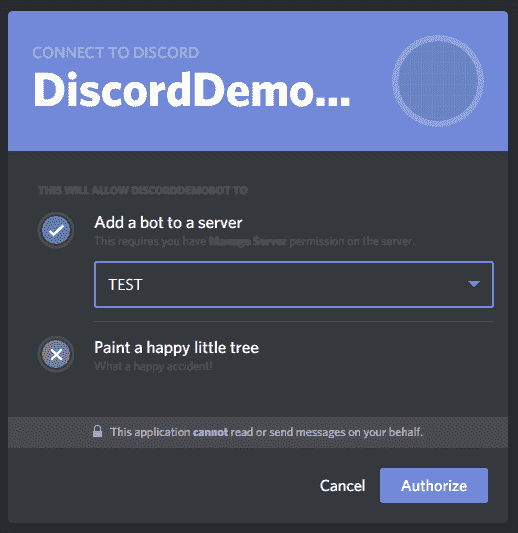
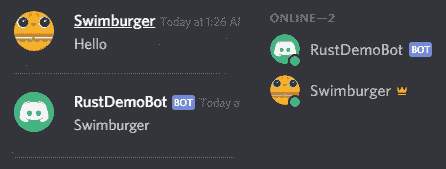
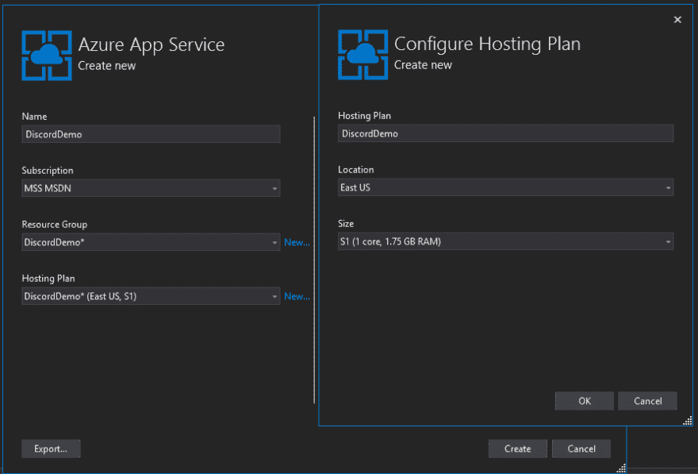
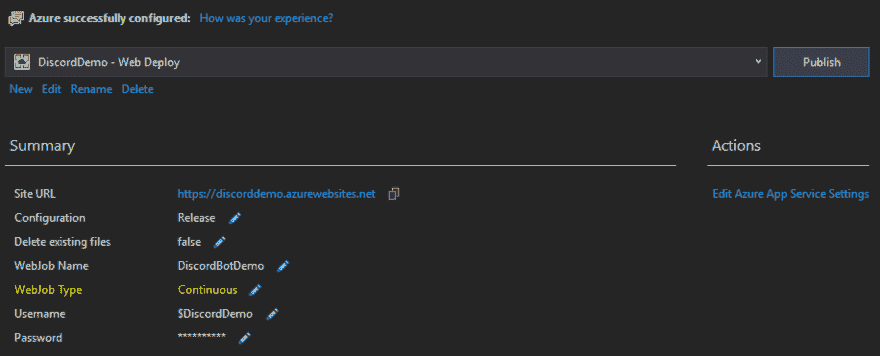

# 创建一个不和机器人使用。NET Core 和 Azure 应用服务

> 原文：<https://dev.to/swimburger/creating-a-discord-bot-using-net-core-and-azure-app-services-4m2>

Discord 是一个专为游戏打造的在线交流平台。你可以通过文本频道和你的朋友聊天，但最重要的是通过语音频道互相交谈。作为一名开发人员，有多种方法可以扩展 Discord，但是我们将学习如何使用它的 bot 特性来扩展 Discord。

## 不和谐机器人

不和谐的机器人可以被添加到语音和文本频道，它们可以监听和响应用户的输入。对于真正的用户来说，机器人看起来就像一个普通的参与者，可以在线和离线，尽管被明确标记为机器人。频道上的权限管理对于用户和机器人也是一样的。这是一个集成服务的有趣平台。

要构建自己的 bot，您需要连接到 Discords WebSocket API。这可以是一个运行在 Raspberry PI 上的简单命令行应用程序，但是我们将使用 Azure App Services 中的 WebJobs 特性来部署我们的。NET 核心项目。在我们的。我们将使用[dsharplus](https://github.com/DSharpPlus/DSharpPlus)库来更容易地与 Discord API 交互。

## 创建我们的机器人

在编写代码之前，我们需要在 Discords 开发者门户中创建一个 Discord Bot。创建完成后，您需要记下“令牌”和“客户端 Id ”,因为我们稍后会用到这两者。你可以按照 [DSharpPlus 的教程](https://dsharpplus.emzi0767.com/articles/getting_started.html)来创建这个。

创建一个简单的。NET 核心控制台应用程序，使用 dotnet CLI 或您选择的编辑器。

现在使用包管理器或者 dotnet CLI 将 DSharpPlus 包添加到您的项目中:

```
Install-Package  DSharpPlus  -Version  3.2.3  # or  dotnet  add  package  DSharpPlus  --version  3.2.3 
```

Enter fullscreen mode Exit fullscreen mode

既然已经添加了，让我们编写验证机器人工作的最小功能:

```
using DSharpPlus;
using DSharpPlus.EventArgs;
using System;
using System.Threading.Tasks;

namespace DiscordBotDemo
{
    public class Program
    {
        public static async Task Main(string[] args)
        {
            var discordClient = new DiscordClient(new DiscordConfiguration
            {
                Token = "YOUR DISCORD TOKEN",
                TokenType = TokenType.Bot
            });

            discordClient.MessageCreated += OnMessageCreated;

            await discordClient.ConnectAsync();
            await Task.Delay(-1);
        }

        private static async Task OnMessageCreated(MessageCreateEventArgs e)
        {
            if(string.Equals(e.Message.Content, "hello", StringComparison.OrdinalIgnoreCase))
            {
                await e.Message.RespondAsync(e.Message.Author.Username);
            }
        }
    }
} 
```

Enter fullscreen mode Exit fullscreen mode

当您构建并运行应用程序时，您会注意到什么也没有发生。什么都没有发生，因为机器人没有被添加到任何不和谐的服务器(又名公会)。要邀请您的 bot 加入 Discord 服务器，请使用以下 OAuth 链接:

[https://discordapp.com/oauth2/authorize?CLIENT _ ID = * *[您的客户端 ID]* *&scope = bot&permissions = 0](https://discordapp.com/oauth2/authorize?client_id=**%5BYOUR_CLIENT_ID%5D**&scope=bot&permissions=0)

[](https://res.cloudinary.com/practicaldev/image/fetch/s--buxE3tTD--/c_limit%2Cf_auto%2Cfl_progressive%2Cq_auto%2Cw_880/https://www.swimburger.net/media/1119/invite-discord-bot-to-server.png)

一旦你的机器人被添加到服务器，只需输入“hello ”,它就会用你的用户名回应你。

[](https://res.cloudinary.com/practicaldev/image/fetch/s--KNttYutn--/c_limit%2Cf_auto%2Cfl_progressive%2Cq_auto%2Cw_880/https://www.swimburger.net/media/1118/discord-bot-demo.png)

一旦你终止你的控制台应用程序，机器人也会不和谐地离线。

## 部署到 Azure 应用服务 WebJobs

在上一节中，我们了解到，当控制台应用程序运行时，discord bot 会联机，当进程终止时，它会立即脱机。为了让机器人正常工作，控制台应用程序需要持续运行。

这意味着 Azure 应用服务网站不是一个好的部署目标，但 Azure 应用服务中的 WebJobs 功能是。Azure WebJobs 可用于在某些事件发生时自动执行一些代码，如 CRON 触发器、Blob 触发器、服务总线消息等。WebJobs 是 Azure Functions 的前身，对于大多数场景，Azure Functions 现在是推荐的方法。不幸的是，Azure 函数不能永远运行，如果你尝试，就会超时。

另一方面，WebJobs 有另一种运行模式，称为“连续”模式，所以在我们的场景中，推荐使用 WebJobs 而不是 Azure 函数。

将控制台应用程序部署到 Azure WebJobs 的最简单方法是在 Visual Studio 中使用右键单击+发布。在这里，你可以选择创建新的 Azure 应用服务:

[](https://res.cloudinary.com/practicaldev/image/fetch/s--T_BV-yqi--/c_limit%2Cf_auto%2Cfl_progressive%2Cq_auto%2Cw_880/https://www.swimburger.net/media/1120/visual-studio-provision-azure-app-service-webjobs.png)

在将您的控制台应用程序实际发布到 Azure 之前，将 WebJob 类型从“已触发”更改为“连续”:

[](https://res.cloudinary.com/practicaldev/image/fetch/s--AdtqYgwb--/c_limit%2Cf_auto%2Cfl_progressive%2Cq_auto%2Cw_880/https://www.swimburger.net/media/1121/visual-studio-webjobs-publish-properties.png)

点击发布，你的不和谐机器人将在几分钟内在线运行在 Azure！

请记住，根据您选择的服务计划(定价)，“永远在线”功能将不可用。为了让你的 discord bot 永远在线，你必须启用“永远在线”，否则 Azure 将暂停你的 WebJob。

## 总结

在这篇文章中，我们使用以下步骤创建了一个运行在 Azure 中的 Discord Bot:

*   在不和谐开发者门户中创建一个不和谐机器人
*   创建. NET 核心控制台应用程序
*   添加 DSharpPlus 包并使用库
*   将控制台应用程序部署到 Azure WebJobs

你可以在 GitHub 上找到[的代码，问下面任何问题。干杯！](https://github.com/Swimburger/DiscordBot-Azure-Demo)