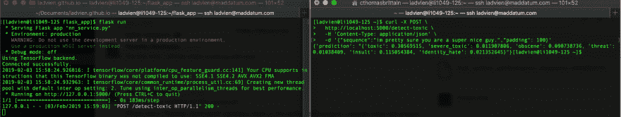

# 创建神经网络 web 服务

> 原文：<https://dev.to/ladvien/creating-a-neural-network-webservice-40ne>

我们快完成了。在之前的文章中，我们使用了一台本地机器来训练 CNN 检测文本中的有害情绪。此外，我们准备了一个小型(1GB RAM)服务器来使用这个预先训练好的网络进行预测。现在，让我们完成它并创建一个 web 服务，任何人都可以访问我们令人敬畏的神奇算法。

### 预测服务

在您的远程服务器上，导航到您的`flask_app`文件夹并创建一个名为`nn_service.py`的文件。下面的代码创建了一个 HTTP 请求端点`/detect-toxic`,并向服务器上运行的其他程序公开。代码后面有更多的解释。

```
cd /home/my_user/flask_app
nano nn_service.py 
```

Enter fullscreen mode Exit fullscreen mode

输入以下内容:

```
from flask import Flask, request
application = Flask(__name__)

from keras.models import load_model
from keras.preprocessing.sequence import pad_sequences
import numpy as np
import pymongo
import json

# Parameters mongo_port = 27017
embedding_collection = 'word_embeddings'
word_embedding_name = 'glove-wiki-gigaword-50'
pad_length = 100

# Globals global model, graph

# Connection to Mongo DB try:
    mong = pymongo.MongoClient('127.0.0.1', mongo_port)
    print('Connected successfully.')
except pymongo.errors.ConnectionFailure:
    print('Could not connect to MongoDB: ' + e)

db = mong[embedding_collection]
coll = db[word_embedding_name]

# Load Keras Model model = load_model('/home/my_user/flask_app/models/tox_com_det.h5')
model._make_predict_function()

# Start flask if __name__ == '__main__':
    application.run(host='127.0.0.1')

@application.route('/detect-toxic', methods=['POST'])
def sequence_to_indexes():
    with open('nn_service.log', 'w+') as file:
        file.write('here')
    if request.method == 'POST':
        try:
            sequence = request.json['sequence']
        except:
            return get_error('missing parameters')
        response = {
            'prediction': prediction_from_sequence(sequence, pad_length)
        }
        return str(response)

def get_word_index(word):
    index = ''
    try:
        index = coll.posts.find_one({'word': word})['index']
    except:
        pass
    return index

def get_error(message):
    return json.dumps({'error': message})

def prediction_from_sequence(sequence, pad_length):
    sequence = sequence.lower()
    sequence_indexes = []
    for word in sequence.split():
        try:
            index = int(get_word_index(word.strip()))
        except:
            index = 0
        if index is not None:
            sequence_indexes.append(index)
    sequence_indexes = pad_sequences([sequence_indexes], maxlen=pad_length)
    sample = np.array(sequence_indexes)
    prediction = model.predict(sample, verbose = 1)
    prediction_labels = ['toxic', 'severe_toxic', 'obscene', 'threat', 'insult', 'identity_hate']
    prediction_results = str({prediction_labels[0]: prediction[0][0],
                              prediction_labels[1]: prediction[0][1],
                              prediction_labels[2]: prediction[0][2],
                              prediction_labels[3]: prediction[0][3],
                              prediction_labels[4]: prediction[0][4],
                              prediction_labels[5]: prediction[0][5]
                            })
    return prediction_results 
```

Enter fullscreen mode Exit fullscreen mode

这是怎么回事？嗯，它是我在本系列的前几部分中详述的代码的扩展。然而，有一些新的作品。

首先，我们连接到包含上下文单词嵌入的 MongoDB 数据库。这个数据库用于查找单词，这些单词已经被发送到我们的服务端点。

这个服务器中唯一的路由是一个`POST`服务。它需要一个参数:`sequence`。该序列是 web 服务消费者希望分析有毒内容的文本。端点调用`prediction_from_sequence()`。在函数内部，单词索引是从`word_embeddings`数据库中提取的。之后，新转换的序列被填充到所需的`100`尺寸。然后，这个序列被传递给我们的 CNN，由它做出预测。最后，预测被转换成 JSON 并返回给用户。

在我们继续深入之前，让我们测试一下这个脚本，以确保它确实可以工作。仍然在`flask_app`目录中输入，将`my_user`替换为你的用户名，将`name_of_flask_app.py`替换为你的 Flask 应用的名称:

```
echo "# Flask variables" &>> /home/my_user/.bashrc
echo "export FLASK_APP=name_of_flask_app.py" &>> /home/my_user/.bashrc 
```

Enter fullscreen mode Exit fullscreen mode

这将设置在执行`Flask` webservice 时使用的`FLASK_APP`变量。

好了，我们现在应该可以全面测试这个应用了:

```
flask run 
```

Enter fullscreen mode Exit fullscreen mode

您应该会看到类似于:
的消息

```
 * Serving Flask app "nn_service.py"
 * Environment: production
   WARNING: Do not use the development server in a production environment.
   Use a production WSGI server instead.
 * Debug mode: off
Using TensorFlow backend.
Connected successfully.
2019-02-03 15:53:26.391389: I tensorflow/core/platform/cpu_feature_guard.cc:141] Your CPU supports instructions that this TensorFlow binary was not compiled to use: SSE4.1 SSE4.2 AVX AVX2 FMA
2019-02-03 15:53:26.398145: I tensorflow/core/common_runtime/process_util.cc:69] Creating new thread pool with default inter op setting: 2\. Tune using inter_op_parallelism_threads for best performance.
 * Running on http://127.0.0.1:5000/ (Press CTRL+C to quit) 
```

Enter fullscreen mode Exit fullscreen mode

太好了！我们在最后冲刺阶段。

我准备了一个`curl`语句来测试服务器。您需要让 Flask 程序保持运行，并打开第二个终端连接到您的服务器。当第二个终端打开时，粘贴下面的内容，用一些不好或好的东西替换“序列”。

```
curl -X POST \
  http://localhost:5000/detect-toxic \
  -H 'Content-Type: application/json' \
  -d '{"sequence":"im pretty sure you are a super nice guy.","padding": 100}' 
```

Enter fullscreen mode Exit fullscreen mode

你*应该*得到一个合适的回应:
[](https://res.cloudinary.com/practicaldev/image/fetch/s--jeKPVeA_--/c_limit%2Cf_auto%2Cfl_progressive%2Cq_auto%2Cw_880/https://ladvien.cimg/toxic-comment-detector-local-test.png)

### NodeJS 和 node-http-proxy

这里变得有点奇怪。通常，一个人会用`uwsgi`或`gunicorn`与`nginx`组合建立一个 Flask 服务器。然而，我发现`uwsgi`中间件正在创建我的项目的两个实例，它们不适合微服务器的 RAM。我花了*很多*时间创建一个服务器`proper`，但当我发现`uwsgi`正在创建`nn_service.py`的两个实例，从而试图将两个 CNN 加载到内存中时，我感到沮丧。我们可怜的服务员。我放弃了“适当”这个词，并按照我下面的描述去做。然而，我已经创建了一个 bash 脚本，以“正确”的方式为您完整地设置了一个服务器。我已经把它加到附录里了。

我选择运行 Flask，并用一个`nodejs`服务器作为代理来服务它。

[T5】](https://res.cloudinary.com/practicaldev/image/fetch/s--Ve726Pnu--/c_limit%2Cf_auto%2Cfl_progressive%2Cq_auto%2Cw_880/https://ladvien.cimg/nn_service_stack.png)

`nodejs`并不典型，但我发现它可能是最容易设置的。那么。

让我们在服务器上安装 NodeJS。

```
sudo yum install -y nodejs 
```

Enter fullscreen mode Exit fullscreen mode

现在转到包含 flask_app 的目录，并初始化一个节点项目。

```
cd /home/my_user/flask_app
npm init 
```

Enter fullscreen mode Exit fullscreen mode

系统会提示您输入项目——慢慢填写，或者反复按回车键跳过它。

一旦项目设置完毕，让我们安装 [node-http-proxy](https://github.com/nodejitsu/node-http-proxy) 包。它将允许我们用几行代码创建一个位于 Flask 服务之上的代理服务器。

仍然在您的项目目录中:

```
npm install node-http-proxy
nano server.js 
```

Enter fullscreen mode Exit fullscreen mode

服务器内文件位置:

```
var http = require('http'),
    httpProxy = require('http-proxy');
httpProxy.createProxyServer({target:'http://localhost:5000'}).listen(8000); 
```

Enter fullscreen mode Exit fullscreen mode

好的，在测试我们的 Flask 服务之前，我们需要允许`8000`端口访问，并允许`HTTP / HTTPS`请求通过防火墙。

```
firewall-cmd --permanent --zone=public --add-service=http
firewall-cmd --permanent --zone=public --add-service=https
sudo firewall-cmd --zone=public --add-port=8000/tcp --permanent
sudo firewall-cmd --reload 
```

Enter fullscreen mode Exit fullscreen mode

您可以通过向您的服务器打开两个终端来测试整个代理设置。一种是，导航到你的 Flask 应用并运行它:

```
cd /home/my_user/flask_app
flask run 
```

Enter fullscreen mode Exit fullscreen mode

在另一个中，导航到`node`代理文件并运行它:

```
cd /home/my_user/flask_app/proxy
node server.js 
```

Enter fullscreen mode Exit fullscreen mode

现在，您应该能够对服务器进行调用了。*这次*，从您的本地机器运行`curl`命令——用您的服务器的 IP 地址
替换`my_server_ip`

```
curl -X POST \
  http://my_server_ip:8000/detect-toxic \
  -H 'Content-Type: application/json' \
  -d '{"sequence":"im pretty sure you are a super nice guy.","padding": 100}' 
```

Enter fullscreen mode Exit fullscreen mode

您应该得到与我们在本地运行`curl`命令时看到的完全一样的响应。

### 将其妖魔化

要做的最后一点工作是创建两个守护进程。一个将保持 Flask 应用程序在后台运行。另一个将保持 web 和 Flask 应用程序之间的代理运行。

在开始之前有一个警告，因为守护进程是在没有`PATH`变量的情况下加载的，所以所有文件引用都必须使用绝对路径。

在服务器的命令提示符下键入:

```
sudo nano /etc/systemd/system/nn_service.service 
```

Enter fullscreen mode Exit fullscreen mode

并添加以下内容，用您的用户名替换`my_user`:

```
[Unit]
Description=Flask instance to serve nn_service
After=network.target

[Service]
User=my_user
Group=my_user
WorkingDirectory=/home/my_user/flask_app
ExecStart=/usr/local/miniconda/bin/flask run

[Install]
WantedBy=multi-user.target 
```

Enter fullscreen mode Exit fullscreen mode

这将创建一个服务。它将在由`WorkingDirectory`指向的目录中运行由`ExecStart`指向的程序，在我们的例子中是`flask run`。

保存并退出。

现在，让我们创建`nn_service_proxy.service`守护进程:

```
sudo nano /etc/systemd/system/nn_service_proxy.service 
```

Enter fullscreen mode Exit fullscreen mode

并输入以下内容，将`my_user`替换为您的用户名:

```
Description=Proxy to Flask instance to serve nn_service
After=network.target

[Service]
User=my_user
Group=my_user
WorkingDirectory=/home/my_user/flask_app/node
ExecStart=/usr/bin/node /home/my_user/flask_app/node/nn_service_proxy.js

[Install]
WantedBy=multi-user.target 
```

Enter fullscreen mode Exit fullscreen mode

太好了！我们已经准备好启用并启动它们。

```
sudo systemctl enable nn_service.service
sudo systemctl enable nn_service_proxy.service
sudo systemctl start nn_service.service
sudo systemctl start nn_service_proxy.service 
```

Enter fullscreen mode Exit fullscreen mode

好了，现在你可以检查系统日志以确保它们正确加载:

```
sudo journalctl -xe 
```

Enter fullscreen mode Exit fullscreen mode

但是，它应该是好的。如果有问题，一定要在评论里提问。否则，我们应该准备测试我们的全功能有毒文本检测网络服务！

```
curl -X POST \
  http://my_server_ip:8000/detect-toxic \
  -H 'Content-Type: application/json' \
  -d '{"sequence":"im pretty sure you are a super nice guy.","padding": 100}' 
```

Enter fullscreen mode Exit fullscreen mode

哇！多好的旅程啊。但是非常酷。我们现在有了一个网络服务，任何人都可以调用它来检查文本是否包含有害情绪。当我开始这个项目时，我没有一个应用程序，但我正在和一个朋友学习 webscraping，我认为将文本传递到这个 webservice 并在包含不良内容时标记它会很棒。

### “适当的”Flask 服务设置

我已经编写了一个脚本来为您设置 web 服务。首先，您需要以 root 用户身份登录 Centos 7 服务器。

然后键入:

```
yum install -y wget
wget http://ladvien.com/assets/centos_nn_webservice.sh
chmod +x centos_nn_webservice.sh 
```

Enter fullscreen mode Exit fullscreen mode

该脚本的作用:

1.  设置新用户
2.  将 Miniconda 添加到 PATH 变量中。
3.  添加 Flask 环境变量(需要运行应用程序)。
4.  更新服务器。
5.  创建 flask_app 目录
6.  打开所需的端口
7.  安装`nginx`
8.  创建一个`nginx`。包含代理服务信息的 conf 文件。
9.  创建一个. ini 文件来包装 Flask 应用程序。
10.  创建并启用一个`uwsgi`守护进程。
11.  创建并启用一个`Flask`守护进程。
12.  安装 Miniconda，tensorflow，并将 Python 设置为 3.6.8。
13.  安装 MongoDB
14.  从 VSCode ( [info](https://ladvien.com/visual-studio-code-raspberry-pi/) )启用远程编辑

我们即将执行这个脚本，但是有一个关键的步骤我想先解释一下。该脚本将接受几个命令行参数。如果这些都是错误的，它会严重影响你的服务器。

```
./centos_nn_webservice.sh user_name user_password flask_app_name flask_port 
```

Enter fullscreen mode Exit fullscreen mode

*   **用户名**这将是提供网络服务的用户
*   **用户 _ 密码**用户的密码。您需要以这个用户的身份`ssh`进入服务器。
*   **flask_app_name** 这是你的应用的名称。从 Python 脚本到守护进程的所有东西都将被标上这个名字。
*   **flask_port** 这是将暴露于网的端口。

好了，用你喜欢的参数替换上面所有的命令行参数，然后执行它。交叉手指或者在评论里吼我。