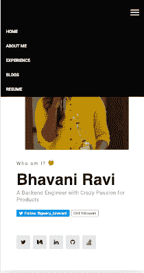

# 与盖茨比和雷卡特斯一起创作作品集？当心！！！

> 原文：<https://dev.to/bhavaniravi/creating-a-portfolio-with-gatsby-and-reactjs-beware-32k7>

*当我与 Gatsby 和 ReactJS 一起建立投资组合时，我面临的问题列表*

[](https://res.cloudinary.com/practicaldev/image/fetch/s--KaPKSHBZ--/c_limit%2Cf_auto%2Cfl_progressive%2Cq_auto%2Cw_880/https://cdn-images-1.medium.com/max/1024/1%2Ah1pmDDz3GBKLcgZCPHl4dw.png)

WordPress 时代已经一去不复返了。即使在做了 3 年后端开发人员之后，玩 PHP 仍然困扰着我。我认为对于大多数 Python 开发者来说都是如此。此外，谁会想要一个单页组合沉重的网站呢？

### 我为什么讨厌 Wordpress？

1.  嗯，咄…这是 PHP
2.  我把我的博客移到了 medium，因此我想要的只是一个轻量级的单页网站。
3.  现在博客被转移到了媒体上，我不再需要在任何地方托管我的网站，这意味着我不需要支付服务器费用。
4.  在某种程度上，我花在弄清楚一个插件和一个模板上的时间太多了，以至于我决定自己写东西会更好。

### 为什么是盖茨比？

1.  盖茨比是一个基于[反应](https://reactjs.org/docs/getting-started.html)、 [GraphQL](https://graphql.org/learn/) 供电的静态站点生成器。大约在同一时间，我想知道反应是什么
2.  虽然它是一个静态的站点生成器，但是它提供了写博客和托管博客的功能。以防将来我改变主意，我不必做彻底的修改。
3.  社区很大。因此，如果你被困在某个地方并提出一个问题，Tada…将立即获得帮助。

### 牢记 5 件事

#### 1。模板

我一直在寻找一个符合我个性的模板，最终找到了一个完全用 HTML、CSS 和 JS 编写的模板。我将大部分 HTML 转换为 react 组件，但是将 JS 代码转换为 React 是我一直在努力的事情。不要对我评头论足，我以前没有这方面的经验。

例如，导航栏控件是由 Bootstrap 的 JS 文件控制的。为了整合这些功能，我不得不使用 [ReactStrap](https://reactstrap.github.io) ，一个带有引导组件的 React 插件。

[](https://res.cloudinary.com/practicaldev/image/fetch/s--Hu2-ZyTz--/c_limit%2Cf_auto%2Cfl_progressive%2Cq_auto%2Cw_880/https://cdn-images-1.medium.com/max/210/1%2Ay7aIih4dsFZcX2BxUwu7xA.png)

在我的模板上看起来如何？

```
<nav class="navbar navbar-expand-lg navbar-light">

....
</nav> 
```

我该如何改变它？

```
class ExtendedNavbar extends React.Component{
    toggle() {
         this.setState({
             isOpen: !this.state.isOpen
         });
    }

render(){
        <Navbar className="navbar-expand-lg" light={true}>
            <NavbarToggler className="navbar-toggler" onClick={this.toggle}/>
            <Collapse isOpen={this.state.isOpen} navbar id="navbarSupportedContent">
                <Nav className="nav navbar-nav menu\_nav ml-auto" navbar>...</Nav>
            </Collapse>
       </Navbar>
} 
```

#### 2。我的 CSS 在哪里

Gatsby 公开的只是一个包含根组件的 index . js 文件。对于一个纯 HTML 背景的人来说，我不知道在哪里添加原始 CSS，我试图将它添加为 react 导入，但它在随机的地方抛出错误。

但是后来，我发现 [React 头盔](https://github.com/nfl/react-helmet)你可以在那里添加你的 CSS 和 bam！！！我可以看到应用的风格。

```
<Helmet>
        My Title
        <meta name="description" content="Helmet application" />
        <link to css1>
        <link to css2>
</Helmet> 
```

#### 3。它可以工作，但是有延迟

我添加 CSS 作为 React 头盔的一部分，我可以在屏幕上看到颜色。我只开心了一天。第二天，我的一个朋友指出，我的 CSS 正在加载，但有延迟，我需要修复它，这是一件大事。我浏览了一个又一个博客，试图解决这个问题。

因为我使用的是 React-helmet，所以浏览器会等到所有的 React 组件渲染完毕，然后对它们应用样式。解决这个问题的唯一方法是找到

tag and stick the CSS links in there. But Gatsby’s index.js you only render the component that needs to go into the body of your site. ie., you won’t see the usual structure of a web page which looks like this.

```
<html>
    <head></head>
    <body></body>
</html> 
```

最后，其中一个博客要求我从默认模板中复制 html.js，并把它放在我的 src 文件夹中。耶！！！现在我可以看到标签。现在我知道应该把 CSS 链接放在哪里了。

#### 4。生产到性能

一切都好。现在，它已经准备好生产了。我用 GitLab 页面托管了它。事情看起来很好，但它花了很长时间来加载页面。这是一件大事，因为如果页面在 2 秒内没有加载，人们就会离开。我尝试了一切可能的方法，但谷歌灯塔对我糟糕的表现嗤之以鼻。

在某一点上，我放弃了，哭着寻求帮助，然后我发现了问题所在。这是 GitLab 的页面，他们提供的免费托管服务糟透了。所以我不得不把它从 [GitLab](https://medium.com/u/68f5136d3254) 移到 [Netlify](https://medium.com/u/5250f9d9bd2f) ，你猜怎么着？生活又变好了。

#### 5。GraphQL

在接触 MongoDB 之后学习 GraphQL 并不是什么大事。但是 GraphQL 没有 select all select * from blogs 类型的查询。因此，您必须明确您想要从 JSON 数据中获得的参数。

```
<StaticQuery query={graphql`
     query {
        site {
          siteMetadata {
             projects{
                 name
                 description
                 skills
             }
         }
     }
</StaticQuery> 
```

例如，如果我将 URL 添加到项目中，那么我必须在静态查询中指定它，以便它获取 URL 参数。

有时候，我会向 siteMetaData 添加一个额外的参数，并刷新网站一百万次，绞尽脑汁想知道哪里出了问题。

外卖，显然我不会是一个坏的全栈开发人员，但我更喜欢后端，因为那是我的心在哪里。

> 巴瓦尼拉维@ geeky _ 巴瓦尼给自己建立一个作品集，比什么都更能自我反省。
> 暴露什么信息？
> 如何呈现最好的自己？
> 
> 在建造 one 的过程中有很多自我实现
> 即将到来！！我的全新作品集
> 
> [# 100 daysofcode](https://twitter.com/hashtag/100DaysOfCode)[#周二思维](https://twitter.com/hashtag/TuesdayThoughts)2019 年 1 月 08 日上午 06:51[](https://twitter.com/intent/tweet?in_reply_to=1082530131216719872)[](https://twitter.com/intent/retweet?tweet_id=1082530131216719872)4[](https://twitter.com/intent/like?tweet_id=1082530131216719872)12

***在*******处结账。*T13】***