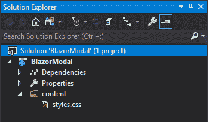
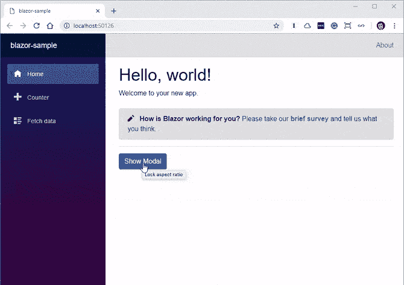

# 创建一个可重用的、无 JavaScript 的 Blazor 模型

> 原文：<https://dev.to/progresstelerik/creating-a-reusable-javascript-free-blazor-modal-3f30>

在本指南中，Chris Sainty 将帮助您学习如何在不使用任何 JavaScript 的情况下为 Blazor 和 Razor 应用程序构建一个可重用的模型。

模态是当今 web 应用程序的一个常见特征。你可以在大多数 UI 框架中找到它们，从简单的确认框到成熟的表单。在这篇文章中，我将带您为 Blazor/Razor 组件应用程序构建一个无 JavaScript 的、可重用的模型。为了让事情变得更有趣，我们将以这样一种方式构建模型，即我们可以传递它的组件来显示，而不仅仅是纯文本或标记字符串。

对于 Blazor 的新用户，让我给你一个快速的概述。Blazor 是微软开发的一个类似 SPA 的框架。有一种客户端模型，它通过基于 [WebAssembly 运行。NET 运行时](https://dev.to/progresstelerik/goodbye-javascript-hello-webassembly-6oc-temp-slug-9525238)。还有一个服务器端模型(Razor 组件)，它运行在标准上。NET 核心运行时。您可以在 Blazor.net 的[了解更多信息。](https://blazor.net)

## 开始设置

如果你是 Blazor 开发的新手，那么你需要确保你有最新版本的[。网芯 SDK 安装](https://dotnet.microsoft.com/download)。您还需要通过 dotnet CLI 安装 [Blazor 语言服务](https://marketplace.visualstudio.com/items?itemName=aspnet.blazor)，以及 Blazor 模板。

```
dotnet new -i Microsoft.AspNetCore.Blazor.Templates 
```

### 创建 Blazor 库

我们希望能够在我们认为合适的任何项目中使用我们的模型。实现这一点的最佳方式是使用我们上面安装的 CLI 模板中包含的 Blazor 库项目。这个项目类型以类似于类库的方式工作，并允许我们共享组件和它们的资产(图像、CSS 等)。)在 Blazor 应用程序之间。

由于这个项目类型目前只能使用 dotnet CLI，我们可以运行以下命令来创建一个新目录和 Blazor 库项目。

```
mkdir BlazorModal
cd BlazorModal
dotnet new blazorlib 
```

现在我们有了一个新的 Blazor 库项目，可以在 Visual Studio 中打开。在我们做任何事情之前，让我们删除一些模板附带的默认项目。我们唯一想保留的是 styles.css，所以项目应该是这样的。

[](https://res.cloudinary.com/practicaldev/image/fetch/s--ehzVhwxL--/c_limit%2Cf_auto%2Cfl_progressive%2Cq_auto%2Cw_880/https://d585tldpucybw.cloudfront.net/sfimages/default-source/blogs/2019/january/emptyblazorlibrary.png%3Fsfvrsn%3D82dbf50_1)

## 模态服务

我们要做的第一件事是`ModalService`。这将是把我们的模态组件和任何其他想要使用它的组件连接起来的粘合剂。在项目的根目录中，用下面的代码添加一个名为 *ModalService.cs* 的新类。

```
using Microsoft.AspNetCore.Blazor;
using Microsoft.AspNetCore.Blazor.Components;
using System;

namespace BlazorModal.Services
{
public class ModalService
{
public event Action<string, RenderFragment> OnShow;
public event Action OnClose; 

public void Show(string title, Type contentType)
{
if (contentType.BaseType != typeof(BlazorComponent))
{
throw new ArgumentException($"{contentType.FullName} must be a Blazor Component");
}

var content = new RenderFragment(x => { x.OpenComponent(1, contentType); x.CloseComponent(); });
OnShow?.Invoke(title, content);
}

public void Close()
{
OnClose?.Invoke();
}
}
} 
```

这是怎么回事？

该类公开了两个方法，`Show()`和`Close()`，以及几个事件。不过，Show 方法很有趣。在检查通过`contentType`参数传入的类型是 Blazor 组件后，它使用所述类型创建一个新的`RenderFragment`。然后它被传递到`OnShow`事件中，这样它就可以被事件处理程序使用。我们一会儿会谈到这一点。

在我们继续之前，我知道你们有些人在想什么… *什么是 RenderFragment？？*

简单来说，一个`RenderFragment`代表一个 UI。Blazor 使用这些`RenderFragments`在浏览器中输出最终的 HTML。在上面的代码中，如果我们传入一个类型的`Foo`，产生的 HTML 将如下所示。

```
<Foo></Foo> 
```

`RenderFragment`有许多有趣的用途，尤其是在处理动态组件生成时，但那是另一个话题了。让我们继续吧。

### IServiceCollection 扩展

当创建一个库时，我总是发现提供一个扩展方法来处理向 DI 容器注册服务是一个好主意。它确保所有东西都在正确的范围内注册，而且消费者只需在他们的应用程序中添加一行代码。使用以下代码向名为*servicecollectionextension . cs*的项目根添加一个新类。

```
using BlazorModal.Services;
using Microsoft.Extensions.DependencyInjection;

namespace BlazorModal
{
public static class ServiceCollectionExtensions
{
public static IServiceCollection AddBlazorModal(this IServiceCollection services)
{
return services.AddScoped<ModalService>();
}
}
} 
```

## 模态分量

现在服务已经就绪，我们可以构建模态组件了。我总是喜欢将组件的逻辑和标记分开。这是通过用组件将继承的所有逻辑创建一个基类来实现的，只给组件留下标记。

首先添加一个名为 *Modal.cshtml* 的新 **Razor 视图**，然后添加一个名为 *Modal.cshtml.cs* 的新类。这样命名的原因是为了让 Visual Studio 将基类嵌套在 Razor 视图下。您不必遵循这个约定，但它确实保持了解决方案窗口的整洁。还要确保你选择的是 Razor 视图，而不是 Razor 页面——Razor 页面不起作用。

我们先来看看基类逻辑。

哦！还有一件事。您需要更改基类的名称。正如你在下面的代码中看到的，我已经把 *Base* 放在了末尾。还是那句话，你想怎么叫都行。模特是另一个受欢迎的选择。但这是为了避免与由 *Modal.cshtml* 生成的代码发生名称冲突。

### 元件逻辑

```
using BlazorModal.Services;
using Microsoft.AspNetCore.Blazor;
using Microsoft.AspNetCore.Blazor.Components;
using System;

namespace BlazorModal
{
public class ModalBase : BlazorComponent, IDisposable
{
[Inject] ModalService ModalService { get; set; }

protected bool IsVisible { get; set; }
protected string Title { get; set; }
protected RenderFragment Content { get; set; }

protected override void OnInit()
{
ModalService.OnShow += ShowModal;
ModalService.OnClose += CloseModal;
}

public void ShowModal(string title, RenderFragment content)
{
Title = title;
Content = content;
IsVisible = true;

StateHasChanged();
}

public void CloseModal()
{
IsVisible = false;
Title = "";
Content = null;

StateHasChanged();
}

public void Dispose()
{
ModalService.OnShow -= ShowModal;
ModalService.OnClose -= CloseModal;
}
}
} 
```

从顶部开始，我们注入一个模态服务的实例。然后，我们声明几个将在组件的标记端使用的参数。我们覆盖了 Blazor 的一个生命周期方法`OnInit`，因此我们可以将`ShowModal`和`CloseModal`方法分别附加到来自模态服务的`OnShow`和`OnClose`事件。

`ShowModal`和`CloseModal`方法非常简单明了。唯一值得指出的部分是对`StateHasChanged`的调用。我们需要调用`StateHasChanged`，因为这些方法是从组件外部调用的。这个方法所做的就是告诉组件有些东西已经改变了，所以它需要重新呈现自己。

最后，组件实现了`IDisposable`接口，这样当组件被销毁时，我们可以注销事件处理程序。

现在让我们看看标记方面。

### 组件标记

```
@inherits ModalBase

<div class="bm-container @(IsVisible ? "bm-active" : string.Empty)">

    <div class="bm-overlay" onclick="@CloseModal"></div>

    <div class="blazor-modal">
        <div class="bm-header">
            <h3 class="bm-title">@Title</h3>
            <button type="button" class="bm-close" onclick="@CloseModal">
                <span>&times;</span>
            </button>
        </div>
        <div class="bm-content">
            @Content
        </div>
    </div>

</div> 
```

第一行是一个指令，说明组件是从`ModalBase`继承的。接下来我们有一个容器 div，它使用了一点剃刀语法，使用了`IsVisible`属性来切换`bm-active`类。这是负责显示或隐藏组件的部分。

下一个 div 用于创建一个暗色的覆盖图，模型将位于其上。它还有一个`onclick`处理程序，如果用户点击覆盖图的任何地方，它就会关闭模态。

然后我们来看模态本身。它有一个显示标题的标题和一个可以用来关闭模式的按钮。`@Content`标记是我们之前谈到的`RenderFragment`将被显示的地方。

## 增添几分格调

没有一个组件是不完整的。她没有什么特别或聪明之处——我绝不是 CSS 大师。但是下面的类应该给所有的东西一个漂亮干净的外观和感觉，使模态在页面上水平和垂直居中。这一切都归功于 Flexbox 的奇迹！

```
.bm-container {
    display: none;
    align-items: center;
    justify-content: center;
    position: fixed;
    width: 100%;
    height: 100%;
    z-index: 2;
}

.bm-overlay {
    display: block;
    position: fixed;
    width: 100%;
    height: 100%;
    z-index: 3;
    background-color: rgba(0,0,0,0.5);
}

.bm-active {
    display: flex;
}

.blazor-modal {
    display: flex;
    flex-direction: column;
    width: 50rem;
    background-color: #fff;
    border-radius: 4px;
    border: 1px solid #fff;
    padding: 1.5rem;
    z-index: 4;
}

.bm-header {
    display: flex;
    align-items: flex-start;
    justify-content: space-between;
    padding: 0 0 2rem 0;
}

.bm-title {
    margin-bottom: 0;
}

.bm-close {
    padding: 1rem;
    margin: -1rem -1rem -1rem auto;
    background-color: transparent;
    border: 0;
    -webkit-appearance: none;
    cursor: pointer;
} 
```

## 试探一下

我们现在已经建立了我们的模型，但是最好能看到它的运行。让我们将一个独立的 Blazor 应用程序添加到解决方案中，这样我们就可以试用它了。如果您愿意，这将同样适用于服务器端项目。

右键单击该解决方案，然后添加>新建项目。然后选择 ASP.NET 核心 Web 应用程序并为其命名。我打算把它叫做 BlazorTest。最后，从对话框中选择 Blazor 作为项目类型。

如果您愿意，可以将 CLI 与以下命令一起使用。

```
dotnet new blazor -n BlazorTest 
```

我们还需要将来自 BlazorTest(或您称之为 BlazorModal 的任何东西)的项目引用添加到 BlazorModal 项目。您的解决方案现在应该是这样的。

[](https://res.cloudinary.com/practicaldev/image/fetch/s--yF-mm-oz--/c_limit%2Cf_auto%2Cfl_progressive%2Cq_auto%2Cw_880/https://d585tldpucybw.cloudfront.net/sfimages/default-source/blogs/2019/january/solutionwithtestproject.png%3Fsfvrsn%3D1ed29280_1)

### 设置测试项目

现在我们有了一个测试项目，我们需要做三件事来注册我们的模型以供使用。

首先，我们需要将下面几行添加到 *_ViewImports.cshtml* 中。

```
@using BlazorModal
@using BlazorModal.Services

@addTagHelper *, BlazorModal 
```

using 语句将使我们在使用`ModalService`时不必使用完全限定名。`addTagHelper`将从指定的名称空间导入所有组件。

其次，我们需要将我们的`ModalService`添加到 DI 容器中。由于我们之前创建服务集合扩展方法的工作，我们只需要在 *Startup.cs* 中的`ConfigureServices`方法中添加以下内容。

```
using BlazorModal;

// Other code omitted for brevity

public void ConfigureServices(IServiceCollection services)
{
services.AddBlazorModal();
} 
```

第三个也是最后一个任务是将模态组件添加到 *MainLayout.cshtml* 中。

```
@inherits BlazorLayoutComponent

<Modal />

<div class="sidebar">
<NavMenu />
</div>

<!—Remaining code omitted for brevity --> 
```

我们现在已经设置了测试项目来使用我们的模态组件。

### 创建一个测试组件

为了测试我们的模式，我们将创建一个简单的表单组件，我们将在我们的模式中显示它。在 *Pages* 文件夹中，添加一个名为 *SimpleForm.cshtml* 的新 Razor 视图，并添加以下代码。

```
@if (ShowForm)
{
<div class="simple-form">
<div class="form-group">
<label for="first-name">First Name</label>
<input bind="@FirstName" type="text" class="form-control" id="first-name" placeholder="Enter email" />
</div>
<div class="form-group">
<label for="last-name">Last Name</label>
<input bind="@LastName" type="text" class="form-control" id="last-name" placeholder="Enter email" />
</div>
<button onclick="@SubmitForm" class="btn btn-primary">Submit</button>
</div>
}
else
{
<div class="alert alert-success" role="alert">
Thanks @FirstName @LastName for submitting the form.
</div>
}

@functions {
bool ShowForm { get; set; } = true;
string FirstName { get; set; }
string LastName { get; set; }

void SubmitForm()
{
ShowForm = false;
}
} 
```

该组件获取用户的名字和姓氏，然后在用户单击 submit 后向他们显示个性化消息。

剩下的就是调用它了。让我们对 *Index* 组件做一些补充，用我们刚刚创建的简单形式调用我们的 modal。

```
@page "/"
@inject ModalService ModalService

<h1>Hello, world!</h1>
Welcome to your new app.

<SurveyPrompt Title="How is Blazor working for you?" />

<hr />

<button onclick="@ShowModal">Show Modal</button>

@functions {
private void ShowModal()
{
ModalService.Show("Simple Form", typeof(SimpleForm));
}
} 
```

我们完事了。这是完成的*索引*组件的样子。

### 运行我们的测试应用

我们现在可以运行我们的测试应用程序，如果一切按计划进行，它应该像这样工作。

[](https://res.cloudinary.com/practicaldev/image/fetch/s--Xv2Hlf7p--/c_limit%2Cf_auto%2Cfl_progressive%2Cq_66%2Cw_880/https://d585tldpucybw.cloudfront.net/sfimages/default-source/blogs/2019/january/blazormodal.gif%3Fsfvrsn%3D6aa58b90_1)

## 包装完毕

在这篇文章中，我们没有使用任何 JavaScript 就构建了一个可重用的模型。我们还以这样的方式构建它，我们可以显示其他组件，我认为这是一个非常好的功能，非常适合 Blazor 的组件模型。

这篇文章的所有代码都可以在我的 GitHub 上找到。

### 相关新闻

寻找更多关于 Blazor 的新闻和信息？查看这些推荐资源:

*   Blazor——基于浏览器的新框架。网络应用(DevReach 2018)
*   什么来了。网芯 3.0
*   [布拉索问&微软的丹尼尔·罗斯](https://dev.to/progresstelerik/blazor-qa-with-microsofts-daniel-roth-3d48)
*   [再见 JavaScript，你好 WebAssembly](https://dev.to/progresstelerik/goodbye-javascript-hello-webassembly-6oc-temp-slug-9525238)
*   [Blazor 项目类型的细分](https://dev.to/progresstelerik/a-breakdown-of-blazor-project-types-2b4g-temp-slug-848040)
*   [2019 年无 JavaScript 前端的 Razor 组件](https://dev.to/progresstelerik/razor-components-for-a-javascript-free-frontend-in-2019-1f6o)
*   [介绍 Blazor 早期预览版的 Telerik UI](https://dev.to/progresstelerik/introducing-the-telerik-ui-for-blazor-early-preview-2f4c)