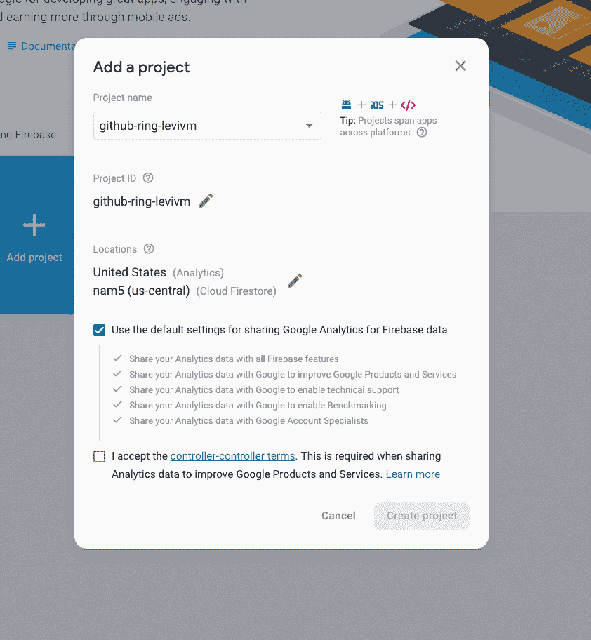
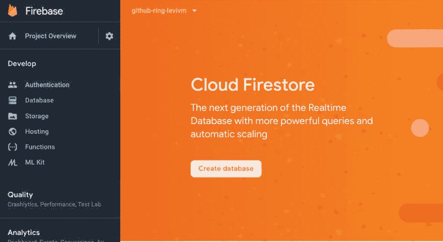
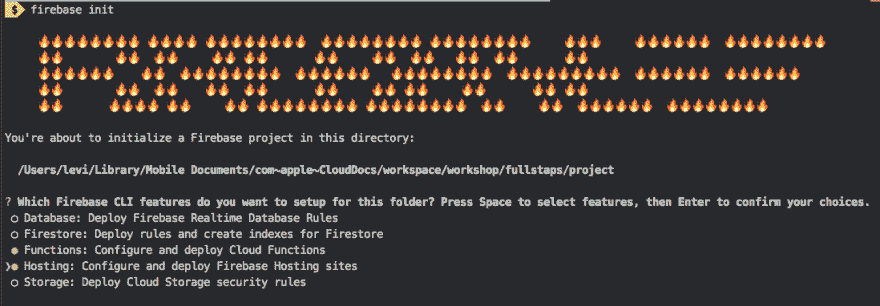
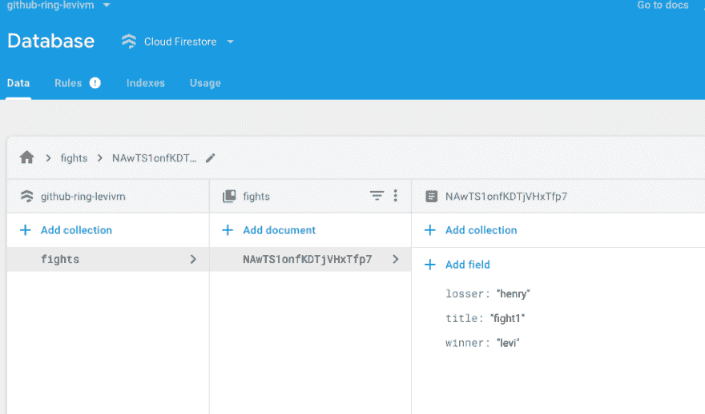

# 使用 NodeJS over Google Cloud 函数创建无服务器 REST API 的初学者指南

> 原文：<https://dev.to/levivm/creating-a-serverless-rest-api-using-google-cloud-functions-firebasefirestore-in-10-min-37km>

# API REST 使用谷歌云功能(无服务器)

随着时间的推移，无服务器应用程序变得越来越重要。它允许专注于您的应用程序代码/测试，而无需担心配置、部署流程或可扩展性。

我们将创建一个通过 rest URL 公开的函数。每次收到 HTTP(S)请求时，都会调用该函数。

在执行过程中，将调用一个 express 服务器来公开我们的 REST 服务。

## 我们要建造什么？

*   Firestore 数据库上 CRUD 服务(创建、读取、更新和删除)的 Express API。
*   使用谷歌云功能来暴露我们的快递服务器
*   使用 Cloud CLI 部署我们的 Google Cloud 功能。

## 创建我们的 firebase 项目

为了创建我们的第一个项目，让我们在这里做[。选择*添加项目*，项目名称必须是唯一的，在我的例子中使用前缀`github-ring-{github_user}`，github-ring-levinm。请务必选择 Firestore 作为我们的数据库。](https://console.firebase.google.com)

[](https://res.cloudinary.com/practicaldev/image/fetch/s--hMGfib_x--/c_limit%2Cf_auto%2Cfl_progressive%2Cq_auto%2Cw_880/https://thepracticaldev.s3.amazonaws.com/i/m6tvhhv2ifz29iugrctp.png)

为了创建我们的数据库，点击*开发* > *数据库*，并选择“以测试模式启动”。

[](https://res.cloudinary.com/practicaldev/image/fetch/s--lhV6-l1a--/c_limit%2Cf_auto%2Cfl_progressive%2Cq_auto%2Cw_880/https://thepracticaldev.s3.amazonaws.com/i/uckh6gvzzcv9wnhk37tv.png)

## 在本地初始化我们的项目

我们需要使用 NPM 安装 firebase。

```
npm install -g firebase-tools 
```

然后，让我们登录我们的 firebase 帐户。

```
firebase login
........... input credentials 
```

初始化项目

```
firebase init
........ select project 
```

[](https://res.cloudinary.com/practicaldev/image/fetch/s--zuqNXuw6--/c_limit%2Cf_auto%2Cfl_progressive%2Cq_auto%2Cw_880/https://thepracticaldev.s3.amazonaws.com/i/gx4iai2itqmmxsfjftlz.png)

它将提示一个交互式控制台。

1.  选择功能和托管选项。
2.  你想用什么语言写云函数？以打字打的文件
3.  您想使用 TSLint 来捕捉可能的错误并加强样式吗？是
4.  您想现在安装与 npm 的依赖关系吗？是
5.  您想将什么用作您的公共目录？按 enter 键选择 public(这是默认选项)
6.  配置为单页 app(将所有 URL 重写为/index.html)？不

我们准备好了，我们的 firebase 项目已经初始化。

## 安装 Express.js 及依赖项

```
cd functions
npm install --save express body-parser 
```

## 创建我们的谷歌云功能

打开`src/index.ts`，这将是我们 Express.js 服务器的入口点

### 导入主库

```
import * as functions from 'firebase-functions';
import * as admin from 'firebase-admin';
import * as express from 'express';
import * as bodyParser from "body-parser"; 
```

### 初始化 firebase 以访问其服务

```
admin.initializeApp(functions.config().firebase); 
```

### 初始化 Express.js 服务器

```
const app = express();
const main = express(); 
```

### 配置服务器。

*   让我们添加用于接收请求的路径。
*   选择 JSON 作为我们处理请求体的主要解析器。

```
main.use('/api/v1', app);
main.use(bodyParser.json()); 
```

### 导出我们的函数。

最后但同样重要的是，让我们定义我们的 Google Cloud 函数名，我们将使用`export`来公开它。我们的函数将接收一个 express 服务器对象(本例中为`main`)，该对象将用于请求处理。如果你想知道更多关于它如何工作的信息，你可以在 Stackoverflow
上查看这个好的[答案](https://github.com/twhite96/js-dev-reads)

```
export const webApi = functions.https.onRequest(main); 
```

### 创建我们的第一个服务

让我们公开一个只返回一个字符串的 GET 端点。

```
app.get('/warm', (req, res) => {
    res.send('Calentando para la pelea');
}) 
```

我们的`src/index.ts`文件应该是这样的:

```
 import * as functions from 'firebase-functions';
import * as admin from 'firebase-admin';
import * as express from 'express';
import * as bodyParser from "body-parser";

admin.initializeApp(functions.config().firebase);

const app = express();
const main = express();

main.use('/api/v1', app);
main.use(bodyParser.json());

export const webApi = functions.https.onRequest(main);

app.get('/warmup', (request, response) => {

    response.send('Warming up friend.');

}) 
```

### 部署我们的功能。

在部署它之前，我们需要如下更改我们的配置文件`firebase.json`:

```
{
  "functions": {
    "predeploy": [
      "npm --prefix \"$RESOURCE_DIR\" run lint",
      "npm --prefix \"$RESOURCE_DIR\" run build"
    ]
  },
  "hosting": {
    "public": "public",
    "ignore": [
      "firebase.json",
      "**/.*",
      "**/node_modules/**"
    ],
    "rewrites": [
      {
        "source": "/api/v1/**",
        "function": "webApi"
      }
    ]
  }
}

```

这个规则允许通过`api/v1`发送的所有请求被`webApi`函数(我们导出的函数)服务。

此外，Google CLI 默认安装 Typescript v2。所以，我们需要更新我们的 typescript 版本`>=3.3.1`。可以在`functions.package.json`里做。

```
  "devDependencies": {
    "tslint": "~5.8.0",
    "typescript": "~3.3.1"
  },

```

重新安装依赖项。

```
cd functions
npm install 
```

我们准备好部署了。

```
firebase deploy 
```

```
.....
✔  Deploy complete!

Project Console: https://console.firebase.google.com/project/github-ring-levivm/overview
Hosting URL: https://github-ring-levivm.firebaseapp.com 
```

如果一切正常，托管 URL 将成为我们的 Google Cloud 功能端点。

### 测试我们的功能

让我们使用`CURL`
发送一个`GET`请求

```
$ curl -G "https://github-ring-levivm.firebaseapp.com/api/v1/warmup"
Warming up friend. 
```

## 剩余 API 积垢

让我们添加 CRUD 端点。我们将管理`fights`信息。

### 创建记录

首先，让我们初始化我们的数据库。我们打开我们的`src/index.ts`并在管理员初始化
后添加它

```
 admin.initializeApp(functions.config().firebase);
const db = admin.firestore(); // Add this 
```

为了创建一个战斗记录，让我们创建`POST /fights/`端点。我们的战斗记录将会有一个`winner`、`loser`和`title`。

```
app.post('/fights', async (request, response) => {
  try {
    const { winner, loser, title } = request.body;
    const data = {
      winner,
      loser,
      title
    } 
    const fightRef = await db.collection('fights').add(data);
    const fight = await fightRef.get();

    response.json({
      id: fightRef.id,
      data: fight.data()
    });

  } catch(error){

    response.status(500).send(error);

  }
}); 
```

*   我们使用`request.body`获得我们的帖子数据
*   我们使用`add()`方法添加一个新的战斗，如果集合不存在(我们的例子)，它会自动创建它。
*   为了得到实际的记录数据，我们必须在 ref 上使用`get()`。
*   使用`response.json`返回一个 json。

### 获得一条记录

我们创建一个`GET /fights/:id`端点，以便通过 id 获取一场比赛。

```
app.get('/fights/:id', async (request, response) => {
  try {
    const fightId = request.params.id;

    if (!fightId) throw new Error('Fight ID is required');

    const fight = await db.collection('fights').doc(fightId).get();

    if (!fight.exists){
        throw new Error('Fight doesnt exist.')
    }

    response.json({
      id: fight.id,
      data: fight.data()
    });

  } catch(error){

    response.status(500).send(error);

  }

}); 
```

*   我们使用`request.params`来获得战斗 id。
*   我们验证 id 是否不为空。
*   我们得到战斗并检查它是否存在。
*   如果战斗不存在，我们抛出一个错误
*   如果战斗存在，我们返回数据。

### 获取记录列表

我们创建一个`GET /fights/`端点。

```
app.get('/fights', async (request, response) => {
  try {

    const fightQuerySnapshot = await db.collection('fights').get();
    const fights = [];
    fightQuerySnapshot.forEach(
        (doc) => {
            fights.push({
                id: doc.id,
                data: doc.data()
            });
        }
    );

    response.json(fights);

  } catch(error){

    response.status(500).send(error);

  }

}); 
```

*   我们得到一个集合快照。
*   我们遍历每个文档，并将数据放入一个数组中。
*   我们归还我们的战斗名单。

### 更新记录

我们必须创建一个`PUT /fights/:id`端点，以便通过`id`更新一场战斗。

```
app.put('/fights/:id', async (request, response) => {
  try {

    const fightId = request.params.id;
    const title = request.body.title;

    if (!fightId) throw new Error('id is blank');

    if (!title) throw new Error('Title is required');

    const data = { 
        title
    };
    const fightRef = await db.collection('fights')
        .doc(fightId)
        .set(data, { merge: true });

    response.json({
        id: fightId,
        data
    })

  } catch(error){

    response.status(500).send(error);

  }

}); 
```

*   我们得到请求数据。
*   我们验证数据
*   我们使用`set(data, merge: true)`更新记录。这意味着它将只更新通过数据参数传递的字段。

### 删除一条记录。

为了删除一场比赛，我们需要添加一个端点`DELETE /fights/:id`。

```
 app.delete('/fights/:id', async (request, response) => {
  try {

    const fightId = request.params.id;

    if (!fightId) throw new Error('id is blank');

    await db.collection('fights')
        .doc(fightId)
        .delete();

    response.json({
        id: fightId,
    })

  } catch(error){

    response.status(500).send(error);

  }

}); 
```

*   我们得到了航班号。
*   我们使用`delete()`来删除一个文档实例(记住 firestore 是基于文档的数据库(“NoSQL”))

我们的`src/index.ts`文件应该是这样的

```
import * as functions from 'firebase-functions';
import * as admin from 'firebase-admin';
import * as express from 'express';
import * as bodyParser from "body-parser";

admin.initializeApp(functions.config().firebase);
const db = admin.firestore(); // Add this

const app = express();
const main = express();

main.use('/api/v1', app);
main.use(bodyParser.json());

export const webApi = functions.https.onRequest(main);

app.get('/warmup', (request, response) => {

    response.send('Warming up friend.');

});

app.post('/fights', async (request, response) => {
  try {
    const { winner, losser, title } = request.body;
    const data = {
      winner,
      losser,
      title
    } 
    const fightRef = await db.collection('fights').add(data);
    const fight = await fightRef.get();

    response.json({
      id: fightRef.id,
      data: fight.data()
    });

  } catch(error){

    response.status(500).send(error);

  }
});

app.get('/fights/:id', async (request, response) => {
  try {
    const fightId = request.params.id;

    if (!fightId) throw new Error('Fight ID is required');

    const fight = await db.collection('fights').doc(fightId).get();

    if (!fight.exists){
        throw new Error('Fight doesnt exist.')
    }

    response.json({
      id: fight.id,
      data: fight.data()
    });

  } catch(error){

    response.status(500).send(error);

  }
});

app.get('/fights', async (request, response) => {
  try {

    const fightQuerySnapshot = await db.collection('fights').get();
    const fights = [];
    fightQuerySnapshot.forEach(
        (doc) => {
            fights.push({
                id: doc.id,
                data: doc.data()
            });
        }
    );

    response.json(fights);

  } catch(error){

    response.status(500).send(error);

  }

});

app.put('/fights/:id', async (request, response) => {
  try {

    const fightId = request.params.id;
    const title = request.body.title;

    if (!fightId) throw new Error('id is blank');

    if (!title) throw new Error('Title is required');

    const data = { 
        title
    };
    const fightRef = await db.collection('fights')
        .doc(fightId)
        .set(data, { merge: true });

    response.json({
        id: fightId,
        data
    })

  } catch(error){

    response.status(500).send(error);

  }

});

app.delete('/fights/:id', async (request, response) => {
  try {

    const fightId = request.params.id;

    if (!fightId) throw new Error('id is blank');

    await db.collection('fights')
        .doc(fightId)
        .delete();

    response.json({
        id: fightId,
    })

  } catch(error){

    response.status(500).send(error);

  }

}); 
```

## 测试

我们部署我们的功能。

```
firebase deploy
.... 
```

我们测试所有的终点。

```
# Testing create fight (POST /fights)
$ curl -d '{"winner":"levi", "losser":"henry", "title": "fight1"}' -H "Content-Type: application/json" -X POST "https://github-ring-levivm.firebaseapp.com/api/v1/fights/"

> {"id":"zC9QORei07hklkKUB1Gl","data":{"title":"fight1","winner":"levi","losser":"henry"}

# Testing  get a fight (GET /fight:id)
$ curl -G "https://github-ring-levivm.firebaseapp.com/api/v1/fights/zC9QORei07hklkKUB1wGl/"

>{"id":"zC9QORei07hklkKUB1Gl","data":{"winner":"levi","losser":"henry","title":"fight1"}}

# Testing get fights list (GET /fights/)
$ curl -G "https://github-ring-levivm.firebaseapp.com/api/v1/fights/"
> [{"id":"zC9QORei07hklkKUB1Gl","data":{"title":"fight1","winner":"levi","losser":"henry"}}]

# Testing update a fight (PUT /fights/:id)
$ curl -d '{"title": "new fight title"}' -H "Content-Type: application/json" -X PUT "https://github-ring-levivm.firebaseapp.com/api/v1/fights/zC9QORei07hklkKUB1Gl/"

> {"id":"zC9QORei07hklkKUB1Gl","data":{"title":"new fight title"}}

# Testing delete a fight (DELETE /fight/:id)
$ curl -X DELETE "https://github-ring-levivm.firebaseapp.com/api/v1/fights/zC9QORei07hklkKUB1Gl/"

> {"id":"zC9QORei07hklkKUB1Gl"} 
```

我们完成了，我们已经使用 Google Cloud Function(无服务器)构建了我们的 API Rest。

注意:您可以在我们的 Firebase 控制台中使用 Firestore 界面检查您的数据库。

[](https://res.cloudinary.com/practicaldev/image/fetch/s--Xg03hSz7--/c_limit%2Cf_auto%2Cfl_progressive%2Cq_auto%2Cw_880/https://thepracticaldev.s3.amazonaws.com/i/fepjsdvbvkwz47t1ftoq.png)

如果这有帮助，请分享:)。

> 如果你喜欢我的内容或者对你有帮助，你可以通过[请我喝咖啡](https://www.buymeacoffee.com/R3i9IQJ)来激励我写更多的内容