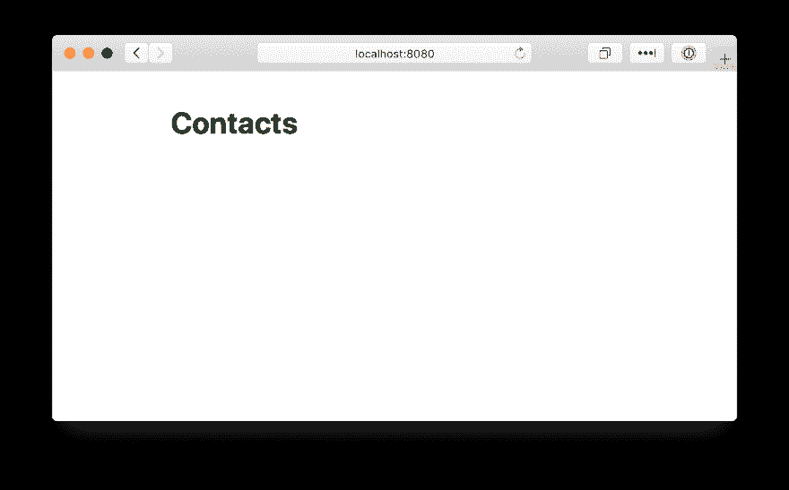
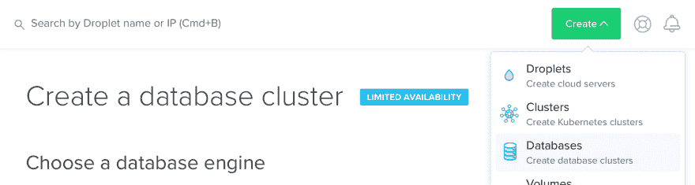
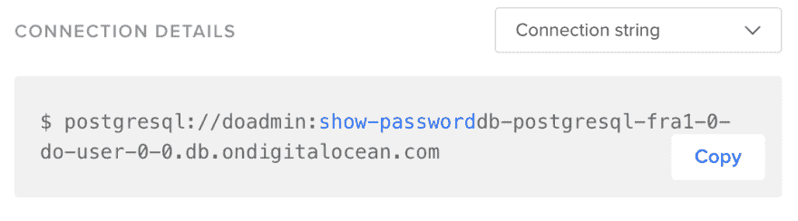
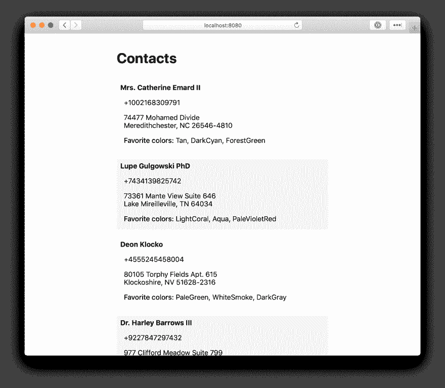

# 用 Go 和 PostgreSQL 创建一个简单的联系人列表

> 原文：<https://dev.to/digitalocean/creating-a-simple-contacts-list-with-go-and-postgresql-1f45>

在本文中，我们将构建一个包含联系人列表的简单网页，其中的联系人来自 PostgreSQL 数据库。我们将在 Go 中连接到数据库，并使用 PostgreSQL 对 JSON 列的支持。结果将是这样的:

[](https://res.cloudinary.com/practicaldev/image/fetch/s--bfSJ_fHL--/c_limit%2Cf_auto%2Cfl_progressive%2Cq_auto%2Cw_880/https://assets.digitalocean.com/ghost/2019/02/Kamal-1.png)

通过这篇文章，您将学习如何使用`sqlx`和`pgx`包连接到 Go 中的 PostgreSQL 数据库，使用模板动态呈现数据，并在 HTTP 服务器上提供结果页面。

# 要求

在我们开始之前:

1.  确保你已经安装了 Go。参见[本帖](https://www.callicoder.com/golang-installation-setup-gopath-workspace/)获取说明。
2.  确保你知道你的`$GOPATH`在哪里。通常是`~/go`，除非设置不同。

# 启动 HTTP 服务器

在您的`$GOPATH`内的一个新的空目录中，创建一个名为`main.go`的文件。你可以给这个目录起任何你喜欢的名字:我选择了`go-contacts`。我们将从使用 Go 内置的`net/http`包设置 HTTP 服务器开始。

```
package main

import (
    "flag"
    "log"
    "net/http"
"os"
)

var (
    listenAddr = flag.String("addr", getenvWithDefault("LISTENADDR", ":8080"), "HTTP address to listen on")
)

func getenvWithDefault(name, defaultValue string) string {
        val := os.Getenv(name)
        if val == "" {
                val = defaultValue
        }

        return val
}

func main() {
    flag.Parse()

    log.Printf("listening on %s\n", *listenAddr)
    http.ListenAndServe(*listenAddr, nil)
} 
```

Enter fullscreen mode Exit fullscreen mode

服务器需要一个主机和一个端口来监听，所以我们在一个名为`addr`的 CLI 标志中要求这样做。我们还想提供在环境变量中传递设置的选项，因此标志的默认值将取自环境变量`LISTENADDR`。这意味着如果没有传递 CLI 标志，将使用环境变量的值。如果两者都不成立，我们将退回到`:8080`。

如果您保存文件并立即运行它，您应该能够浏览到 [http://localhost:8080](http://localhost:8080) 。

```
go run main.go 
```

Enter fullscreen mode Exit fullscreen mode

等等，这是“404 页面未找到”错误吗？！

[](https://i.giphy.com/media/HUkOv6BNWc1HO/giphy.gif)

那也行！这是因为我们还没有配置任何路由或页面，所以服务器不知道如何响应请求。为什么我们不现在就去做呢？

## 联系人列表页面

让我们创建联系人列表页面，并在根路径`/`上提供它。我们将使用`template/html`包，这样我们可以轻松地传递动态数据(联系人),稍后在页面中呈现。

在`main.go`旁边创建一个名为`templates`的目录，并在其中创建一个名为`index.html`的文件，内容如下:

```
<!doctype html>
<html>
    <head>
        <meta charset="utf-8">
        <meta name="viewport" content="width=device-width, initial-scale=1">

        Contacts
        <link rel="stylesheet" href="https://unpkg.com/tachyons@4.10.0/css/tachyons.min.css"/>
    </head>
    <body>
        <div class="mw6 center pa3 sans-serif">
            <h1 class="mb4">Contacts</h1>
        </div>
    </body>
</html> 
```

Enter fullscreen mode Exit fullscreen mode

这是一个具有基本样式的页面，将作为我们联系人列表的基础。

现在我们需要阅读程序中的 index.html 模板。导入`html/template`并添加一个全局变量来保存顶部`listenAddr`之后的模板:

```
import (
    "flag"
    "log"
    "html/template"
    "net/http"
)

var (
        listenAddr       = flag.String("addr", getenvWithDefault("LISTENADDR", ":8080"), "HTTP address to listen on")
        tmpl             = template.New("")
) 
```

Enter fullscreen mode Exit fullscreen mode

在`main()`内，在`flag.Parse()`行之后，添加以下内容。为了与所有操作系统兼容，导入`path/filepath`包，因为我们将使用它来构建模板文件的路径。

```
var err error

_, err = tmpl.ParseGlob(filepath.Join(".", "templates", "*.html"))
if err != nil {
    log.Fatalf("Unable to parse templates: %v\n", err)
} 
```

Enter fullscreen mode Exit fullscreen mode

这将读取模板目录中的每个 HTML 文件，并为渲染做准备。现在我们已经完成了，我们想要配置模板在`/`上呈现。在文件的最底部添加一个新函数来服务页面:

```
func handler(w http.ResponseWriter, r *http.Request) {
    tmpl.ExecuteTemplate(w, "index.html", nil)
} 
```

Enter fullscreen mode Exit fullscreen mode

最后，配置服务器使用这个处理函数。在`main()`中的`log.Printf()`行上方，添加:

```
http.HandleFunc("/", handler) 
```

Enter fullscreen mode Exit fullscreen mode

现在我们准备好了！整个文件应该是这样的:

```
package main

import (
    "flag"
    "log"
    "html/template"
    "net/http"
    "os"
    "path/filepath"
)

var (
    listenAddr = flag.String("addr", getenvWithDefault("LISTENADDR", ":8080"), "HTTP address to listen on")
    tmpl       = template.New("")
)

func getenvWithDefault(name, defaultValue string) string {
        val := os.Getenv(name)
        if val == "" {
                val = defaultValue
        }

        return val
}

func main() {
    flag.Parse()

    var err error

    _, err = tmpl.ParseGlob(filepath.Join(".", "templates", "*.html"))
    if err != nil {
        log.Fatalf("Unable to parse templates: %v\n", err)
    }

    http.HandleFunc("/", handler)
    log.Printf("listening on %s\n", *listenAddr)
    http.ListenAndServe(*listenAddr, nil)
}

func handler(w http.ResponseWriter, r *http.Request) {
    tmpl.ExecuteTemplate(w, "index.html", nil)
} 
```

Enter fullscreen mode Exit fullscreen mode

再次运行`go run main.go`，你应该会看到我们已经配置好的模板。

[](https://res.cloudinary.com/practicaldev/image/fetch/s--dyIHjv7h--/c_limit%2Cf_auto%2Cfl_progressive%2Cq_auto%2Cw_880/https://assets.digitalocean.com/ghost/2019/03/Kamal-2.png)

# 数据库中的联系人

页面中缺少了一些东西—实际的联系人！让我们把它们加进去。

我们将使用 DigitalOcean 数据库快速建立 PostgreSQL 集群。如果你还没有，创建一个新的——只需要几分钟:如果你更喜欢文本帖子，参见[数据库的产品文档](https://www.digitalocean.com/docs/databases/how-to/clusters/create/)。如果你喜欢视频，[点击这里](https://www.youtube.com/watch?v=jY5FhyiEdig)。

[](https://res.cloudinary.com/practicaldev/image/fetch/s--f8WSD6bA--/c_limit%2Cf_auto%2Cfl_progressive%2Cq_auto%2Cw_880/https://assets.digitalocean.com/ghost/2019/02/Kamal-3.png)

创建集群后，从控制面板复制其连接字符串。在“概述”页面的“连接详细信息”部分，从列表中选择“连接字符串”并复制它:

[](https://res.cloudinary.com/practicaldev/image/fetch/s--VeNK5zPD--/c_limit%2Cf_auto%2Cfl_progressive%2Cq_auto%2Cw_880/https://assets.digitalocean.com/ghost/2019/03/Kamal-4.png)

连接字符串包含连接到您的数据库所需的所有细节(包括您的密码)，因此请确保其安全。

## 初始化数据库

我们的 Go 应用程序将只处理联系人的显示，所以我准备了一个包含 10 个随机生成的联系人的 SQL 导出，您可以将其导入到您的数据库中。这里可以找到[。](https://raw.githubusercontent.com/digitalocean/databases/master/examples/contacts.sql)

在 macOS 上，我喜欢使用 TablePlus 来处理我的数据库，但是你可以使用任何你喜欢的客户端或者使用`psql` CLI 命令导入它，比如:

```
psql 'your connection string here' < contacts.sql 
```

Enter fullscreen mode Exit fullscreen mode

## 抓取联系人

好了，现在我们有了一个数据库，里面有一些联系人🎉让我们的程序连接到它并获取联系人。我们将逐步构建这一功能。

在 Go 中有许多方法可以连接到 PostgreSQL 数据库。在这种情况下，我们还需要一种方便的方法来访问 JSONB 字段，因为我们的 contacts 数据库使用它们。我个人发现 [`github.com/jmoiron/sqlx`](http://github.com/jmoiron/sqlx) 和 [`github.com/jackc/pgx`](http://github.com/jackc/pgx) 的组合效果最好。

从导入包开始:

```
go get -u -v github.com/jackc/pgx github.com/jmoiron/sqlx 
```

Enter fullscreen mode Exit fullscreen mode

并将它们添加到`main.go` :
的顶部

```
import (
    ...

    _ "github.com/jackc/pgx/stdlib"
    "github.com/jmoiron/sqlx"
    "github.com/jmoiron/sqlx/types"
) 
```

Enter fullscreen mode Exit fullscreen mode

现在，我们需要做一些事情。我们需要根据数据库的表结构定义联系人类型，并连接到我们的 PostgreSQL 数据库。当提供联系人页面时，我们将查询数据库中的联系人，并将它们传递给模板进行呈现。

### 联系人类型

将这些类型添加到`main.go`。它们匹配[联系人数据库导出]((https://raw.githubusercontent.com/digitalocean/databases/master/examples/contacts.sql))的结构，并准备支持 JSONB 字段`favorites` :

```
// ContactFavorites is a field that contains a contact's favorites
type ContactFavorites struct {
    Colors []string `json:"colors"`
}

// Contact represents a Contact model in the database 
type Contact struct {
    ID                   int
    Name, Address, Phone string

    FavoritesJSON types.JSONText    `db:"favorites"`
    Favorites     *ContactFavorites `db:"-"`

    CreatedAt string `db:"created_at"`
    UpdatedAt string `db:"updated_at"`
} 
```

Enter fullscreen mode Exit fullscreen mode

### 数据库连接

注意，我们还没有连接到数据库👀让我们现在做那件事。我们将 PostgreSQL 连接字符串作为 CLI 标志传入，并添加一个全局数据库变量。所以再次在`main.go`顶端:

```
var (
    connectionString = flag.String("conn", getenvWithDefault("DATABASE_URL", ""), "PostgreSQL connection string")
    listenAddr       = flag.String("addr", ":8080", "HTTP address to listen on")
    db               *sqlx.DB
    tmpl             = template.New("")
) 
```

Enter fullscreen mode Exit fullscreen mode

注意，我们使用函数`getenvWithDefault` like 和 listen address 来允许使用环境变量(`DATABASE_URL`)和 CLI 标志(`-conn`)传递连接字符串。

在`main()`(在`http.HandleFunc()`的正上方)中的模板逻辑之后，添加以下内容:

```
if *connectionString == "" {
    log.Fatalln("Please pass the connection string using the -conn option")
}

db, err = sqlx.Connect("pgx", *connectionString)
if err != nil {
    log.Fatalf("Unable to establish connection: %v\n", err)
} 
```

Enter fullscreen mode Exit fullscreen mode

我们现在连接到我们的 PostgreSQL 数据库了！

[](https://i.giphy.com/media/3ohrygAnH3QLVxC3Pq/giphy.gif)

### 查询数据库中的联系人

在文件底部添加一个新函数，从数据库中获取所有联系人。为了更清楚地解释错误，我们将使用另一个包:`github.com/pkg/errors`。照常在`main.go`顶部下载导入。

```
go get -u -v github.com/pkg/errors 
```

Enter fullscreen mode Exit fullscreen mode

```
import (
    ...
    "github.com/pkg/errors"
    ...
)

…

func fetchContacts() ([]*Contact, error) {
    contacts := []*Contact{}
    err := db.Select(&contacts, "select * from contacts")
    if err != nil {
        return nil, errors.Wrap(err, "Unable to fetch contacts")
    }

    return contacts, nil
} 
```

Enter fullscreen mode Exit fullscreen mode

现在缺少的一件事是收藏夹栏。如果你看一下联系人类型，我们已经定义了这个字段:`FavoritesJSON types.JSONText `db:"favorites"`` 。这将数据库中的`favorites`列映射到 Contact 结构中的`FavoritesJSON`字段，使其作为一个 JSON 对象序列化为文本。

这意味着我们需要手动解析 JSON 对象并将其解组到实际的 Go 结构中。我们将使用 Go 的`encoding/json`包，所以确保在`main.go`的顶部导入它。添加到`fetchContacts()` :

```
import (
    ...
    "encoding/json"
    ...
)
...
func fetchContacts() ([]*Contact, error) {
    ...

    for _, contact := range contacts {
        err := json.Unmarshal(contact.FavoritesJSON, &contact.Favorites)

        if err != nil {
            return nil, errors.Wrap(err, "Unable to parse JSON favorites")
        }
    }

    return contacts, nil
} 
```

Enter fullscreen mode Exit fullscreen mode

结果结构将存储在联系结构的`Favorites`字段中。

## 渲染联系人

酷，我们有数据了。让我们使用它！在`handler()`函数中，我们将使用`fetchContacts()`来获取联系人，然后将他们传递给模板:

```
func handler(w http.ResponseWriter, r *http.Request) {
    contacts, err := fetchContacts()
    if err != nil {
        w.WriteHeader(http.StatusInternalServerError)
        w.Write([]byte(err.Error()))
        return
    }

    tmpl.ExecuteTemplate(w, "index.html", struct{ Contacts []*Contact }{contacts})
} 
```

Enter fullscreen mode Exit fullscreen mode

这将尝试获取联系人，失败时显示一个错误，并将它们传递给模板。请注意，如果发生错误，完整的错误将作为响应发送。在生产环境中，您可能希望记录错误并发送一般错误消息。

现在我们需要修改模板来处理我们传递给它的联系人。为了将喜爱的颜色显示为逗号分隔的列表，我们将使用`strings.Join`函数。在我们能够在模板中使用它之前，我们需要将它定义为一个模板函数，在`tmpl.ParseGlob`行上方的`main()`中。不要忘记导入顶部的`strings`包:

```
import (
    ...
    "strings"
    ...
)

...

tmpl.Funcs(template.FuncMap{"StringsJoin": strings.Join})
_, err = tmpl.ParseGlob(filepath.Join(".", "templates", "*.html"))

... 
```

Enter fullscreen mode Exit fullscreen mode

然后，在 HTML 模板中的`<h1>`行下，添加以下内容:

```
{{range .Contacts}}
<div class="pa2 mb3 striped--near-white">
    <header class="b mb2">{{.Name}}</header>
    <div class="pl2">
        <p class="mb2">{{.Phone }}</p>
        <p class="pre mb3">{{.Address}}</p>
        <p class="mb2"><span class="fw5">Favorite colors:</span> {{StringsJoin .Favorites.Colors ", "}}</p>
    </div>
</div>
{{end}} 
```

Enter fullscreen mode Exit fullscreen mode

仅此而已！最终的`main.go`文件应该是这样的:

```
package main

import (
    "encoding/json"
    "flag"
    "log"
    "html/template"
    "net/http"
        "path/filepath"
    "strings"

    _ "github.com/jackc/pgx/stdlib"
    "github.com/jmoiron/sqlx"
    "github.com/jmoiron/sqlx/types"
    "github.com/pkg/errors"
)

// ContactFavorites is a field that contains a contact's favorites
type ContactFavorites struct {
    Colors []string `json:"colors"`
}

// Contact represents a Contact model in the database 
type Contact struct {
    ID                   int
    Name, Address, Phone string

    FavoritesJSON types.JSONText    `db:"favorites"`
    Favorites     *ContactFavorites `db:"-"`

    CreatedAt string `db:"created_at"`
    UpdatedAt string `db:"updated_at"`
}

var (
    connectionString = flag.String("conn", getenvWithDefault("DATABASE_URL", ""), "PostgreSQL connection string")
    listenAddr       = flag.String("addr", getenvWithDefault("LISTENADDR", ":8080"), "HTTP address to listen on")
    db               *sqlx.DB
    tmpl             = template.New("")
)

func getenvWithDefault(name, defaultValue string) string {
        val := os.Getenv(name)
        if val == "" {
                val = defaultValue
        }

        return val
}

func main() {
    flag.Parse()
    var err error

    // templating

    tmpl.Funcs(template.FuncMap{"StringsJoin": strings.Join})
    _, err = tmpl.ParseGlob(filepath.Join(".", "templates", "*.html"))
    if err != nil {
        log.Fatalf("Unable to parse templates: %v\n", err)
    }

    // postgres connection

    if *connectionString == "" {
        log.Fatalln("Please pass the connection string using the -conn option")
    }

    db, err = sqlx.Connect("pgx", *connectionString)
    if err != nil {
        log.Fatalf("Unable to establish connection: %v\n", err)
    }

    // http server

    http.HandleFunc("/", handler)

    log.Printf("listening on %s\n", *listenAddr)
    http.ListenAndServe(*listenAddr, nil)
}

func fetchContacts() ([]*Contact, error) {
    contacts := []*Contact{}
    err := db.Select(&contacts, "select * from contacts")
    if err != nil {
        return nil, errors.Wrap(err, "Unable to fetch contacts")
    }

    for _, contact := range contacts {
        err := json.Unmarshal(contact.FavoritesJSON, &contact.Favorites)

        if err != nil {
            return nil, errors.Wrap(err, "Unable to parse JSON favorites")
        }
    }

    return contacts, nil
}

func handler(w http.ResponseWriter, r *http.Request) {
    contacts, err := fetchContacts()
    if err != nil {
        w.WriteHeader(http.StatusInternalServerError)
        w.Write([]byte(err.Error()))
        return
    }

    tmpl.ExecuteTemplate(w, "index.html", struct{ Contacts []*Contact }{contacts})
} 
```

Enter fullscreen mode Exit fullscreen mode

再次运行程序，像这样传入数据库的连接字符串，您应该会看到联系人列表:

```
go run main.go -conn "connection string here"
# alternatively:
DATABASE_URL="connection string here" go run main.go 
```

Enter fullscreen mode Exit fullscreen mode

[](https://res.cloudinary.com/practicaldev/image/fetch/s--oYq21xd1--/c_limit%2Cf_auto%2Cfl_progressive%2Cq_auto%2Cw_880/https://assets.digitalocean.com/ghost/2019/03/Kamal-5.png)

# 结论

阅读完本文后，您将逐步了解如何构建一个简单的联系人列表，从 HTTP web 服务器提供的空白页面开始，到呈现从 PostgreSQL 数据库获取的联系人列表的页面结束。在这个过程中，您将熟悉如何使用`html/template`来呈现包含动态数据的 web 页面，连接到 PostgreSQL 数据库，并与存储在数据库中的 JSONB 对象进行交互。

你可以在 GitHub repo[digital ocean/databases](https://github.com/digitalocean/databases/tree/master/examples/go-contacts)中找到完整的源代码。

## 下一步

下面是一些你可以在这篇文章之后做的事情，以便进一步练习:

*   将喜爱的颜色打印为项目符号列表，每种颜色作为一个单独的项目。使用`html/template`的内置`range`函数在喜爱的颜色片上循环。
*   添加喜欢的形状(正方形、圆形等。)发送给一个或多个联系人，并编辑模板以显示它。`Contact`结构应该保持不变。
*   按上次更新的顺序列出联系人，最近的排在最前面。