# 使用 AdonisJS 创建 API(第 1 部分)

> 原文：<https://dev.to/nilomiranda/creating-an-api-using-adonisjs-part-1-2mk0>

# 用 AdonisJS 构建 API

大家好！在本系列中，我们将使用 AdonisJS 创建一个 API，AdonisJS 是一个用于构建 NodeJS 应用程序的框架。

老实说，我不知道这个系列将包含多少帖子，因为我将在编写本教程时构建 API，但我会尽量保持每个帖子小而简洁，这样就很容易跟进和搜索与阿多尼斯相关的每个主题

## 先搭积木

让我们首先确保安装了 Adonis CLI:

### 安装 AdonisJS

在您的终端中，运行以下命令:

```
npm install -g @adonisjs/cli 
```

Enter fullscreen mode Exit fullscreen mode

您可能需要管理员权限来安装 Adonis CLI。

现在，您可以运行命令`adonis`，它会在您的终端中显示 Adonis CLI
中所有可用的命令

```
Usage:
  command [arguments] [options]

Global Options:
  --env              Set NODE_ENV before running the commands
  --no-ansi          Disable colored output

Available Commands:
  addon              Create a new AdonisJs addon
  install Install Adonisjs provider from npm/yarn and run post install instructions
  new                Create a new AdonisJs application
  repl               Start a new repl session
  serve              Start Http server
 key
  key:generate       Generate secret key for the app
 make
  make:command       Make a new ace command make:controller    Make a new HTTP or Websocket channel controller
  make:ehandler      Make a new global exception handler
  make:exception     Make a new exception
  make:hook          Make a new lucid model hook
  make:listener      Make a new event or redis listener
  make:middleware    Make a new HTTP or Ws Middleware
  make:migration     Create a new migration file
  make:model         Make a new lucid model
  make:provider      Make a new provider
  make:seed          Create a database seeder
  make:trait         Make a new lucid trait
  make:view          Make a view file
 route
  route:list         List all registered routes
 run
  run:instructions   Run instructions for a given module 
```

Enter fullscreen mode Exit fullscreen mode

## 创建新的应用程序

安装了 CLI 后，我们将能够构建我们的应用程序。在这种情况下，我们将创建一个 Restfull API。让我们从运行 adonis 的`new`命令
开始

```
adonis new -h 
```

Enter fullscreen mode Exit fullscreen mode

这样，我们将能够在创建新应用程序时看到所有可用的选项:

```
Usage:
  new <name> [options]

Arguments:
  name                Name of the project directory

Options:
  --api-only          Scaffold project for api server
  --api               Scaffold project for api server
  --slim              Scaffold smallest possible Adonisjs application
  --blueprint [value] Path to github project blueprint
  --branch [value]    Specify git branch for project blueprint
  --skip-install      Do not install modules from npm
  --yarn              Use yarn over npm for modules installation
  --cnpm              Use cnpm over npm for installation
  --raw               Disable animations and colored output

About:
  Create a new AdonisJs application 
```

Enter fullscreen mode Exit fullscreen mode

对于本教程，因为我们将创建一个 API，所以让我们使用选项`--api-only`。

```
adonis new schedulerapi --api-only 
```

Enter fullscreen mode Exit fullscreen mode

创建项目后，让我们启动服务器。所以首先我们转到我们的项目目录，它是由 adonis
创建的

```
cd schedulerapi 
```

Enter fullscreen mode Exit fullscreen mode

并启动我们的服务器:

```
adonis serve --dev 
```

Enter fullscreen mode Exit fullscreen mode

通过传递选项`--dev`将启用 nodemon，这是一个库，用于观察文件中的变化，并用新的更改刷新服务器。

您的命令将返回您的服务器正在运行的地址，可能是`http://127.0.0.1:3333/`。在你的浏览器中打开它，你会看到阿瑟 JSON 返回，因为我们只是在创建一个 API，不需要任何视图

```
{"greeting":"Hello world in JSON"} 
```

Enter fullscreen mode Exit fullscreen mode

### 设置我们的数据库

让我们快速配置一下将要使用的数据库。对于这个项目，我们将使用一个**关系型**数据库，在我的例子中，我将使用 MySQL，因为它是我已经安装在我的机器上的一个，但是您可以随意使用任何您想要的关系型数据库，如 Postgres 或 sqlite3。

所以头，我们的文件负责配置我们项目中的数据库，它位于`config`文件夹中。文件是`database.js`。现在打开这个文件，您会注意到它导出了三个配置，分别是:`MySQL`、`PostgreSQL`和`Sqlite`。请注意，在每个配置上面，我们都有一个注释块，告诉我们需要安装哪个包，这取决于您将使用的数据库。

因为我将使用 MySQL，所以我只需要运行:

```
npm i --save mysql 
```

Enter fullscreen mode Exit fullscreen mode

如果您使用 PostgreSQL，那么运行:

```
npm i --save pg 
```

Enter fullscreen mode Exit fullscreen mode

如果你使用的是 sqlite:

```
npm i --save sqlite3 
```

Enter fullscreen mode Exit fullscreen mode

完美！安装好你的软件包后，进入我们的文件**。env** (在我们项目的根目录中)设置变量以正确连接到我们的数据库:

```
DB_CONNECTION = [mysql, sqlite, pg]
DB_HOST = YOUR_LOCALHOST_ADDRESS
DB_PORT = YOUR_PORT
DB_USER = YOUR_DB_USER
DB_PASSWORD = YOUR_DB_PASSWORD
DB_DATABASE= YOUR_DATABASE_NAME 
```

Enter fullscreen mode Exit fullscreen mode

您只需要设置这些变量。只要确保你创建的数据库的名称与你设置的变量`DB_DATABASE`一致。

保存该文件，现在使用
运行迁移

```
adonis migration:run 
```

Enter fullscreen mode Exit fullscreen mode

现在，如果你打开你用来管理数据库的 GUI，在我的例子中，我使用的是 **sequel pro** ，你会看到你的数据库有了新的表:

[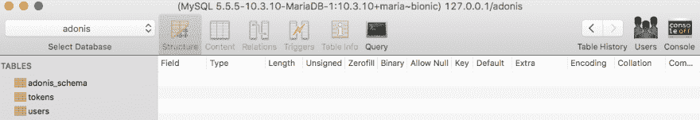](https://res.cloudinary.com/practicaldev/image/fetch/s--qp3WbhCy--/c_limit%2Cf_auto%2Cfl_progressive%2Cq_auto%2Cw_880/https://thepracticaldev.s3.amazonaws.com/i/wxf7chh2js00dv0cpqi8.png)

### 创建我们的第一个控制器

现在让我们通过创建一个用户注册控制器来研究一下控制器。默认情况下，当您第一次创建 Adonis 应用程序时，正如我们在这里所做的，它会预先配置一个用户模型，因为大多数应用程序需要某种用户交互。

现在，让我们创建一个包含业务逻辑的控制器，以便将新用户保存到数据库中。走向你的终端，输入:

```
adonis make:controller User 
```

Enter fullscreen mode Exit fullscreen mode

这将显示，要求为 HTTP 请求或 websocket 通道选择一个控制器:

```
> Select controller type (Use arrow keys)
  For HTTP requests
  For Websocket channel 
```

Enter fullscreen mode Exit fullscreen mode

让我们选择 HTTP 请求

```
✔ create  app/Controllers/Http/UserController.js 
```

Enter fullscreen mode Exit fullscreen mode

如果您成功创建了控制器，您将会看到上面的消息。现在，在你的控制器文件夹中(位于应用程序文件夹中)，你会看到另一个名为 **Http** 和*最后*的文件夹，里面有你的`UserController.js`

现在，为了使我们的控制器与我们的模型一起工作，在我们的控制器文件中，我们需要导入模型文件，在我们的例子中，是用户模型。因此，在`'use stric'`之后，让我们要求我们的模型:

```
const User = use('App/Models/User') 
```

Enter fullscreen mode Exit fullscreen mode

现在在我们的类`UserController`中，让我们从添加第一个方法开始，这个方法将处理将新用户保存到我们的数据库中。姑且称之为**店()**。

在我们的方法中，我们可以访问一个名为`ctx`的变量，这个变量包含请求的上下文。

通过使用析构，我们将使用上下文的`request`:

```
class UserController {
  async store ({ request }) { ... } 
```

Enter fullscreen mode Exit fullscreen mode

现在，使用`request`,我们能够通过使用来自请求
的方法`only()`,从这个请求中收集一些数据

```
class UserController {
  async store ({ request }) {
    // request data coming from the request
    const data = request.only()
    } 
```

Enter fullscreen mode Exit fullscreen mode

通过使用`request.only()`,我们能够知道我们想要从请求中获得哪些数据字段。

首先，让我们看看用户应该发送什么数据。让我们来看看我们的用户迁移数据，位于**数据库**文件夹:

```
|-- factory.js
`-- migrations
    |-- 1503250034279_user.js
    `-- 1503250034280_token.js 
```

Enter fullscreen mode Exit fullscreen mode

我们要找的文件是`1503250034279_user.js`。打开文件，您会看到以下内容:

```
{ ...some code ... }
class UserSchema extends Schema {
  up () {
    this.create('users', (table) => {
      table.increments()
      table.string('username', 80).notNullable().unique()
      table.string('email', 254).notNullable().unique()
      table.string('password', 60).notNullable()
      table.timestamps()
    })
  }
{ ...more code... } 
```

Enter fullscreen mode Exit fullscreen mode

所以用户会给我发一个`username`，一个`email`和一个`password`。现在让我们回到我们的`UserController.js`文件。

作为`request.only()`的参数，我们将传递一组我们希望在请求中得到的值，在我们的例子中，是用户名、电子邮件和密码

```
class UserController {
  async store ({ request }) {
    // request data coming from the request
    const data = request.only(['username', 'email', 'password'])
    } 
```

Enter fullscreen mode Exit fullscreen mode

在创建新用户之前，让我们检查一下我们的数据库，看看用来创建新帐户的用户名是否已经被使用:

```
// looking for user in database
const userExists = await User.findBy('email', data.email) 
```

Enter fullscreen mode Exit fullscreen mode

如果你查看 Adonis 文档，你会看到你有一个名为`findByOrFail()`的方法，但是我将只使用`findBy()`，因为我想在用户已经存在的情况下发送一条消息。

```
// if user exists don't save
      if (userExists) {
        return response
          .status(400)
          .send({ message: { error: 'User already registered' } })
      } 
```

Enter fullscreen mode Exit fullscreen mode

最后，如果用户没有注册，我们将他保存在我们的数据库中:

```
// if user doesn't exist, proceeds with saving him in DB
      const user = await User.create(data) 
```

Enter fullscreen mode Exit fullscreen mode

你的用户控制器现在大概是这样:

```
class UserController {
  // creating and saving a new user (sign-up)
  async store ({ request, response }) {
    try {
      // getting data passed within the request
      const data = request.only(['username', 'email', 'password'])

      // looking for user in database
      const userExists = await User.findBy('email', data.email)

      // if user exists don't save
      if (userExists) {
        return response
          .status(400)
          .send({ message: { error: 'User already registered' } })
      }

      // if user doesn't exist, proceeds with saving him in DB
      const user = await User.create(data)

      return user
    } catch (err) {
      return response
        .status(err.status)
        .send(err)
    }
  }
} 
```

Enter fullscreen mode Exit fullscreen mode

我只是忘了提一下，之前我把主要代码包装在一个`try block`中，万一出现任何意外错误，我们在`catch (err) block`中捕获它，并返回一个显示错误的响应。

### 路由

现在我们已经创建了第一个控制器，是时候测试它了，为此我们将学习如何在 Adonis 中使用 routes

当您创建应用程序时，您有一个名为`routes.js`的文件，它位于项目根目录的`start folder`中

打开`routes.js`，清理里面所有的代码。

为了在 Adonis 中使用路由，我们需要使用`use()` functi
从 Adonis 导入路由

```
'use strict'

const Route = use('Route') 
```

Enter fullscreen mode Exit fullscreen mode

要创建用户，我们必须发送一个 POST 请求。当我们访问[http://127 . 0 . 0 . 1/3333/users](http://127.0.0.1/3333/users)时，我们将发送这个请求:

```
Route.post('users', 'UserController.store') 
```

Enter fullscreen mode Exit fullscreen mode

`post()`的第一个参数是将触发控制器的 url，第二个参数是控制器本身

对于 url，您可以使用`users`或`/users`。两种选择都可行

要访问控制器的某个方法，你只需要输入控制器的名字，在我们的例子中是`UserController`和方法的名字:`UserController.store`

为了在我们的应用程序中发出请求，我将使用失眠休息客户端。你可以在这里下载:[https://insomnia.rest/download/](https://insomnia.rest/download/)

当你第一次失眠时，你会看到这样的情况:

[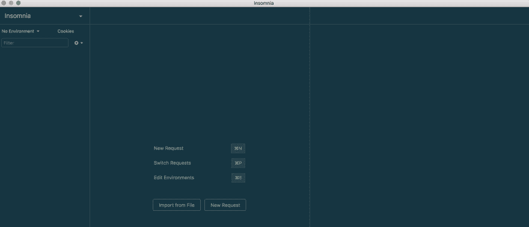](https://res.cloudinary.com/practicaldev/image/fetch/s--vx-bEVDS--/c_limit%2Cf_auto%2Cfl_progressive%2Cq_auto%2Cw_880/https://thepracticaldev.s3.amazonaws.com/i/lfl4ytundh1r93yj0cks.png)

让我们从创建一个新的工作区开始，这样我们就可以创建并存储我们配置的请求:

只需点击“失眠”旁边的向下箭头。

[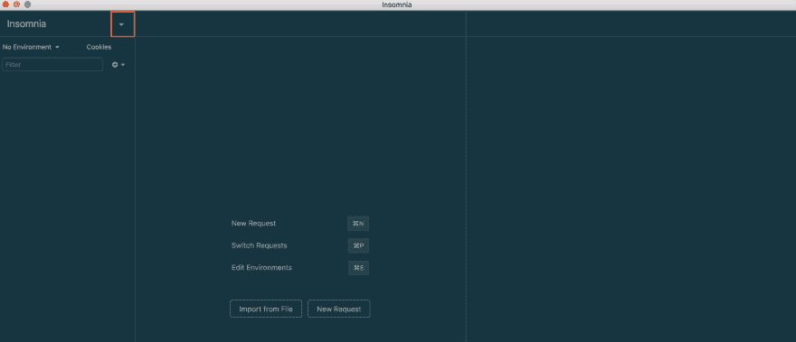](https://res.cloudinary.com/practicaldev/image/fetch/s--nGJi3ITs--/c_limit%2Cf_auto%2Cfl_progressive%2Cq_auto%2Cw_880/https://thepracticaldev.s3.amazonaws.com/i/8wqwve6zyke5hc8055x6.png)

现在在下拉菜单中选择“新工作区”

[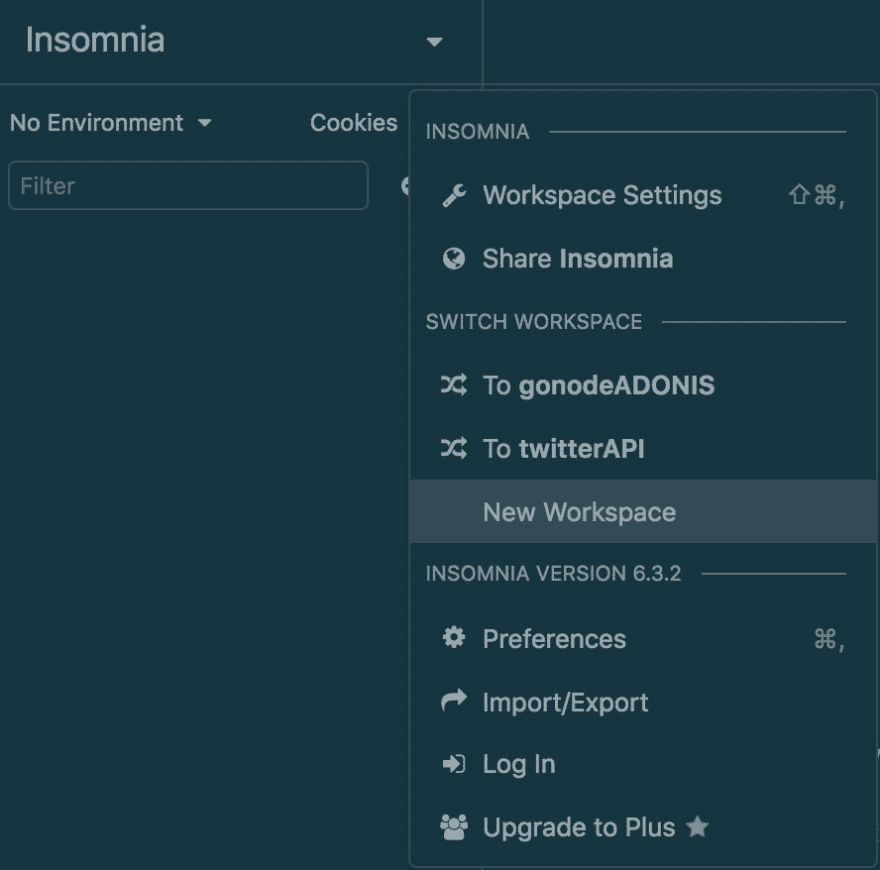](https://res.cloudinary.com/practicaldev/image/fetch/s---YeCpNYX--/c_limit%2Cf_auto%2Cfl_progressive%2Cq_auto%2Cw_880/https://thepracticaldev.s3.amazonaws.com/i/3rw2rlvhcb1n7pbue8uf.png)

[](https://res.cloudinary.com/practicaldev/image/fetch/s--CrGFh8AW--/c_limit%2Cf_auto%2Cfl_progressive%2Cq_auto%2Cw_880/https://thepracticaldev.s3.amazonaws.com/i/ok5wxzeqydfia2ue13be.png)

我将把我的工作区称为“schedulerAPI”

现在点击“cookies”正下方的“加号”:

[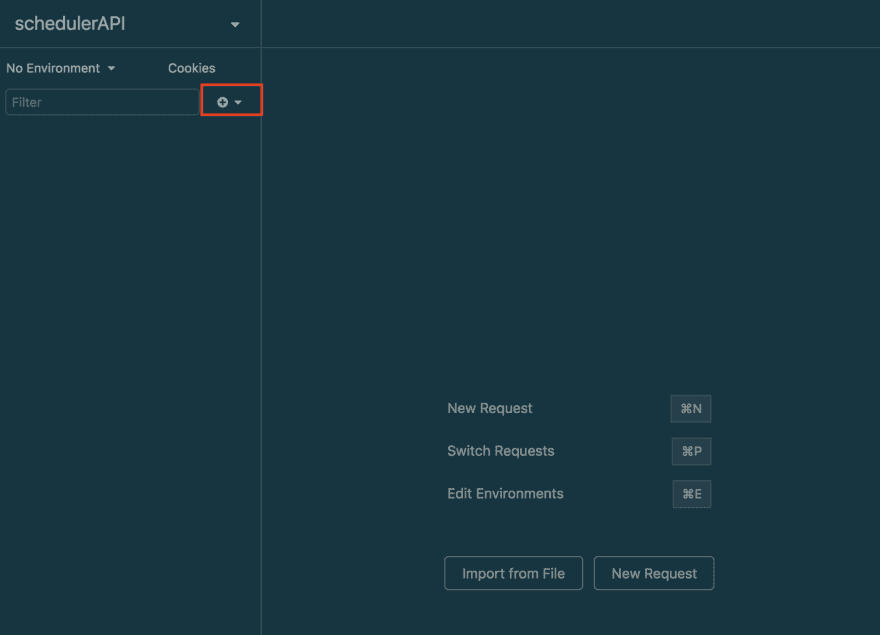](https://res.cloudinary.com/practicaldev/image/fetch/s--svYsfOop--/c_limit%2Cf_auto%2Cfl_progressive%2Cq_auto%2Cw_880/https://thepracticaldev.s3.amazonaws.com/i/b84e6hhv23ig4sp8fjxe.png)

我将创建一个名为“User”的文件夹，并创建一个名为“store”的新 post 请求

要更改请求的类型，点击`GET`并在下拉菜单中选择`POST`

[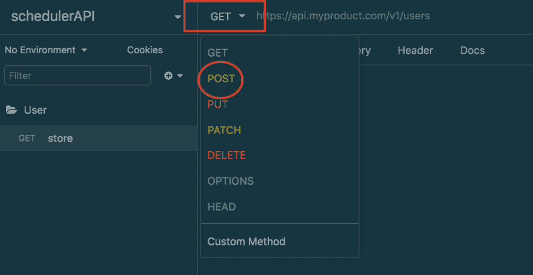](https://res.cloudinary.com/practicaldev/image/fetch/s--Y50J7V6q--/c_limit%2Cf_auto%2Cfl_progressive%2Cq_auto%2Cw_880/https://thepracticaldev.s3.amazonaws.com/i/1xi4ml0a3jjijnddou8p.png)

现在在`POST`的正下方，你会看到一个名为“Body”的下拉菜单，点击它并选择 JSON。

正如我们之前看到的，我们需要在请求中发送`username`、`email`和`password`。

```
{  "username":  "Danilo",  "email":  "me@danmiranda.io",  "password":  "123456"  } 
```

Enter fullscreen mode Exit fullscreen mode

现在，在失眠症中，让我们告诉我们需要向哪个地址发送请求。

[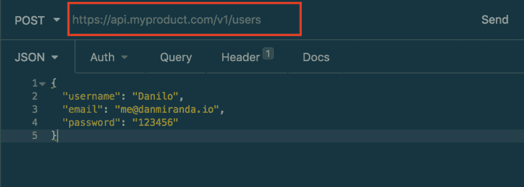](https://res.cloudinary.com/practicaldev/image/fetch/s--goZQnJ8j--/c_limit%2Cf_auto%2Cfl_progressive%2Cq_auto%2Cw_880/https://thepracticaldev.s3.amazonaws.com/i/8u9iqm7n96qz8y4sa07d.png)

为了使我们的生活更容易，所以我们不需要键入每个新的请求，我们创建完整的地址 [http://127.0.0.1:3333](http://127.0.0.1:3333) ，让我们设置一个可以在失眠症内部使用的环境变量:

[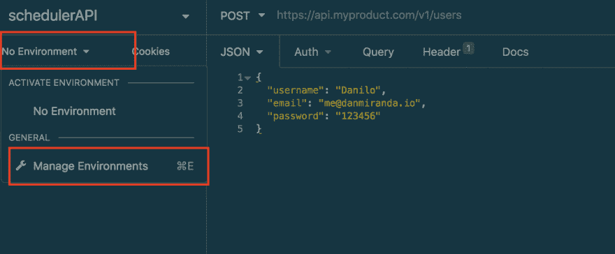](https://res.cloudinary.com/practicaldev/image/fetch/s--rkLRctSa--/c_limit%2Cf_auto%2Cfl_progressive%2Cq_auto%2Cw_880/https://thepracticaldev.s3.amazonaws.com/i/tlmmghfyz8dkk61ubzo1.png)

姑且称之为`base_url`，并放上我们的根地址:

```
{  "base_url":  "http://127.0.0.1:3333"  } 
```

Enter fullscreen mode Exit fullscreen mode

点击`Done`保存即可

现在在我们的地址栏中输入`base_url`和`/users`，就像这样

[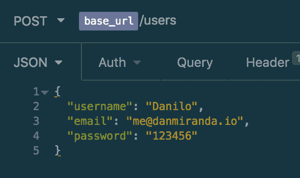](https://res.cloudinary.com/practicaldev/image/fetch/s--5UV5NHmq--/c_limit%2Cf_auto%2Cfl_progressive%2Cq_auto%2Cw_880/https://thepracticaldev.s3.amazonaws.com/i/qxmkminph13n5kjooa4u.png)

现在点击`Send`发送我们的请求

您将在失眠症的右侧看到，我们的请求返回了创建的用户，就像我们告诉它的那样:

[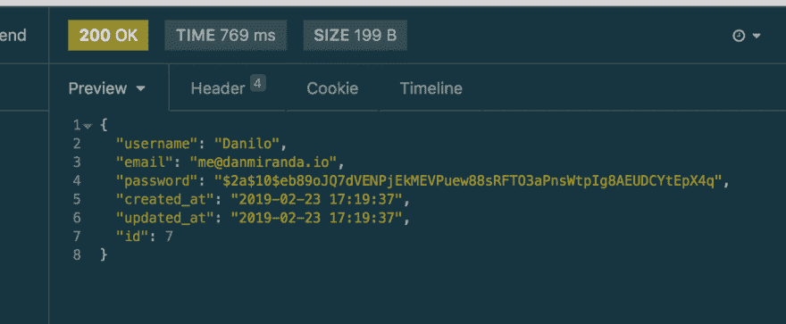](https://res.cloudinary.com/practicaldev/image/fetch/s--jbVXBIKL--/c_limit%2Cf_auto%2Cfl_progressive%2Cq_auto%2Cw_880/https://thepracticaldev.s3.amazonaws.com/i/525svq79d0uyus4dcvt5.png)

让我们测试我们已经创建的用户。如果我用同一封邮件再次发送请求，它会返回一个错误:

[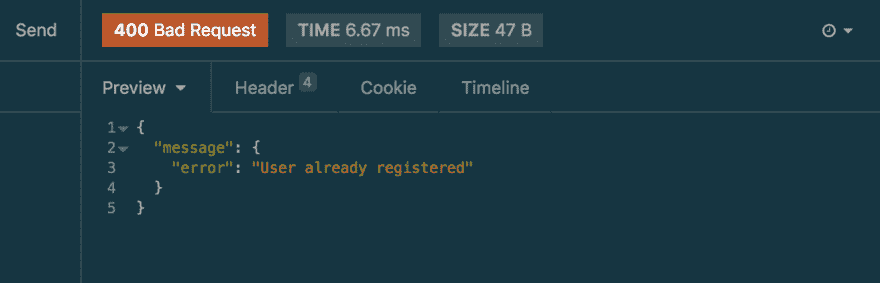](https://res.cloudinary.com/practicaldev/image/fetch/s--o1pGmxZ_--/c_limit%2Cf_auto%2Cfl_progressive%2Cq_auto%2Cw_880/https://thepracticaldev.s3.amazonaws.com/i/kywzr6iaalyf39ycdq20.png)

现在就这样，我们之后继续

所以回顾一下我们所学的一切:

*   Install AdonisJS
*   用 adonis 创建新的应用程序
*   配置数据库以正确使用我们的 Adonis 应用程序
*   创建我们的第一个控制器
*   创建我们的第一条路线
*   向患有失眠症的 API 发送请求

本帖原帖 [https://danmiranda.io](https://danmiranda.io) 。一定要查看那里的其他帖子。

在推特上关注我:[https://twitter.com/Nilomiranda](https://twitter.com/Nilomiranda)

第二部见！