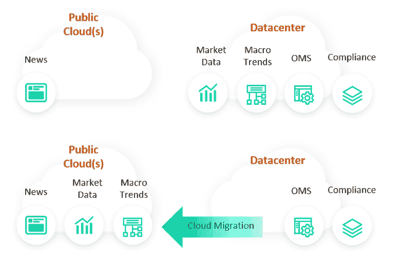
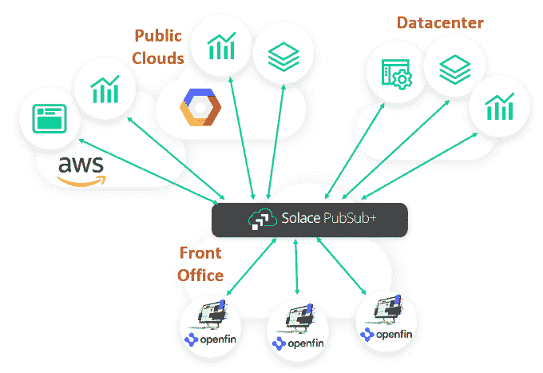
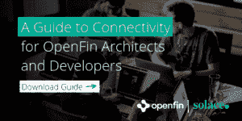
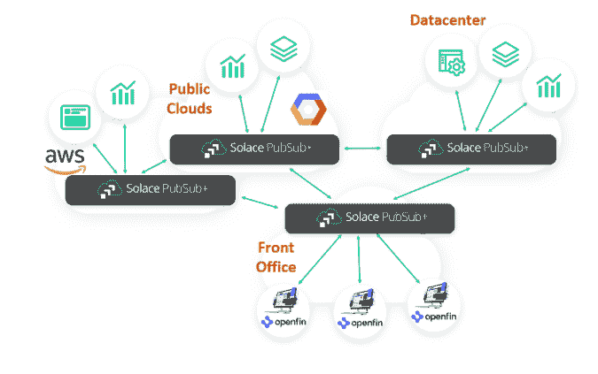
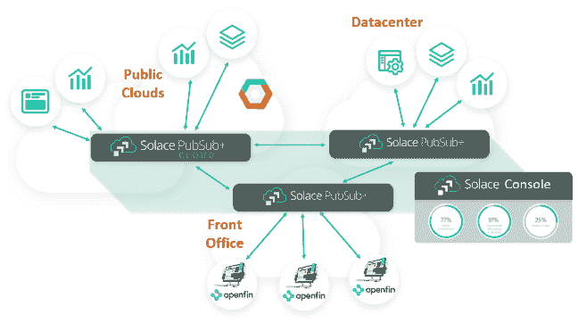

# 跨混合云创建开放事件网格

> 原文：<https://dev.to/solacedevs/creating-an-openfin-event-mesh-across-the-hybrid-cloud-231a>

在金融服务业，有一句古老的谚语“趋势是你的朋友。”如今，每个金融服务公司的趋势都是从数据中心转向云。汤森路透最近的一项调查发现，虽然 2017 年云支出占金融公司 IT 预算的 30%，但预计今年(2019 年)将达到 47%。

在大多数金融公司，OpenFin 应用程序需要与各种服务交换数据，这些服务包括传统的数据中心资源、部署在云中的新工作负载、SaaS 服务以及一系列其他第三方服务。让我们看看后端环境是如何变化的:

*   **数据中心应用。**订单路由和合规性等一些核心应用程序可能永远不会离开数据中心，但大多数其他应用程序迁移到云的时机已经成熟。这可以通过使用虚拟化或容器的“提升和转移”,或者利用机器学习或流分析等强大的新云引擎的下一代传统替代计划来实现。在某些情况下，数据中心应用程序正在变得混合，一些工作负载在云中，其余的留在数据中心。
*   **SaaS 方案。**金融科技革命为市场带来了新的托管服务，可以以更低的成本取代传统的内部应用程序。示例包括欺诈检测、数据沿袭(作为合规性的一部分)和风险管理。
*   **第三方服务。**通过专用 VPN 或租用线路获取第三方服务的日子即将结束。当彭博( [B-PIPE](https://www.bloomberg.com/company/announcements/bloomberg-makes-real-time-data-available-cloud/) )和汤森路透([路孚特 Elektron](https://www.refinitiv.com/en/products/elektron-enterprise-data-management) )有云优先战略时，你知道这正式成为一种趋势。OpenFin 快速增长的应用目录中充斥着第三方云服务。

## 实现服务位置透明

当您在正在进行的服务迁移中规划 OpenFin 连接时，有一个从应用和服务交互中抽象出服务位置的策略变得至关重要。对于与远程服务交互的 OpenFin 应用程序以及服务本身之间的相互作用来说，也是如此。

这是消息传递基础架构的众多优势之一，尤其是可以跨越数据中心和公共云的基础架构。消息传递基础设施允许您声明哪些系统产生和使用哪些事件，并使用队列或主题名称来路由数据。通过这种方式，后端服务可以从数据中心转移到云，代理将动态地重新路由流量，而不改变任何 OpenFin 应用程序或其他服务。同样的技术用于灾难恢复和业务连续性；如果您的主云出现故障，来自您的 OpenFin 应用的流量可以立即路由到备用公共云或私有云。

## OpenFin 服务集成

最快速的开始方式是使用一个多协议代理将您的 OpenFin 应用程序与混合云中的服务连接起来。交通流量是这样的。

正如白皮书[OpenFin 架构师和开发人员连接指南所述，](https://try.solace.com/wp-download-openfin-guide-to-connectivity/) Solace 允许 OpenFin 应用程序使用原生 web 技术，并通过其独特的多协议方法访问您的所有云、web 和传统服务。

## 全局事件网格

我们的许多客户在单个云或数据中心内也需要相同的功能，更像这样:

例如，在上图中，最左边的应用程序可以使用部署在 AWS 中的代理来管理云的事件*和*将数据路由到前台、数据中心或其他云。混合云环境中任何地方的任何应用程序都可以订阅任何一组事件，代理将动态地协调哪里需要什么，同时根据需要在数据交付期间切换协议。

## 托管公共云事件网格

如果您不想自己管理云基础架构，甚至可以选择托管服务。您可以按需付费，Solace 将根据需要确保正常运行时间和容量。一个单一的控制台将让你看到所有的内部服务活动，所以你总是有一个完整的画面你的数据流。

## 哪个适合你？

无论您是希望仅为 OpenFin 合理化服务访问，还是希望改造整个企业，Solace PubSub+都可以简化您的数据流，并在您将工作负载逐渐转移到云时提供最大的灵活性。如果您想了解有关 Solace PubSub+、PubSub+ Cloud 或启用 Solace 的事件网格的更多信息，[请立即联系我们](https://dev.to/contact/)。

帖子[创建一个跨越混合云的 OpenFin 事件网格](https://solace.com/blog/openfin-event-mesh-hybrid-cloud/)首先出现在 [Solace](https://solace.com) 上。