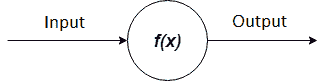
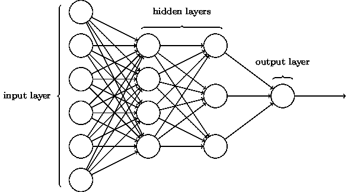
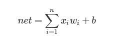
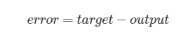
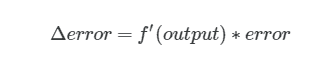
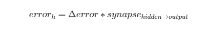
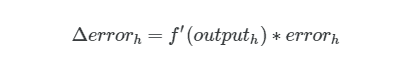
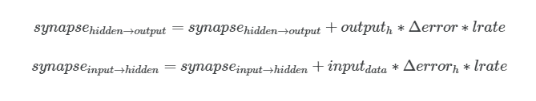
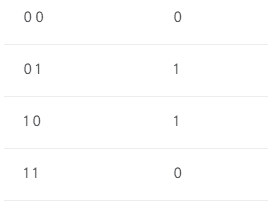

# 使用 JavaScript 在 7 分钟内创建神经网络！

> 原文：<https://dev.to/liashchynskyi/creating-of-neural-network-using-javascript-in-7minutes-o21>

嘿，怎么了😁今天，我要告诉你如何在没有人工智能框架的情况下，用 JavaScript 构建一个简单的神经网络。我们走吧！

为了更好地理解，你需要知道以下事情:

*   OOP, JS, ES6;
*   基础数学；
*   基础线性代数。

# 简单理论

神经网络是由**个神经元**和**个突触**连接而成的集合。神经元可以表示为接收一些输入值并作为结果产生一些输出函数。

[](https://res.cloudinary.com/practicaldev/image/fetch/s---XXX4ADH--/c_limit%2Cf_auto%2Cfl_progressive%2Cq_auto%2Cw_880/https://cdn-images-1.medium.com/max/800/1%2AUFiJTvJO4eCuTycsLC3TLQ.png)

每一个突触都有自己的权重。因此，神经网络的主要元素是以特定方式连接成层的神经元。

每一个神经网络至少有一个输入层，至少有一个隐层和一个输出层。当每一层中的每个神经元都与下一层中的所有神经元相连时，就称为多层感知器(MLP)。如果神经网络有一个以上的隐含层，那么它被称为深度神经网络(DNN)。

[](https://res.cloudinary.com/practicaldev/image/fetch/s--5DxkKcR3--/c_limit%2Cf_auto%2Cfl_progressive%2Cq_auto%2Cw_880/https://cdn-images-1.medium.com/max/800/0%2AUHkKkn4dcN45xbAc.png)

图中表示**类型的 DNN 6–4–3–1**表示输入层有 6 个神经元，第一个隐层有 4 个，第二个隐层有 3 个，输出层有 1 个。

* * *

# 正向传播

一个神经元可以有一个或多个输入，这些输入可以是其他神经元的输出。

[](https://res.cloudinary.com/practicaldev/image/fetch/s--9VtmKX86--/c_limit%2Cf_auto%2Cfl_progressive%2Cq_auto%2Cw_880/https://cdn-images-1.medium.com/max/800/0%2AVGvxOUOcJX5hso_0.png)

*   X1 和 X2 -输入数据；
*   w1、w2 -重量；
*   f(x1，x2) -激活函数；
*   y 输出值。

所以，我们可以用数学公式来描述上面所有的东西:

[](https://res.cloudinary.com/practicaldev/image/fetch/s--vfh3zNSz--/c_limit%2Cf_auto%2Cfl_progressive%2Cq_auto%2Cw_880/https://cdn-images-1.medium.com/max/800/1%2AdMljfH2anWtmEbSPkZfBXA.png)

该公式描述了神经元的输入值。在这个公式中: **n -输入数，x -输入值，w -权重，b -偏差**(我们还不会使用那个特性，但是现在你应该知道一件事——它总是等于 1)。

如您所见，我们需要将每个输入值乘以其权重，并对产品进行汇总。我们得到了 **x** 乘以 **w** 的乘积之和。下一步是通过激活函数传递输出值 ***net*** 。 ***同样的操作需要应用于我们神经网络中的每个神经元。*T11】**

最后，你知道什么是正向传播。

* * *

# 反向传播(或称反向传播或只是反向传播)

反向投影是 1970 年首次推出的强大算法之一。阅读更多关于它如何工作的信息。]

反向传播由几个步骤组成，您需要将这些步骤应用于神经网络中的每个神经元。

*   首先，你需要计算神经网络输出层的误差。

[](https://res.cloudinary.com/practicaldev/image/fetch/s--ImwqldhQ--/c_limit%2Cf_auto%2Cfl_progressive%2Cq_auto%2Cw_880/https://cdn-images-1.medium.com/max/800/1%2A5yo4SajKz1QqXI8GiW0EoA.png)

**目标** -真值，**输出** -神经网络的真实输出。

*   第二步是关于计算 ***的δ误差值。*T3】**

[](https://res.cloudinary.com/practicaldev/image/fetch/s--m6MFJQH1--/c_limit%2Cf_auto%2Cfl_progressive%2Cq_auto%2Cw_880/https://cdn-images-1.medium.com/max/800/1%2ApTQ8wJoGMxfDizlGuCwveg.png)

**f’**-激活函数的导数。

*   计算隐含层神经元的误差。

[](https://res.cloudinary.com/practicaldev/image/fetch/s--xqQeyZlx--/c_limit%2Cf_auto%2Cfl_progressive%2Cq_auto%2Cw_880/https://cdn-images-1.medium.com/max/800/1%2AhwZatkVm0_B59j8xJmpNIg.png)

**突触** -连接在隐藏层和输出层之间的神经元的权重。

然后我们再计算***△***，但现在针对隐层神经元。

[](https://res.cloudinary.com/practicaldev/image/fetch/s--G3le5qAp--/c_limit%2Cf_auto%2Cfl_progressive%2Cq_auto%2Cw_880/https://cdn-images-1.medium.com/max/800/1%2At-80Rqf-twKvFhZp7rtETA.png)

**输出** -一个隐层神经元的输出值。

*   是时候更新权重了。

[](https://res.cloudinary.com/practicaldev/image/fetch/s--yL45KIQZ--/c_limit%2Cf_auto%2Cfl_progressive%2Cq_auto%2Cw_880/https://cdn-images-1.medium.com/max/800/1%2AEaZ-DpsyZGQQQ538Nw85_A.png)

**lrate** -学习率。

伙计们，我们只是用了最简单的反向投影算法和梯度下降😯。如果你想更深一步，那么看这个视频。

[https://www.youtube.com/embed/Ilg3gGewQ5U](https://www.youtube.com/embed/Ilg3gGewQ5U)

仅此而已。我们完成了所有的数学。只管编码！！！

* * *

# 练习

所以，我们将创建 MLP 来解决异或问题(真的吗，伙计？😯).

> 从最简单的到最难的，兄弟。一切都会好起来的。

XOR 的输入、输出。

[](https://res.cloudinary.com/practicaldev/image/fetch/s--u7Te-3Zv--/c_limit%2Cf_auto%2Cfl_progressive%2Cq_auto%2Cw_880/https://cdn-images-1.medium.com/max/1600/1%2AIc2H-HbN1tOT4q9ARSJvzQ.png)

我们将使用 **Node.js** 平台和 **math.js** 库(类似于 **Python** 中的 **numpy** )。在您的终端中运行这些命令:

```
mkdir mlp && cd mlp 
npm init 
npm install babel-cli babel-preset-env mathjs 
```

Enter fullscreen mode Exit fullscreen mode

让我们创建一个名为`activations.js`的文件，它将包含我们的激活函数定义。在我们的例子中，我们将使用经典的 sigmoid 函数(oldschool，bro)。