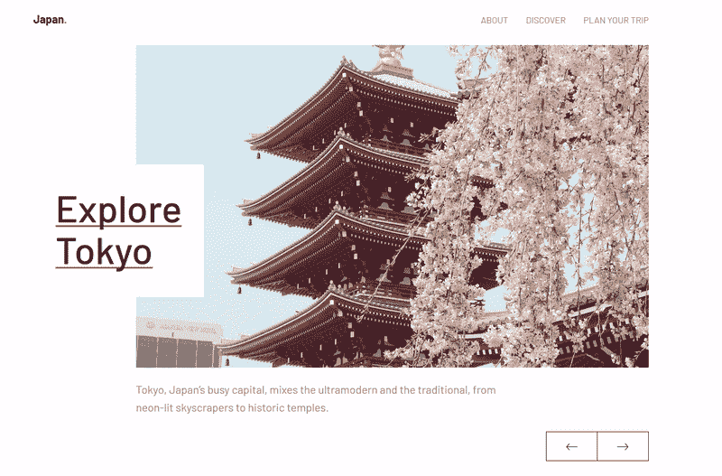

# 创建滚动显示效果

> 原文：<https://dev.to/kathykato/creating-reveal-effects-on-scroll-31o6>

在本教程中，我想分享如何创建滚动块显示效果。该效果由尺寸减小并显示文本或图像的纯色块组成。

这些显示效果可用于为 UI 组件(如图像滑块)创建引人入胜的全新交互。我使用类似的擦除动画创建了这个滑块:

[](https://res.cloudinary.com/practicaldev/image/fetch/s--VcREsZdy--/c_limit%2Cf_auto%2Cfl_progressive%2Cq_66%2Cw_880/https://thepracticaldev.s3.amazonaws.com/i/viwjnn7xxxjwcr0622mh.gif) 
在[笔上查看](https://codepen.io/kathykato/pen/MqYVOq)。

我将向您展示如何使用 CSS 和 [Animate on Scroll (AOS)](https://michalsnik.github.io/aos/) 来创建这种效果，这是一个 JavaScript 库，用于在用户进入视口时动画显示滚动元素。

* * *

## 入门

让我们从添加动画滚动库到项目开始。在`<head>`标签中包含 AOS . CSS:

```
<link href="https://unpkg.com/aos@2.3.1/dist/aos.css" rel="stylesheet"> 
```

Enter fullscreen mode Exit fullscreen mode

和 aos.js 在结束前`<body>`标签:

```
<script src="https://unpkg.com/aos@2.3.1/dist/aos.js"></script> 
```

Enter fullscreen mode Exit fullscreen mode

一旦添加，初始化 AOS:

```
AOS.init(); 
```

Enter fullscreen mode Exit fullscreen mode

## 创建显示块

首先，我们将创建 reveal 块来显示下面的文本。我们将从 [Doggo Ipsum](https://doggoipsum.com/) 获取文本，这是一个来自 doggo lingo 的 lorem ipsum 生成器。

```
<div class="reveal-holder">
  <div class="reveal-block"></div>
  <h1 class="heading">Maximum borkdrive</h1>
</div> 
```

Enter fullscreen mode Exit fullscreen mode

`.reveal-holder`类是纯色块元素和文本的容器。这些类的样式是:

```
.reveal-holder {
  position: relative;
  display: inline-block;
  overflow: hidden;
}

.reveal-block {
  position: absolute;
  top: 0;
  width: 100%;
  height: 101%;
  background: white;
} 
```

Enter fullscreen mode Exit fullscreen mode

这是为了正确地覆盖和显示元素。将`.reveal-block`类的高度设为 101%在这里很重要:

[](https://res.cloudinary.com/practicaldev/image/fetch/s--WvoSBJV5--/c_limit%2Cf_auto%2Cfl_progressive%2Cq_auto%2Cw_880/https://thepracticaldev.s3.amazonaws.com/i/slfth2p9wq0wdf50xtus.png) 
将高度设置为 100%会导致调整窗口大小时显示块不会完全覆盖图像。将`.reveal-holder`类的`overflow` CSS 属性设置为 hidden 有助于防止元素内容之外的任何内容被剪切。

## 使用 CSS 转场

使用`data-aos`属性设置动画。例如，要从右边显示一个元素，将属性添加到 HTML:
中的`.reveal-block`类

```
<div class="reveal-block" data-aos="reveal-right"></div> 
```

Enter fullscreen mode Exit fullscreen mode

还有 CSS:

```
[data-aos="reveal-right"] {
  transform: scaleX(1);
  transform-origin: 100% 0%;
  transition-property: transform;
  transition-delay: 0.5s;
}

[data-aos="reveal-right"].aos-animate {
  transform: scaleX(0);
} 
```

Enter fullscreen mode Exit fullscreen mode

`transform` CSS 属性对`.reveal-block`元素使用了`scaleX()`函数，以便块在动画时调整大小。`transform-origin`属性设置变换的点，在本例中是在 100% 0%或左右。这是导致块通过减小尺寸来产生动画的原因。`transition-property`设置要应用的过渡效果，而`transition-delay`根据设置的值设置过渡等待。

将这些选项添加到`AOS.init()`函数中，使动画播放一次:

```
AOS.init({
  once: true
}); 
```

Enter fullscreen mode Exit fullscreen mode

动画现在可以滚动播放一次了！到目前为止，它应该是这样的:
[](https://res.cloudinary.com/practicaldev/image/fetch/s--RGYTmWfc--/c_limit%2Cf_auto%2Cfl_progressive%2Cq_66%2Cw_880/https://thepracticaldev.s3.amazonaws.com/i/hldvndy5gvzlyhnh00s3.gif)

给图像添加同样的效果，也是一个类似的过程。在 HTML 中用图像替换文本:

```
<div class="reveal-holder">
  <div class="reveal-block" data-aos="reveal-left"></div>
  
</div> 
```

Enter fullscreen mode Exit fullscreen mode

要使显示效果从右向左滑动，请将`transform-origin`编辑为 0% 100%:

```
[data-aos="reveal-left"] {
  ...
  transform-origin: 0% 100%;
  ...
} 
```

Enter fullscreen mode Exit fullscreen mode

## 制作伪元素动画

我们将在`.reveal-block`类中使用伪元素来创建一个更加时尚的 reveal 动画。

首先修改`.reveal-block`类的 CSS:

```
.reveal-block {
  position: absolute;
  top: 0;
  width: 100%;
  height: 101%;
  background: white;
}

.reveal-block::before {
  position: absolute;
  content: '';
  top: 0;
  left: 0;
  right: 0;
  bottom: 0;
  background: lightgray;
  transition-property: transform;
  transition-duration: 0.5s;
} 
```

Enter fullscreen mode Exit fullscreen mode

`::before`伪元素是它自己的元素，就像另一个`.reveal-block`一样，但是可以用它自己的属性来设置，比如背景颜色或定位。

像这样给`.reveal-block`添加一个`.right`类:

```
<div class="reveal-block right" data-aos="reveal-right"></div> 
```

Enter fullscreen mode Exit fullscreen mode

这将有助于用伪元素制作动画。CSS 是:

```
.reveal-block.right::before {
  transform: scaleX(0);
  transform-origin: 0% 100%;
}

.reveal-block.right.aos-animate::before {
  transform: scaleX(1);
} 
```

Enter fullscreen mode Exit fullscreen mode

这就是结果:
[](https://res.cloudinary.com/practicaldev/image/fetch/s--DG0CNV7b--/c_limit%2Cf_auto%2Cfl_progressive%2Cq_66%2Cw_880/https://thepracticaldev.s3.amazonaws.com/i/h5ej2exro7gvds0v1gq0.gif)

看起来棒极了！剩下的就是在滚动前隐藏元素。为此，我们将向`.reveal-holder`类添加一个 data-aos 属性:

```
<div class="reveal-holder" data-aos="reveal-item">...</div> 
```

Enter fullscreen mode Exit fullscreen mode

以及附带的 CSS:

```
[data-aos="reveal-item"] {
  visibility: hidden;
  transition-property: visibility;
  transition-duration: 0s;
}

[data-aos="reveal-item"].aos-animate {
  visibility: visible;
} 
```

Enter fullscreen mode Exit fullscreen mode

## 包装完毕

诸如 block reveal 效果的滚动触发的动画可以是展示内容的身临其境且优雅的交互。我希望这篇教程不仅能帮助你学习这些动画是如何制作的，还能帮助你理解到底是什么让这个动画工作。

在 [CodePen](https://codepen.io/kathykato/pen/PLwBez) 上有现场演示。我还用代码创建了一个 [GitHub 库](https://github.com/kathykato/reveal-effects)。编码快乐！