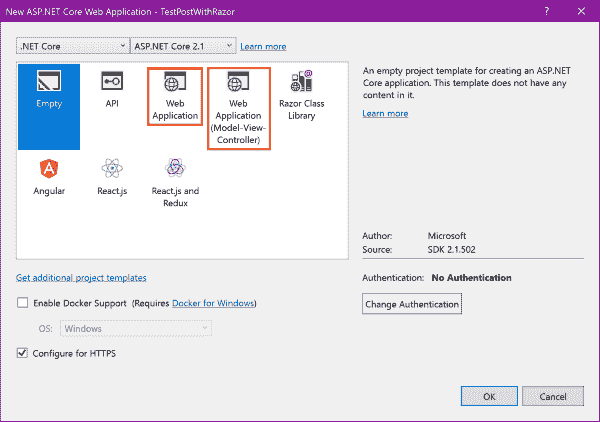
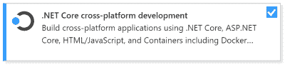
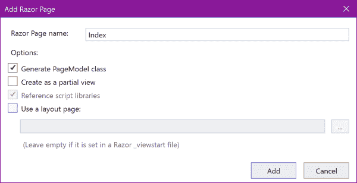
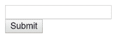
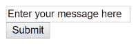

# 用 POST 方法创建尽可能简单的 ASP.NET 核心表单

> 原文：<https://dev.to/azure/creating-the-simplest-possible-aspnet-core-form-with-a-post-method-416g>

最近，我需要为某人创建一个简单的页面来提交 HTML 表单。Azure 应用程序的其余部分运行在 Azure 无服务器功能、[逻辑应用](http://gslb.ch/d266b)和[认知服务](http://gslb.ch/d117b)上，但对于最后一部分，我希望用户可以点击链接，在网络浏览器中打开页面(可能在移动设备上)，在表单中输入密码，并通过 POST 提交到 SSL 加密页面。我想到了编写一个小的 Xamarin 应用程序，并通过 POST 提交到 Azure 函数。另一种选择是使用静态 HTML 页面，并使用 Javascript 通过 POST 向 Azure 函数提交表单。对于未来，我不排除这两种选择。

但与此同时，我想尝试一个简单的 [Razor page (CSHTML)](http://gslb.ch/d193b) 向用户呈现一个 HTML 表单，并通过 HTTPS 将这个表单提交给它自己。

> 这个例子的[源代码在这里](https://github.com/lbugnion/sample-dotnetcore-simplepostwithrazor/tree/master/src)。

## 有模特的刮胡刀页真的很酷

我喜欢没有 MVC 的超级简单的 ASP.NET 核心网站。不要误解我的意思， [MVC](http://gslb.ch/d279b) 对于企业 web 应用程序来说是很棒的，在这些应用程序中，可测试性和可维护性是最基本的。但是它们也带来了很多开销。如果你继续用下面红圈的模板创建一个“空的”ASP.NET 核心 MVC 网站，你会得到很多文件(CSHTML 页面，控制器，设置类，Javascript，CSS 等等)。甚至一个空的 ASP.NET 核心 MVC 网站包含 38 个文件(！).

[](https://res.cloudinary.com/practicaldev/image/fetch/s--r3aHXGhQ--/c_limit%2Cf_auto%2Cfl_progressive%2Cq_auto%2Cw_880/https://raw.githubusercontent.com/lbugnion/sample-dotnetcore-simplepostwithrazor/master/img/002.png)

*Visual Studio 中的 ASP.NET 核心 Razor 和 ASP.NET 核心 MVC 模板*

另一个选择是创建一个只有 Razor 页面的 ASP.NET 核心 web 应用程序。在这样的应用程序中，您消除了控制器，并在附加到 CSHTML Razor 页面的 [PageModel](http://gslb.ch/d280b) 实例中处理代码。这绝对不复杂，事实上我的私人网站就是以这种方式实现的。然而，即使您使用上面显示的橙色圆圈模板以这种方式创建了一个“空的”web 应用程序，您最终仍然会得到许多文件，并且需要删除其中的大部分。这很烦人，我更喜欢从一个“真正空的”模板开始，就像上图中用蓝色选中的那个。

> 尽管我在这个例子中使用了 Visual Studio，但是您可以使用命令行创建 ASP.NET 核心应用程序，这里显示了`dotnet new` [语法](http://gslb.ch/d281b)。

## 从零开始

让我们使用上面显示的`Empty` web 应用程序模板从头开始。为此，在 Visual Studio 2017 中，首先选择文件、新建、项目。

> 开始之前，您必须确保已经安装了。NET 核心工作负载在 [Visual Studio 安装程序](http://gslb.ch/d282b)中。您始终可以从“开始”菜单运行 Visual Studio 安装程序，并检查是否选中了以下工作负荷。

[](https://res.cloudinary.com/practicaldev/image/fetch/s---f6KNuqi--/c_limit%2Cf_auto%2Cfl_progressive%2Cq_auto%2Cw_880/https://raw.githubusercontent.com/lbugnion/sample-dotnetcore-simplepostwithrazor/master/img/003.png)

*。净核心工作量*

在下一步中，您必须选择空的 web 应用程序，如下所示。您可以默认启用 HTTPS，这通常是个好主意。在我们的示例中，我们不会使用身份验证，因此您可以将此选项留给`No Authentication`。然后单击确定。

[](https://res.cloudinary.com/practicaldev/image/fetch/s--r3aHXGhQ--/c_limit%2Cf_auto%2Cfl_progressive%2Cq_auto%2Cw_880/https://raw.githubusercontent.com/lbugnion/sample-dotnetcore-simplepostwithrazor/master/img/002.png)

## 配置 Razor 页面

在接下来的步骤中，我们将配置应用程序来提供 Razor 页面。要做到这一点，即使我们不打算在这里使用完整的 MVC 功能，我们仍然需要让应用程序使用 MVC 服务。

1.  在 Visual Studio 中打开 [Startup.cs](https://github.com/lbugnion/sample-dotnetcore-simplepostwithrazor/blob/master/src/TestPostWithRazor/Startup.cs) 。
2.  修改`ConfigureServices`方法如下:

```
public void ConfigureServices(IServiceCollection services)
{
    services.AddMvc();
} 
```

1.  修改`Configure`方法，如下所示:

```
public void Configure(
    IApplicationBuilder app, 
    IHostingEnvironment env)
{
    if (env.IsDevelopment())
    {
        app.UseDeveloperExceptionPage();
    }

    app.UseMvc();
} 
```

## 创建剃刀页面

使用这种配置，应用程序将在名为`Pages`的文件夹中查找 Razor (CSHTML)页面，并将请求定向到与路由(URL)相对应的页面。在这个例子中，因为我们希望尽可能简单，所以我们将使用默认路径并创建一个名为 [Index.cshtml](https://github.com/lbugnion/sample-dotnetcore-simplepostwithrazor/blob/master/src/TestPostWithRazor/Pages/Index.cshtml) 的页面。

1.  右键单击项目，从上下文菜单中选择`Add`，然后选择`New Folder`。
2.  将这个新文件夹命名为`Pages`。
3.  右击`Pages`文件夹，并从上下文菜单中选择`Add`和`Razor Page`。
4.  在`Add scaffold`对话框中，按下`Add`。
5.  在`Add Razor Page`对话框中，输入名称`Index`并确保选择了`Generate PageModel class`。
6.  取消勾选`Use a layout page`，然后按下`Add`。

[](https://res.cloudinary.com/practicaldev/image/fetch/s--MKFl7rHN--/c_limit%2Cf_auto%2Cfl_progressive%2Cq_auto%2Cw_880/https://raw.githubusercontent.com/lbugnion/sample-dotnetcore-simplepostwithrazor/master/img/004.png)

> 这一步可能需要一些时间，因为需要安装一些 Nuget 包，以便 ASP.NET 核心应用程序、路由和 Razor 页面能够工作。

## 测试 GET 方法

默认情况下，页面被配置为接收 GET 请求。我们现在将测试这个。

*   打开 Index.cshtml 页面(在 Pages 文件夹中)。
*   请注意`@model`指令的存在。这指示 ASP.NET 使用`IndexModel`类(在 [Index.cshtml.cs](https://github.com/lbugnion/sample-dotnetcore-simplepostwithrazor/blob/master/src/TestPostWithRazor/Pages/Index.cshtml.cs) 中)来处理调用。

> 您也可以直接在 Index.cshtml 页面中添加代码，与 html 标记内联。这非常方便，但也可能导致一些非常难以测试的“意大利面条”代码。不建议这样做，除非是布局代码(例如`for`循环创建列表等)...).

*   打开 [Index.cshtml.cs](https://github.com/lbugnion/sample-dotnetcore-simplepostwithrazor/blob/master/src/TestPostWithRazor/Pages/Index.cshtml.cs) 文件。该文件嵌套在解决方案资源管理器的 Index.cshtml 页中。
*   在 OnGet 方法中放置一个断点。
*   在调试模式下运行应用程序。这将启动 IIS Express 并在您最喜欢的 web 浏览器中打开一个`localhost` URL，例如`https://localhost:44367/`。
*   请注意，断点被命中。

在该方法中，您可以访问所有常见的 ASP.NET 对象，例如 [HttpRequest](http://gslb.ch/d287b) 实例(在`Request`属性中)等。

## 设置发布功能

就像我们可以在`OnGet`方法中处理`GET`调用一样，我们将在`OnPost`方法中处理`POST`调用。然而，正如我们将看到的，这需要一点额外的配置。首先让我们准备一个 HTML 表单，它将向 IndexModel 类发送一个文本字段。

1.  在[的`IndexModel`类](https://github.com/lbugnion/sample-dotnetcore-simplepostwithrazor/blob/master/src/TestPostWithRazor/Pages/Index.cshtml.cs)中，添加一个`string`类型的属性，名为`Message`。

```
public string Message
{
    get;
    set;
} 
```

1.  修改`OnGet`方法如下:

```
public void OnGet()
{
    Message = "Enter your message here";
} 
```

1.  仍然在 IndexModel 类中，添加一个名为`OnPost`的方法:

```
public void OnPost()
{
    Message = Request.Form[nameof(Message)];
} 
```

1.  在`OnPost`方法中放置一个断点。
2.  在编辑器中打开 [Index.cshtml](https://github.com/lbugnion/sample-dotnetcore-simplepostwithrazor/blob/master/src/TestPostWithRazor/Pages/Index.cshtml) 。
3.  编辑`body`如下:

```
<body>
    <form method="post">
        <input asp-for="Message" />
        <br />
        <input type="submit" />
    </form>
</body> 
```

1.  在调试模式下再次运行应用程序。像以前一样调用`OnGet`方法，您应该会看到带有一个空输入字段的 HTML 表单。

[](https://res.cloudinary.com/practicaldev/image/fetch/s--bt3JYeAr--/c_limit%2Cf_auto%2Cfl_progressive%2Cq_auto%2Cw_880/https://raw.githubusercontent.com/lbugnion/sample-dotnetcore-simplepostwithrazor/master/img/005.png)

在这一点上，如果您像我一样期望输入字段用`Message`属性的内容初始化，您可能会感到惊讶(因为[的`asp-for`属性](http://gslb.ch/d284b))。但是，让我们进一步测试，看看另一个问题。

1.  在字段中输入任意文本，然后按提交按钮。

此时，您将在浏览器中得到一个 HTTP 错误 400(错误请求)。

## 修复坏请求错误 400

一个快速的在线搜索显示，这个问题与丢失的[防伪令牌](http://gslb.ch/d285b)有关，防伪令牌是 ASP.NET 为避免跨站请求伪造(CSRF)攻击而实施的安全措施。本质上，令牌所做的是证明请求来自表单所来自的站点。

那我们怎么拿到令牌呢？这就是一个名为`Microsoft.AspNetCore.Mvc.TagHelpers`的有用的名称空间[发挥作用的地方](http://gslb.ch/d283b)。将它添加到 CSHTML 页面将自动在 HTML 表单中生成防伪标记，并且还将创建与我们添加到表单中的[属性`asp-for`相对应的 HTML 属性。](http://gslb.ch/d284b)

1.  打开 Index.cshtml。
2.  在文件的上面，但是在[`@page`属性](http://gslb.ch/d286b)下面添加[`@addTagHelper`属性](http://gslb.ch/d283b)，这样你的文件看起来就像下面的代码:

```
@page
@addTagHelper *, Microsoft.AspNetCore.Mvc.TagHelpers
@model TestPostWithRazor.Pages.IndexModel
@{
    Layout = null;
} 
```

1.  在调试模式下再次运行应用程序。
2.  在您的 web 浏览器中，一旦页面被加载，您现在应该看到表单按预期初始化:

[](https://res.cloudinary.com/practicaldev/image/fetch/s--Xhu6utQp--/c_limit%2Cf_auto%2Cfl_progressive%2Cq_auto%2Cw_880/https://raw.githubusercontent.com/lbugnion/sample-dotnetcore-simplepostwithrazor/master/img/006.png)

1.  右键单击页面上的任意位置，选择`View page source`。您应该会看到由 ASP.NET 应用程序生成的以下 HTML 代码:

```
<body>
    <form method="post">
        <input type="text" id="Message" name="Message" value="Enter your message here" />
        <br />
        <input type="submit" />
    <input name="__RequestVerificationToken" type="hidden" value="[Some token]" /></form>
</body> 
```

1.  修改文本字段的内容，然后单击提交按钮。此时，`OnPost`方法中的断点应该被命中，并且该字段的内容将被赋给`Message`属性。

## 结论

> 这个例子的[源代码在这里](https://github.com/lbugnion/sample-dotnetcore-simplepostwithrazor/tree/master/src)。

有时候，简单更好。在这个例子中，我们看到了如何创建一个带有 Razor 页面(和相应的`PageModel`)的空 ASP.NET 核心应用程序，以及如何配置这个应用程序来处理简单的`GET`和`POST`方法。这是对其他机制的替代，例如与无服务器 Azure 函数对话的纯客户端 JavaScript 支持的页面。虽然这里提出的解决方案不是无服务器的，但如果你已经在 Azure 中有一个应用服务计划，由于 ASP.NET 核心的跨平台能力，你可以利用它。

希望这段代码对一些人有用。

编码快乐！

【人名】劳伦