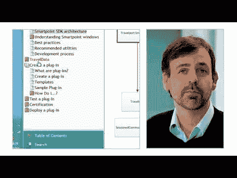
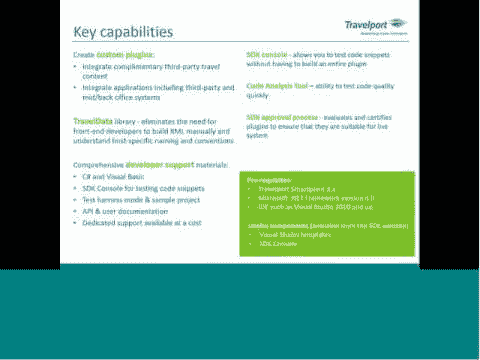

# 创建 Travelport Smartpoint 插件-第 1 部分

> 原文：<https://dev.to/ramx/creating-travelport-smartpoint-plugin---part-1-17g6>

当你不知道如何构建某个东西时，当你被要求构建它时会发生什么，它会产生紧张和兴奋，但给它加上一个期限紧张很快就会变成焦虑，让我带你从头开始构建我的第一个 Travelport Smartpoint 插件的旅程。

## TL；速度三角形定位法(dead reckoning)

Travelport Smartpoint SDK 用于增强 Travelport Smartpoint 的功能，这是一种更智能的预订方式，如航空公司、酒店、汽车等。我使用 Smartpoint SDK 创建了一个插件来获取 Smartpoint 控制台中的第三方数据。

* * *

要求:
首先你需要的是:

*   Travelport 智能点
*   可视化工作室
*   Travelport Smartpoint SDK 控制台

* * *

资源:

*   Travelport 编码大师班:Smartpoint SDK 演示 

*Travelport 编码大师班:Smartpoint SDK 演示

* [Smartpoint SDK API 文档](https://support.travelport.com/webhelp/smartpointsdk/)