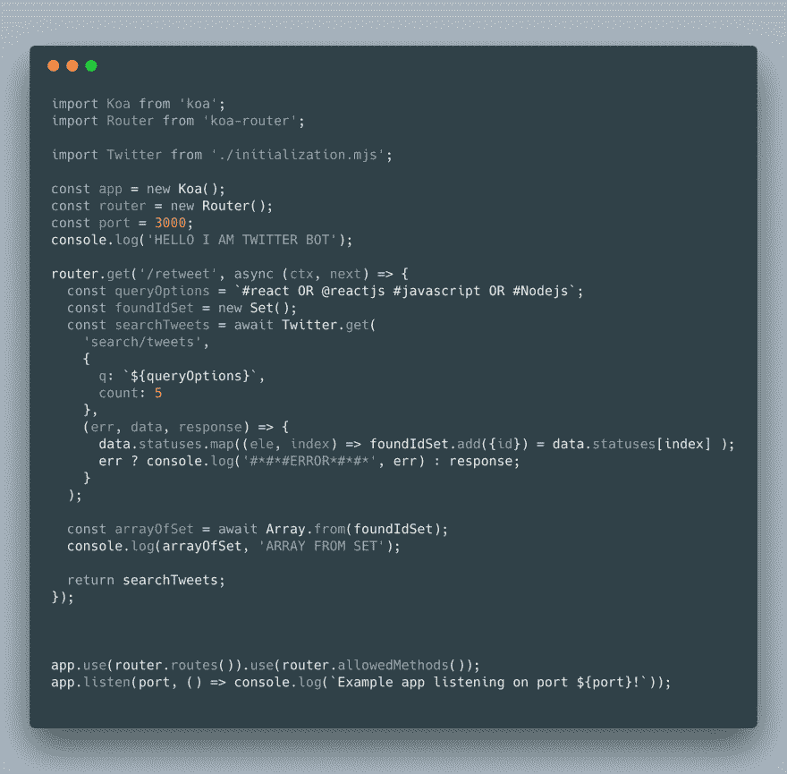
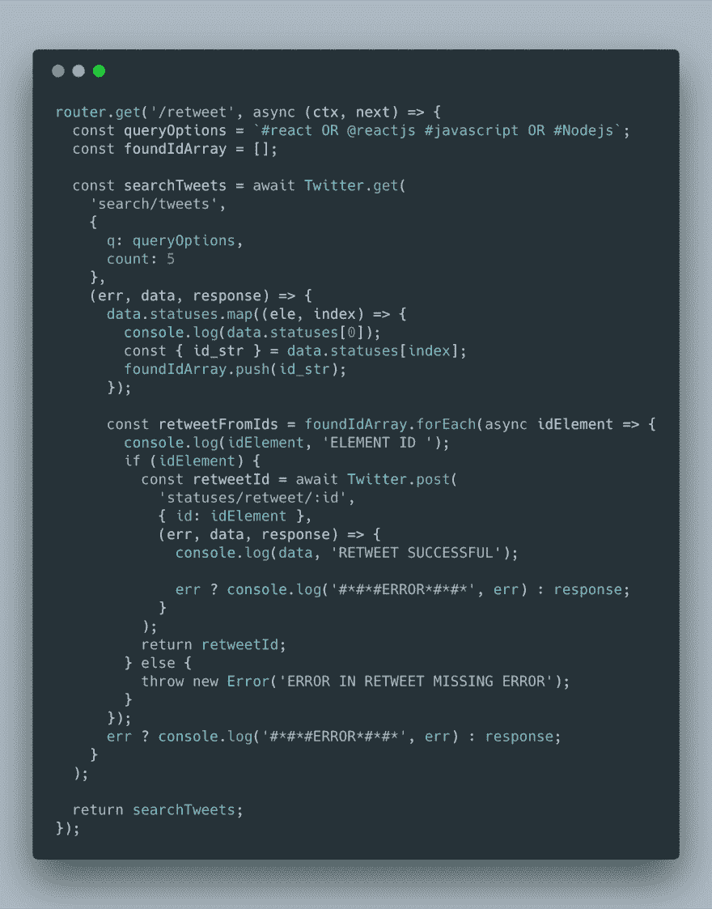

# Twitter 机器人的创建——转发和搜索

> 原文：<https://dev.to/jacobmgevans/creation-of-twitter-bot-retweets-searches-48bl>

# 使用 Twitter API 创建 Twitter 机器人的痛苦和教训

因此，我首先开始了这些“简单”的兼职项目，作为我在初创公司工作时的一项职责；为公司管理社交媒体。我想，嘿，我是一名开发人员，这不会很难自动化。好吧，我有一点错，也有一点对，这差不多总结了我大部分的编码经历。

我决定从一些简单的研究开始这个项目，以回答一些问题，有没有一个库可以帮助与 Twitter API 交互？有什么大的障碍吗？有类似的例子吗？我应该借此机会尝试我没有用过的技术吗？现在我用谷歌搜索回答了这些问题，除了最后一个我决定是的，我将使用 Koa 一个 Node.js 的框架，它在某些方面类似于 Express，而在其他方面有很大的不同。

## 问题想通了...没有。

所以我想我已经回答了其他的问题，很多人似乎都在使用 Twit，一个 NPM 的软件包，它可以帮助我们更容易地与 API 接口。也许我应该直接处理 API 我从 Twits 挑剔的初始化中吸取了一些惨痛的教训。相信我，我尽力了。稍后我将讨论我是如何解决这个问题的。关于是否存在其他类似的东西的问题，是也不是。很多人已经让机器人不完全做我想做的事情。这些障碍主要来自 Twitter API，一些来自 Twit，一些来自我自己糟糕的编码。

*   你需要为机器人创建一个全新的账户→机器人想要自主。

*   你需要申请访问 Twitter API，他们会问很多问题。我甚至收到了要求更详细回答的电子邮件。下面是 Twitter 开发者平台的启动网站:[https://developer.twitter.com/](https://developer.twitter.com/)

*   然后，您将能够创建一个“应用程序”,它将位于配置文件名称仪表板→配置文件名称→配置文件历史的下拉列表中。如果你迷路了，有更好的例子和图片。

*   完成后，您可以将应用程序添加到开发环境中，并转到应用程序设置来生成 API 密钥。

现在的全部代码:)
有趣的事情开始了，你实际上是在编写代码。我的代码目前只找到状态/推文，我计划动态地传递它们，以便被转发和喜欢。

这里的全部代码至少会给你收到的所有 5 个状态/tweet 的 id。然后我从它们中创建一个数组，我可以把它变成一个数组，这个数组变成一个集合()。

在某个时候，一旦我完成了机器人的其余功能，我还将分解代码和 API 的不同部分，以给出每个部分的更详细的描述。

写完这篇文章后不久，我就能够在搜索中完成转发。我仍然需要提炼那些被发现和转发的推文。然而，机器人现在能够找到并开始…很快也会喜欢上它们。我们的目标是让这个机器人有一个时间表，像 Cron 作业之类的，在一天中周期性地触发这些事件。

### 这是目前的机器人:

