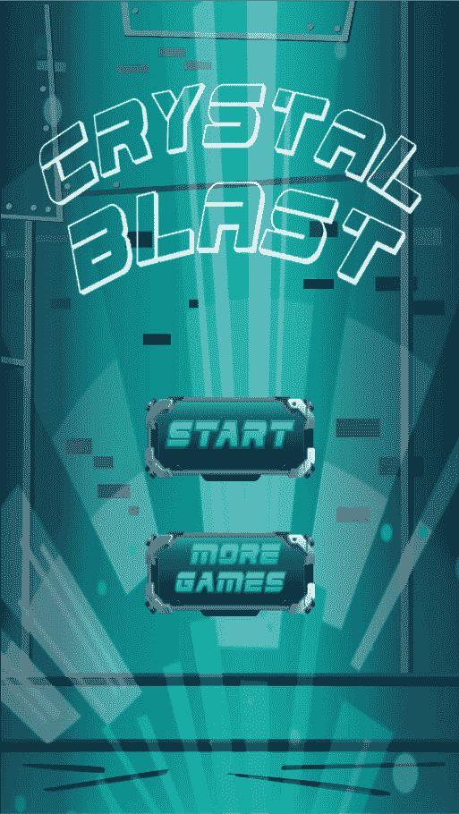
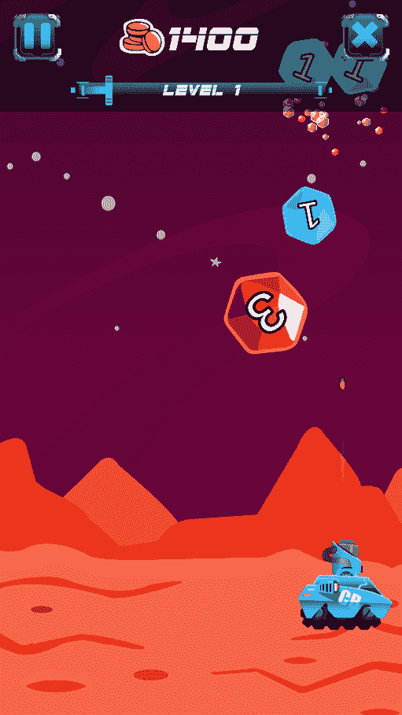
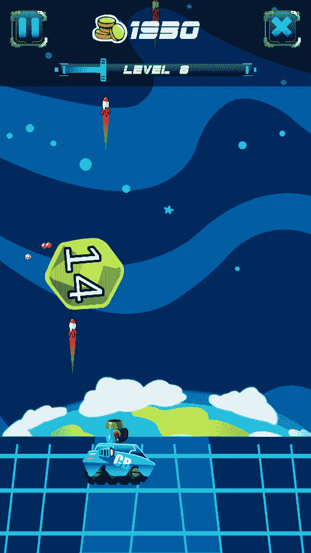
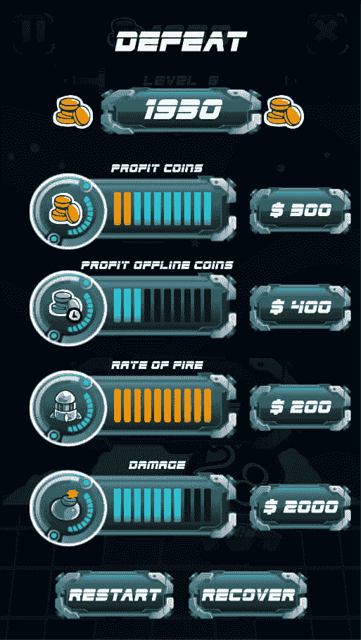

# 水晶爆炸

> 原文：<https://dev.to/balconygames/crystal-blast-9g1>

大家好！

几天前我们发布了新游戏。没有广告，没有报酬，只是为了娱乐。技术问题对我们来说仍然存在，因为游戏开发对我们来说是新的。

简而言之，我们现在还不能解决这个问题，但是社区可能会帮助我们找到问题所在。

我们正在使用 Unity。这是一个非常棒的平台，可以为多种平台快速制作游戏原型。

问题:

*   在使用 Android 发布我们的另一个游戏( [Sweety Jumper](https://play.google.com/store/apps/details?id=com.balconygames.sweetyjumper) )时，我们添加了应用程序购买包和广告包(google ads)。它编译得很好，但在设备上安装后，它没有打开广告，也不可能在生产或测试模式下购买任何东西。有人在 Unity 上为 android 构建时遇到过同样的问题吗？ios 在相同的设备上运行良好。也许有人可以建议如何正确地调试它，我相信这可能是构建 apk 时对 jars 的依赖，但看不到如何解决它的正确方法。

我们的游戏新游戏是[水晶爆炸](https://play.google.com/store/apps/details?id=com.balconygames.CrystalBlast)

寻找支持票的产品:

*   甜甜的跳线[向上](https://www.producthunt.com/posts/sweety-jumper)
*   水晶爆炸[上升](https://www.producthunt.com/posts/crystal-blast)

如果你有时间请回顾游戏，我将不胜感激。

感谢您的阅读！

