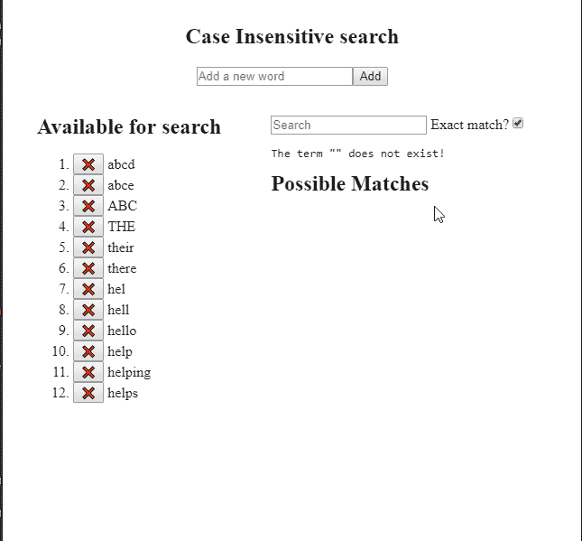

# @cshooks/usetrie，用于 Typeahead/Autocomplete 的 React 挂钩

> 原文：<https://dev.to/dance2die/cshooksusetrie-a-react-hook-for-typeaheadautocomplete-4911>

*图片由[杰米街](https://unsplash.com/photos/MoDcnVRN5JU?utm_source=unsplash&utm_medium=referral&utm_content=creditCopyText)上的[Unsplash](https://unsplash.com/search/photos/retriever?utm_source=unsplash&utm_medium=referral&utm_content=creditCopyText)—“trie”是从[检索](https://en.wikipedia.org/wiki/Trie#History_and_etymology)而来的，因此可爱🐶【寻回犬】*

我已经发布了 [@cshooks/usetrie](https://www.npmjs.com/package/@cshooks/usetrie) 。

这是一个针对[type ahead](https://en.wikipedia.org/wiki/Typeahead)/自动完成的 React 挂钩。

[@cshooks/hooks](https://github.com/cshooks/hooks) 将是家🏠计算机科学数据结构/算法相关的钩子。

## 🤔为什么？

当你有一个想要匹配前缀的文本列表时，你必须一个接一个地匹配数组中的每一个文本，这很费时间。

[Trie](https://en.wikipedia.org/wiki/Trie) 是一种数据结构，它将文本存储在树中，这使得能够快速查找前缀。

和`useTrie`作为[门面](https://en.wikipedia.org/wiki/Facade_pattern)启用快速前缀搜索。

## 🔧怎么会？

查看 [README](https://github.com/cshooks/hooks/blob/master/packages/useTrie/README.md) 文件，其中详细解释了用法。

这里有一些为病人准备的快速演示沙盒。

*   [简单演示添加/删除文本](https://codesandbox.io/s/3jzy58wqq)
*   [字符串/对象数组& Reddit 数据演示](https://codesandbox.io/s/zz2mxlxzp)

<figure> 

<figcaption>德莫斯</figcaption>

</figure>

## ➕附加信息

我最初创建这个是为了学习数据结构，所以`Trie`类是必需的，而`useTrie` hook 被迫适应 React 的声明性，如下所示，这并不理想。