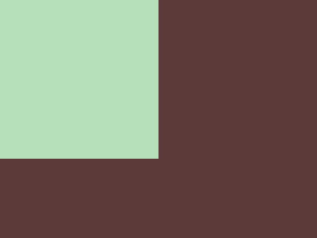

# CSS 战#1 -简单的正方形

> 原文：<https://dev.to/pheeria/css-battle-1-simply-square-c19>

我是那些喜欢认为[只知道 HTML 和 CSS 是不够的](https://medium.com/@mandy.michael/is-there-any-value-in-people-who-cannot-write-javascript-d0a66b16de06)的人之一。我知道，这不公平，我甚至不需要向自己证明什么。CSS 难度极高。至少，对我来说。所以，我决定尝试用它弄脏我的手。幸运的是，这里有[，一个不错的 CSS 挑战互动网站](https://cssbattle.dev/battle/1)。谁不喜欢挑战呢？

只需要给定一个图像就可以重新创建样式表。如果用尽可能少的字符实现，您将获得输出匹配的百分比近似值和额外的分数。

[](https://res.cloudinary.com/practicaldev/image/fetch/s--3Xek_oi1--/c_limit%2Cf_auto%2Cfl_progressive%2Cq_auto%2Cw_880/https://cssbattle.dev/targets/1.png)

在看到第一个问题的最短解决方案后，我决定不再用高分来困扰自己，而是专注于学习部分。如果你想知道为什么，这里有一个解决办法

```
 
```

Enter fullscreen mode Exit fullscreen mode

因为分数要求第一题答案正确，第二题答案简短，所以我更倾向于关注正确与否。由于 CSS 在提供选择方面非常强大，我将尝试对相同的问题给出不同的答案。

## 1。绝对值

第一个非常简单。我们创建一个 200 乘 200 像素的正方形，并给它一个背景色。因为正常的文档流向是从上到下，从左到右，所以正方形应该在屏幕的左上角。但事实并非如此。我们需要删除浏览器的默认边距。移除浏览器的默认设置被称为规范化，有一个出色的库可以做到这一点(什么都有一个库)。我建议通读源代码——它很短，并且有描述性的注释。因为我们只关心边距，所以我们将 body 标记的边距设为零，body 标记也有一个背景色。

```
<div></div>
<style>
  body {
    margin: 0;
    background: #5d3a3a;
  }

  div {
    width: 200px;
    height: 200px;
    background: #b5e0ba;
  }
</style> 
```

Enter fullscreen mode Exit fullscreen mode

## 2。相对值

为了不被硬编码的值束缚，我们可以用`calc(100vw / 2)`代替宽度，用`calc(100vh * 2 / 3)`代替高度。

```
<div></div>
<style>
  body {
    margin: 0;
    background: #5d3a3a;
  }

  div {
    width: calc(100vw / 2);
    height: calc(100vh * 2 / 3);
    background: #b5e0ba;
  }
</style> 
```

Enter fullscreen mode Exit fullscreen mode

允许我们在同一个计算中混合不同的单位。或者因为宽度明显，可以直接写成`50vw`。`66vh`因为身高不会被接受为正确答案。`66.6vh`然会。

## 3。边境

到目前为止，这些解决方案都遵循着几乎相同的逻辑，只是在大小计算上有所不同。这是另一种方法。如果我们可以放置相同的正方形，但这次不是给身体背景着色，而是创建一个边框，会怎么样？

```
<div></div>
<style>
  div {
    margin: -8px;
    width: 200px;
    height: 200px;
    background: #b5e0ba;
    border-right: 200px solid #5d3a3a;
    border-bottom: 200px solid #5d3a3a;
  }
</style> 
```

Enter fullscreen mode Exit fullscreen mode

将这里的边距设置为负值只是为了消除默认边距对[的影响，并避免设计两个标签的样式。](https://dxr.mozilla.org/mozilla-central/source/layout/style/res/html.css)

## 4。方框阴影

最后一个灵感来自最短的解决方案。显然，复制现有的物体来创建*阴影*是可能的。`box-shadow`顾名思义，是用来制造订书钉效果的。甚至有一个[发电机！](https://developer.mozilla.org/en-US/docs/Web/CSS/CSS_Background_and_Borders/Box-shadow_generator)前两个值是 X 和 Y 偏移，可以是负值。第三个是模糊半径。颜色之前的最后一个是扩展半径，它负责缩放，在我们的例子中，我任意设置了一个足够大的值来覆盖整个`400 x 300`屏幕。

```
<div></div>
<style>
  div {
    margin: -8px;
    width: 50vw;
    height: 66.6vh;
    background: #b5e0ba;
    box-shadow: 0 0 0 200px #5d3a3a;
  }
</style> 
```

Enter fullscreen mode Exit fullscreen mode

你更喜欢这些解决方案中的哪一个？你还知道其他人吗？