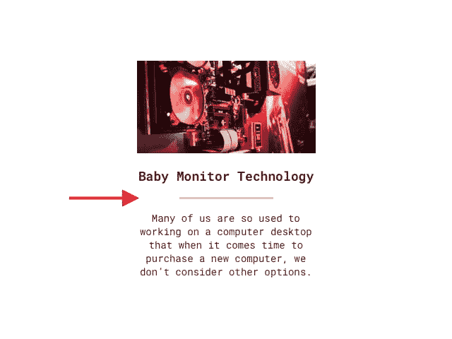

# CSS 边框长度

> 原文：<https://dev.to/iamfrntdv/css-border-length-width-m85>

[](https://res.cloudinary.com/practicaldev/image/fetch/s--6rLIryQQ--/c_limit%2Cf_auto%2Cfl_progressive%2Cq_auto%2Cw_880/https://thepracticaldev.s3.amazonaws.com/i/2kcf753lf4jnjrdu8f16.jpg)

CSS 很棒，很简单，真的很容易理解。当然，尽管它很棒，但它仍然有一些缺失的功能，例如范围。但是在这篇小文章中，我想提出解决一个小问题。

我想我们中的许多人都遇到过这样的情况:边框必须比它的父元素本身短得多。不幸的是，用 border 解决这个问题是不可能的，在我看来，border 可以更容易、更好。目前解决这个问题的唯一方法是使用一些其他的帮助元素(hr、span、div 等)。)或伪元素:

```
.title {
    font-size: 24px;
    margin: 0 0 10px;
    padding: 0 0 10px;
    position: relative;
}

.title::after {
    background-color: #efefef; 
    bottom: 0;
    content: '';
    display: block;
    height: 1px;
    left: 50%;
    position: absolute;
    transform: translate(-50%,0);
    width: 50px;
} 
```

Enter fullscreen mode Exit fullscreen mode

如你所见，这不是最差的解决方案，但也不是最好的。

我认为对于这种情况可以有一个更好的解决方案-边界长度。
如果有可能这样做呢:

```
.title {
    border-bottom-length: 50px;
    border-bottom-color: #efefef;    
    border-bottom-width: 1px;
    border-bottom-style: solid;
    font-size: 24px;
    margin: 0 0 10px;
    padding: 0 0 10px;
} 
```

Enter fullscreen mode Exit fullscreen mode

对我来说，这个解决方案看起来更干净。当然还有人手短缺...

你怎么想呢?