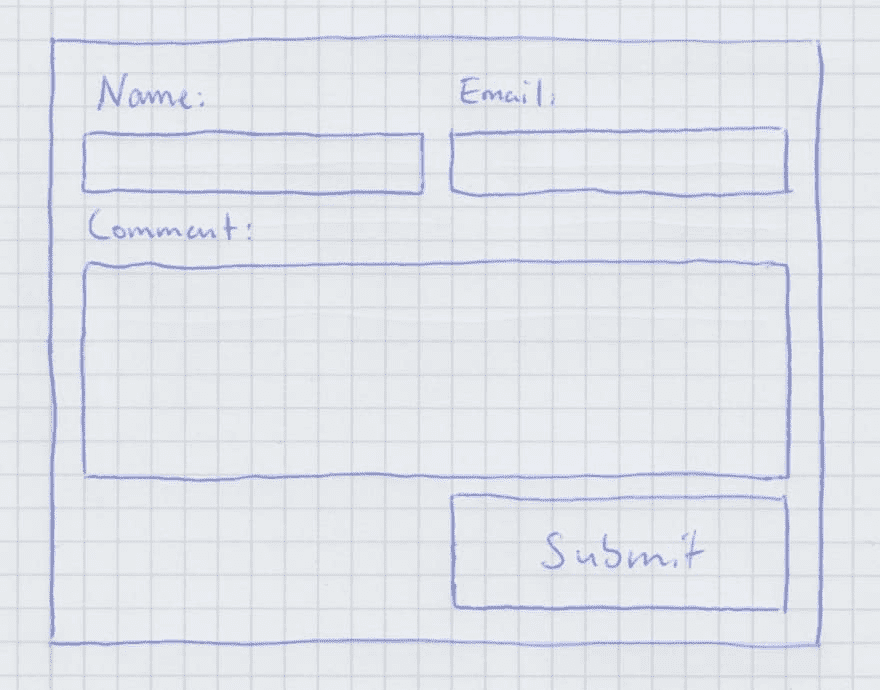
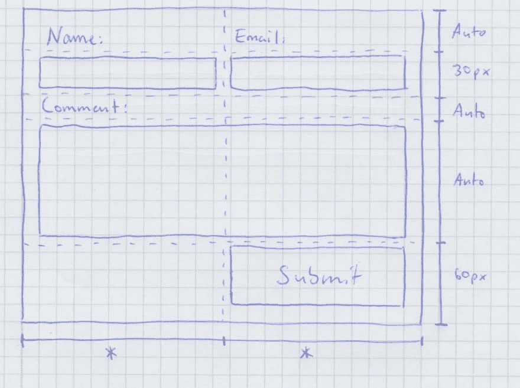
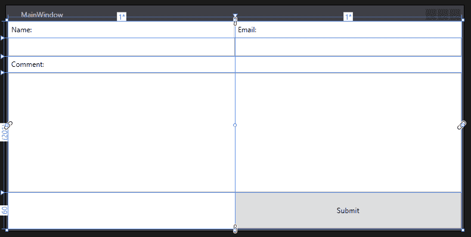

# 面向 WPF/XAML 开发者的 CSS 网格简介

> 原文：<https://dev.to/kuperadrian/css-grid-intro-for-wpfxaml-developers-2foo>

这篇文章试图向那些已经熟悉 WPF/XAML 网格布局的人解释 CSS 网格特性。XAML 网格布局非常酷，因为它使得定义复杂的用户界面非常简单直接。另一方面，对于 CSS，我总是觉得有必要使用 CSS 框架，以便有信心做出看起来合适的 ui。但不会再有了！CSS 网格几乎一对一地将 XAML 网格布局的魅力带到了 web 上，这使得用 HTML + CSS 构建复杂的布局最终变得易于管理。所以让我们开始吧。

# 示例实物模型

让我们来看一个简单的评论条目表单模型，我们将使用它作为示例:

[](https://res.cloudinary.com/practicaldev/image/fetch/s--Hd2iCCkF--/c_limit%2Cf_auto%2Cfl_progressive%2Cq_auto%2Cw_880/https://thepracticaldev.s3.amazonaws.com/i/2fd2t70aqqoq6t1fyug8.jpeg)

首先，我们将看到如何使用 XAML 网格布局来实现这一点。然后，我们将使用 HTML + CSS 网格构建相同的 UI，以便于比较这两种方法。

# 利用 XAML

每当我看到一个我必须用 XAML 实现的用户界面的模型时，我首先试图弄清楚界面的“网格”,并把它画到模型中。对于我们的示例，网格可能如下所示:

[](https://res.cloudinary.com/practicaldev/image/fetch/s--CYXYe9T8--/c_limit%2Cf_auto%2Cfl_progressive%2Cq_auto%2Cw_880/https://thepracticaldev.s3.amazonaws.com/i/o8708r2eflb8czabsh55.jpeg)

从这一点来看，使用 XAML 网格布局来翻译这张图片是简单明了的，即使对于那些并不真正了解 XAML 的人来说也应该是可以理解的

```
<Grid>
    <!-- First, we define our grid -->
    <Grid.RowDefinitions>
        <RowDefinition Height="Auto" />
        <RowDefinition Height="30" />
        <RowDefinition Height="Auto" />
        <RowDefinition Height="Auto" />
        <RowDefinition Height="60" />
    </Grid.RowDefinitions>
    <Grid.ColumnDefinitions>
        <ColumnDefinition Width="*" />
        <ColumnDefinition Width="*" />
    </Grid.ColumnDefinitions>

    <!-- then we add all ui items at their respective position -->
    <Label Grid.Column="0" Grid.Row="0" Content="Name:" />
    <Label Grid.Column="1" Grid.Row="0" Content="Email:" />

    <TextBox Grid.Column="0" Grid.Row="1" />
    <TextBox Grid.Column="1" Grid.Row="1" />

    <Label Grid.Column="0" Grid.Row="2" Content="Comment:" />

    <!-- something like an text area -->
    <TextBox Grid.Column="0" 
             Grid.ColumnSpan="2" 
             Grid.Row="3"
             Height="200"
             TextWrapping="Wrap"
             AcceptsReturn="True" />

    <Button Grid.Column="1" Grid.Row="4" Content="Submit" />
</Grid> 
```

Enter fullscreen mode Exit fullscreen mode

结果是:

[](https://res.cloudinary.com/practicaldev/image/fetch/s--R6yYMtsQ--/c_limit%2Cf_auto%2Cfl_progressive%2Cq_auto%2Cw_880/https://thepracticaldev.s3.amazonaws.com/i/laaxq7mt4bfyq90w2k0m.PNG)

# 现在用 CSS 网格

CSS 网格很酷的一点是，它们的使用非常类似于 XAML 网格布局，这意味着如果你对 XAML 很熟悉，你很快就会适应 CSS 网格。

首先，让我们来看看复制我们想要创建的 UI 所必需的 HTML:

```
<div id="container">
  <div id="name-label">Name:</div>
  <div id="email-label">Email:</div>

  <input id="name-txtbox" type="text" />
  <input id="email-txtbox" type="text" />

  <div id="comment-label">Comment:</div>

  <textarea id="comment-txtarea" rows=10></textarea>

  <button id="submit-btn" type="button">Submit</button>
</div> 
```

Enter fullscreen mode Exit fullscreen mode

看起来并不复杂，但与 XAML 不同的是，标记中没有任何关于网格的内容。嗯，这不是所谓的 *CSS* 网格没有意义。网格的行和列，以及网格中 UI 项的位置都是在`css`文件中定义的:

```
/* "#" selects an item inside the html by their id */
#container {
  display: grid; /* with this we declare our container as a grid */

  grid-template-columns: 1fr 1fr; /* two columns, equal width */
  grid-template-rows: auto 30px auto auto 60px; /* 5 rows */
}

#name-label {
  grid-column: 1;
  grid-row: 1;
}

#email-label {
  grid-column: 2;
  grid-row: 1;
}

#name-txtbox {
  grid-column: 1;
  grid-row: 2;
}

#name-txtbox {
  grid-column: 2;
  grid-row: 2;
}

#comment-label {
  grid-column: 1;
  grid-row: 3;
}

#comment-txtarea {
  grid-column-start: 1;
  grid-column-end: span 2; /* span both columns */
  grid-row: 4;
}

#submit-btn {
  grid-column: 2;
  grid-row: 5;
} 
```

Enter fullscreen mode Exit fullscreen mode

首先，我们选择我们的“容器”——div 元素，将其声明为网格，并将行和列设置为与 XAML 几乎相同(`1fr`几乎等于`*`、`auto`等于`Auto`、`30px`和`60px`不言自明)。之后，我们只需选择网格中的 UI 项目，并使用`grid-column`和`grid-row`给它们在网格中指定位置。

看看我创建的这个 [CodePen](https://codepen.io/kuper-adrian/pen/yGVdZN/) 看看结果。

总而言之，下表全面展示了 XAML 网格布局中的某些元素是如何“转换”到 CSS 网格中的:

| XAML | CSS 网格 |
| --- | --- |
| `<Grid>` | `<div id="foo">` + `#foo { display: grid; }` |
| *, 2* | 1fr，2fr |
| 汽车 | 汽车 |
| `<RowDefinitions>` | 网格-模板-行: |
| `<ColumnDefinitions>` | 网格-模板-列: |
| 网格。排 | 网格行: |
| 网格。RowSpan | 网格-行-开始:+网格-行-结束: |
| 网格。圆柱 | 网格-柱形图: |
| 网格。列跨度 | 网格-列-开始:+网格-列-结束: |

很简单，对吧？CSS 网格让我能够重用我在 XAML 网格布局方面的知识和经验，最终让我能够轻松地使用 HTML + CSS 构建复杂的 UI 布局，而不需要像 Bootstrap 这样的 CSS 框架。此外，它们还有一些 XAML 网格布局所没有的额外功能，例如命名区域，你绝对应该查看一下。一旦你被 CSS 网格说服并想了解它们，看看[这本令人敬畏的完整指南](https://css-tricks.com/snippets/css/complete-guide-grid/)。