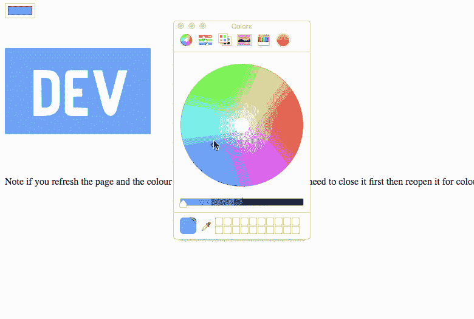

# CSS 掩码属性

> 原文：<https://dev.to/nickytonline/css-mask-property-2d42>

假设您有一个想要某种颜色的背景，但是您只想显示背景的一部分。进入 [CSS `mask`属性](https://developer.mozilla.org/en-US/docs/Web/CSS/mask)。把它想象成一个饼干切割器。你想烤一块饼干，而不是一块长方形的面团。那么，这如何适应网络上的真实世界的例子呢？

你是否有过这样的经历:你喜欢一个图标，并想放在你的网站上，但是就像“如果我能把它和我的网站的颜色结合起来，看起来会好很多”？CSS `mask`属性来拯救。正如你所看到的，如果你与下面的[笔](https://codepen.io)交互，当你通过拾色器改变颜色时，图标的颜色，在这个例子中 [dev.to](https://dev.to) ，将只应用背景色到 SVG 的填充部分。向[simpleicons.org](https://simpleicons.org)喊出开发图标！

如果你想看它的运行，看看我的网站菜单上的图标，[iamdeveloper.com](https://www.iamdeveloper.com)。

对 CSS mask 属性的支持非常好，除非你仍然需要支持 Internet Explorer。如果是这种情况，快速谷歌将为您提供一些后备选项。

此外，这篇博文还有一点好处。我使用 [CSS 变量](https://developer.mozilla.org/en-US/docs/Web/CSS/Using_CSS_variables)和 JavaScript 来改变 logo 的颜色，所以也可以在 codepen 中查看。

*注意:如果你使用的是不支持`<input type="color" />`的浏览器，它会像普通的文本输入一样。你需要输入一个有效的十六进制颜色，然后按下屏幕键盘上的回车键来改变颜色*

找点乐子，在 codepen 中尝试一下吧！👋

[https://codepen.io/nickytonline/embed/ebxrpv?height=600&default-tab=result&embed-version=2](https://codepen.io/nickytonline/embed/ebxrpv?height=600&default-tab=result&embed-version=2)

在 [Unsplash](https://unsplash.com/search/photos/cookie-cutter?utm_source=unsplash&utm_medium=referral&utm_content=creditCopyText) 上由 [Neven Krcmarek](https://unsplash.com/photos/0TH1H1rq_eY?utm_source=unsplash&utm_medium=referral&utm_content=creditCopyText) 拍摄的照片