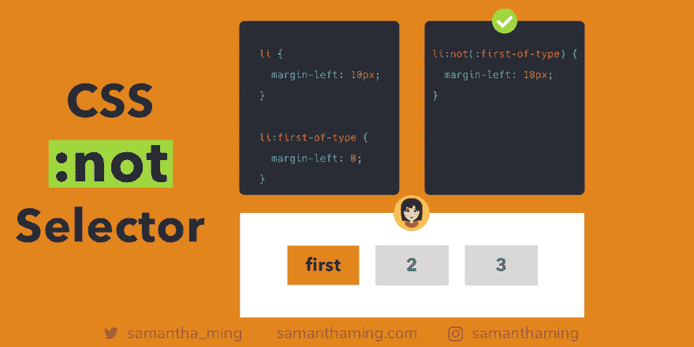

# CSS:非选择器

> 原文：<https://dev.to/samanthaming/css-not-selector-ek2>

[](https://res.cloudinary.com/practicaldev/image/fetch/s--cGCmGNgQ--/c_limit%2Cf_auto%2Cfl_progressive%2Cq_auto%2Cw_880/https://thepracticaldev.s3.amazonaws.com/i/3smwyo3y3xe03yxoo03i.png)

而不是用两个不同的选择器来分配样式，然后用另一个来否定它。使用:not 选择器选择每个元素，除了那些与您传递的参数匹配的元素👍

```
/* ❌ */

li {
  margin-right: 10px;
}

li:first-of-type {
  margin-right: 0;
}

/* ✅ Much Better */

li:not(:first-of-type) {
  margin-right: 10px;
} 
```

## 允许的参数

在当前的草案中，CSS 选择器级别 3，你只能传递简单的选择器作为你的参数。

**简单选择器:**

*   类型选择器
*   通用选择器
*   属性选择器
*   类别选择器
*   ID 选择器
*   伪类

```
/* Type */
h1 {}

/* Universal */
* {}

/* Attribute */
a[title] {}

/* Class */
.parent {}

/* ID */
#demo {}

/* Pseudo-class */
:first-child {} 
```

### CSS 版本化简要说明

就像 JavaScript 或 ECMAScript 如何有不同的版本一样。CSS 也有不同的版本。然而，不像 ECMAScript，所有的东西都在一个大的类别下(ES5，ES6，ES7)，CSS 是分块工作的。

例如，他们有 *CSS 选择器第三级*、 *CSS 网格布局第一级*、 *CSS Flexbox 第一级*。`:not`选择器属于 [CSS 选择器 3 级](https://www.w3.org/TR/selectors-3/)规格。CSS 工作组正在研究的下一个问题是...提示，3 后面是什么...丁丁， [CSS 选择器第 4 级](https://drafts.csswg.org/selectors-4/)😜

Rachel Andrew 写了一篇精彩的文章解释了 CSS 级别，我也在参考资料部分链接了它，如果你感兴趣的话可以读一读🤓

### 传递选择器列表

在当前版本中，您只能传入简单的选择器作为参数。然而，在 CSS 选择器级别 4 中，您将能够传入一个选择器列表。太酷了，对吧👏。

```
/* CSS Selectors Level 3 */
p:not(:first-of-type):not(.special) {}

/* CSS Selectors Level 4 */
p:not(:first-of-type, .special) {} 
```

下面是将要选择的内容

```
<div>
  <p>1</p>
  <p>2</p><!-- selected -->
  <p>3</p><!-- selected -->
  <p class="special">4</p>
  <p>5</p><!-- selected -->
</div> 
```

## 不允许嵌套否定🙈

需要指出的一点是否定可能不是嵌套的。所以这是一个禁忌:

```
:not(:not(...)) {} 
```

## `:first-child` vs `:first-of-type`

让我们从分别定义它们开始:

`:first-child`如果第一个元素是其父元素的第一个子元素，则仅选择该元素。这意味着如果它不是父对象的第一个子对象，则不会选择任何对象。

`:first-of-type`将选择你指定类型的第一个元素。即使它不是其父母的第一个孩子。因此，如果您使用这个选择器，结果总是会出现(除非您选择了一个根本不存在的元素)。

好的，让我们看一些例子。

### 孩子都是同一类型

因为子类型完全相同，所以两者的结果是相同的。

```
<div>
  <p></p> <!-- p:first-child, p:first-of-type -->
  <p></p>
</div> 
```

### 孩子是不同的类型

```
<div>
  <h1></h1>
  <p></p> <!-- p:first-of-type -->
  <p></p>
</div> 
```

**而是**，因为`p`不再是第一个孩子了。如果调用`p:first-child`，什么都不会被选中。

```
<!-- ⚠️ p:first-child ➡️ no element selected -->
<div>
  <h1></h1>
  <p></p>
  <p></p>
</div> 
```

### 选择第一个孩子

所以你可能想知道，如果我不关心类型，我只想选择它的父的第一个孩子。在这种情况下，您可以这样做:

```
.parent :first-child {
  color: blue;
} 
```

```
<div class="parent">
  <h1></h1><!-- selected -->
  <p></p>
  <p></p>
</div> 
```

### 其他类似的 CSS 伪类

这种理解也适用于其他表亲类:

*   `:last-child`和`:last-of-type`
*   `:nth-child`和`:nth-of-type`
*   `:only-child`和`only-of-type`

## 浏览器支持

大多数现代浏览器和 Internet Explorer 9 及更高版本都支持`:not`选择器。

[浏览器兼容性](https://developer.mozilla.org/en-US/docs/Web/CSS/:not#Browser_compatibility)

## 资源

*   [MDN Web Docs - CSS :not](https://developer.mozilla.org/en-US/docs/Web/CSS/:not)
*   [w3schools - CSS :not](https://www.w3schools.com/cssref/sel_not.asp)
*   [W3C - CSS:不是](https://www.w3.org/TR/selectors/#negation)
*   [CSS 招数——CSS:不是](https://css-tricks.com/almanac/selectors/n/not/)
*   [caniuse - CSS :not](https://caniuse.com/#feat=css-not-sel-list)
*   [为什么没有 CSS4 -解释 CSS 等级](https://rachelandrew.co.uk/archives/2016/09/13/why-there-is-no-css4-explaining-css-levels/)
*   w3schools - CSS:第一个孩子
*   w3schools - CSS:第一种类型

* * *

**感谢阅读❤**
问好！[insta gram](https://www.instagram.com/samanthaming/)|[Twitter](https://twitter.com/samantha_ming)|[脸书](https://www.facebook.com/hisamanthaming) | [媒体](https://medium.com/@samanthaming) | [博客](https://www.samanthaming.com/blog)