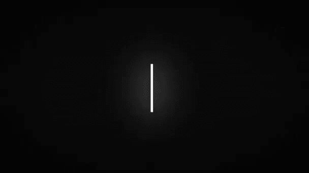

# 光标模仿者

> 原文：<https://dev.to/dhilipkmr/cursor-imitator-2p0j>

[](https://res.cloudinary.com/practicaldev/image/fetch/s--KRuPQsen--/c_limit%2Cf_auto%2Cfl_progressive%2Cq_auto%2Cw_880/https://thepracticaldev.s3.amazonaws.com/i/0p2irzwq6gf6ag9h2aqd.png)

## 那么我们今天要造什么呢？

我们将在这个项目中使用 React 来模拟用户输入效果。

我们最终的**输出**将如下所示:

[](https://res.cloudinary.com/practicaldev/image/fetch/s--CqCyd-uO--/c_limit%2Cf_auto%2Cfl_progressive%2Cq_66%2Cw_880/https://thepracticaldev.s3.amazonaws.com/i/97fibkkcxj4x6lgb9siv.gif)

## 项目概述:

*   组件将描述的**数组作为输入。**
*   组件将有一个**闪烁的文本光标(' | ')。**
*   文本开始以**指定的延迟出现在屏幕上。**
*   光标**随着类型文本沿着**移动。
*   光标**在句子结束时闪烁**一会儿。
*   最后一句的结尾没有光标闪烁。

[](https://i.giphy.com/media/aAkNru67Hh40E/giphy.gif)T3】

```
import React from 'react';
import PropTypes from 'prop-types';

class CursorImitator extends React.Component {

  static defaultProps = {
    content: [],
    nextLetterTime: 50,
    waitAtEnd: 500,
    waitAtStart: 200,
    blinkSpeed: 130,
    letterWrapClass: ''
  }

  constructor(props) {
    super(props);
    this.loadIntro = this.loadIntro.bind(this);
    this.loadCursorBlink = this.loadCursorBlink.bind(this);
    this.clearAllTimeoutsAndIntervals = this.clearAllTimeoutsAndIntervals.bind(this);
    this.state = {
      mounted: false
    };
    this.ttw = 0;             // Time to Wait.
    this.timeoutList = [];    // List of all timeouts triggered.
  }

  componentDidMount() {
    this.setState({ mounted: true });
  }

  loadIntro(content) {
    const contentLast = content.length - 1;
    return(
      <div>
        {
          content.map((sentence, index) => {
            const refName = 'line_' + index;
            const isLast = contentLast === index;
            return (
              <div ref={refName} className={this.props.letterWrapClass}>
                {this.state.mounted && this.loadLetter(sentence, refName, isLast)}
              </div>
            )
          })
        }
      </div>
    )
  }

  render() {
    const {content, className, style} = this.props;
    return (
      <div className={className} style={style}>
        {this.loadIntro(content)}
      </div>
    );
  }
} 
```

Enter fullscreen mode Exit fullscreen mode

### 那么到目前为止我们做了什么？

*   如果未提供，则`defaultProps`具有属性的初始值。
    *   `content` -描述的数组。每个索引存储一个要出现的句子。
    *   `nextLetterTime` -下一个字母出现之前的时间。
    *   `waitAtEnd` -每句话结束时等待的时间。
    *   `waitAtStart` -每句话开始前等待的时间。
    *   `blinkSpeed` -光标出现和再次出现的时间【闪烁】。
    *   `letterWrapClass` -为`<div>`包装句子的类。
*   `constructor()`
    *   `this.ttw` -等待时间是一个实例变量，因为它必须被持久化。
    *   `this.timeoutList` -所有触发的超时列表，以便我们在需要时清除。
*   `render()` -负载`loadIntro()`
*   `loadIntro()` -对于每一个句子，我们迭代并加载字母，但是只有当组件已经被**安装时。**这是因为我们需要对每个句子的引用，它们只有在组件被安装后才会被创建。我们利用对每个句子的 div 的引用来更新它，而不是把它作为一个**状态变量。**

### 接下来:一个字母一个字母地加载

```
loadLetter(sentence, refName, isLastSentence) {
    /* To retain content when accessed from within setTimeout */
    let sentenceLength = sentence.length;
    sentence.split('').forEach((letter, index) => {
      let nextLetter = letter;
      let ttw = this.ttw++;
      let reference = refName;
      const {nextLetterTime, waitAtEnd, waitAtStart} = this.props;
      let self = this;
      let currIndex = index;
      /* To create a Blink at the start of every Sentence */
      if (index === 0) {
        this.loadCursorBlink(self.refs[reference], this.ttw);
        this.ttw = this.ttw + (waitAtStart / nextLetterTime);
        ttw = this.ttw;
      }
      const nextTimeout = setTimeout(() => {
        if (self.interval) {
          clearInterval(self.interval);       // Clear any previous Intervals and removing blink
        }
        if (currIndex === 0 && self.refs && self.refs[reference]) { // Adding '|' in the beginning of every sentence and  inserting incoming texts before that
          self.refs[reference].innerText = '|';
        }
        if (nextLetter === '  ' && self.refs && self.refs[reference]) {  // Handling space
          return self.refs[reference].innerHTML = self.refs[reference].innerHTML.substring(0, self.refs[reference].innerHTML.length - 1) + ' |';
        } else if (self.refs && self.refs[reference]) {                 // adding next digit
          return self.refs[reference].innerText = self.refs[reference].innerText.substring(0,self.refs[reference].innerText.length - 1) + nextLetter + '|';
        }
      }, ttw * nextLetterTime);  // incremented value for every sentence
      this.timeoutList.push(nextTimeout); // To clear it all at once if required
      if (index === sentenceLength - 1) {
        /* To create a Blink at the End of every Sentence */
        this.loadCursorBlink(this.refs[reference], this.ttw, true, isLastSentence);
        this.ttw = this.ttw + (waitAtEnd / nextLetterTime);
      }
    })
  } 
```

Enter fullscreen mode Exit fullscreen mode

`loadLetter()`接受 3 个参数。

*   是出现在单独一行的句子。
*   获取对 div 的引用，它应该在该 div 上加载内容。
*   `islastSentence`用于避免载入结束时闪烁的光标。

> 这里我们应该小心**闭包**，因为我们将对父作用域中的每个字母使用`settimeout`。所以我们使用`let`和`const`来保持它们与`setTimeout`的绑定。

```
this.ttw = this.ttw + (waitAtStart / nextLetterTime); 
```

Enter fullscreen mode Exit fullscreen mode

*   `waitAtStart/nextLetterTime`给出下一个字母必须出现的迭代次数。
*   我们为每个字母增加`this.ttw`。每个字母出现的时间是其在`this.ttw`和`nextLetterTime`中位置的倍数
*   进行检查是因为每当我们造一个新句子时，光标会在开头闪烁一会儿。我们计算新的`this.ttw`,它应该是在眨眼时间到期之后。

*   `nextTimeout`保存当前触发的超时，该超时在所需时间过去后触发。并且被推入`this.timeoutList`以便稍后能够清除。

    *   这里我们清除任何先前的`self.interval`如果存在，这确保闪烁没有发生。`this.interval`保存创建的闪烁间隔。
    *   检查是否在每句话首添加“|”，并在此之前插入来信。
*   如果我们到达了句子的末尾，最后一次检查就完成了。如果是，我们可以闪烁光标。

```
loadCursorBlink(ref, ttw, end, isLastSentence) {
  let reference = ref;
  let self = this;
  let isEnd = end;
  const {nextLetterTime, blinkSpeed} = this.props;
  const nextTimeOut = setTimeout(() => {
    if (self.interval) {
      clearInterval(self.interval);
      // 'self.lastReference' stores last shown sentence's reference, we remove the '|' symbol before creating a new interval
      if (self.lastReference && self.lastReference.innerText.substring(self.lastReference.innerText.length-1) === '|') {
        self.lastReference.innerText = self.lastReference.innerText.substring(0, self.lastReference.innerText.length - 1);
      }
    }
    if (!isLastSentence) {
      self.interval = setInterval(() => {
        self.lastReference = reference;
        if (isEnd) {
          if (reference.innerText.substring(reference.innerText.length - 1) === '|') {
            reference.innerText = reference.innerText.substring(0, reference.innerText.length - 1);
          } else if (reference.innerText.substring(reference.innerText.length - 1) !== '|') {
            reference.innerText = reference.innerText + '|';
          }
        } else {
          if (reference.innerText === '|') {
            reference.innerText = '';
          } else if (reference.innerText === '') {
            reference.innerText = '|';
          }
        }
      }, blinkSpeed);
    }
  }, ttw * nextLetterTime);
  this.timeoutList.push(nextTimeOut);
} 
```

Enter fullscreen mode Exit fullscreen mode

[](https://i.giphy.com/media/ZUyfp4MH7dzwc/giphy.gif)

`loadCursorBlink()`接受 4 个参数。对 div 的引用、等待时间、句子结尾以及是否是最后一句话。

*   对于这种方法，保持闪烁出现和消失的时间。
*   `nextTimeout`保存当前触发的超时，该超时在所需时间过去后触发。并且被推入`this.timeoutList`以便稍后能够清除。
    *   这里我们清除任何以前的间隔，如果 present & `self.lastReference`存储了最后显示的句子的引用，我们在创建新的间隔之前删除“|”符号。
*   如果不是最后一句话，那么我们启动间隔，按照给定的`blinkSpeed`产生眨眼。
*   我们在一个句子中所有字母的末尾和第一个字母的开头处理 blink。

```
 componentWillUnmount() {
  this.clearAllTimeoutsAndIntervals()
}

clearAllTimeoutsAndIntervals() {
  if (this.timeoutList) {
    this.timeoutList.forEach((timeout) => {
      clearTimeout(timeout);
    });
  }
  clearInterval(this.interval);
} 
```

Enter fullscreen mode Exit fullscreen mode

`clearAllTimeoutsAndIntervals()`如果组件在所有触发的超时启动之前被卸载，帮助清除所有间隔。

点击查看全部代码

## 乡亲们都到齐了！！！