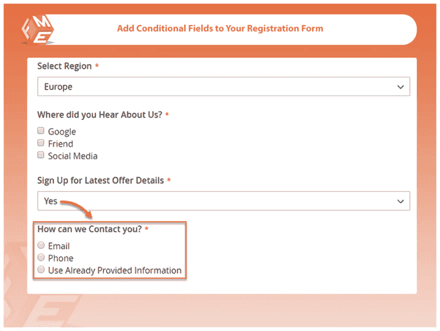
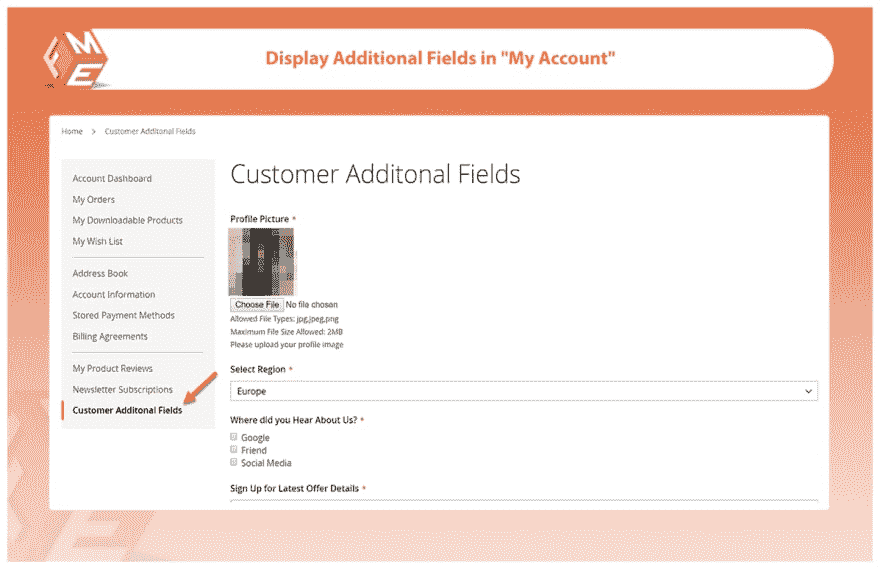
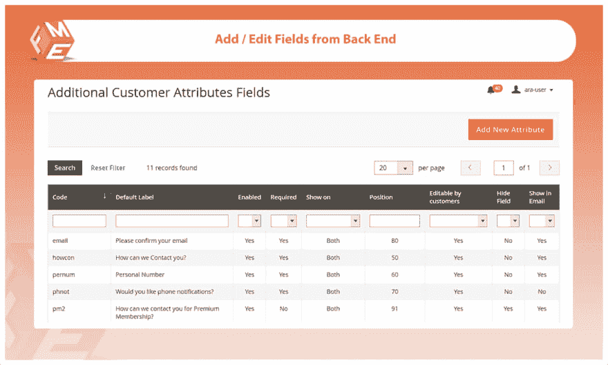
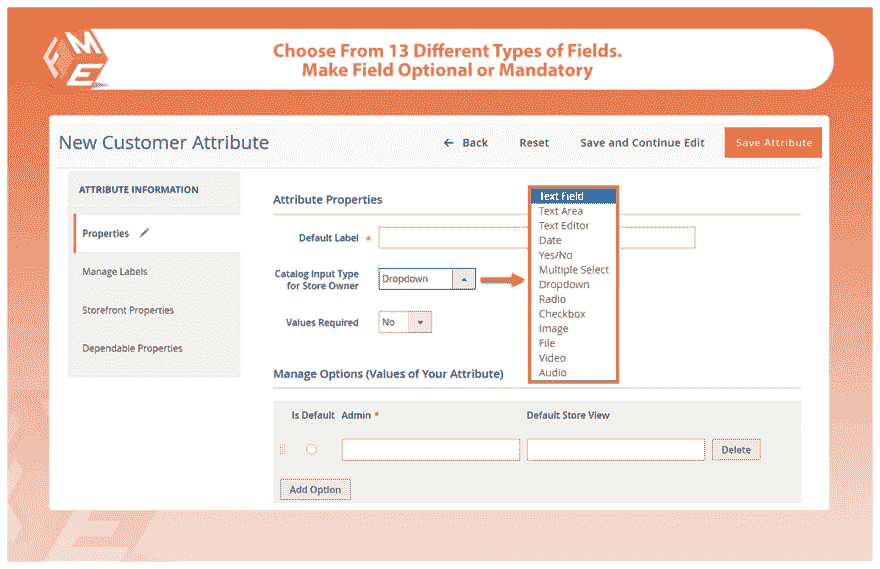
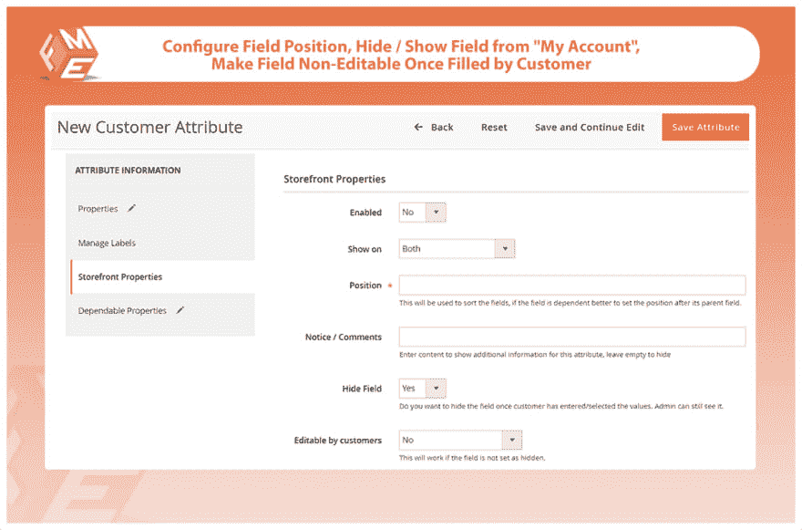
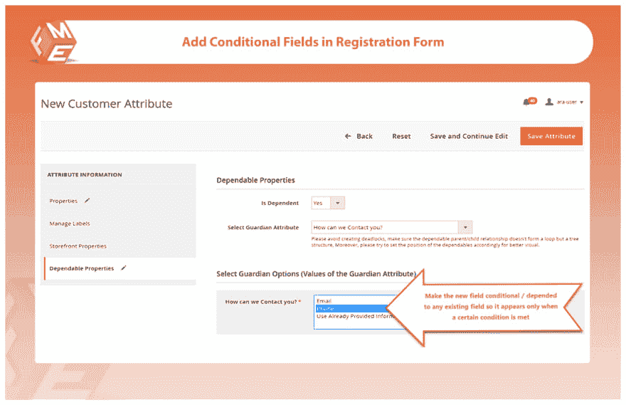

# Magento 2 的自定义注册字段

> 原文：<https://dev.to/simonwalkerfme/custom-registration-fields-for-magento-2-4iac>

Magento 2 自定义注册表单字段允许您在商店/网站的注册表单中添加额外的字段

从各种选定的字段中你可以选择任何一个。

*   文件上传
*   图像上传
*   文本
*   日期
*   消息
*   无线电选项

## **主要特征**

**向注册页面添加无限制的自定义字段
位置&在注册表单的任意位置对字段进行排序
添加多级可靠字段
支持 13 种类型的字段
使字段成为强制或可选字段
配置字段的数据输入验证
在注册电子邮件中显示/隐藏新字段&“我的帐户”
通过商店视图限制附加字段
使字段在客户输入数据后不可编辑**

### **向注册页面添加无限的自定义字段**

通过使用这个扩展，您可以添加无限的自定义字段到注册页面，以获得关于客户的附加信息。通过获取额外信息，你开始了解顾客的需求、偏好和需要。

### **定位&在注册表的任意位置排序字段**

您可以设置位置，并按逻辑顺序对它们进行排序，如下所示

*   城市
*   状态
*   邮政区码
*   国家

### **增加多级依赖字段**

该扩展允许您在表单中添加多级可靠字段

### **支持 13 种类型的字段**

您可以在表单中添加以下 13 种类型的附加字段，

*   文本字段
*   文本区域
*   文件上传
*   图像上传
*   日期
*   掉下
*   多重选择
*   是/否选项
*   收音机
*   复选框
*   文字编辑器
*   音频上传
*   视频上传

### **将字段设为强制或可选**

您可以将该字段设置为必填或可选。必填字段将用红星符号表示

### **为字段**配置数据输入验证

您可以配置数据验证，以确保从用户那里收集准确的信息。

### **显示/隐藏注册邮件中的新字段&“我的帐户”**

您可以根据自己的需要和要求管理自定义字段。您可以随时显示或隐藏附加的自定义字段。

### **通过商店视图限制附加字段**

您可以通过商店视图限制附加字段。

### **一旦客户输入数据，使字段不可编辑**

输入一次数据后，可以将字段设置为不可编辑。

**完成细节&演示-****T3】magento 2 添加客户属性 T5】**

