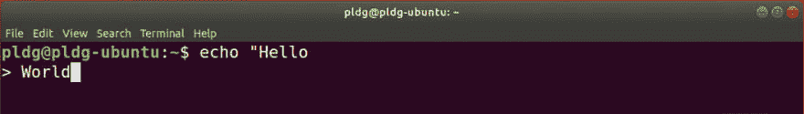
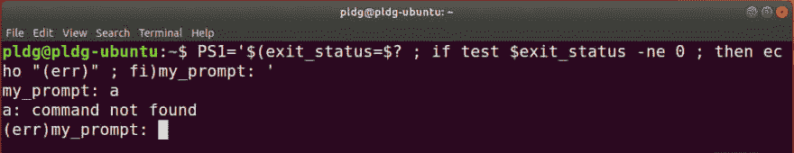
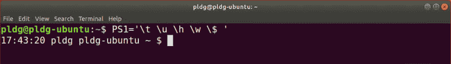
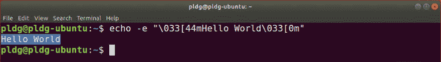
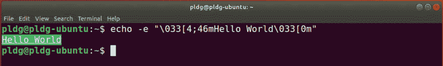
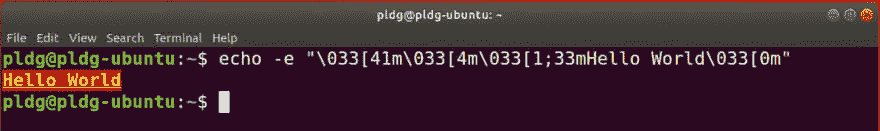
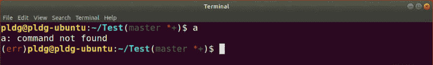

# 自定义外壳提示

> 原文：<https://dev.to/pldg/customize-shell-prompt-2bpa>

改变终端 [shell 提示符](https://en.wikibooks.org/wiki/Guide_to_Unix/Explanations/Shell_Prompt)的外观:自定义颜色、文本格式，并动态显示其他类型的信息(包括 git 状态)。

我们将在 Ubuntu 上使用 bash，但大多数概念也可以应用于其他基于 unix 的系统(例如 MacOS 和 Linux 的 Windows 子系统)。

## 提示变量

Bash 有四种由这些变量控制提示类型:

*   `PS1`主要提示。
*   当你需要键入更多命令时显示(多行命令)。
*   `PS3`当选择命令等待输入时显示。
*   `PS4`调试 Bash 脚本时显示。

如果你`echo $PS1`你会看到一串字符序列:

```
\[\e]0;\u@\h: \w\a\]${debian_chroot:+($debian_chroot)}\[\033[01;32m\]\u@\h\[\033[00m\]:\[\033[01;34m\]\w\[\033[00m\]\$ 
```

Enter fullscreen mode Exit fullscreen mode

当您进入一个交互式 shell 会话时，shell 读取`PS1`并输出如下内容:

```
username@hostname:directory$ 
```

Enter fullscreen mode Exit fullscreen mode

结尾的美元符号`$`表示你是一个普通用户，对于根用户，它被替换为散列符号`#`。

如果您选择`echo $PS2`，它将只显示大于号`>`符号。

在下面的截图中可以看到`PS1`和`PS2`:

[](https://res.cloudinary.com/practicaldev/image/fetch/s--e2STSGdo--/c_limit%2Cf_auto%2Cfl_progressive%2Cq_auto%2Cw_880/https://user-images.githubusercontent.com/24630716/54070240-cff76700-425d-11e9-963c-6ad444de4146.png)

`PS3`和`PS4`提示不是很常见。在本指南中，我们将重点关注主要提示。

## 改变提示

要控制主要提示的输出，请编辑`PS1`变量:

```
PS1='my_prompt: ' 
```

Enter fullscreen mode Exit fullscreen mode

[](https://res.cloudinary.com/practicaldev/image/fetch/s--XUe_MVKN--/c_limit%2Cf_auto%2Cfl_progressive%2Cq_auto%2Cw_880/https://user-images.githubusercontent.com/24630716/54074429-bf151880-4292-11e9-97bf-8a4a2cf98308.png)

因为`PS1`在 Bash 中被直接替换了，所以在 shell `exit`上的更改会消失。在本指南的后面，我们将学习如何使这种改变永久化。

## 嵌入命令

您可以在`PS1`变量:
中运行命令

```
PS1='$(exit_status=$? ; if test $exit_status -ne 0 ; then echo "(err)" ; fi)my_prompt: ' 
```

Enter fullscreen mode Exit fullscreen mode

如果退出代码不等于`0`，它将显示`(err)`。

[](https://res.cloudinary.com/practicaldev/image/fetch/s--mXCEOHzM--/c_limit%2Cf_auto%2Cfl_progressive%2Cq_auto%2Cw_880/https://user-images.githubusercontent.com/24630716/54114732-555c5200-43eb-11e9-9e7b-f5cb70b0e96e.png)

## 反斜杠-转义字符

有一些反斜杠转义的特殊字符可以用来在提示中动态显示有用的信息。

例如:

```
PS1='\t \u \h \w \$ ' 
```

Enter fullscreen mode Exit fullscreen mode

*   `\t`显示时间。
*   `\u`显示用户名。
*   `\h`显示主机名。
*   `\w`显示当前工作目录。
*   `\$`普通用户显示美元 *$* 符号；如果你是根用户，显示散列 *#* 符号。

[](https://res.cloudinary.com/practicaldev/image/fetch/s--lIriI6cr--/c_limit%2Cf_auto%2Cfl_progressive%2Cq_auto%2Cw_880/https://user-images.githubusercontent.com/24630716/54074447-dce27d80-4292-11e9-9792-800e95b857f6.png)

这里是一个完整的[反斜杠转义字符](https://ss64.com/bash/syntax-prompt.html)的列表。

## ANSI 转义序列

Bash 允许用户调用一系列的 [ANSI 转义序列](https://en.wikipedia.org/wiki/ANSI_escape_code)来改变终端窗口的颜色、文本格式、光标位置和其他选项。这些序列是一组不可打印的[控制字符](https://en.wikipedia.org/wiki/ASCII#Control_characters)，shell 将其解释为命令。

ANSI 转义序列总是以一个转义字符和一个左括号字符开始，后跟一个或多个控制字符:

```
ESC[COMMAND 
```

Enter fullscreen mode Exit fullscreen mode

*   转义符`ESC`可以写成`\033`或者`\e`或者`\x1b`。
*   `COMMAND`是控制字符。

所有可用命令见 ANSI 序列列表(某些终端可能部分支持 ANSI 序列)。

## 颜色和文本格式

为了给文本终端的输出着色，使用下面的 ANSI 序列:

```
ESC[CODEm 
```

Enter fullscreen mode Exit fullscreen mode

其中`CODE`是一系列一个或多个分号分隔的颜色代码。

例如:

```
echo -e "\033[44mHello World\033[0m" 
```

Enter fullscreen mode Exit fullscreen mode

*   `-e`启用`echo`解析转义序列。
*   标记 ANSI 序列的开始。
*   `44`是蓝色背景的代码。
*   `m`标记颜色代码的结束。
*   `0`删除所有文本属性(格式和颜色)。重置属性很重要，否则样式将应用于 *Hello World* 之后的所有文本(包括提示和我们键入的文本)。

[](https://res.cloudinary.com/practicaldev/image/fetch/s--KGj8brWX--/c_limit%2Cf_auto%2Cfl_progressive%2Cq_auto%2Cw_880/https://user-images.githubusercontent.com/24630716/54041392-e7841080-41c7-11e9-8d1c-52ac7bc0e168.png)

您也可以通过在基本值前设置“属性”来修改颜色，用分号`;`分隔。

所以如果你想要一个绿色背景(`46`)加下划线文本(`4`)，顺序是:

```
echo -e "\033[4;46mHello World\033[0m" 
```

Enter fullscreen mode Exit fullscreen mode

[](https://res.cloudinary.com/practicaldev/image/fetch/s--MvecnW4Z--/c_limit%2Cf_auto%2Cfl_progressive%2Cq_auto%2Cw_880/https://user-images.githubusercontent.com/24630716/54275170-4069f500-458a-11e9-81fc-562e18ebabef.png)

您可以将多个序列组合在一起:

```
echo -e "\033[41m\033[4m\033[1;33mHello World\033[0m" 
```

Enter fullscreen mode Exit fullscreen mode

[](https://res.cloudinary.com/practicaldev/image/fetch/s--iX67Bki6--/c_limit%2Cf_auto%2Cfl_progressive%2Cq_auto%2Cw_880/https://user-images.githubusercontent.com/24630716/54275994-698b8500-458c-11e9-9177-f966510776b5.png)

在这里你可以找到所有[颜色代码](https://stackoverflow.com/a/33206814/)的列表。

## 永久保存提示修改

要使更改永久化，您可以修改默认的`PS1`变量或在 *~/的末尾添加一个新变量。巴沙尔*文件:

```
PS1='$(exit_status=$? ; if test $exit_status -ne 0 ; then echo -e "(\[\033[31m\]err\[\033[0m\])${debian_chroot:+($debian_chroot)}" ; else echo ${debian_chroot:+($debian_chroot)} ; fi)\[\033[1;33m\]\u@\h\[\033[0m\]:\[\033[1;36m\]\w\[\033[0m\]\$ ' 
```

Enter fullscreen mode Exit fullscreen mode

非打印字符必须用转义方括号`\[`(非打印字符的开始)和`\]`(非打印字符的结束)括起来。比如说`\[\033[1;33m\]`。否则 Bash 会认为他们正在打印字符，并使用它们来计算其大小(导致文本在到达终端边缘之前严重换行)。

这一行`${debian_chroot:+($debian_chroot)}`向你的提示显示你在哪个[库](https://unix.stackexchange.com/a/3174/)中。

您可以使用`source ~/.bashrc`来刷新更改，而不是退出并重新进入 shell。

[](https://res.cloudinary.com/practicaldev/image/fetch/s---FGmzD6a--/c_limit%2Cf_auto%2Cfl_progressive%2Cq_auto%2Cw_880/https://user-images.githubusercontent.com/24630716/54270455-c2085580-457f-11e9-9e7e-16d9a5ad0b3e.png)

## 显示 git 仓库状态

Git 提供了一个脚本，允许在提示符下查看存储库状态。

下载 [git-prompt.sh](https://github.com/git/git/blob/8976500cbbb13270398d3b3e07a17b8cc7bff43f/contrib/completion/git-prompt.sh) :

```
curl -o ~/.git-prompt.sh https://raw.githubusercontent.com/git/git/master/contrib/completion/git-prompt.sh 
```

Enter fullscreen mode Exit fullscreen mode

该脚本附带了一个函数`__git_ps1`,它有两种用法:

*   可以在`PS1`里面调用(这样看不到彩色提示)。
*   或者你可以在 [`PROMPT_COMMAND`](https://www.tldp.org/HOWTO/Bash-Prompt-HOWTO/x264.html) 里面调用它(用这个方法你可以启用彩色提示)。

默认情况下，`__git_ps1`将只显示您所在的分支，您也可以通过一系列名称以`GIT_PS1_SHOW*`开头的变量来启用 git 状态。

如果你不想要彩色提示，你可以简单地在`PS1`中使用`$(__git_ps1 "(%s)")`，并根据你的喜好设置`GIT_PS1_SHOW*`变量。

要显示彩色提示，您不能直接编辑`PS1`。相反，你必须在`PROMPT_COMMAND`变量中调用`__git_ps1`函数。如果`PROMPT_COMMAND`被设置，该值被解释为在打印主要提示之前执行的命令。在这种模式下，您可以使用`GIT_PS1_SHOWCOLORHINTS=true`请求彩色提示。

在 *~/的末尾添加以下代码。巴沙尔*文件:

```
source ~/.git-prompt.sh

GIT_PS1_SHOWDIRTYSTATE="true"
GIT_PS1_SHOWSTASHSTATE="true"
GIT_PS1_SHOWUNTRACKEDFILES="true"
GIT_PS1_SHOWUPSTREAM="auto"
# Colored hints work only if __git_ps1 is called inside PROMPT_COMMAND
GIT_PS1_SHOWCOLORHINTS=true PROMPT_COMMAND='__git_ps1 "$(exit_status=$? ; if test $exit_status -ne 0 ; then echo -e "(\[\033[31m\]err\[\033[0m\])${debian_chroot:+($debian_chroot)}" ; else echo ${debian_chroot:+($debian_chroot)} ; fi)\[\033[1;33m\]\u@\h\[\033[0m\]:\[\033[1;36m\]\w\[\033[0m\]" "\$ " "(%s)"' 
```

Enter fullscreen mode Exit fullscreen mode

*   `source ~/.git-prompt.sh`将加载 *git-prompt.sh* 脚本。
*   `GIT_PS1_SHOW*`变量用于添加附加功能。
*   如果在`PROMPT_COMMAND`中使用了`__git_ps1`，那么必须用至少两个参数调用它，第一个参数在前面，第二个参数在分配给`PS1`时附加到状态字符串中。有一个可选参数用作 [printf](https://ss64.com/bash/printf.html) 格式字符串，以进一步定制输出(`%s`是`__git_ps1`的输出，在本例中它被括在括号中)。

[](https://res.cloudinary.com/practicaldev/image/fetch/s--_mGWRHYA--/c_limit%2Cf_auto%2Cfl_progressive%2Cq_auto%2Cw_880/https://user-images.githubusercontent.com/24630716/54270548-ec5a1300-457f-11e9-9dfb-dbe7e58bd569.png)

更多信息请阅读 *~/中的评论。git-prompt.sh* 文件。

## 外部资源

*   [https://www . digital ocean . com/community/tutorials/how-to-customize-your-bash-prompt-on-a-Linux-VPS](https://www.digitalocean.com/community/tutorials/how-to-customize-your-bash-prompt-on-a-linux-vps)
*   [https://misc.flogisoft.com/bash/home](https://misc.flogisoft.com/bash/home)
*   [https://wiki . arch Linux . org/index . PHP/Bash/Prompt _ customization](https://wiki.archlinux.org/index.php/Bash/Prompt_customization)
*   [https://medium . freecodecamp . org/how-you-can-style-your-terminal-like-medium-freecodecamp-or-any-way-you-want-f 499234d 48 BC](https://medium.freecodecamp.org/how-you-can-style-your-terminal-like-medium-freecodecamp-or-any-way-you-want-f499234d48bc)