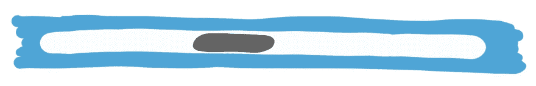
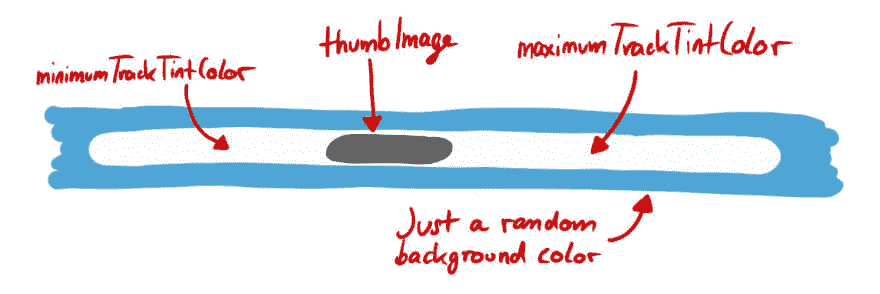

# 自定义 UISlider

> 原文：<https://dev.to/zeitschlag/customizing-uislider-iib>

我们正在开发一个非常有用的功能，至少我们希望如此。这个功能的一部分是稍微定制的 [`UISlider`](https://developer.apple.com/documentation/uikit/uislider?language=objc) 。最后，它应该看起来非常类似于你从`UIScrollView`中知道的狭窄脊柱:

由于这个组件之前已经存在于应用程序中，我们决定只改变它的外观。对我来说，是第一次和`UISlider`合作。

这些天来，当我不得不使用新东西时，我通常首先做的是浏览苹果的文档，如果有的话。我打开 [Dash](https://kapeli.com/dash) ，找到了 [`UISlider`](https://developer.apple.com/documentation/uikit/uislider?language=objc) 的“自定义滑块外观”部分。哈，我真幸运！这正是我一直在寻找的东西！

计划是使用 [`setThumbImage:ForState:`](https://developer.apple.com/documentation/uikit/uislider/1621336-setthumbimage?language=objc) 改变拇指图像，并将 [`minimumTrackTintColor`](https://developer.apple.com/documentation/uikit/uislider/1621348-minimumtracktintcolor?language=objc) 和 [`maximumTrackTintColor`](https://developer.apple.com/documentation/uikit/uislider/1621334-maximumtracktintcolor?language=objc) 设置为白色，就像这样:

我写了代码，并为自己感到自豪:天哪，这比预期的要容易得多。然后我运行应用程序，甜蜜的耶稣变酸了:要么颜色被应用，要么拇指图像看起来很好——但不是两者都是！

我又看了一下文档，突然，有一段文字的标题是“调试滑块”。我发誓，它神奇地出现了！它以前不在那里！

无论如何，这一段解释了我的问题:

> 使用自定义色调颜色或自定义图像，但不能同时使用两者。使用图像或色调自定义滑块外观时，使用其中一个选项，但不能同时使用两个选项。轨迹和缩略图外观的冲突设置以最近设置的值为准。例如，为任何状态设定新的最小轨道图像会清除您可能为最小轨道图像提供的任何自定色调颜色。同样，设置缩略图淡色会删除与滑块关联的任何自定义缩略图图像。
> 
> [来源:苹果](https://developer.apple.com/documentation/uikit/uislider?language=objc#declarations)

换句话说:如果我想设置一个自定义的缩略图，我必须提供图像——而不是颜色！—用于轨道。如果我想改变音轨的颜色，我不能使用自定义的缩略图。所以:要么一切都是颜色 y，要么一切都是图像 y，但不能两者兼而有之。

值得庆幸的是，我的一个同事以前遇到过这个问题，所以他已经写了一个解决方法:他在 [`UIColor`](https://developer.apple.com/documentation/uikit/uicolor?language=objc) 上创建了一个类别，用一个方法返回一个 [`UIImage`](https://developer.apple.com/documentation/uikit/uiimage?language=objc) ，颜色和大小都是 1x1。方法本身看起来非常类似于 StackOverflow 上的这个[答案，除了它不是`UIImage`上的一个类别/扩展，而是`UIColor`上的。](https://stackoverflow.com/a/24615631)

使用这个或多或少有点脏的技巧，我让 UISlider 看起来像我们的设计师想象的那样。

下一次，我可能会更彻底地阅读文件。希望如此。

无论如何，感谢阅读！