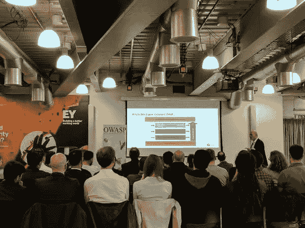
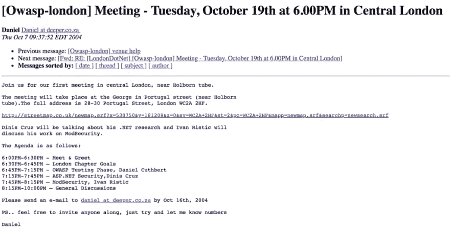

# 伦敦的网络安全/信息安全/应用安全会议/活动

> 原文：<https://dev.to/securestep9/cybersecurity-infosec-appsec-meetups-events-in-london-2na1>

### 伦敦的网络安全/信息安全/应用安全会议/聚会/活动

经常有人问我这样一个问题:哪些以网络安全为主题的聚会/活动/会议正在伦敦举行，哪些值得参加？

首先，作为 OWASP 伦敦分会的分会领导人，我当然需要提到我们的 OWASP 伦敦分会聚会(或“分会会议”)，它自 2004 年以来一直定期在伦敦举行！

第一次 OWASP 伦敦分会会议于 2004 年 10 月 19 日星期二在 Holborn tube 附近的乔治酒吧举行(见[http://lists . OWASP . org/piper mail/OWASP-London/2004-10 月/000032.html](http://lists.owasp.org/pipermail/owasp-london/2004-October/000032.html) )

第一次 OWASP 伦敦会议由以下人员组织和参加:

*   狄尼斯·克鲁兹(现在是 Photobox 的 CISO)
*   丹尼尔·库斯伯特(现任桑坦德银行网络安全研究全球主管)
*   Dafydd Stuttard(现在是 Portswigger 的首席执行官/打嗝扫描仪/打嗝套件的创造者)
*   Ivan Ristic(SSL Labs/Qualys/Let ' s Encrypt 背后的人，现在在 FeistyDuck/Hardenize)
*   彼得·伍德(FirstBase 现任首席执行官)
*   Gunter Ollman(现微软云和 AI 安全事业部 CSO，前 io active CTO)

现在，2019 年伦敦分会聚会吸引了 200 多名观众！如果您想参加我们的活动，请关注 OWASP 伦敦分会:

**推特** : [@owasplondon](https://twitter.com/owasplondon)

**https://www.facebook.com/OWASPLondon**:[脸书](https://www.facebook.com/OWASPLondon)

**网页**:https://www.owasp.org/index.php/London

**Meetup**:https://www.meetup.com/OWASP-London/

**LinkedIN**:【https://www.linkedin.com/company/owasplondon/ T2】

### 伦敦网络安全会议

首先，重要的是列出以下主要会议:

*   **SC Congress**—[https://www.sccongressuk.com](https://www.sccongressuk.com)更适合决策者而非技术人员。**免费**。每年**二月**在 ILEC 中心举行
*   **云安全博览会**在 Excel【https://www.cloudsecurityexpo.com/ T2】举行本次博览会&大会与物联网、DevOps、BigData 和区块链博览会同期举办。免费参加，许多伟大的技术和更高层次的演讲—每年 3 月在**Excel 展览中心举行。**免费。****
*   http://www.crestcon.co.uk/注册道德安全测试员委员会(CREST)是渗透测试公司的主要认证机构，他们于 4 月在伦敦的皇家医师学院(Regents Park)举行年会。门票 **125- 200**
*   **伦敦 AWS 峰会-**[https://aws.amazon.com/events/summits/london](https://aws.amazon.com/events/summits/london/?)AWS 是目前世界上排名第一的云服务提供商，他们在伦敦举行大规模的年度 AWS 峰会(通常在 5 月的 Excel Expo Centre 举行)，围绕云技术和云安全进行了大量的讨论和会议。**免费**
*   **信息安全欧洲(又名 InfoSec Europe)** 在奥林匹亚[https://www.infosecurityeurope.com/](https://www.infosecurityeurope.com/)——已经举办多年的原创博览会&会议。欧洲信息安全大会每年 6 月 5 日在 T4 举行。**免费。**
*   伦敦—[**https://www.securitybsides.org.uk/**](https://www.securitybsides.org.uk/)黑客社区大会，每年 6 月**在 ILEC 中心举行。从**免费**到 50 的门票(免费门票很快售完——几分钟内)。著名安全演讲者的精彩技术演讲和培训研讨会。如果你错过了伦敦的门票，不要绝望，因为英国和世界各地都有安全会议，只要在你附近的城市找一张就行了(在英国，我们有贝尔法斯特、利兹、曼彻斯特和苏格兰(爱丁堡)。**
***   **44 con**——**[T5】https://44con.com/](https://44con.com/)本地 DefCon 式的黑客大会。涵盖互联网安全、物联网、漏洞发现和新的利用技术等主题。著名安全演讲者的精彩技术演讲和培训研讨会。门票: **300- 1300** ，但**首日免费**。每年**九月**举行*****   **网络安全 X 欧洲/ IP 博览会欧洲**-[T3【https://ipexpoeurope.com】T5】](https://ipexpoeurope.com/europe/en/page/dtx-europe)*   免费参加，每年 10 月**日**在 Excel Expo Centre 举行许多精彩的技术和更高层次的讲座。**免费***   **伦敦 DevSecCon—**[**【https://www.devseccon.com/】**](https://www.devseccon.com/)**—每年在【T10 月至 11 月举行，门票 **200- 300，**许多精彩的技术讲座和培训研讨会*****   **black hat Europe**—**[T5】https://www.blackhat.com/eu-18/](https://www.blackhat.com/eu-18/)黑客大会暨博览会，每年**12 月**在 Excel 举办大型黑客讲座。门票 **1500- 1900** ，然而**世博**楼层(现场演示！)是**免费的。**********

 ****### **伦敦网络安全会议**

聚会是免费参加的，但是需要提前注册，这是必要的，一些场所需要身份证才能参加活动。

*   伦敦 OWASP】
*   [DevSecOps -伦敦聚会](https://www.meetup.com/DevSecOps-London-Gathering/)
*   [由 Capital One 主办的伦敦网络安全会议](https://www.meetup.com/London-Cyber-Capital-One/)
*   [许多帽子俱乐部](https://www.meetup.com/The-Many-Hats-Club/)
*   [LDN 安全社区会议](https://www.meetup.com/LDN-Security-Community-Meetup)
*   [带有反诉的网络安全](https://www.meetup.com/Countercept/)
*   伦敦证券交易所
*   [HACK::SOHO -月球黑暗面之旅](https://www.eventbrite.com/e/hacksoho-a-trip-to-the-dark-side-of-the-moon-tickets-53536096907?aff=ebdssbdestsearch#)
*   伦敦 DevOps
*   [伦敦码头](https://www.meetup.com/Docker-London/)
*   [伦敦的里努星](https://www.meetup.com/Linuxing-In-London/)
*   [Veracode DevSecOps Meetup -伦敦](https://www.meetup.com/Veracode-DevSecOps-Meetup-London/)
*   [伦敦 IT 安全讲座](https://www.meetup.com/London-IT-Security-Talks/)
*   [伦敦发展警察会议](https://www.meetup.com/London-DevSecOps-Meetup/)
*   [伦敦黑客协会 LLHS 女士](https://www.meetup.com/LLHS-Ladies-of-London-Hacking-Society/)
*   [ISSA-UK](https://www.eventbrite.co.uk/o/issa-uk-1588320960)
*   [DC4420](https://dc4420.org)

### 更多事件

查看这些事件聚合器:

*   [https://10times.com/london-uk/technology/conferences](https://10times.com/london-uk/technology/conferences)
*   [https://infosec-conferences.com/](https://infosec-conferences.com/)****