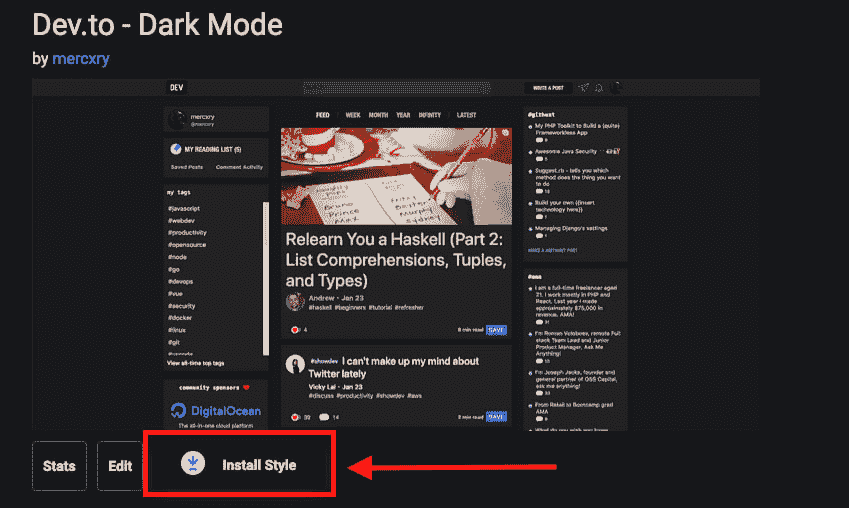
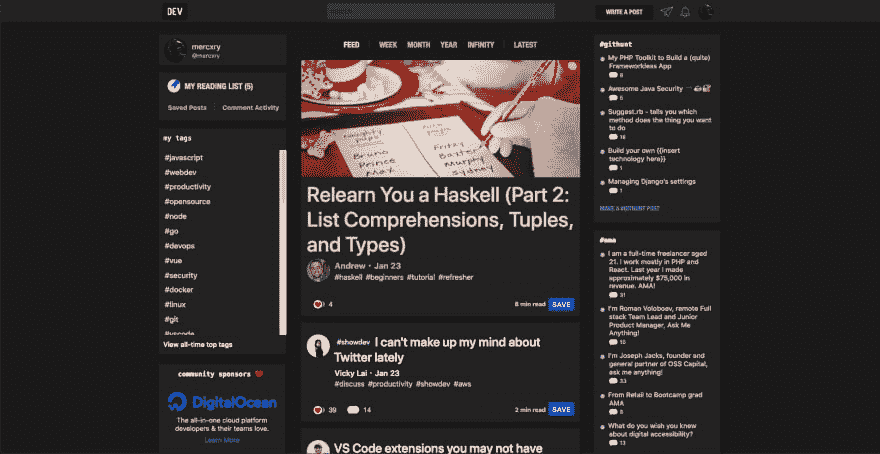
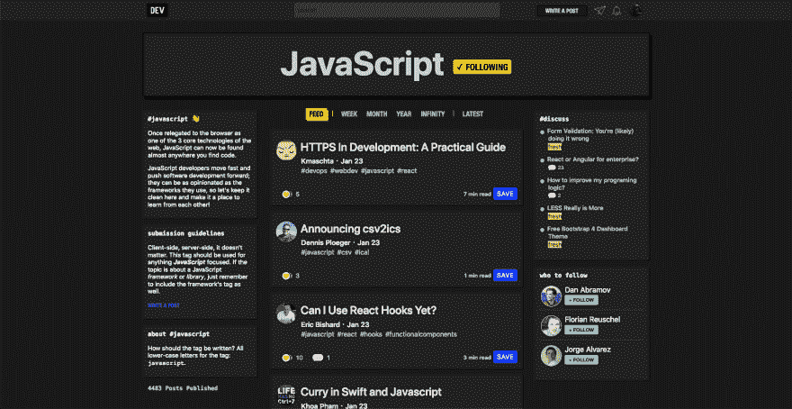
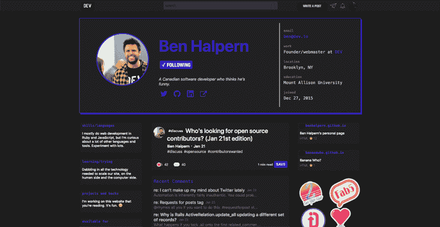
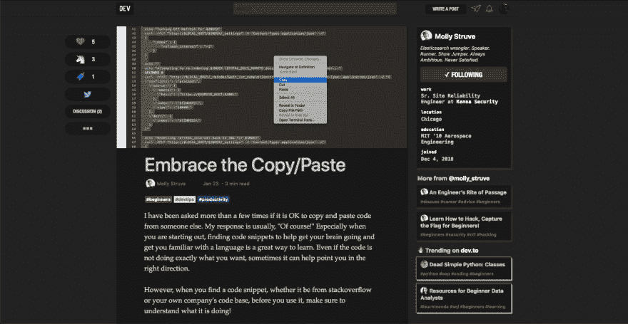

# 开发人员的黑暗主题

> 原文：<https://dev.to/mercxry/dark-theme-for-devto-14e9>

*截图在帖子底部*

# 前言

在正式的黑暗主题发布之前，这是一个临时的解决方案，因此代码没有被组织和排序，你可能会发现一些带有光明主题的组件/页面。

# 为什么是黑暗主题？

> 如果你知道黑暗面的力量...达斯·维德

玩笑归玩笑，使用黑色主题有很多好处，比如:

*   侵入性较小的夜间阅读
*   帮助您更加关注文本
*   防止你长时间坐在电脑前使眼睛疲劳
*   以及许多其他好处(你可以谷歌一下)

就我个人而言，我沉迷于黑暗主题，我可能会成为吸血鬼🧛‍♂️

# 怎么用？

要使用它，你应该安装一个兼容[https://userstyles.org](https://userstyles.org)的用户风格管理器，我个人推荐的是手写笔

Stylus 是一个兼容 **Mozilla Firefox** 、**谷歌 Chrome** 和 **Opera** 的用户风格编辑器和管理器，可以在各自的商店下载:

*   Mozilla Firefox:[https://addons.mozilla.org/en-US/firefox/addon/styl-us/](https://addons.mozilla.org/en-US/firefox/addon/styl-us/)
*   谷歌 Chrome & Opera:[https://Chrome . Google . com/web store/detail/stylus/clngdbkpkpeebahjckkjfobafhncgmne](https://chrome.google.com/webstore/detail/stylus/clngdbkpkpeebahjckkjfobafhncgmne)

安装手写笔后，只需**进入主题页面**，点击显示**“安装风格”**的按钮

**主题页面:**【https://userstyles.org/styles/168140/dev-to-dark-mode T2】

搞定了。现在你可以回到 Dev.to，享受黑暗主题☕

# 截图

**主页:**
 
**标签页:**

**简介页:**

**帖子页:**

# 结论

如果你发现了 bug，你可以留下评论或者在 [Twitter](https://twitter.com/mercxry_) 上联系我，我不保证会定期及时地更新主题，但我会努力让它继续工作。

你现在可以在 Github 上投稿:[https://github.com/mercxry/dev.to-dark-theme](https://github.com/mercxry/dev.to-dark-theme)

## 学分

我受到了这期 GitHub 的启发:[https://github.com/thepracticaldev/dev.to/issues/1413](https://github.com/thepracticaldev/dev.to/issues/1413)