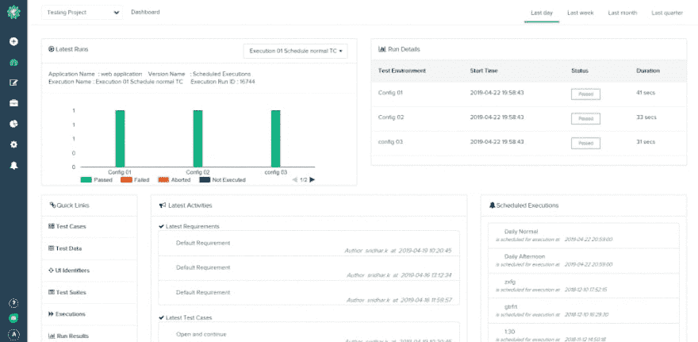

# Testsigma 中的数据驱动测试

> 原文：<https://dev.to/shabarishgit/data-driven-testing-in-testsigma-bj4>

[数据驱动测试](https://testsigma.com/automated-data-driven-testing)是一种通常在使用大量测试数据测试应用时使用的方法。

什么是测试数据？测试数据是输入值(有效和无效的用户名/密码组合或电话号码等)。这里，测试数据是从 Excel、JSON、属性文件甚至纯文本文件中读取的。

Selenium 可以用于[数据驱动测试](https://en.wikipedia.org/wiki/Data-driven_testing)，但是它需要额外的 API 来从文本文件中读取测试数据，并且代码中有一个循环语句，这反过来增加了复杂性。

但是 Testsigma 中的数据驱动测试非常简单。您只需上传测试数据文件，并开始在测试中的任何地方使用。让我们看看怎么做。

在 Testsigma
中运行数据驱动测试先决条件:我们需要一个有效的测试数据概要文件，这对于数据驱动测试是强制性的。

有两种简单的方法可以做到这一点:

1)通过手动创建测试数据配置文件

2)通过导入测试数据概要文件

**方法 1:手动创建一个测试数据概要文件**
这是 Testsigma 的仪表板的样子。

点击“测试开发”,然后点击右上角的创建图标。输入测试数据输入，为测试数据概要文件提供一个名称，然后单击 Create。

[https://player.vimeo.com/video/340010622](https://player.vimeo.com/video/340010622)

**方法 2:导入测试数据概要文件**
要导入您创建的测试数据概要文件，点击测试数据页面中的导入图标，为测试数据概要文件提供一个名称并上传您的文件。

链接中有一个示例测试数据文件，提供了要使用的格式。现在，单击创建。

[https://player.vimeo.com/video/340010672](https://player.vimeo.com/video/340010672)

如果我们通过这两种方法中的任何一种准备好了测试数据概要文件，我们可以在 [Testsigma](https://testsigma.com/) 中创建一个数据驱动的测试用例。

单击左侧面板上的加号图标。

现在点击+测试用例(创建一个新的测试用例)按钮，输入您的测试用例的名称，并点击“带我到一个详细的表格”链接，其中显示了一些更多的选项。

现在，选择您创建的概要文件，单击数据驱动切换按钮并点击 Create。

[https://player.vimeo.com/video/339999812](https://player.vimeo.com/video/339999812)

现在我们已经导入了，让我们看看如何将它添加到我们的测试步骤中:

在您的 Testsigma 帐户中，键入页面的 URL(橙色的 HRM 登录页面是开源的

让我们使用语法“在 ui 标识符字段中输入测试数据”在页面的用户名字段中输入一些内容。您可以查看这篇文章，它解释了在 ui 标识符字段中输入测试数据所需的所有步骤。

您可以在您的 [Testsigma 帐户](https://testsigma.com/)的左窗格中的 NLP 语法链接中查看 Testsigma 中使用的所有语法，或者使用帮助图标来查看您可以使用的关键字以及对您有所帮助的示例。

现在让我们看看如何使用 testdata，而不将它硬编码到测试步骤中。
删除文本测试数据，并从建议中选择@ |参数|。相反，选择建议中出现的 testdata 名称。参见表示法。

[https://player.vimeo.com/video/340006839](https://player.vimeo.com/video/340006839)

现在，您只需要创建一个简单的试运行，然后单击 Create and Run。这只是说明数据驱动测试的一个例子。有很多可能的方法可以使用测试数据，而不必将它硬编码到测试步骤中。

**测试数据管理**
[管理测试数据配置文件](https://support.testsigma.com/support/solutions/articles/32000018296-how-to-manage-test-data-)在 Testsigma 中表现最佳，可以选择导出、编辑和删除测试数据配置文件，而无需下载任何编译器、ide 或 API。测试数据被很好地组织和维护，是一个可以跨所有测试用例访问的存储库。

查看本[实践指南，它解释了数据驱动测试](https://dzone.com/articles/data-driven-testing-using-testsigma)。