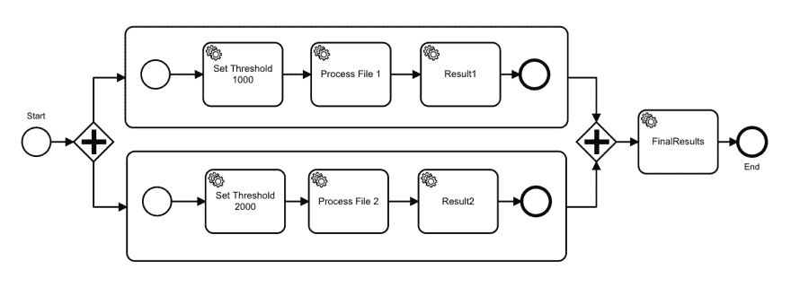
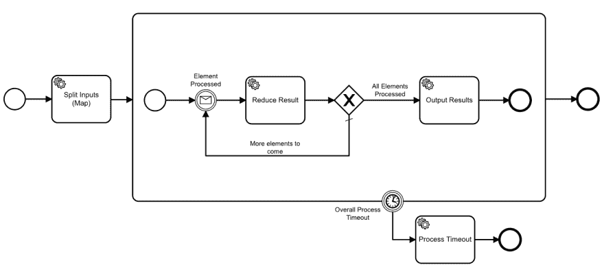
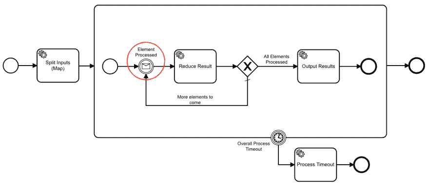
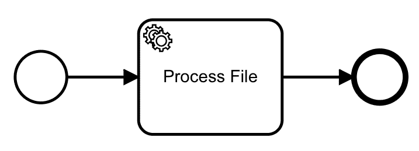

# 使用 Zeebe 进行数据管道编排(以及一个 Map/Reduce 实现示例)

> 原文：<https://dev.to/jwulf/data-pipeline-orchestration-with-zeebe-and-an-example-map-reduce-implementation-3j10>

*这篇文章最初出现在 [Zeebe 博客](https://zeebe.io/blog/2019/05/zeebe-map-reduce/)上。*

Zeebe 是一个面向微服务的工作流程编排引擎。它可以用于编排数据处理管道，如图像处理或机器学习。

正如谷歌的[网站可靠性工程书籍](https://landing.google.com/sre/sre-book/chapters/data-processing-pipelines/)中所讨论的，数据处理管道的一个问题是及时响应不断增长的业务需求。

Zeebe 是一个有状态的工作流引擎，状态不能水平扩展——但是 Zeebe 可以。因此，您希望以一种封装和隔离状态*和*的方式设计您的管道，允许您在可以并行化工作的部分中扩大工作器的规模。

实现这一点的一种计算解决方案模式是 [Map/Reduce](https://en.wikipedia.org/wiki/MapReduce) 。在本帖中，我们将看看如何使用 Zeebe 来构建 Map/Reduce 管道。

这并不意味着这是一个生产就绪的解决方案，而只是让您思考使用 Zeebe 中可用的原语的可能方法。

GitHub 上的[就是这个代码的一个例子。本文中的想法是使用 Zeebe](https://github.com/jwulf/zeebe-map-reduce) 的 [TypeScript 客户端库来说明的，但是它们同样适用于 Java、Go、C#、Python 或 Ruby。](https://github.com/CreditSenseAU/zeebe-client-node-js)

我已经使它足够通用，可以重用，事实上是可组合的。通过编写强类型接口和一个类来管理一些协调，您可以在 Zeebe 中的编排和开发人员对它的(重用)之间实现显著的分离。

## 并行化工作

对并行化工作的直观初步尝试可能涉及单个工作流中的子流程:

[](https://res.cloudinary.com/practicaldev/image/fetch/s--clc7DtX7--/c_limit%2Cf_auto%2Cfl_progressive%2Cq_auto%2Cw_880/https://thepracticaldev.s3.amazonaws.com/i/76kzvkaa1ht6bmyjozv6.png)

然而，为了并行化和扩展工作人员，我们需要拆分工作流。这是因为工作流是*有状态的*——有状态计算不能很好地扩展。工作流的状态存储在工作流 [*变量*](https://docs.zeebe.io/reference/variables.html) 中，虽然您可以通过子流程和[局部范围的变量](https://docs.zeebe.io/reference/variables.html#local-variables)实现某种程度的隔离，但是如果您试图在单个工作流中处理这些问题，您将会混淆问题。*同一工作流中的并行子流程在全局范围内变异相同的变量*。

此外，虽然这种方法具有非常明确的优点，但它不会使 map/reduce 功能从管道的特定转换中消失。这意味着对于*每个管道中的每个转换步骤，您将显式地重新连接 map/reduce flow* 。

## 领域驱动设计

我非常喜欢领域驱动的设计，如果领域是微服务编排，那么您可以将 map/reduce 功能视为[有界上下文](https://martinfowler.com/bliki/BoundedContext.html)。

大多数编程语言都为集合提供了某种映射功能。作为一名开发人员，你并不关心它是如何实现的——只要它在那里，并且你可以使用它。

当您在 map 功能中实现一些优化时，使用它的所有东西都会受益——而不是必须遍历每一个管道图并更新它。

## 晒出地图/缩小

如果您将您的解决方案映射到由 Map/Reduce 模式实现的 *split-apply-combine* 边界，您将获得更多的收益。

因此，您有一个与共享状态相关的工作流——也就是:*分割*输入，*组合*并产生输出；一个独立的工作流实现了模式的*应用*部分——这个部分可以通过添加更多的工人资源来独立扩展。

## 拆分/合并工作流

这是主要的工作流程，两个*将输入分割成不同的、可独立处理的单元；而*结合*工人的成果来产生最终的产出:*

[](https://res.cloudinary.com/practicaldev/image/fetch/s--kA3H4avC--/c_limit%2Cf_auto%2Cfl_progressive%2Cq_auto%2Cw_880/https://thepracticaldev.s3.amazonaws.com/i/9dqvkk8qwetf4yuiws8s.png)

此工作流的 bpmn 文件在 GitHub 上有[。](https://github.com/jwulf/zeebe-map-reduce/blob/master/bpmn/map-reduce.bpmn)

“Split Input”任务既接受输入元素，也接受将被调用来转换它们的工作流的 id。

你可以把输入签名想成:

```
interface MapReduceInput {
    elements: any[];
    mapFunctionWorkflowId: string;
} 
```

*附注:实际上比这要复杂一点，因为我们传入了一个相关键和配置来返回结果。*

通过将一个“mapFunctionWorkflowId”作为输入，该实现足够通用，可以用于在任何一组输入的*上映射/缩减*任何工作流*。您负责确保映射函数工作流工作器可以处理输入元素的类型——在工作器和任务之间或工作流之间的耦合中没有编译器强制的类型安全。*

您可以围绕这些接口编写类，以确保它们在应用程序编程级别得到遵守。在 GitHub 上的[示例代码中，我已经做到了——提供一个类型安全的应用程序级 API。](https://github.com/jwulf/zeebe-map-reduce)

## 工作原理

“Split Input”任务工作器将遍历`elements`变量中的元素，并为每个元素创建一个`mapFunctionWorkflowId`的实例，传入元素。它还传入一个唯一的相关键。map 函数 worker 使用它向主工作流发送处理结果的消息(通过[消息关联](https://docs.zeebe.io/reference/message-correlation.html))，在主工作流中，它与当前结果集进行*合并* -归约。

下面是实现“拆分输入”任务 worker 的代码:

```
zbc.createWorker<MapReduceInput>(uuid(), "split-inputs", (job, complete) => {
  const { elements = [], mapFunctionWorkflowId } = job.variables;
  const correlationKey = job.variables;
  const tasks = elements.map(element =>
    this.zbc.createWorkflowInstance(mapFunctionWorkflowId, {
      element,
      correlationKey
    })
  );
  console.log(`Spawned ${tasks.length} workflow instances`); // @DEBUG
  complete();
}); 
```

注意:我们在应用程序级别创建“correlationKey ”,并通过变量传递它，以避免工作人员在我们仍在创建任务时返回结果。在我们通过`complete({correlationKey})`更新 correlationKey 的值之前，[消息可以被缓冲](https://docs.zeebe.io/reference/message-correlation.html#message-buffering)，然而我们只是通过确保它被提前设置来避免它。

在“Split Input”任务为每个元素创建了工作流实例之后，令牌移动到 reducer 子流程中，并在“Element processed”消息捕获处停止。

[](https://res.cloudinary.com/practicaldev/image/fetch/s--ChwFS6DN--/c_limit%2Cf_auto%2Cfl_progressive%2Cq_auto%2Cw_880/https://thepracticaldev.s3.amazonaws.com/i/5ptitlujoccs4g8tvqqc.png)

它在这里等待，直到一个工人发回一个结果。当它收到一个结果时，它用结果集减少那个结果，然后检查是否所有结果都在。如果是，它将继续执行输出任务。如果没有，它返回等待下一个结果。

以下是减速器任务工作者的代码:

```
zbc.createWorker<MapReduceOutput>(uuid(), "collect", (job, complete) => {
  const { accumulator, element, elements } = job.variables;
  accumulator.push(element);
  const done = accumulator.length === elements.length;
  console.log(`Collected: ${accumulator.length}/${elements.length}`); // @DEBUG
  complete({
    accumulator,
    done
  });
}); 
```

reducer 子流程有一个边界计时器事件。如果这在子流程完成之前触发，令牌将移动到“流程超时”事件。这是处理出错情况的方法——例如:依赖的工作流失败，并且从不返回结果。

注意，对于简单的实现，不能保证结果集的排序与输入集相同。结果集的排序将反映代理从工作进程接收结果的顺序*。网络条件、工作人员的资源以及计算的复杂性都会对此产生影响。*

## 应用工作流

应用工作流很简单。在我们的例子中，它只有一个任务:

[](https://res.cloudinary.com/practicaldev/image/fetch/s--K3KtqXSv--/c_limit%2Cf_auto%2Cfl_progressive%2Cq_auto%2Cw_880/https://thepracticaldev.s3.amazonaws.com/i/9o2105cbxoglqp07u3mh.png)

按照惯例，应用工作流具有接口:

```
interface ZeebeMapFunctionInput {
  element: any;
  correlationKey: string;
}

interface ZeebeMapFunctionResponse {
  element: any;
} 
```

应用工作流执行“元素”变量的转换，并使用接收到的“correlationKey”变量的值将结果发送回主工作流:

```
zbc.publishMessage<ZeebeMapFunctionResponse>({
  name: "collect-result",
  correlationKey,
  timeToLive: 30000,
  messageId: uuid(),
  variables: {
    element: currentValue
  }
}); 
```

“correlationKey”使结果消息与产生它的特定工作流实例相关联，并且该工作流实例收集并减少状态。

## 有什么遗漏/值得注意的

关于这种实现，有几点需要注意:

*   *全有或全无* -如果任何一个元素转换工作流失败，该过程将超时。您可以在超时处理程序中通过返回一个带有错误消息的部分状态来处理这个问题。
*   *结果相对于输入*是无序的——您需要处理排序，因为它们是根据处理完成的顺序累积的。
*   有效载荷大小有一个限制 -你不能推入兆字节的数据。对于大量的输入数据，您需要推入一组引用，比如 AWS S3 URL，并编写任务工人来检索实际数据。

## 有替代方法的想法吗？

剥橘子的方法总是不止一种。如果你想出了另一种方法，或者这种方法的变体，我很想听听！

你可以在 [Zeebe Slack](https://zeebe-slack-invite.herokuapp.com/) 或者 [Zeebe 论坛](https://forum.zeebe.io/)上找到我。

我期待着听到你和 Zeebe 一起创造的令人敬畏的东西！