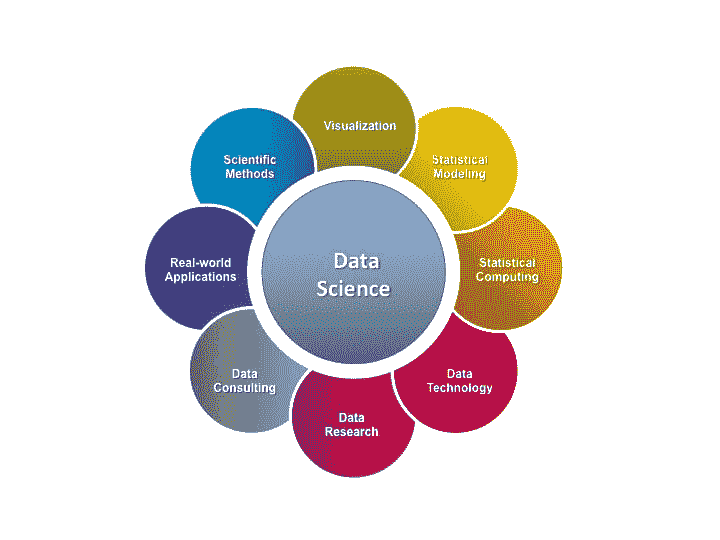

# 数据科学——有用吗？

> 原文：<https://dev.to/tinaward/data-science---does-it-work-at-all-3e2j>

## 首先解释一下什么是数据科学！

一般来说，数据科学是一组来自各个领域的特定学科，负责分析数据并基于数据找到最佳解决方案。之前这里面只涉及数理统计，后来他们开始使用机器学习和人工智能，其中加入了最优化和计算机科学作为分析数据的方法。

## 而这个领域的科学家是做什么的？

第一，编程，数学模型和统计学。但不仅仅是。对于他们来说，了解主题领域(例如，在金融流程、生物信息学、银行业甚至是一个计算机游戏中)正在发生的事情非常重要，以便回答真正的问题:这家或那家公司伴随着什么风险，什么样的基因组对应于某种疾病，如何识别欺诈性交易，或者什么样的人类行为对应于应该被禁止的玩家。
[T3】](https://res.cloudinary.com/practicaldev/image/fetch/s--pUDyCdMO--/c_limit%2Cf_auto%2Cfl_progressive%2Cq_auto%2Cw_880/https://www.unomaha.edu/college-of-arts-and-sciences/mathematics/_filimg/datasciencecircle.jpg)

## 为什么还需要它？

首先，得益于对大数据的分析，原来是为了更高效地做决策。比如，美国最新的选举活动表明了这一点:使用基于数据阵列的算法，可以捕捉观众的情绪并更精确地瞄准广告信息(唐纳德·特朗普的团队可能在选举活动中就证明了这一点)。

在所有或多或少有足够数据的应用领域，都可以从数据分析中获益。比如在医学上，算法可以让你更好地诊断疾病，开出治疗方案。如果算法有助于提前识别团队开始出现问题的地方，人事管理就可以得到改善

## 他们是什么时候开始使用的？

最近。随着数据和计算能力的增长，更有效地解决老问题成为可能。今天使用的许多算法是十几年前就知道的，它们只是变得更相关和更有效。机器学习算法需要大量的信息。比人类更精确的图像识别，更精确的翻译和最近出现的天气预报——所有这些都类似于太空火箭，最终找到了合适的燃料。

## 但是都一样，人做决定？

现在大部分是。但是一般来说，有了足够的技术知识，已经有可能自动采用简单的决策——只要有清晰的、可执行的规则。例如，今天的网络安全系统几乎完全依靠机器学习算法工作，决定是否向垃圾邮件发送信件或阻止可疑交易。当然，他们这样做是基于已经存在的数据。

使用数据科学的下一步是自动化做出更复杂的决策或创建智能助理。类似这样的东西现在正在工作 navigators，但你仍然可以记住旧手机上的 T9，它是在我们的短语中训练和调整的。接下来是任务链甚至特定职业的自动化。