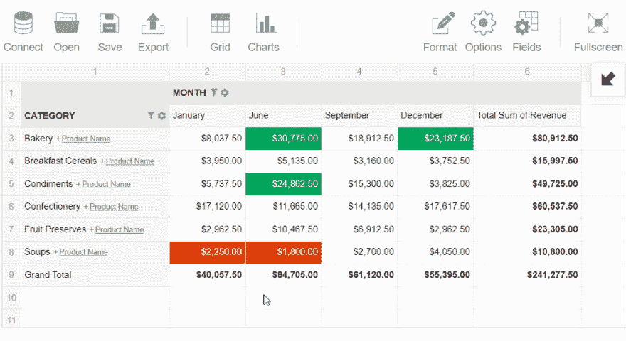
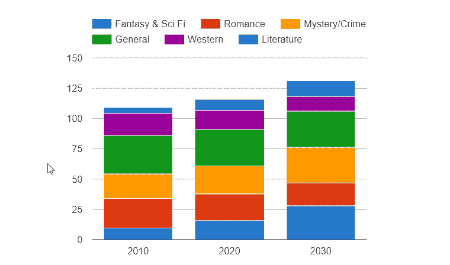
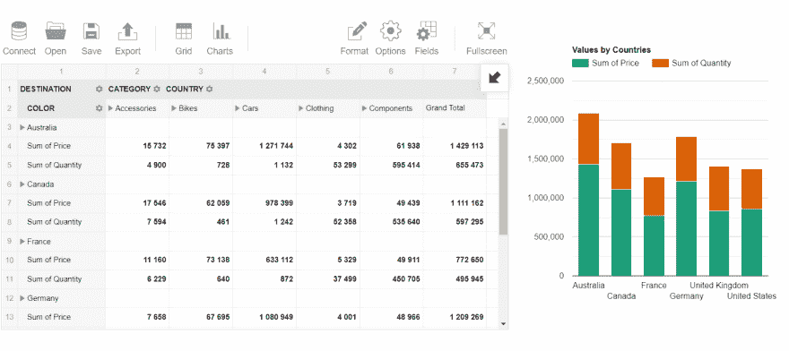

# Angular 项目中的数据可视化和 Web 报表

> 原文：<https://dev.to/veronikaro/data-visualization-and-web-reporting-in-angular-project-2d6f>

### 问题&动机

最近，我面临着一个挑战:寻找完全可定制且易于集成的 web 组件，这些组件可以作为嵌入式 BI 工具，用于我的应用程序中的**分析**、**报告**和**可视化**。

更困难的是找到与 Angular 框架兼容并且不会使应用程序的维护复杂化的解决方案。

我想我并不孤单，所以我决定与其他可能面临同样问题的开发者分享我的经验。

今天，我将简要介绍一下 **Angular** 的特性，并省略关于其最基本概念的其他理论细节——我相信您会在 dev.to 社区和 Angular 文档页面上找到有见地的文章。

所以，让我直截了当地谈谈这篇评论的目的——展示如何在 Angular 应用程序中运行分析，并借助两个工具改变您创建报告的方式:一个 JavaScript pivot grid 和一个图表库。

此外，根据最近的框架更新，了解哪些工具值得成为运行在最新版本 Angular 上的项目的一部分可能是有用的。

在此基础上，我们将创建一个简单而强大的报告，它具有帮助进一步分析的所有潜力。我迫不及待地想和你分享一个演示。

**TL；博士**:直接跳到有用链接的部分，这会帮助你实践。

### **为什么有棱角？**

 
让我先分享一下我认为 Angular 的优点，以及它如何使开发过程变得更快更容易。

使用 Angular 构建动态客户端应用程序(单页面或多页面)的过程伴随着各种好处。通过选择角度，您可以利用以下功能:

*   代码的**模块化设计**，使得应用程序的组件易于操作。因此，代码更有组织性和可读性。
*   去耦组件
*   简化的 **MVC** 架构
*   提供类型安全并使代码更易于维护和重构的 TypeScript 的静态类型化。
*   功能强大的 CLI 可自动创建角度应用程序。
*   一个活跃且不断发展的开发人员社区，他们分享关于框架和问题解决方案的知识。
*   支持多种平台。

上述所有特性都提高了构建 web、桌面和移动应用程序的效率。

然而，Angular 的学习曲线很高，尤其是与 React 相比。但是投入学习和掌握它的努力是值得你将会达到的结果的。

现在，让我们进一步了解您项目中用于 web 报告的*解决方案。*

### **什么是 Flexmonster**

[Flexmonster](https://www.flexmonster.com/?r=dv2) 是一个用 JavaScript 编写的数据透视表组件。它适用于表格和多维数据的 web 报告和分析。

它的主要优势是兼容各种客户端技术，包括 Angular 和 AngularJS。

首先，您需要选择应用程序中使用的数据源类型。最常见的是一个 **SQL/NoSQL** 数据库，但是同样支持 **JSON** 、 **CSV** 源和 **OLAP** 多维数据集。

一旦您将 Flexmonster 嵌入到项目中并将数据加载到项目中，您就可以利用所有内置功能开始配置您自己的交互式报告。毕竟，报告可以导出为 Excel、PDF、图像和 HTML。

接下来，我想概述一下对我的报告有用的分析特性列表。

#### **解析特征**

*   聚合函数(即 16 个内置函数和创建自定义函数的能力)
*   使用排序、分组和过滤功能可以组织数据
*   拖放功能
*   切片和切块
*   嵌入式数据透视图。

### **如何将数据透视表与有角度的**整合

就我个人而言，我觉得整个过程就像复制粘贴一样简单。这里有一个[教程](https://www.flexmonster.com/doc/integration-with-angular/?r=dv2)帮助我开始。

### **仪表盘&数据可视化**

如果您、您的用户或队友不仅需要聚合数据，还需要可视化数据，那么一个很好的想法是在应用程序中构建一个交互式仪表盘，或者提供这样的功能。许多分析师喜欢仪表板，因为它们有助于跟踪业务指标和做出数据驱动的决策。而且，作为一名开发人员，您可能知道根据特定的或经常性的请求来构建和配置它需要花费大量的时间。

让我们考虑第二个工具，它将节省您的时间，并帮助您的 web 项目通过交互式数据可视化脱颖而出。

### **谷歌排行榜**

在自由软件领域，很难找到比谷歌图表更好的图表服务了。
它消除了用 D3.js 操作 DOM 元素的必要性:Google Charts 提供了基于数据生成图表的大量 API。要激活数据，您只需将 Google Loader 包含到 web 页面中，创建一个 DataTable JavaScript 对象，然后将数据异步传递给它，并定义一个函数来实例化和绘制图表。

### **如何加载图表中的数据**

从应用程序中提取数据并将其发送到图表的最简单方法是使用名为 Datasource 或 Flexmonster Pivot Table 的 web 服务。前者支持图表工具数据源协议，并允许向数据源发送 SQL 查询以检索填充有数据的数据表实例。后者可以作为来自各种数据源的聚合数据的客户端提供者。使用它，您不需要编写查询来从 pivot grid 中检索数据——只需为它调用适当的 API 方法。此外，该组件提供了 JavaScript 连接器，无需为一些基本的图表类型编写数据处理代码。但是，当然，如果您需要实现一些自定义逻辑，您可以这样做。

### **谷歌排行榜中的 Angular app**

Google Charts 也兼容 Angular 我已经在 npm 上找到了它的包装器。

这是带有 Flexmonster 和 Google 图表的**仪表板**的样子:

 
如你所见，图表和表格并不互相对立。相反，它们结合在一起会发光。仪表板有可能增强分析结果的交流。

### **总结**

今天我试图分析 Angular 作为构建动态 web 应用程序的平台的好处。然而，人们应该意识到 Angular 可以简化开发过程，也可以使其复杂化。彻底考虑你的特定项目是否需要这个框架。

期待听到您的反馈和建议。

#### **有用链接**

这些指南帮助我完成了与 Flexmonster 和 Google Charts 的集成过程。

*   [带有 Flexmonster 和谷歌图表的 Angular 项目示例](https://y0rxj9vz29.codesandbox.io/)

您可以随意使用它来处理您的数据:)
 (我建议在新的标签页/窗口中打开带有仪表板的网页，因为该 IDE 中的嵌入式浏览器并不总是能正确显示结果)

*   [关于 Flexmonster 和 Angular 集成的教程](https://www.flexmonster.com/doc/integration-with-angular/?r=dv2)
*   [谷歌图表库](https://developers.google.com/chart/interactive/docs/gallery/?r=dv2)
*   [Angular 6&7](https://www.npmjs.com/package/angular-google-charts/?r=dv2)的谷歌图表包装