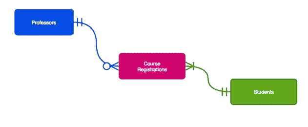
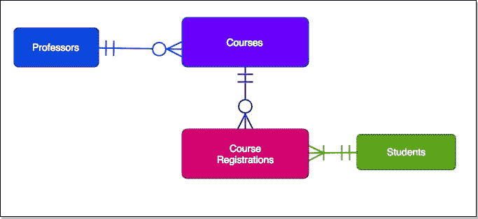
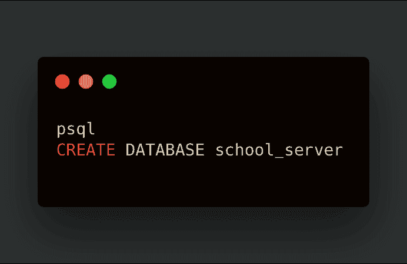
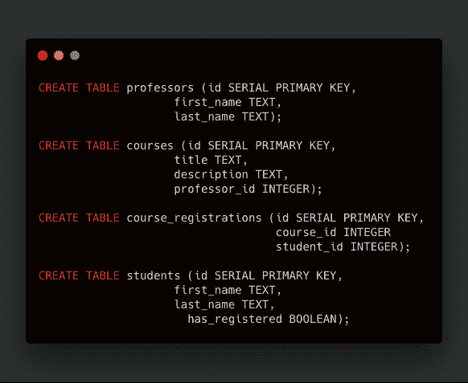
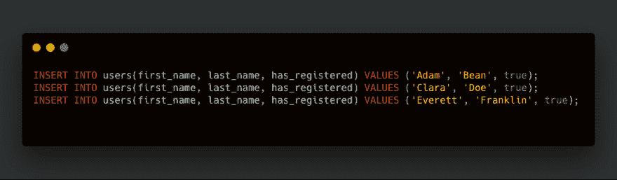

# 数据库模型和实体关系图第四部分

> 原文：<https://dev.to/kevindsteeleii/database-models-and-erds-for-newbs-part-4-4m0h>

## 重述

上次我们解决了学生、教授和课程的关系。这是通过惊人的应用程序*连接表*完成的。连接表基本上，包含对两个或更多数据库模型的引用，否则这些数据库模型将具有*多对多*关系。这是有问题的，因为它造成了数据在许多地方重复的情况，导致低的*基数*。基数基本上是指特定列中数据的唯一性。虽然连接表并不完美，但它比将行的整个副本(模型的单个实例)嵌套在其他行中要好。

## 更正

基于展示更多种类的*鱼尾纹符号*的愿望，我为学生做了一个关于数据模型的假设。但是*有一个或多个*课程注册，当你仔细想想，学生的申请是令人困惑的。这会降低基数，所以我将添加一个名为 *has_registered* 的布尔数据类型列来缓解这个问题。

**它拍了这个。**

**又做成这个样子**

## 代号，是吗？

还没有，首先是一些勘误表。

1.  我绝不是 DBA(数据库管理员)或其他什么人，所以在这篇文章中我不打算深入讨论连接。
2.  我用的是 **PostgreSQL** 。如果你没有，这里有一个[下载链接](https://www.postgresql.org/download/)。
3.  我在生产中使用 ORM(对象关系映射器),但是你应该在一定程度上知道你正在使用的任何抽象的“引擎盖”下发生了什么。这有望揭示您用来加速数据库的工具实际上在做什么。
4.  像 [pgAdmin](https://www.pgadmin.org/download/) 这样的可视化工具和管理器可以帮助你管理数据库。下载它，玩它！
5.  忘记 UUID 的事。这很简洁，但是我不认为在 PostgreSQL 中引入模块适合初学者
6.  我也省略了一个完整版本的样子。有很多数据需要考虑，稍后我们会详细介绍类似的内容。
7.  最后，在这一点上，我假设您下载了 PostgreSQL 并设置了它。

所以我们开始吧:

首先，我们使用终端、git bash 或 power shell(您应该使用其中的一个！)并输入以下内容:

 
所以在上面的代码中，我进入了 DBMS(数据库管理系统)，然后创建了保存我的表的数据库。我亲切地称它为*学校服务器*。

接下来，桌子本身。

 
所以我在这里做了教授、学生、课程和课程注册表。密切关注*课程*和*课程 _ 注册*表。它们都包含一些**外键**。

**听起来很熟悉？**
我之前提到过，外键被用作指向表中适当行的引用，该行与包含外键的行有关系。

在 courses 和 course_registration 表中，我们看到 3 个不同的外键。课程只有一个，在 *professor_id* 列。Course_Registrations 有两个，因为它是一个连接课程和学生的**连接表**。这也是它的外键所指向的。所以让我们来看看这些新造的桌子是什么样子的。

**教授**

| 身份证明（identification） | 名字 | 姓氏 |
| --- | --- | --- |

**课程**

| 身份证明（identification） | 标题 | 描述 | 教授 _id |
| --- | --- | --- | --- |

**课程 _ 注册**

| 身份证明（identification） | 课程 id | 学生 id |
| --- | --- | --- |

**学生**

| 身份证明（identification） | 名字 | 姓氏 | 已经注册 |
| --- | --- | --- | --- |

这变得有点长了(纵向)。所以我要结束了，但是在我结束之前，我会再给你们看一样东西。

创造学生！
[T3】](https://res.cloudinary.com/practicaldev/image/fetch/s--K3yqWWBb--/c_limit%2Cf_auto%2Cfl_progressive%2Cq_auto%2Cw_880/https://i.ibb.co/6gpMmzr/2019-02-03-003.png)

现在我们的学生列表是这样的:

| 身份证明（identification） | 名字 | 姓氏 | 已经注册 |
| --- | --- | --- | --- |
| one | 圣经》和《古兰经》传统中）亚当（人类第一人的名字 | 豆 | 真实的 |
| Two | [人名]克莱拉 | 做 | 真实的 |
| three | 埃弗雷特 | 富兰克林 | 真实的 |
| - | - | - | - |

下一次，我将介绍在 SQL 中获取特定学生的数据、更新和删除。再见！