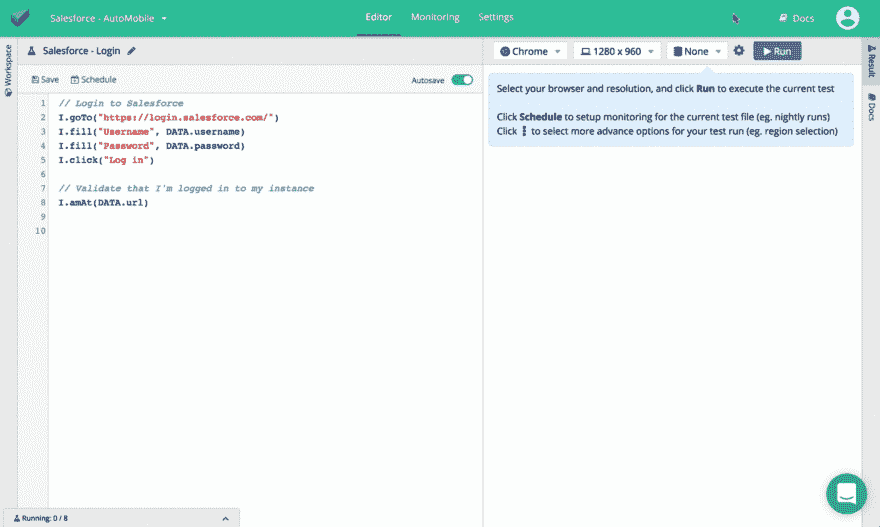
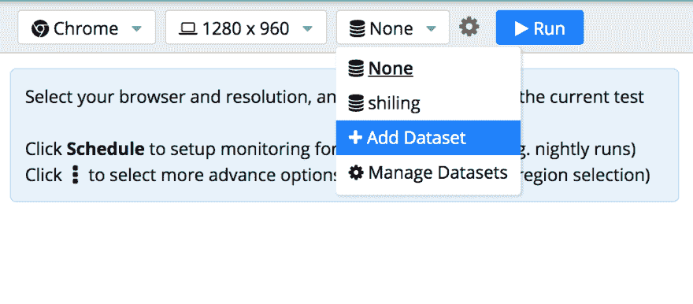
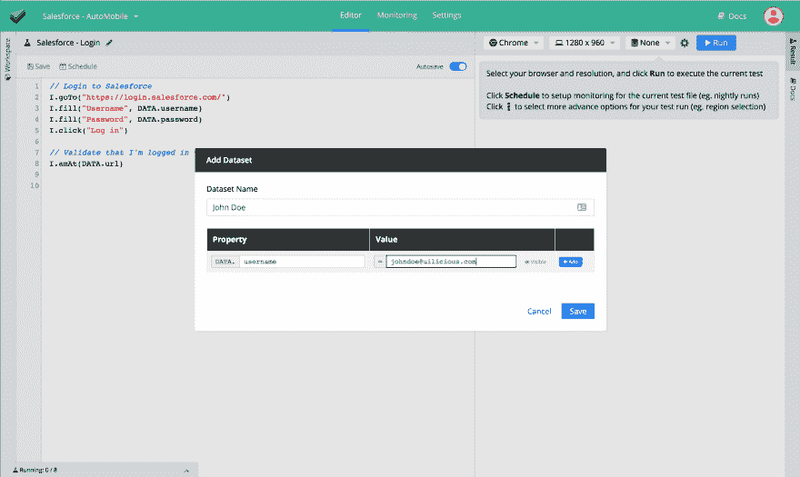
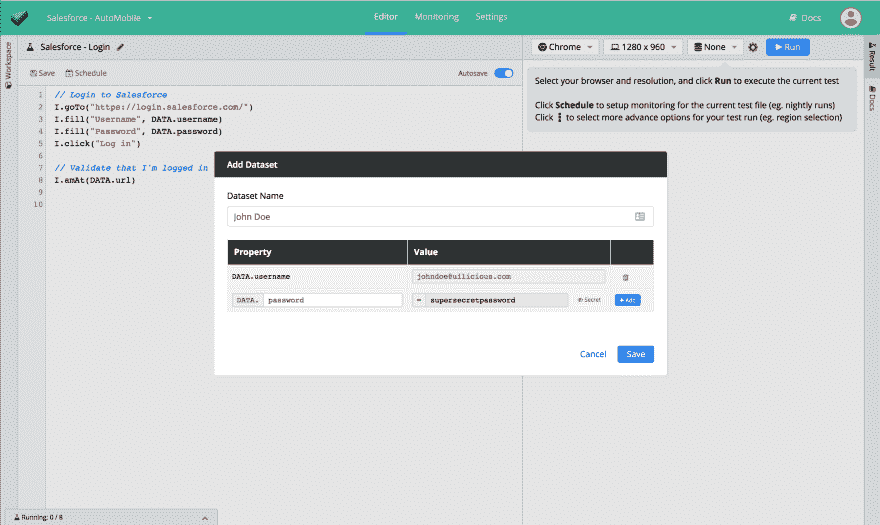
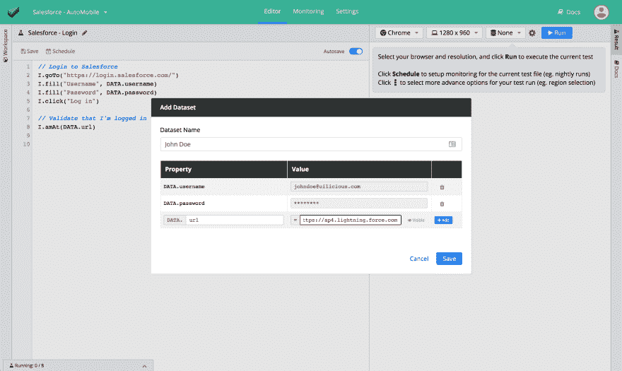
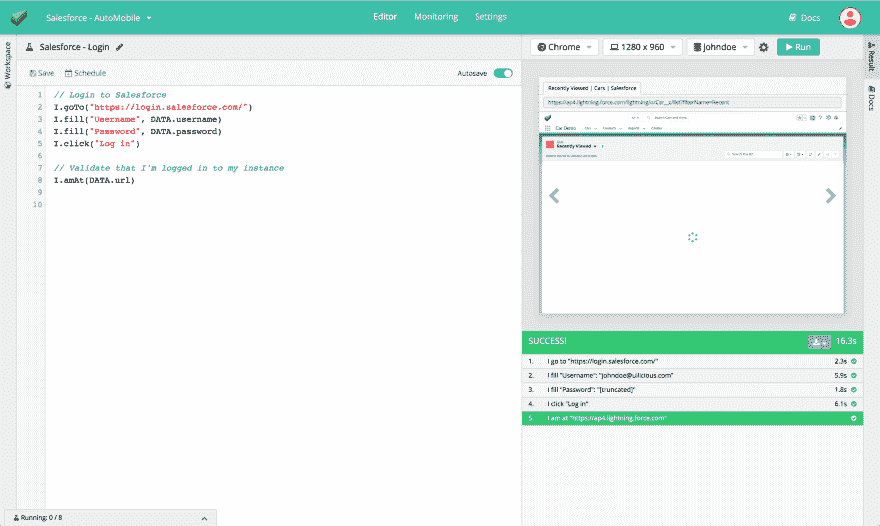

# 🔄用数据集替换 UI-licious 中的测试数据！

> 原文：<https://dev.to/uilicious/datasets-lets-you-swap-out-test-data-in-your-ui-licious-tests-53cf>

<figure>

[](https://res.cloudinary.com/practicaldev/image/fetch/s--f8wkqCu---/c_limit%2Cf_auto%2Cfl_progressive%2Cq_66%2Cw_880/https://thepracticaldev.s3.amazonaws.com/i/rgefcjppjw8if31e4k3l.gif)

<figcaption>Swap out test data with Datasets!</figcaption>

</figure>

大家情人节快乐！

这是我们新年的第一个发行说明，我们很高兴地宣布 [UI-licious Studio](https://uilicious.com/) 的数据集发布！

数据集允许您配置不同的测试数据集来运行测试。

当您想要:

*   针对不同**环境**的设置测试，例如试运行、生产
*   测试相同的用户旅程，但针对不同的**角色**
*   在测试脚本中存储**敏感的**测试数据，比如不能以明文形式写入的密码，并且在测试报告中屏蔽它们。

*(注:数据集仅在 UI-licious Studio 专业版上可用。你可以免费[运行公共测试](https://snippet.uilicious.com/test/public/1VBEfXDTJYacreZWGcahGV)UI-licious 片段。)*

* * *

## 设置和使用数据集

数据集通过在测试中填充`DATA`对象来工作。

让我们使用这个测试来登录 Salesforce，例如:

```
// Login to Salesforce
I.goTo("https://login.saleforce.com/")
I.fill("Username", DATA.username)
I.fill("Password", DATA.password)
I.click("Log in")

// Verify that user is logged into the correct instance of Salesforce
I.amAt(DATA.url) 
```

我们将设置`username`和`password`来登录，并设置`url`来登录使用数据集的每个测试运行的实例。

让我们添加一个数据集(就在“运行”按钮旁边):

[](https://res.cloudinary.com/practicaldev/image/fetch/s--7rILaqeU--/c_limit%2Cf_auto%2Cfl_progressive%2Cq_auto%2Cw_880/https://thepracticaldev.s3.amazonaws.com/i/r86hyye3c9z5ejvwwctr.png)

将数据集命名为“John Doe ”,并添加`username`属性和值，如下所示:

[](https://res.cloudinary.com/practicaldev/image/fetch/s--jfN9d3j7--/c_limit%2Cf_auto%2Cfl_progressive%2Cq_auto%2Cw_880/https://thepracticaldev.s3.amazonaws.com/i/8l2h1a3kgluqz95plp9x.png)

添加下面的`password`属性及其值，但是如果你想在测试报告中屏蔽它的值，记得选中标记它为**秘密**。

[](https://res.cloudinary.com/practicaldev/image/fetch/s--N6Udd9ov--/c_limit%2Cf_auto%2Cfl_progressive%2Cq_auto%2Cw_880/https://thepracticaldev.s3.amazonaws.com/i/dnofknslvht1lv6na2el.png)

最后，我们将添加`url`属性及其值。

[](https://res.cloudinary.com/practicaldev/image/fetch/s--JqeBjfjo--/c_limit%2Cf_auto%2Cfl_progressive%2Cq_auto%2Cw_880/https://thepracticaldev.s3.amazonaws.com/i/ileptg5otbykm92ga33q.png)

现在，让我们用“无名氏”数据集进行测试，瞧！

[](https://res.cloudinary.com/practicaldev/image/fetch/s--nUJbAjiF--/c_limit%2Cf_auto%2Cfl_progressive%2Cq_auto%2Cw_880/https://thepracticaldev.s3.amazonaws.com/i/moi3i43py2uqpk10d0pw.png)T3】

```
1\. I go to "https://login.salesforce.com/" ------ 2.3s SUCCESS
2\. I fill "Username": "johndoe@uilicious.com" --- 5.9s SUCCESS
3\. I fill "Password": "[truncated]" ------------- 1.8s SUCCESS
4\. I click "Log in" ----------------------------- 6.1s SUCCESS
5\. I am at "https://ap4.lightning.force.com/" ---      SUCCESS 
```

`password`的值在结果中被屏蔽，因为它在该数据集中被设置为秘密属性。

* * *

# 还有什么新的改进？

在过去的几个月里，我们也一直在关注性能的改进，并为测试引擎开发新的特性，这样您就可以创建更精细、可读性更好的测试。

## 🚀实验发动机

*   拖放命令:
    *   `I.dragTo` -拖动一个元素到另一个目标元素。
    *   `I.dragBy` -使用(x，y)像素偏移量向一个方向拖动元素。
    *   `I.dragUp`、`I.dragDown`、`I.dragLeft`、`I.dragRight`-I . drag by 的快捷方式
*   `I.getValue` -读取并返回输入字段的值。这允许您提取输入字段的值并将其设置为一个变量。
*   为方便起见，新增了滚动命令- `I.scrollUp`、`I.scrollDown`、`I.scrollLeft`、`I.scrollRight`。
*   错误抑制-对于所有的 I 和 UI 命令，您可以使用命令的`$`变量来抑制错误-例如`I.see$("Flying pigs")`。当您想要抑制在 if/else 块中用作条件表达式的命令的错误时，这可能很有用。
*   错误和日志抑制——对于所有的 I 和 UI 命令，您可以使用命令的`$$`变体来抑制错误和日志——例如`UI.execute$$(...)`。
*   `UI.context`现在可以用于显式地将上下文切换到 iframe。如果 web 应用程序或特定浏览器上的安全策略阻止 UI-licious 正常访问和评估 iframes 的内容并对其进行测试，这将非常有用。

参见[命令列表](https://docs.uilicious.com/scripting/list_of_commands.html)。

## 📈报告

*   更好的日志来指出测试脚本本身的错误。
*   改进了在监控仪表板上检索作业状态的性能。
*   现在打印出要执行的脚本片段，使测试报告和流程更容易理解。您还可以覆盖 UI.execute 的日志消息
*   增加了通过 webhooks 发送的测试运行报告的持续时间

* * *

## 谢谢！

非常感谢那些友好地将自己借给测试版测试这个新功能并试图打破它并给我们关于改善用户体验的评论的用户！

## 反馈？

我们总是喜欢听到用户的反馈，并发现人们用 UI-licious 做的各种创造性的事情，所以请随时在[support@uilicious.com](mailto:support@uilicious.com)给我们留言！