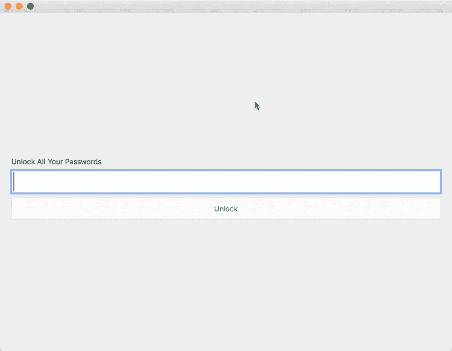

# 第 17 天:Swift macOS 密码管理器，适用于讨厌云的人

> 原文：<https://dev.to/swlkr/day-17-swift-macos-password-manager-for-people-who-hate-the-cloud-21an>

[<——第 16 天去这里](https://dev.to/swlkr/day-16-swift-macos-password-manager-for-people-who-hate-the-cloud-2bi7)

📅2019 年 1 月 17 日
🚀距离发布还有 13 天
🔥十六日连胜
💰2.99 美元的价格(现在进入一杯咖啡的领域)
🤑0 美元收入
📈0 顾客
⌚️花了 18.5 小时
💻-
🏁今天的目标:**加密 sqlite 数据库**

上午 7:10
我意识到，虽然用 UUIDs 将密码作为钥匙串值似乎是个好主意，但这不是个好主意。钥匙链可以独立于应用程序上传到 iCloud，这有点违背了初衷。我将尝试将主密码存储在钥匙串中，并将密码存储在 SQLite 中，这意味着我需要将主密码连接到 SQLite，我以前没有这样做过😬

上午 8:05
我有点不知所措了，但是我学到了很多关于 NSToolbar 的局限性以及如何解决它们的知识。我今天还学习了 SplitViews，我并没有意识到我的固定宽度 TableView 与固定宽度 ContainerView 的结合是多么糟糕。因此，将它与钥匙链、sqlite 加密结合起来……这样的例子不胜枚举。

哦！今天我也很累，在复制按钮还没有提交的时候，我通过`git —reset hard head`丢失了昨天复制按钮的所有工作。检查了一下`reflog`，没有这样的运气😅

叹气。下班后我来拿这个。这不是一个好主意，因为还有 13 天就要从头开始了，但无论如何都要这么做💪

下午 6:18
晚一点开始，我得为我的房子收拾一些新地板，因为地毯和乙烯树脂不够好🙅‍♀️:好吧，让我们看看两小时后我会在哪里

**晚上 9 点 19 分**
三个小时后。我完全从零开始，一直在疯狂地编码。这次我其实做了一件好事。SQLite 数据库使用您设置的主密码进行加密🎉。就好像这东西现在值得花钱似的！除了…你不能再储存或复制密码😅这是现在的样子。无效的🏜

不，我不知道为什么它会那样跳出我录音的框架。我还得处理一件奇怪的事情。

好吧，让我今天再来一次，为了我自己的理智:

*   16 天后开始了全新的 xcode 项目
*   实际上[用你设置的主密码](https://github.com/stephencelis/SQLite.swift/issues/861#issuecomment-455423412)加密了 SQLite 数据库
*   从迦太基转到了椰子
*   仔细阅读*最先进的* AppKit UI 材料(nstoolbar/仿工具栏和分割视图)
*   仅将主密码存储在钥匙串中，将其他所有内容存储在加密的 SQLite 文件中

明天再来看更多的悲伤和绝望，因为发布截止日期就像乌云一样笼罩着我！到时候见！👋