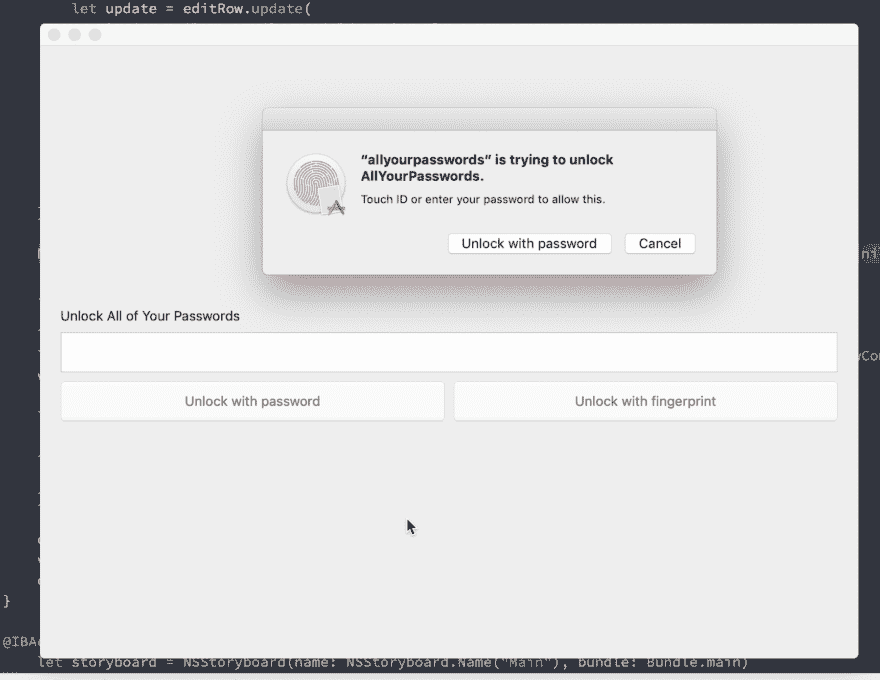

# 第 19 天:Swift macOS 密码管理器，适用于讨厌云的人

> 原文：<https://dev.to/swlkr/day-19-swift-macos-password-manager-for-people-who-hate-the-cloud-283f>

[<——第 18 天去这里](https://dev.to/swlkr/day-18-swift-macos-password-manager-for-people-who-hate-the-cloud-550g)

📅2019 年 1 月 19 日
🚀距离发布还有 11 天
🔥十八日连胜
💰2.99 美元的价格(现在进入一杯咖啡的领域)
🤑0 美元收入
📈0 顾客
⌚️花了 26 个小时
💻78 个文件被更改，247089 个插入(+)，54 个删除(-)
🏁今天的目标:**添加新密码**

上午 10:22
一个迟到的早晨，却足以让你早早完成工作。让我们重新添加密码。快速说三遍。

**下午 3:35**
取得了很大的进展，如果我是这个项目的一个团队成员，大家都会击掌欢呼。在记分牌上再加五个小时。无论如何，现在已经恢复了大部分功能，还有一个空视图！这是它是如何形成的

[](https://res.cloudinary.com/practicaldev/image/fetch/s--5buvC6XF--/c_limit%2Cf_auto%2Cfl_progressive%2Cq_66%2Cw_880/https://thepracticaldev.s3.amazonaws.com/i/obkg999g7hhzlra8bnrr.gif)

谁说重写没用了？！根本不在乎那家伙。我说，重写直到你写对为止。越是在接近截稿日期的时候重写，你就越能回过头来想，是的，我是一个鲍斯。

无论如何，必须休息一下，因为 5 个小时是很长的时间，毕竟是星期六。

这里是我在刷新表格视图时添加的一些代码

```
 NotificationCenter.default.addObserver(self, selector: #selector(reloadTableView), name: NSNotification.Name(rawValue: "reloadTableView"), object: nil)

   @objc func reloadTableView() {
        rows = Array((try! db?.prepare(login.table))!)
        filteredRows = rows
        tableView.reloadData()

        if (filteredRows?.count)! > 0 {
            tableView.selectRowIndexes(NSIndexSet(index: 0) as IndexSet, byExtendingSelection: false)
            containerViewController?.row = rows?[0]
            containerViewController?.tableViewController = self
            containerViewController?.showDetailViewController()
        } else {
            containerViewController?.tableViewController = self
            containerViewController?.showEmptyViewController()
        }
    } 
```

然后像这样调用 tableView 刷新函数

```
NotificationCenter.default.post(name: NSNotification.Name(rawValue: "reloadTableView"), object: nil) 
```

有趣的是，我试图通过容器视图控制器向下传递对 tableViewController 的引用，但在没有密码的情况下，它无法对应用程序进行全新的初始化。肯定好多了。现在，我必须通过对象层次结构删除大量围绕调用的代码。太好了。

我保证今天或明天会检查整体架构。这是我在 11 天大事件前所做的另一个总结😬