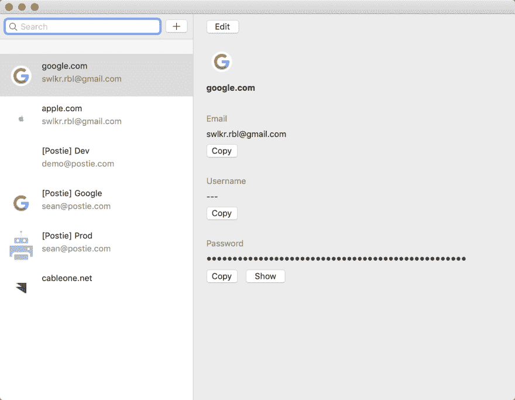

# 第 26 天:为讨厌云的人提供 Swift macOS 密码管理器

> 原文：<https://dev.to/swlkr/day-26-swift-macos-password-manager-for-people-who-hate-the-cloud-468e>

[<——第 25 天去这里](https://dev.to/swlkr/day-25-swift-macos-password-manager-for-people-who-hate-the-cloud-4fio)

📅2019 年 1 月 26 日
🚀[离](https://www.producthunt.com/upcoming/all-your-passwords)发射还有 4 天
🔥25 天连胜
💰0.99 美元的价格(将放入只允许 0.99 美元的应用商店*叹* )
🤑0 美元收入
📈0 客户
⌚️花了 38.5 小时
😭1 重写
💻113 个文件被更改，249768 个插入(+)，561 个删除(-)
🏁今天的目标:**尝试建立一个登陆页面，使查看屏幕不至于被吸走**

**晚上 8:35**
嗯，我今天又活过来了，所以流媒体没成功。我想我会在听一些佛罗里达乔治亚边境线音乐的同时，设法把细节页做得更好。不要评价我，我是一个代码牛仔🤠

**晚上 8:51**
移动了文本字段下面的按钮，我觉得这样看起来更好

[](https://res.cloudinary.com/practicaldev/image/fetch/s--eSvmPALv--/c_limit%2Cf_auto%2Cfl_progressive%2Cq_auto%2Cw_880/https://thepracticaldev.s3.amazonaws.com/i/utqaimx64h1n706xo9zm.png)

**晚上 9:28**
还增加了一个显示按钮来隐藏`NSSecureTextField`并显示一个`NSTextField`来显示明文密码值。你能相信没有办法在安全文本字段中显示明文值吗？我想这是有道理的，但这是一个痛苦的应用程序，因为你有两个控件堆叠在对方的顶部。这么多黑客。黑客对黑客。

我注意到，每当我在表视图中切换行时，内存都会线性增加。必须马上解决这个问题！不得延误！

**晚上 9 点 55 分**
就是这样。结束了。我像个伟大的水管工一样修好了漏洞。

我是这样做的。我把在 tableview select 上调用的“细节视图控制器”移到了一个实例变量中，而不是每次都在函数中重新实例化:

```
class ContainerViewController : NSViewController {

    var row : Row?
    var tableViewController : TableViewController?
    var detailViewController: DetailViewController? // <— here it is! 
```

一旦完成，我就跟踪那里是否有一个值，并调用`removeFromParent`

```
 if let oldViewController = detailViewController {
            oldViewController.view.removeFromSuperview()
            oldViewController.removeFromParent()
            detailViewController = nil
        } 
```

很高兴看到内存稳定在 36 MB 左右。今天到此为止。明天我会在编辑/取消时修复其他内存泄漏。还有编辑/取消的速度太慢，感觉就像一个网络应用程序，太慢了。🤦‍♂️